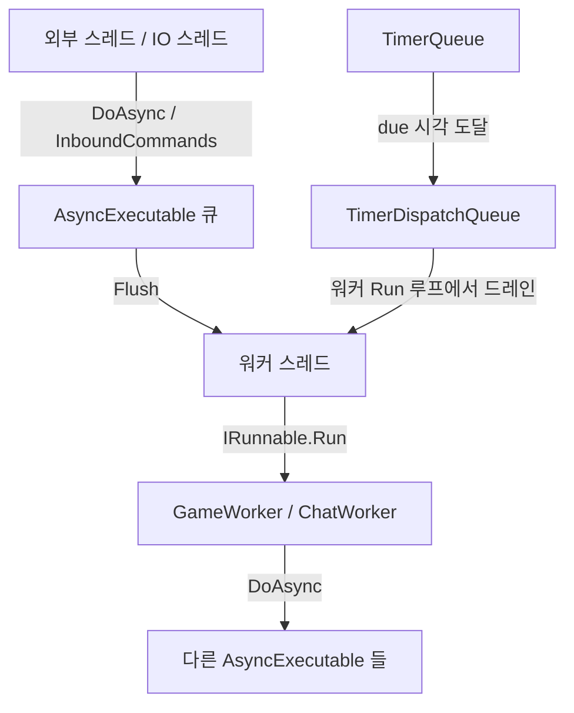

# JobDispatcherNET 완전 정복
## 초보자를 위한 친절한 가이드

> **대상 독자**: C#을 어느 정도 다룰 줄 알지만, 멀티스레딩과 Actor 패턴이 낯선 개발자
> **목표**: 코드 한 줄 한 줄의 의미를 이해하고, 직접 게임 서버에 적용할 수 있는 수준

---

```
  ╔══════════════════════════════════════════════════════╗
  ║       JobDispatcherNET 완전 정복                     ║
  ║                                                      ║
  ║   "lock 없이도 안전한 게임 서버를 만드는 방법"        ║
  ║                                                      ║
  ╚══════════════════════════════════════════════════════╝
```

---

## 목차

### 1부: 개념 이해
| 챕터 | 제목 | 핵심 내용 |
|------|------|-----------|
| [Chapter 01](./chapter01.md) | 들어가며 — 왜 JobDispatcherNET인가? | 멀티스레딩 문제, Actor 모델 소개 |
| [Chapter 02](./chapter02.md) | Actor 모델과 직렬 실행의 마법 | 핵심 원리, 큐 기반 직렬화 |
| [Chapter 03](./chapter03.md) | AsyncExecutable — 모든 것의 기반 | DoAsync, DoAsyncAfter, Flush |

### 2부: 라이브러리 내부 구조
| 챕터 | 제목 | 핵심 내용 |
|------|------|-----------|
| [Chapter 04](./chapter04.md) | JobEntry와 오브젝트 풀링 | Job, Job\<T\>, ConcurrentBag 풀 |
| [Chapter 05](./chapter05.md) | ThreadContext와 TimerQueue | 타이머 메커니즘, 워커 스레드 친화 |
| [Chapter 06](./chapter06.md) | JobDispatcher와 IRunnable | 전용 OS 스레드, 워커 수퍼바이저 |
| [Chapter 07](./chapter07.md) | Sequencer — 패킷 순서 보장 | IO 스레드 분리, CAS 드레인 |
| [Chapter 08](./chapter08.md) | 설정·모니터링·로깅 | JobOptions, JobMetrics, IJobLogger |

### 3부: 예제 프로젝트 실전 분석
| 챕터 | 제목 | 핵심 내용 |
|------|------|-----------|
| [Chapter 09](./chapter09.md) | ExampleConsoleApp — 기본기 익히기 | DoAsync, DoAsyncAfter, 워커 패턴 |
| [Chapter 10](./chapter10.md) | ExampleChatServer — Actor 기반 채팅 서버 | ChatServer/Room/User Actor 협업 |
| [Chapter 11](./chapter11.md) | ExampleMmorpgServer — MMORPG 게임 서버 | GameZone, PlayerActor, 공간 인덱스 |
| [Chapter 12](./chapter12.md) | AdvancedMmorpgServer — 고급 패턴 | NPC AI, Sequencer, JobOptions 활용 |

### 4부: 종합
| 챕터 | 제목 | 핵심 내용 |
|------|------|-----------|
| [Chapter 13](./chapter13.md) | 실전 패턴과 모범 사례 | 설계 원칙, 함정 피하기, 체크리스트 |

---

## 전체 구조 한눈에 보기



---

## 빠른 참조 카드

```
┌─────────────────────────────────────────────────────────┐
│  내가 원하는 것          →  사용할 것                    │
├─────────────────────────────────────────────────────────┤
│  객체 내부를 lock 없이    →  AsyncExecutable 상속        │
│  스레드 안전하게 다루고 싶다                             │
├─────────────────────────────────────────────────────────┤
│  N ms 후에 실행하고 싶다  →  DoAsyncAfter(TimeSpan, ...) │
├─────────────────────────────────────────────────────────┤
│  전용 OS 스레드를 돌리고  →  IRunnable + JobDispatcher   │
│  싶다                                                    │
├─────────────────────────────────────────────────────────┤
│  패킷 순서를 보장하고 싶다 →  Sequencer<T>              │
├─────────────────────────────────────────────────────────┤
│  큐 깊이를 제한하고 싶다  →  JobOptions.MaxQueueSize     │
├─────────────────────────────────────────────────────────┤
│  메트릭을 보고 싶다       →  JobMetrics.Snapshot()       │
└─────────────────────────────────────────────────────────┘
```
