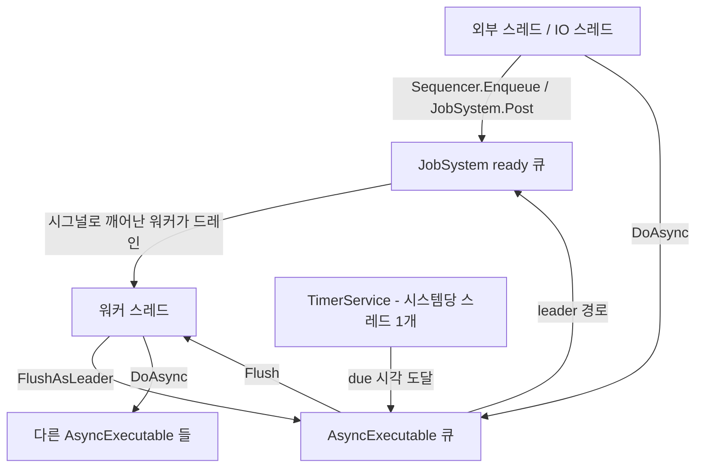

# JobDispatcherNET 완전 정복
## 초보자를 위한 친절한 가이드

> **대상 독자**: C#을 어느 정도 다룰 줄 알지만, 멀티스레딩과 Actor 패턴이 낯선 개발자
> **목표**: 코드 한 줄 한 줄의 의미를 이해하고, 직접 게임 서버에 적용할 수 있는 수준

---

```
  ╔══════════════════════════════════════════════════════╗
  ║       JobDispatcherNET 완전 정복                     ║
  ║                                                      ║
  ║   "lock 없이도 안전한 게임 서버를 만드는 방법"        ║
  ║                                                      ║
  ╚══════════════════════════════════════════════════════╝
```

---

## 목차

### 1부: 개념 이해
| 챕터 | 제목 | 핵심 내용 |
|------|------|-----------|
| [Chapter 01](./chapter01.md) | 들어가며 — 왜 JobDispatcherNET인가? | 멀티스레딩 문제, Actor 모델 소개 |
| [Chapter 02](./chapter02.md) | Actor 모델과 직렬 실행의 마법 | 핵심 원리, 큐 기반 직렬화 |
| [Chapter 03](./chapter03.md) | AsyncExecutable — 모든 것의 기반 | DoAsync, 입장 CAS, Flush, Ask/RunAsync |

### 2부: 라이브러리 내부 구조
| 챕터 | 제목 | 핵심 내용 |
|------|------|-----------|
| [Chapter 04](./chapter04.md) | JobEntry와 오브젝트 풀링 | Job, Job\<T\>, ConcurrentBag 풀, Discard |
| [Chapter 05](./chapter05.md) | 타이머 서비스와 ThreadContext | 시스템당 타이머 스레드, 취소·주기 타이머 |
| [Chapter 06](./chapter06.md) | JobDispatcher와 IRunnable | 전용 OS 스레드, 시그널 대기, 수퍼바이저 |
| [Chapter 07](./chapter07.md) | Sequencer — 패킷 순서 보장 | IO 스레드 분리, CAS 드레인, Stop/Abort |
| [Chapter 08](./chapter08.md) | 설정·모니터링·로깅 | JobOptions, JobSystemOptions, JobMetrics |

### 3부: 예제 프로젝트 실전 분석
| 챕터 | 제목 | 핵심 내용 |
|------|------|-----------|
| [Chapter 09](./chapter09.md) | ExampleConsoleApp — 기본기 익히기 | DoAsync, DoAsyncAfter, 워커 패턴 |
| [Chapter 10](./chapter10.md) | ExampleChatServer — Actor 기반 채팅 서버 | ChatServer/Room/User Actor 협업 |
| [Chapter 11](./chapter11.md) | ExampleMmorpgServer — MMORPG 게임 서버 | GameZone, PlayerActor, 공간 인덱스 |
| [Chapter 12](./chapter12.md) | AdvancedMmorpgServer — 고급 패턴 | JobSystem, NPC AI, Sequencer, StopAsync |

### 4부: 종합
| 챕터 | 제목 | 핵심 내용 |
|------|------|-----------|
| [Chapter 13](./chapter13.md) | 실전 패턴과 모범 사례 | 설계 원칙, 함정 피하기, 체크리스트 |

---

## 전체 구조 한눈에 보기


```mermaid
graph TD
    A[외부 스레드 / IO 스레드] -->|Sequencer.Enqueue / JobSystem.Post| R[JobSystem ready 큐]
    A -->|DoAsync| B[AsyncExecutable 큐]
    R -->|시그널로 깨어난 워커가 드레인| C[워커 스레드]
    C -->|FlushAsLeader| B
    B -->|Flush| C
    C -->|DoAsync| E[다른 AsyncExecutable 들]
    T[TimerService - 시스템당 스레드 1개] -->|due 시각 도달| B
    B -->|leader 경로| R
```

`JobSystem` 하나가 워커 스레드, ready 큐, 타이머 스레드, 메트릭, 셧다운 게이트를 모두
소유합니다. 명시적으로 만들지 않으면 `JobSystem.Default` 가 쓰입니다.

---

## 빠른 참조 카드

```
┌──────────────────────────────────────────────────────────────────────┐
│  내가 원하는 것                →  사용할 것                          │
├──────────────────────────────────────────────────────────────────────┤
│  객체 내부를 lock 없이          →  AsyncExecutable 상속               │
│  스레드 안전하게 다루고 싶다        + DoAsync (반환 bool 확인!)        │
├──────────────────────────────────────────────────────────────────────┤
│  hot path에서 할당을 없애고 싶다 →  DoAsync<TState>(static 람다, state)│
├──────────────────────────────────────────────────────────────────────┤
│  N ms 후에 한 번 실행           →  DoAsyncAfter(delay, ...)           │
│  나중에 취소도 하고 싶다            → 반환된 ITimerHandle.Cancel()     │
├──────────────────────────────────────────────────────────────────────┤
│  N ms 마다 반복 실행            →  DoAsyncEvery(period, action,       │
│                                     initialDelay)                     │
│                                     (자기 재예약 패턴은 이제 불필요)   │
├──────────────────────────────────────────────────────────────────────┤
│  actor 의 상태를 읽어오고 싶다   →  Ask<T>(func)         (async 호출자)│
│                                    AskSync<T>(func, timeout) (동기)   │
├──────────────────────────────────────────────────────────────────────┤
│  actor 안에서 DB/HTTP await     →  RunAsync / AskAsync                │
│                                    (ConfigureAwait(false) 쓰지 말 것) │
├──────────────────────────────────────────────────────────────────────┤
│  워커 풀을 띄우고 싶다           →  new JobDispatcher(n)              │
│  워커에 자체 루프가 필요하다      →  IRunnable + JobDispatcher<T>      │
├──────────────────────────────────────────────────────────────────────┤
│  IO 스레드가 게임 로직을         →  JobOptions.Mode =                 │
│  실행하지 않게 하고 싶다            ExecutionMode.Scheduled            │
│                                    또는 JobSystem.Post(action)        │
├──────────────────────────────────────────────────────────────────────┤
│  패킷 순서를 보장하고 싶다        →  Sequencer<T>(system, handler)     │
├──────────────────────────────────────────────────────────────────────┤
│  큐 깊이를 제한하고 싶다         →  JobOptions.MaxQueueSize           │
│  거부 사유를 알고 싶다            →  OnDropped(actor, DropReason)      │
├──────────────────────────────────────────────────────────────────────┤
│  계속 터지는 actor 를 격리        →  JobOptions.MaxConsecutiveFailures │
│  actor 단위로 오류를 처리         →  protected override OnJobError     │
├──────────────────────────────────────────────────────────────────────┤
│  메트릭을 보고 싶다              →  system.Metrics.Snapshot()         │
│                                    (전역: JobMetrics.GetSnapshot())   │
│                                    dotnet-counters: JobDispatcherNET  │
├──────────────────────────────────────────────────────────────────────┤
│  서버를 우아하게 종료하고 싶다    →  await system.StopAsync(timeout)   │
│                                    (4단계 수동 종료는 더 이상 불필요)  │
└──────────────────────────────────────────────────────────────────────┘
```
