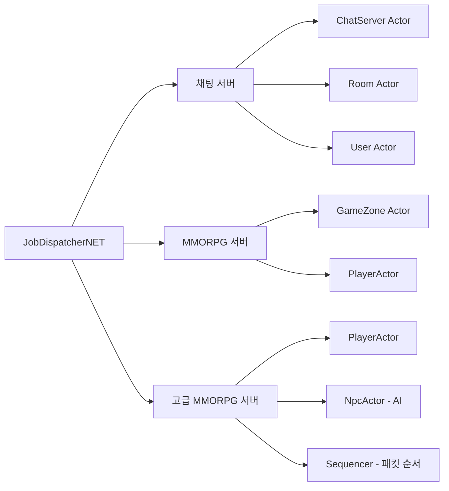

# Chapter 01: 들어가며 — 왜 JobDispatcherNET인가?

## 1.1 게임 서버의 공포, 멀티스레딩

게임 서버를 처음 만들어 보면 이런 코드를 짜게 됩니다.

```csharp
// 플레이어 HP를 다루는 코드 — 이것이 왜 위험할까요?
public class Player
{
    public int Hp { get; set; }

    public void TakeDamage(int damage)
    {
        Hp -= damage;         // ← 이 줄이 실은 여러 단계로 실행됩니다!
        if (Hp <= 0)
            Die();
    }
}
```

얼핏 보면 문제없어 보입니다. 그런데 여러 스레드가 동시에 이 코드를 실행하면?

```
시간 ──────────────────────────────────────────────────────►

스레드 A (몬스터1 공격): Hp 읽기(100) ─────────────────── Hp 쓰기(100-30=70)
스레드 B (몬스터2 공격):               Hp 읽기(100) ─ Hp 쓰기(100-50=50)

결과: Hp = 50  ← 몬스터1의 30 데미지가 증발했습니다!
실제 기대값: 100 - 30 - 50 = 20
```

이것을 **레이스 컨디션(Race Condition)**이라 합니다. 두 스레드가 같은 데이터에 동시에 접근해서 서로의 결과를 덮어쓰는 버그입니다.

---

## 1.2 전통적인 해결책: lock

보통은 이렇게 고칩니다:

```csharp
public class Player
{
    private readonly object _lock = new();
    public int Hp { get; private set; }

    public void TakeDamage(int damage)
    {
        lock (_lock)   // ← 한 번에 한 스레드만 들어오게!
        {
            Hp -= damage;
            if (Hp <= 0)
                Die();
        }
    }
}
```

작동은 합니다. 하지만 문제가 있습니다:

```
┌─────────────────────────────────────────────┐
│             lock의 문제점                    │
├─────────────────────────────────────────────┤
│ 1. 성능 저하    — 스레드가 줄 서서 기다림   │
│ 2. 데드락 위험  — A가 B를 기다리고          │
│                   B가 A를 기다리면 영구 정지 │
│ 3. 코드 복잡성  — 모든 shared state에       │
│                   lock을 걸어야 함           │
│ 4. 실수하기 쉬움 — lock을 빠뜨리면 버그     │
└─────────────────────────────────────────────┘
```

게임 서버에 플레이어가 1만 명이고, 매 틱(50ms)마다 수천 개의 작업이 발생한다면... lock 경합이 심각해집니다.

---

## 1.3 더 나은 방법: Actor 모델

Actor 모델은 다른 철학을 가집니다:

> **"공유 상태를 없애자. 대신 메시지를 주고받자."**

각 객체(Actor)는 자신만의 **작업 큐**를 가집니다. 외부에서는 직접 상태를 변경하지 않고, 큐에 "이 작업을 해줘"라는 메시지를 넣습니다. Actor는 자신의 큐에서 작업을 하나씩 꺼내 **직렬(순서대로)**로 처리합니다.

```
        [스레드 A]    [스레드 B]    [스레드 C]
            │             │             │
            ▼             ▼             ▼
        DoAsync()     DoAsync()     DoAsync()
            │             │             │
            └─────────────┴─────────────┘
                          │
                          ▼
                   ┌──────────────┐
                   │  Player 큐   │
                   │  [작업1]     │
                   │  [작업2]     │
                   │  [작업3]     │
                   └──────┬───────┘
                          │ 순서대로 처리
                          ▼
                   Player.TakeDamage()
                   Player.TakeDamage()
                   Player.TakeDamage()
                   (항상 직렬 실행 — lock 불필요!)
```

이것이 **JobDispatcherNET**이 구현하는 핵심 아이디어입니다.

---

## 1.4 JobDispatcherNET이란?

JobDispatcherNET은 .NET에서 Actor 모델을 쉽게 구현하기 위한 라이브러리입니다.

```
┌─────────────────────────────────────────────────────────┐
│                  JobDispatcherNET                        │
│                                                          │
│  ┌─────────────────┐    ┌──────────────────────────┐    │
│  │  AsyncExecutable │    │   JobDispatcher<T>       │    │
│  │                  │    │                          │    │
│  │  • 각 객체에게   │    │  • N개의 전용 OS 스레드  │    │
│  │    자기만의 큐를  │    │  • IRunnable을 반복 실행 │    │
│  │    부여          │    │  • 워커 자동 재기동      │    │
│  │  • lock 없는     │    │                          │    │
│  │    직렬 처리     │    └──────────────────────────┘    │
│  └─────────────────┘                                     │
│                                                          │
│  ┌─────────────────┐    ┌──────────────────────────┐    │
│  │  TimerQueue      │    │   Sequencer<T>           │    │
│  │                  │    │                          │    │
│  │  • 고정밀 지연   │    │  • 패킷 순서 보장        │    │
│  │    실행          │    │  • IO 스레드와 워커       │    │
│  │  • 워커 스레드   │    │    스레드 분리            │    │
│  │    친화적 설계   │    │                          │    │
│  └─────────────────┘    └──────────────────────────┘    │
└─────────────────────────────────────────────────────────┘
```

---

## 1.5 이 라이브러리로 만들 수 있는 것

이 책에서 다룰 예제들을 살펴봅시다:



---

## 1.6 이 책을 읽기 전에 알아야 할 것

이 책을 최대한 활용하려면 다음 내용을 알고 있으면 좋습니다:

```
알면 좋은 것                알아도 되고 몰라도 되는 것
───────────────────────    ─────────────────────────────
✓ C# 기본 문법              △ async/await (라이브러리가
✓ 클래스와 상속               lock 없이 직렬화를 해주므로
✓ 람다(Lambda) 표현식          많이 안 씁니다)
✓ 인터페이스(interface)     △ Task<T>의 내부 동작 원리
✓ Thread가 무엇인지          △ 고급 lock 패턴
  (개념 정도만)
```

---

## 1.7 소스 코드 구조

저장소를 열면 다음 폴더들이 보입니다:

```
JobDispatcherNET/
├── JobDispatcherNET/          ← 핵심 라이브러리 (여기서 시작!)
│   ├── AsyncExecutable.cs     ← Actor의 기반 클래스
│   ├── JobDispatcher.cs       ← 워커 스레드 풀
│   ├── JobEntry.cs            ← 작업 항목 + 풀링
│   ├── ThreadContext.cs       ← 스레드 전용 저장소
│   ├── TimerQueue.cs          ← 지연 실행 타이머
│   ├── TimerDispatchQueue.cs  ← 타이머→워커 브릿지
│   ├── Sequencer.cs           ← 패킷 순서 보장
│   ├── JobOptions.cs          ← 옵션 설정
│   ├── JobMetrics.cs          ← 메트릭 수집
│   └── IJobLogger.cs          ← 로깅 인터페이스
│
├── ExampleConsoleApp/         ← 예제 1: 기본기 (Chapter 09)
├── ExampleChatServer/         ← 예제 2: 채팅 서버 (Chapter 10)
├── ExampleMmorpgServer/       ← 예제 3: MMORPG (Chapter 11)
└── AdvancedMmorpgServer/      ← 예제 4: 고급 MMORPG (Chapter 12)
```

---

## 1.8 다음 장 미리보기

Chapter 02에서는 Actor 모델의 핵심 원리를 더 깊이 이해합니다. 직렬 실행이 어떻게 동작하는지, 왜 lock이 필요 없어지는지 코드와 다이어그램으로 살펴봅니다.

---

*[→ Chapter 02: Actor 모델과 직렬 실행의 마법](./chapter02.md)*
