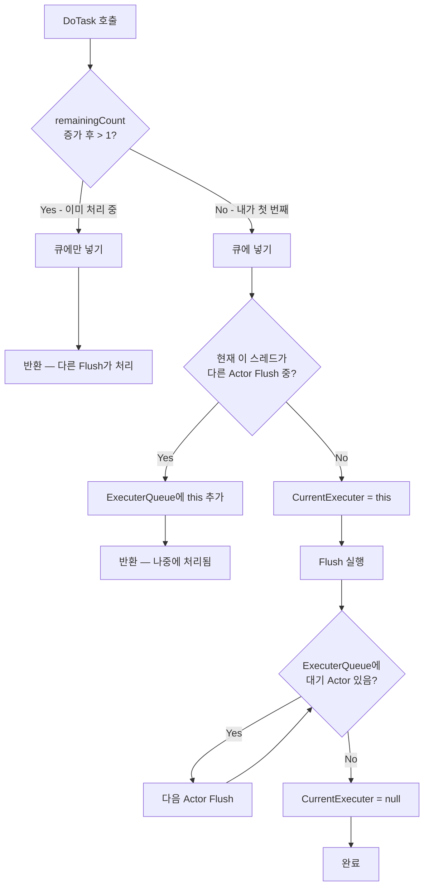

# Chapter 03: AsyncExecutable — 모든 것의 기반

## 3.1 전체 구조 미리보기

`AsyncExecutable`은 JobDispatcherNET의 심장입니다. 코드를 읽기 전에 전체 구조를 파악합시다:

```
AsyncExecutable 클래스
──────────────────────────────────────────────────────────
필드:
  _jobQueue    : Channel<JobEntry>  ← 작업들이 들어오는 큐
  _options     : JobOptions         ← 큐 크기 제한 등 설정
  _remainingTaskCount : int         ← 현재 큐에 있는 작업 수

공개 API:
  DoAsync(Action)                   ← 작업 등록 (람다)
  DoAsync<TState>(action, state)    ← 작업 등록 (클로저 없이!)
  DoAsyncAfter(delay, action)       ← 지연 작업 등록
  RemainingTaskCount                ← 큐 깊이 조회

정적 API:
  AcceptingWork                     ← 전역 입력 차단 스위치

내부 메서드:
  DoTask(JobEntry)                  ← 실제 큐 등록 로직
  Flush()                           ← 큐를 비우는 핵심 루프
──────────────────────────────────────────────────────────
```

---

## 3.2 DoAsync — 가장 기본적인 진입점

```csharp
public bool DoAsync(Action action)
{
    // 1) 전역 셧다운 체크
    if (!AcceptingWork)
    {
        JobMetrics.IncrementDropped();
        return false;
    }

    // 2) 람다를 Job 객체로 포장 (풀에서 재사용!)
    var job = Job.Rent(action);

    // 3) 실제 등록
    return DoTask(job);
}
```

간단해 보이지만 실제 마법은 `DoTask`에 있습니다.

---

## 3.3 DoTask — 직렬 실행의 핵심 로직

`DoTask`가 가장 중요한 메서드입니다. 단계별로 이해해봅시다:

```csharp
internal bool DoTask(JobEntry task)
{
    // ─── 단계 1: 카운터 증가 ────────────────────────────────
    if (Interlocked.Increment(ref _remainingTaskCount) > 1)
    {
        // 이미 다른 작업이 처리 중 → 큐에만 넣고 끝
        if (!_jobQueue.Writer.TryWrite(task))
        {
            // 큐 만원 → 거부
            Interlocked.Decrement(ref _remainingTaskCount);
            ReportDropped(task);
            return false;
        }
        // 다른 Flush가 알아서 처리해줌
    }
    else
    {
        // ─── 단계 2: 이 스레드가 "첫 번째" → 내가 처리해야 함 ─
        if (!_jobQueue.Writer.TryWrite(task))
        {
            Interlocked.Decrement(ref _remainingTaskCount);
            ReportDropped(task);
            return false;
        }

        // ─── 단계 3: 이미 다른 Actor를 처리 중인지 확인 ────────
        var currentExecuter = ThreadContext.CurrentExecuter;
        if (currentExecuter is not null)
        {
            // 현재 이 스레드가 다른 Actor의 Flush 안에 있음
            // → 지금 바로 처리하면 재귀 문제 발생 가능
            // → 큐에 넣어두고 나중에 처리
            ThreadContext.ExecuterQueue.Enqueue(this);
        }
        else
        {
            // ─── 단계 4: 내가 Leader가 되어 직접 처리 ────────────
            try
            {
                ThreadContext.CurrentExecuter = this;  // "내가 처리 중" 표시

                Flush();  // 내 큐를 비운다

                // 내 Flush 도중 큐에 들어온 다른 Actor들도 처리
                while (ThreadContext.ExecuterQueue.TryDequeue(out var dispatcher))
                {
                    dispatcher.Flush();
                }
            }
            finally
            {
                ThreadContext.CurrentExecuter = null;  // 처리 완료 표시
            }
        }
    }

    return true;
}
```

이 로직을 다이어그램으로 보면:



---

## 3.4 Flush — 큐를 비우는 핵심 루프

```csharp
internal void Flush()
{
    var spinner = new SpinWait();
    int iterations = 0;

    while (true)
    {
        // 큐에서 작업 꺼내기 시도
        if (_jobQueue.Reader.TryRead(out var job))
        {
            spinner.Reset();
            iterations = 0;

            try
            {
                job.Execute();              // 실제 실행!
                JobMetrics.IncrementExecuted();
            }
            catch (Exception ex)
            {
                JobMetrics.IncrementFailed();
                // OnError 핸들러로 예외 전달
                if (OnError is { } handler)
                    handler(ex);
                else
                    JobLog.Error("Unhandled job error", ex);
            }

            // 카운터 감소, 0이 되면 큐 완전히 비었음
            if (Interlocked.Decrement(ref _remainingTaskCount) == 0)
            {
                _drainTcs?.TrySetResult();  // DisposeAsync 대기 해제
                break;
            }
        }
        else
        {
            // 큐가 일시적으로 비어있음 (아직 완전히 끝나지 않음)
            // SpinWait으로 CPU를 잠깐 양보하며 기다림
            if (++iterations >= MaxFlushSpinIterations)
            {
                Thread.Yield();
                iterations = 0;
                spinner.Reset();
            }
            else
            {
                spinner.SpinOnce();
            }
        }
    }
}
```

### Flush의 동작 원리

```
           _remainingTaskCount = 3 (큐에 작업 3개)
                    │
                    ▼
          ┌─────────────────────────────────────┐
          │           Flush 루프                │
          │                                     │
          │  ① TryRead → job1 꺼냄 → Execute   │
          │    Decrement → count=2              │
          │                                     │
          │  ② TryRead → job2 꺼냄 → Execute   │
          │    Decrement → count=1              │
          │                                     │
          │  ③ TryRead → job3 꺼냄 → Execute   │
          │    Decrement → count=0 → break!    │
          └─────────────────────────────────────┘

만약 ③ 실행 중에 새 작업이 들어오면?

  DoAsync 호출 → Increment → count=1 (이미 누군가 Flush 중이므로 큐에만 넣기)
  Flush가 break 후 새 작업 발견 → ...

  잠깐! Flush는 이미 break했는데?
  → 새 DoAsync 호출에서 count=1이 되는 순간
    (아무도 Flush 중이 아니므로) 새 스레드가 Flush 시작!
```

---

## 3.5 DoAsync\<TState\> — 클로저 없는 고성능 버전

```csharp
// 일반 DoAsync: 람다가 외부 변수를 캡처 → 힙 할당 발생
testObject.DoAsync(() => testObject.TestFunc1(5));
//                 ↑ "5"를 캡처하는 클로저 객체가 매번 생성됨!

// DoAsync<TState>: 클로저 없음 → 할당 없음
testObject.DoAsync<int>(
    static (state) => testObject.TestFunc1(state),  // static 람다!
    5);                                              // state로 전달
```

왜 중요할까요?

```
초당 10만 번 DoAsync 호출이 발생하는 게임 서버라면:

일반 DoAsync:
  - 클로저 객체 10만 개 생성/소멸
  - GC 압력 증가
  - GC 발생 시 수십 ms 멈춤 (게임에서 심각한 문제!)

DoAsync<TState>:
  - 클로저 없음 → GC 압박 없음
  - 부드러운 게임 플레이 유지
```

---

## 3.6 DoAsyncAfter — 지연 실행

```csharp
public void DoAsyncAfter(TimeSpan delay, Action action)
{
    if (!AcceptingWork) { JobMetrics.IncrementDropped(); return; }

    var job = Job.Rent(action);
    // ThreadContext.Timer는 현재 스레드의 TimerQueue입니다
    ThreadContext.Timer.ScheduleTask(this, delay, job);
    // TimerQueue가 delay 후에 자동으로 DoTask를 호출해줌!
}
```

자기복제 패턴의 핵심이 됩니다:

```csharp
// 5초마다 자동으로 실행되는 heartbeat
private void Heartbeat()
{
    // 실제 작업...
    Console.WriteLine("살아있습니다!");

    // 5초 후에 자기 자신을 다시 예약 → 영원히 반복!
    DoAsyncAfter(TimeSpan.FromSeconds(5), Heartbeat);
}
```

```
      Start()
        │
        ▼
    Heartbeat()                 ← 즉시 실행
    "살아있습니다!"
    DoAsyncAfter(5s, Heartbeat)
        │
        │  (5초 후...)
        ▼
    Heartbeat()                 ← 5초 후 실행
    "살아있습니다!"
    DoAsyncAfter(5s, Heartbeat)
        │
        │  (또 5초 후...)
        ▼
    Heartbeat()                 ← 계속 반복...
```

---

## 3.7 AcceptingWork — 전역 셧다운 스위치

```csharp
// 서버 종료 시
AsyncExecutable.AcceptingWork = false;
// 이후 모든 DoAsync 호출은 즉시 false를 반환하고 작업을 버립니다

// 종료 후 새 인스턴스를 위해 복구 (테스트용)
AsyncExecutable.AcceptingWork = true;
```

셧다운 순서:

```
1. AcceptingWork = false    ← 새 작업 더 이상 안 받음
2. 각 Actor.DisposeAsync()  ← 현재 큐의 작업 모두 처리 후 종료
3. dispatcher.Dispose()     ← 워커 스레드 종료
4. TimerRegistry.DisposeAll() ← 타이머 정리
```

---

## 3.8 DisposeAsync — 우아한 종료

```csharp
public virtual async ValueTask DisposeAsync()
{
    // 아직 처리 중인 작업이 있으면
    if (Volatile.Read(ref _remainingTaskCount) > 0)
    {
        var tcs = new TaskCompletionSource(
            TaskCreationOptions.RunContinuationsAsynchronously);
        _drainTcs = tcs;

        // 한 번 더 체크 (TOCTOU 방지)
        if (Volatile.Read(ref _remainingTaskCount) > 0)
            await tcs.Task;  // 큐가 빌 때까지 대기
    }

    _jobQueue.Writer.Complete();  // 채널 닫기
    GC.SuppressFinalize(this);
}
```

```
DisposeAsync() 호출
      │
      ├─ 큐가 비어있음? → 즉시 채널 닫기
      │
      └─ 큐에 작업 있음?
            │
            ▼
         _drainTcs 설정 (신호 대기)
            │
            │  (Flush가 마지막 작업 처리 후)
            ▼
         _drainTcs.TrySetResult() ← Flush에서 신호!
            │
            ▼
         채널 닫기 → DisposeAsync 완료
```

---

## 3.9 RemainingTaskCount — 큐 모니터링

```csharp
// 큐 깊이 확인 (모니터링/디버깅용)
var player = new Player();
Console.WriteLine($"대기 작업: {player.RemainingTaskCount}");

// 실무에서는 이렇게 활용:
if (player.RemainingTaskCount > 1000)
{
    JobLog.Warn($"플레이어 {playerId} 큐 과부하! ({player.RemainingTaskCount})");
}
```

---

## 3.10 전체 흐름 정리

실제 코드 실행 순서를 처음부터 끝까지 추적해봅시다:

```
외부 호출: player.TakeDamage(30)
    │
    ▼
TakeDamage(30) {
    DoAsync(() => ProcessTakeDamage(30))
}
    │
    ▼
DoAsync(action) {
    job = Job.Rent(action)   ← 풀에서 Job 객체 가져오기
    DoTask(job)
}
    │
    ▼
DoTask(job) {
    count = Increment(1)     ← count = 1 (첫 번째 작업)
    Queue.TryWrite(job)      ← 큐에 넣기
    CurrentExecuter == null  ← 아무도 처리 안 하고 있음
    CurrentExecuter = this   ← 내가 처리자가 됨
    Flush()
}
    │
    ▼
Flush() {
    job = Queue.TryRead()    ← 방금 넣은 job 꺼내기
    job.Execute()            ← ProcessTakeDamage(30) 실행!
    Decrement()              ← count = 0
    break                    ← 큐 비었으므로 종료
}
    │
    ▼
ProcessTakeDamage(30) {
    _hp -= 30               ← 안전하게 상태 변경!
}
```

---

## 3.11 정리

```
이번 장에서 배운 것
──────────────────────────────────────────────
✓ DoAsync — 람다를 큐에 등록
✓ DoAsync<TState> — 클로저 없는 고성능 버전
✓ DoAsyncAfter — 지연 실행, 자기복제 패턴에 활용
✓ DoTask — 직렬 실행을 보장하는 핵심 로직
✓ Flush — 큐를 비우는 루프
✓ AcceptingWork — 전역 셧다운 스위치
✓ DisposeAsync — 우아한 종료
```

---

*[← Chapter 02](./chapter02.md) | [→ Chapter 04: JobEntry와 오브젝트 풀링](./chapter04.md)*
