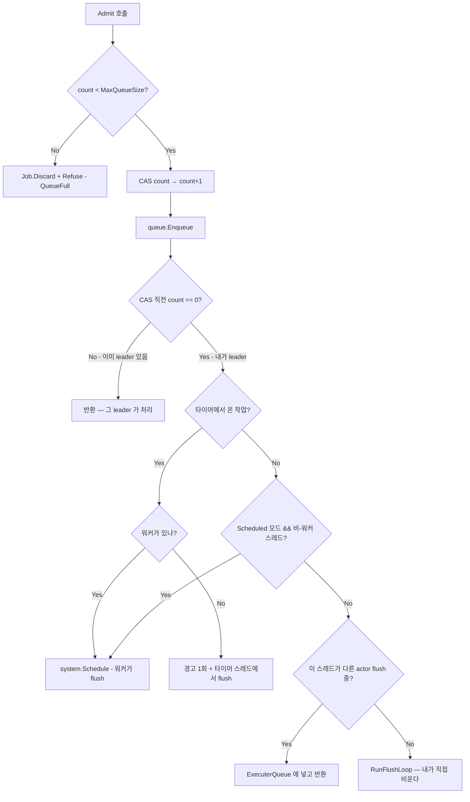

# Chapter 03: AsyncExecutable — 모든 것의 기반

## 3.1 전체 구조 미리보기

`AsyncExecutable`은 JobDispatcherNET의 심장입니다. 코드를 읽기 전에 전체 구조를 파악합시다:

```
AsyncExecutable 클래스
──────────────────────────────────────────────────────────
필드:
  _queue       : ConcurrentQueue<JobEntry>  ← 작업들이 들어오는 큐
  _system      : JobSystem                  ← 워커·타이머·메트릭의 소유자
  _options     : JobOptions                 ← 큐 크기 제한, 실행 모드 등
  _remainingTaskCount : int                 ← 큐 대기 + 실행 중 작업 수
  _faulted     : int                        ← 연속 실패로 격리된 상태인가

공개 API (작업 등록):
  DoAsync(Action)                   ← 작업 등록 (람다), bool 반환
  DoAsync<TState>(action, state)    ← 작업 등록 (클로저 없이!)
  DoAsyncAfter(delay, action)       ← 지연 작업 등록 → ITimerHandle
  DoAsyncEvery(period, action)      ← 주기 작업 등록 → ITimerHandle

공개 API (결과 받기 / 비동기):
  Ask<TResult>(func)                ← 결과를 Task<TResult>로 회수
  AskSync<TResult>(func, timeout)   ← 논-actor 호출자용 동기 회수
  RunAsync(Func<Task>)              ← await 하는 작업
  AskAsync<TResult>(Func<Task<T>>)  ← await 하면서 결과도 반환

공개 API (상태 조회):
  Name / System                     ← 이름, 소속 JobSystem
  RemainingTaskCount                ← 큐 깊이 조회
  MaxObservedQueueDepth             ← 관측된 최대 큐 깊이
  IsFaulted / ClearFault()          ← 연속 실패 격리 상태

재정의 지점:
  protected virtual void OnJobError(Exception)   ← actor 단위 오류 처리

정적 API:
  OnError                           ← 프로세스 전역 예외 폴백
  AcceptingWork                     ← [Obsolete] → system.AcceptingWork

내부 메서드:
  Admit(JobEntry, fromTimer)        ← 입장 판정 + 큐 등록 + leader 결정
  Flush()                           ← 큐를 비우는 핵심 루프
──────────────────────────────────────────────────────────
```

> **v2.0 에서 바뀐 점**
> 예전에는 큐가 `Channel<JobEntry>` 였고, 큐 크기 제한도 채널의 bounded 옵션이 담당했습니다.
> 지금은 **unbounded `ConcurrentQueue<JobEntry>` + 카운터 CAS** 조합입니다. 왜 바꿨는지는 3.3에서
> 설명합니다 (P0-1 버그).

---

## 3.2 DoAsync — 가장 기본적인 진입점

```csharp
public bool DoAsync(Action action)
{
    ArgumentNullException.ThrowIfNull(action);

    // 1) 입장 자격 검사: 셧다운 중인가 / Dispose 됐나 / faulted 인가
    if (!TryReserve(out var reason))
        return Refuse(reason);      // 메트릭 +1, OnDropped 콜백, false 반환

    // 2) 람다를 Job 객체로 포장 (풀에서 재사용!) 후 실제 등록
    return Admit(Job.Rent(action), fromTimer: false);
}
```

`TryReserve`는 세 가지를 봅니다:

```csharp
private bool TryReserve(out DropReason reason)
{
    if (!_system.AcceptingWork) { reason = DropReason.ShuttingDown; return false; }
    if (Volatile.Read(ref _completed) != 0) { reason = DropReason.Disposed;  return false; }
    if (Volatile.Read(ref _faulted)   != 0) { reason = DropReason.Faulted;   return false; }
    reason = default;
    return true;
}
```

**반환값 `bool`을 절대 무시하지 마세요.** `false`는 "이 작업은 실행되지 않는다"는 뜻입니다
(큐 만원 / 셧다운 중 / Dispose 됨 / actor 격리됨). 어느 쪽인지는 `JobOptions.OnDropped` 콜백이
받는 `DropReason`으로 알 수 있습니다 (8장).

간단해 보이지만 실제 마법은 `Admit`에 있습니다.

---

## 3.3 Admit — 직렬 실행의 핵심 로직

`Admit`이 가장 중요한 메서드입니다. 단계별로 이해해봅시다:

```csharp
private bool Admit(JobEntry task, bool fromTimer)
{
    // ─── 단계 1: 입장 판정 = 카운터 CAS ─────────────────────
    int current;
    while (true)
    {
        current = Volatile.Read(ref _remainingTaskCount);

        // 큐 한도 초과? → 이 자리에서 거부하고 Job 은 풀로 반납
        if (_maxQueueSize != 0 && current >= _maxQueueSize)
        {
            task.Discard();
            return Refuse(DropReason.QueueFull);
        }

        // current 가 그대로일 때만 current+1 로 확정 (경쟁이 있으면 재시도)
        if (Interlocked.CompareExchange(ref _remainingTaskCount, current + 1, current) == current)
            break;
    }

    _system.OnJobAdmitted();     // in-flight 계수 (드레인 판정에 사용)
    _queue.Enqueue(task);        // unbounded 큐 → 여기서는 절대 실패하지 않는다

    // ─── 단계 2: 내가 leader 인가? ──────────────────────────
    if (current != 0)
        return true;             // 이미 누군가 이 actor 를 flush 중 → 큐에만 넣고 끝

    // ─── 단계 3: leader 는 어디에서 실행할 것인가 ───────────
    if (fromTimer)
    {
        if (_system.HasWorkers) { _system.Schedule(this); return true; }  // 워커에게 넘김
        _system.WarnTimerFallbackOnce();   // 워커가 없다 → 타이머 스레드에서 직접 실행
        RunFlushLoop();
        return true;
    }

    if (_mode == ExecutionMode.Scheduled && !ThreadContext.IsWorkerThread && _system.HasWorkers)
    {
        _system.Schedule(this);  // 비-워커 스레드는 ready 큐에 넣기만 하고 반환
        return true;
    }

    if (ThreadContext.CurrentExecuter is not null)
    {
        // 이 스레드는 지금 다른 actor 를 flush 중 → 재귀 대신 나중 처리
        ThreadContext.ExecuterQueue.Enqueue(this);
        return true;
    }

    RunFlushLoop();              // LeaderFlush: 내가 이 자리에서 큐를 비운다
    return true;
}
```

### 왜 "카운터가 먼저"인가 — P0-1 버그 이야기

v2.0 의 `DoTask`는 순서가 반대였습니다. **먼저 카운터를 올리고, 그다음 채널에 쓰고, 실패하면
카운터를 되돌렸습니다.** 그 사이에는 "카운터에는 있는데 큐에는 없는 유령 작업"이 존재합니다.

```
MaxQueueSize = 1 인 actor

L(leader) : job1 실행 중, 큐에 job2 대기            count = 2
Q(다른 스레드): Increment → count = 3
Q            : 채널 쓰기 실패 (가득)
   --- 여기서 Q 가 OS 에 선점됨 ---
L            : job1 끝, Decrement → 2 (≠0, 계속)
L            : job2 실행, Decrement → 1 (≠0, 계속)
L            : 큐 읽기 실패 → 스핀
Q            : Decrement → count = 0
L            : 카운터를 다시 보지 않으므로 → 영원히 스핀 (코어 1개 소모!)
M(새 producer): Increment 0→1 → 자기가 leader 라 판단 → L 과 동시에 같은 actor 실행
                → "한 번에 하나씩" 이라는 직렬 실행 보장이 무너진다
```

지금 구조에서는 이 창 자체가 없습니다.

```
카운터 CAS 가 통과했다  ⇒  이 작업은 반드시 큐에 들어간다 (unbounded 라서 쓰기가 실패하지 않음)
카운터 CAS 가 실패했다  ⇒  큐에는 아무것도 넣지 않았고, Job 은 풀로 반납됐다

즉 카운터와 큐가 어긋날 수 없다 = 카운터가 곧 진실(source of truth)
```

거부된 `Job`은 사용자에게 넘기지 않고 `task.Discard()`로 라이브러리가 풀에 반납합니다
(4장 참조). `OnDropped` 콜백이 `JobEntry`를 받지 않게 바뀐 이유가 이것입니다.

이 로직을 다이어그램으로 보면:


```mermaid
flowchart TD
    A[Admit 호출] --> B{count < MaxQueueSize?}
    B -->|No| C[Job.Discard + Refuse - QueueFull]
    B -->|Yes| D[CAS count → count+1]
    D --> E[queue.Enqueue]
    E --> F{CAS 직전 count == 0?}
    F -->|No - 이미 leader 있음| G[반환 — 그 leader 가 처리]
    F -->|Yes - 내가 leader| H{타이머에서 온 작업?}
    H -->|Yes| I{워커가 있나?}
    I -->|Yes| J[system.Schedule - 워커가 flush]
    I -->|No| K[경고 1회 + 타이머 스레드에서 flush]
    H -->|No| L{Scheduled 모드 && 비-워커 스레드?}
    L -->|Yes| J
    L -->|No| M{이 스레드가 다른 actor flush 중?}
    M -->|Yes| N[ExecuterQueue 에 넣고 반환]
    M -->|No| O[RunFlushLoop — 내가 직접 비운다]
```

### ExecutionMode — 누가 actor 코드를 실행하는가

```
LeaderFlush (기본값)
  idle actor 에 처음 작업을 넣은 스레드가 그 자리에서 Flush 를 돌린다.
  → 지연이 가장 짧다. 워커 안에서 actor → actor 호출할 때 최적.
  → 단점: 소켓 IO 스레드나 ThreadPool 스레드가 호출자면 그 스레드가 게임 로직을 돌린다.

Scheduled
  비-워커 스레드의 호출은 actor 를 JobSystem 의 ready 큐에 넣기만 하고 즉시 반환.
  워커가 꺼내서 Flush 한다. (워커 스레드에서의 호출은 여전히 즉시 flush)
  → 네트워크·ThreadPool 진입점에서 접근하는 actor 에는 이쪽을 권장.
```

```csharp
// 콘솔 스레드와 IO 스레드가 직접 찌르는 월드 actor
public GameWorld(ServerConfig cfg, JobSystem system)
    : base(new JobOptions
    {
        Name = "World",
        System = system,
        MaxQueueSize = 10_000,
        Mode = ExecutionMode.Scheduled,   // ← 호출자 hijack 방지
    })
```

---

## 3.4 Flush — 큐를 비우는 핵심 루프

```csharp
internal void Flush()
{
    var spinner = new SpinWait();
    var iterations = 0;
    var executed = 0;

    while (true)
    {
        if (_queue.TryDequeue(out var job))
        {
            spinner = new SpinWait();
            iterations = 0;

            ExecuteJob(job);                     // 실행 + 메트릭 + 예외 처리

            _system.OnJobRetired();
            var remaining = Interlocked.Decrement(ref _remainingTaskCount);

            if (remaining == 0)
            {
                SignalDrained();                 // DisposeAsync 대기 해제
                return;
            }

            if (++executed >= _maxJobsPerFlush && _system.HasWorkers)
            {
                // 공정성: 한 actor 가 워커를 영원히 독점하지 못하게 되돌려준다
                _system.Schedule(this);
                return;
            }
        }
        else
        {
            // ★ 카운터가 진실이다. 0 이면 예약을 들고 있는 producer 가 없다는 뜻이므로
            //   기다릴 것이 없다. v2.0 루프에는 이 탈출구가 없어서 무한 스핀했다.
            if (Volatile.Read(ref _remainingTaskCount) == 0)
            {
                SignalDrained();
                return;
            }

            // 카운터는 양수인데 큐가 비었다 = producer 가 CAS 와 Enqueue 사이에 있다.
            // 아주 짧은 순간이므로 스핀으로 기다린다.
            if (++iterations >= MaxFlushSpinIterations)
            {
                Thread.Yield();
                iterations = 0;
                spinner = new SpinWait();
            }
            else
            {
                spinner.SpinOnce();
            }
        }
    }
}
```

### 두 개의 탈출구

```
탈출구 ①  작업을 실행한 뒤 Decrement 결과가 0
          → 큐가 완전히 비었다. 정상 종료.

탈출구 ②  큐 읽기 실패 + 카운터가 0
          → 카운터를 들고 있는 producer 가 하나도 없다.
            (있다면 그 producer 가 Enqueue 후 leader 판정을 다시 하므로 안전)
          → 기다릴 이유가 없다. 종료.

MaxFlushSpinIterations 는 이제 "producer 가 CAS 와 Enqueue 사이에 있는
수십 ns 를 얼마나 스핀으로 견딜지"만 조절합니다. 예전처럼 무한 스핀의
안전장치가 아닙니다.
```

### Flush의 동작 원리

```
           _remainingTaskCount = 3 (큐에 작업 3개)
                    │
                    ▼
          ┌─────────────────────────────────────┐
          │           Flush 루프                │
          │                                     │
          │  ① TryDequeue → job1 → Execute     │
          │    Decrement → count=2              │
          │                                     │
          │  ② TryDequeue → job2 → Execute     │
          │    Decrement → count=1              │
          │                                     │
          │  ③ TryDequeue → job3 → Execute     │
          │    Decrement → count=0 → return!    │
          └─────────────────────────────────────┘

만약 ③ 실행 중에 새 작업이 들어오면?

  DoAsync 호출 → CAS 0→1 이 아니라 1→2 (이미 leader 있음) → 큐에만 넣기
  Flush 는 Decrement 결과가 1 이므로 계속 돌아 그 작업까지 처리

Flush 가 이미 return 한 뒤에 들어오면?

  DoAsync 호출 → CAS 0→1 성공 → "내가 leader" → 새로 Flush 시작
```

### ExecuteJob — 예외는 actor 를 넘어가지 않는다

```csharp
try
{
    job.Execute();
    _system.Metrics.OnExecuted();
    if (_maxConsecutiveFailures > 0)
        Volatile.Write(ref _consecutiveFailures, 0);   // 성공하면 연속 실패 카운트 리셋
}
catch (Exception ex)
{
    _system.Metrics.OnExecuted();
    _system.Metrics.OnFailed();
    HandleJobFailure(ex);      // OnJobError(ex) → 필요하면 faulted 전이
}
```

`HandleJobFailure`는 먼저 **actor 단위 훅**을 부릅니다:

```csharp
public sealed class PlayerActor : AsyncExecutable
{
    // 이 플레이어의 작업이 터졌다 → 프로세스가 아니라 이 세션만 끊는다
    protected override void OnJobError(Exception exception)
    {
        JobLog.Error($"[{Name}] 작업 실패 — 세션 종료", exception);
        _session.Close();
    }
}
```

재정의하지 않으면 기본 구현이 프로세스 전역 `AsyncExecutable.OnError`로 넘기고, 그것도 없으면
로거에 씁니다. 그리고 `JobOptions.MaxConsecutiveFailures`를 설정해 두면 연속 N회 실패한 actor 는
`IsFaulted == true` 가 되어 이후 작업을 `DropReason.Faulted`로 거부합니다 —
`ClearFault()`를 부를 때까지. 폭주하는 actor 하나가 로그를 채우는 것을 막는 장치입니다.

---

## 3.5 DoAsync\<TState\> — 클로저 없는 고성능 버전

```csharp
// 일반 DoAsync: 람다가 외부 변수를 캡처 → 힙 할당 발생
testObject.DoAsync(() => testObject.TestFunc1(5));
//                 ↑ testObject 와 5를 캡처하는 클로저 객체가 매번 생성됨!

// DoAsync<TState>: 클로저 없음 → 할당 없음
testObject.DoAsync(
    static t => t.Self.TestFunc1(t.Value),   // static 람다!
    (Self: testObject, Value: 5));           // 캡처할 값은 전부 state 로
```

왜 중요할까요?

```
초당 10만 번 DoAsync 호출이 발생하는 게임 서버라면:

일반 DoAsync:
  - 클로저 객체 10만 개 생성/소멸
  - GC 압력 증가
  - GC 발생 시 수십 ms 멈춤 (게임에서 심각한 문제!)

DoAsync<TState>:
  - 클로저 없음 → GC 압박 없음
  - 부드러운 게임 플레이 유지
```

`state`가 참조형이고 값이 `null`이어도 그대로 핸들러에 전달됩니다. (v2.0 은 `null` 상태를
`default!`로 바꿔 넘겨서 "값을 지우지 않았는데 null 이 되는" 혼란이 있었습니다 — 4장 참조.)

---

## 3.6 DoAsyncAfter / DoAsyncEvery — 지연·주기 실행

```csharp
// N ms 후 한 번 — 취소 가능한 핸들을 돌려준다
public ITimerHandle DoAsyncAfter(TimeSpan delay, Action action);
public ITimerHandle DoAsyncAfter<TState>(TimeSpan delay, Action<TState> action, TState state);

// period 마다 반복 — 핸들을 Cancel 할 때까지
public ITimerHandle DoAsyncEvery(TimeSpan period, Action action, TimeSpan? initialDelay = null);
```

```csharp
public interface ITimerHandle
{
    bool Cancel();       // 발화 전이면 true, 이미 발화했으면 false
    bool IsPending { get; }
}
```

타이머는 `JobSystem`이 소유한 **전용 타이머 스레드 1개**가 관리합니다. 발화하면 그 작업은
actor 의 큐로 들어가고, 워커가 flush 합니다 (5장에서 자세히).

### 주기 작업은 DoAsyncEvery 로

예전에는 "작업이 끝나면서 자기 자신을 다시 예약"하는 자기복제 패턴을 손으로 썼습니다:

```csharp
// ❌ 옛날 방식 — 한 번이라도 예외가 나면 체인이 영원히 끊긴다
private void Heartbeat()
{
    Console.WriteLine("살아있습니다!");
    DoAsyncAfter(TimeSpan.FromSeconds(5), Heartbeat);  // 이 줄에 도달하지 못하면 끝
}
```

```csharp
// ✅ 지금 방식 — 예외가 나도 다음 틱이 온다. 정지는 Cancel() 한 번.
private ITimerHandle? _heartbeat;

public void Start()
    => DoAsync(() => _heartbeat = DoAsyncEvery(TimeSpan.FromSeconds(5), Heartbeat));

private void Heartbeat()
{
    Console.WriteLine("살아있습니다!");
}

private void ProcessDespawn()
{
    _heartbeat?.Cancel();      // 플래그 검사 대신 실제 취소 → GC 도 바로 풀린다
}
```

```
DoAsyncEvery(5s, Heartbeat)
    │
    ├─ t=5s   타이머 스레드 → actor 큐 → Heartbeat()
    ├─ t=10s  ...
    ├─ t=15s  Heartbeat() 안에서 예외! → 로그만 남고 체인은 그대로 유지
    ├─ t=20s  ...
    │
    └─ handle.Cancel() → 여기서 끝
```

---

## 3.7 Ask / RunAsync — 결과 회수와 async 작업

### Ask — 결과를 돌려받는 작업

`DoAsync`는 "던지고 잊기"입니다. 결과가 필요하면 `Ask`를 씁니다.

```csharp
public sealed class DataStore : AsyncExecutable
{
    private readonly Dictionary<string, int> _data = [];

    // Dictionary 는 actor 큐 안에서만 접근된다 — lock 없음
    public Task<int?> GetValueAsync(string key)
        => Ask(static t => t.Self.Read(t.Key), (Self: this, Key: key));

    private int? Read(string key) => _data.TryGetValue(key, out var v) ? v : null;
}

// 사용
var value = await store.GetValueAsync("score");
```

큐에 들어가지 못하면(만원·셧다운 등) 반환된 Task 가 `JobRejectedException`으로 실패합니다.
조용히 영원히 기다리는 일은 없습니다.

### AskSync — 논-actor 호출자용 동기 회수

```csharp
public WorldSnapshot GetSnapshot()
{
    try
    {
        // 콘솔 명령, 헬스 프로브, Main 등 "async 가 아닌" 호출자용
        return AskSync(BuildSnapshot, TimeSpan.FromSeconds(2));
    }
    catch (TimeoutException)
    {
        JobLog.Warn("[World] snapshot timed out");
        return WorldSnapshot.Empty;
    }
}
```

`AskSync`는 첫 줄에서 `JobDiagnostics.GuardBlockingWait`를 부릅니다. **actor 작업 안에서
호출하면 예외를 던집니다.** 그 자리에서 블로킹하면 그 스레드가 바로 상대 actor 를 돌려야 할
스레드이므로 100% 데드락이기 때문입니다. 예전 책이 "주의하세요"라고만 적던 함정을 이제
라이브러리가 잡아 줍니다 (`JobSystemOptions.DetectBlockingWaitOnWorker`, DEBUG 기본 on).

### RunAsync / AskAsync — await 하는 작업

DB·Redis·HTTP 호출이 있는 작업은 `await` 이 필요합니다.

```csharp
public Task SaveAsync()
    => RunAsync(async () =>
    {
        var snapshot = BuildSnapshot();     // ① actor 큐 안 (안전)
        await _db.WriteAsync(snapshot);     // ② await
        _lastSavedAt = DateTime.UtcNow;     // ③ 다시 actor 큐 안 (안전)
    });

public Task<int> LoadScoreAsync()
    => AskAsync(async () => await _db.ReadScoreAsync(_id));
```

`await` 이후 continuation 이 어디로 돌아오는지는 `JobOptions.AsyncReentrancy`가 정합니다:

```
Interleaved (기본값)
  continuation 이 이 actor 의 큐로 되돌아온다. await 중에는 다른 작업이 실행된다.
  → 처리량이 높다. 단, ② 앞뒤로 다른 작업이 상태를 바꿨을 수 있다는 것을 감안해야 한다.
  → ConfigureAwait(false) 를 쓰면 이 보장이 깨진다 (ThreadPool 로 돌아감). 쓰지 말 것.

Exclusive
  async 작업이 끝날 때까지 actor 가 다른 작업을 전혀 실행하지 않는다.
  → 추론이 가장 쉽다. 단, 느린 await 하나가 actor 전체를 멈춘다.
```

---

## 3.8 셧다운 — AcceptingWork 와 StopAsync

```csharp
// ✅ 지금 방식 — 한 줄
var drained = await system.StopAsync(TimeSpan.FromSeconds(10));
if (!drained)
    JobLog.Warn("일부 작업이 남은 채로 종료되었습니다");
```

`StopAsync`가 하는 일:

```
1. (옵션 refuseNewWork: true 면) 먼저 AcceptingWork = false
2. in-flight 작업 + ready 큐 + 대기 타이머가 모두 0 이 될 때까지 대기 (drainTimeout 까지)
3. AcceptingWork = false
4. 타이머 스레드 정지
5. 이 system 에 붙은 dispatcher 들 Dispose (워커 Join)
```

기본값이 "드레인하면서도 새 작업을 받는" 이유는, 종료 처리 자체가 작업을 만들기 때문입니다
(예: actor 가 despawn 하면서 이웃에게 알림). 외부 입력을 먼저 차단하고 싶으면
`StopAsync(timeout, refuseNewWork: true)` 를 쓰거나, 네트워크를 먼저 멈추면 됩니다.

```csharp
// 게이트만 직접 만지고 싶다면 (system 단위!)
system.AcceptingWork = false;   // 이후 이 system 의 모든 DoAsync 가 false 반환
```

> **v2.0 에서 바뀐 점**
> `AsyncExecutable.AcceptingWork` (프로세스 전역 static)는 `[Obsolete]`입니다. `JobSystem.Default`
> 로 위임될 뿐이라, 한 프로세스에 job system 이 둘이면 서로의 셧다운 게이트를 건드립니다.
> 그리고 예전의 4단계 수동 종료 —
> `AcceptingWork=false` → 각 actor `DisposeAsync` → `dispatcher.Dispose()` →
> `TimerRegistry.DisposeAll()` — 는 `StopAsync` 한 줄로 대체되었습니다.
> (`TimerRegistry` 자체가 이제 no-op 입니다. 5장 참조.)

---

## 3.9 DisposeAsync — 개별 actor 의 우아한 종료

```csharp
public virtual async ValueTask DisposeAsync()
{
    // 아직 처리 중인 작업이 있으면
    if (Volatile.Read(ref _remainingTaskCount) > 0)
    {
        var tcs = new TaskCompletionSource(
            TaskCreationOptions.RunContinuationsAsynchronously);
        _drainTcs = tcs;

        // 한 번 더 체크 (TOCTOU 방지)
        if (Volatile.Read(ref _remainingTaskCount) > 0)
            await tcs.Task.ConfigureAwait(false);   // 큐가 빌 때까지 신호 대기
    }

    Volatile.Write(ref _completed, 1);   // 이후 DoAsync 는 DropReason.Disposed 로 거부
    GC.SuppressFinalize(this);
}
```

```
DisposeAsync() 호출
      │
      ├─ 큐가 비어있음? → 즉시 완료 표시
      │
      └─ 큐에 작업 있음?
            │
            ▼
         _drainTcs 설정 (신호 대기 — 폴링 없음)
            │
            │  (Flush 가 마지막 작업을 처리하고 카운터가 0 이 되면)
            ▼
         SignalDrained() → _drainTcs.TrySetResult()
            │
            ▼
         _completed = 1 → DisposeAsync 완료
```

**주의:** 드레인을 해 줄 주체가 있어야 합니다. 워커를 먼저 `Dispose` 한 뒤 actor 를
`DisposeAsync` 하면 큐를 비울 사람이 없어 영원히 기다립니다. 그래서 요즘 권장 순서는
"actor 를 하나씩 정리"가 아니라 **`system.StopAsync()` 한 번**입니다. 개별 `DisposeAsync`는
"이 actor 만 먼저 접겠다"는 국소적인 경우에 쓰세요.

---

## 3.10 RemainingTaskCount / IsFaulted — 큐 모니터링

```csharp
// 큐 깊이 확인 (모니터링/디버깅용)
var player = new PlayerActor(p, world);
Console.WriteLine($"대기 작업: {player.RemainingTaskCount}");
Console.WriteLine($"관측 최대 깊이: {player.MaxObservedQueueDepth}");
Console.WriteLine(player);        // "Player#7(queue=3)"

// 실무에서는 이렇게 활용:
if (player.RemainingTaskCount > 1000)
    JobLog.Warn($"[{player.Name}] 큐 과부하! ({player.RemainingTaskCount})");

// 연속 실패로 격리된 actor 를 복구
if (player.IsFaulted)
{
    JobLog.Warn($"[{player.Name}] faulted — 원인 확인 후 복구");
    player.ClearFault();
}
```

---

## 3.11 전체 흐름 정리

실제 코드 실행 순서를 처음부터 끝까지 추적해봅시다:

```
외부 호출: player.TakeDamage(30)
    │
    ▼
TakeDamage(30) {
    DoAsync(static t => t.Self.ProcessTakeDamage(t.Dmg), (Self: this, Dmg: 30))
}
    │
    ▼
DoAsync(action, state) {
    TryReserve()             ← 셧다운/Dispose/faulted 아님 확인
    job = Job<T>.Rent(...)   ← 풀에서 Job 객체 가져오기
    Admit(job, fromTimer: false)
}
    │
    ▼
Admit(job) {
    CAS 0 → 1                ← 입장 확정 (count 는 이제 진실)
    queue.Enqueue(job)       ← unbounded, 실패하지 않음
    current == 0             ← 내가 leader
    Mode == LeaderFlush,
    CurrentExecuter == null  ← 이 스레드는 놀고 있음
    RunFlushLoop()
}
    │
    ▼
Flush() {
    job = queue.TryDequeue() ← 방금 넣은 job 꺼내기
    ExecuteJob(job)          ← ProcessTakeDamage(30) 실행!
    Decrement()              ← count = 0
    SignalDrained(); return  ← 큐 비었으므로 종료
}
    │
    ▼
ProcessTakeDamage(30) {
    _hp -= 30               ← 안전하게 상태 변경!
}
```

---

## 3.12 정리

```
이번 장에서 배운 것
──────────────────────────────────────────────
✓ DoAsync — 람다를 큐에 등록, 반환 bool 을 반드시 확인
✓ DoAsync<TState> — 클로저 없는 고성능 버전
✓ Admit — 카운터 CAS 로 입장 판정 (카운터가 곧 진실)
✓ Flush — 카운터가 0 이면 무조건 탈출, MaxJobsPerFlush 로 공정성
✓ ExecutionMode — LeaderFlush(기본) vs Scheduled(비-워커 진입점)
✓ DoAsyncAfter/DoAsyncEvery — ITimerHandle 로 취소 가능, 주기 실행
✓ Ask/AskSync/RunAsync/AskAsync — 결과 회수와 async 작업
✓ OnJobError + MaxConsecutiveFailures — actor 단위 오류 격리
✓ system.StopAsync — 4단계 수동 셧다운을 대체하는 한 줄
✓ DisposeAsync — 개별 actor 의 신호 기반 드레인
```

---

*[← Chapter 02](./chapter02.md) | [→ Chapter 04: JobEntry와 오브젝트 풀링](./chapter04.md)*
