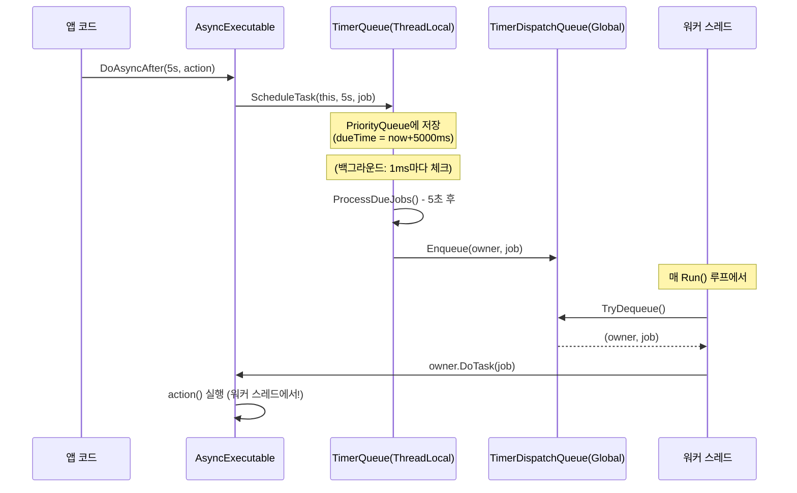

# Chapter 05: ThreadContext와 TimerQueue — 타이머 메커니즘

## 5.1 ThreadLocal 저장소란?

스레드 로컬(ThreadLocal) 저장소는 각 스레드가 자신만의 복사본을 갖는 변수입니다.

```
일반 static 변수:        ThreadLocal 변수:
                          
Thread-1 ──┐             Thread-1: Timer-1 (자기 것)
Thread-2 ──┼─► _timer    Thread-2: Timer-2 (자기 것)
Thread-3 ──┘  (공유!)    Thread-3: Timer-3 (자기 것)

→ 모든 스레드가 공유       → 각 스레드가 독립 사용
→ lock 필요               → lock 불필요
```

JobDispatcherNET에서 각 워커 스레드는 자신만의 `TimerQueue`를 갖습니다.

---

## 5.2 ThreadContext 구조

```csharp
public static class ThreadContext
{
    // 각 스레드의 전용 TimerQueue
    private static readonly ThreadLocal<TimerQueue> _timer = new(() =>
    {
        var tq = new TimerQueue();
        TimerRegistry.Track(tq);  // 전역 레지스트리에 약한 참조로 등록
        return tq;
    });

    // 현재 Flush 중인 Actor 체인을 위한 큐
    private static readonly ThreadLocal<Queue<AsyncExecutable>> _executerQueue
        = new(() => new Queue<AsyncExecutable>());

    // 현재 이 스레드가 Flush 중인 Actor (null이면 처리 중 없음)
    private static readonly ThreadLocal<AsyncExecutable?> _currentExecuter
        = new(() => null);

    // JobDispatcher가 매 틱마다 갱신하는 현재 시각(ms)
    private static readonly ThreadLocal<long> _tickCount = new();

    public static TimerQueue Timer => _timer.Value!;
    public static Queue<AsyncExecutable> ExecuterQueue => _executerQueue.Value!;
    public static AsyncExecutable? CurrentExecuter
    {
        get => _currentExecuter.Value;
        set => _currentExecuter.Value = value;
    }
    public static long TickCount
    {
        get => _tickCount.Value;
        set => _tickCount.Value = value;
    }
}
```

`TickCount`의 활용 예시:

```csharp
// GameWorker.cs에서
public bool Run(CancellationToken cancellationToken)
{
    // ...

    // ThreadLocal TickCount를 이용한 락 없는 주기 작업!
    long now = ThreadContext.TickCount;
    if (now - _lastHeartbeatTick >= 5000)  // 5초마다
    {
        _lastHeartbeatTick = now;
        Console.WriteLine($"Worker #{_workerId} alive — tick={now}ms");
    }

    return true;
}
```

---

## 5.3 TimerQueue — 고정밀 지연 실행

```csharp
public sealed class TimerQueue : IDisposable
{
    private readonly PriorityQueue<TimerJob, long> _queue = new();
    private readonly object _lock = new();
    private readonly PeriodicTimer _timer;         // 1ms 주기 백그라운드 타이머
    private readonly Task _processingTask;
    private readonly long _startTicks = Stopwatch.GetTimestamp();
    private readonly List<TimerJob> _jobBuffer = [];

    public TimerQueue() : this(TimeSpan.FromMilliseconds(1)) { }

    public TimerQueue(TimeSpan tickInterval)
    {
        _timer = new PeriodicTimer(tickInterval);
        _processingTask = ProcessTimerJobsAsync();  // 백그라운드 처리 시작
    }

    // 현재 이 TimerQueue 기준의 경과 시간 (ms)
    public long GetCurrentTick() =>
        (long)Stopwatch.GetElapsedTime(_startTicks).TotalMilliseconds;
}
```

---

## 5.4 타이머 작업 등록

```csharp
public void ScheduleTask(AsyncExecutable owner, TimeSpan delay, JobEntry task)
{
    if (Volatile.Read(ref _disposed) != 0)
        return;

    // 만료 시각 계산 (현재 tick + delay)
    var dueTime = GetCurrentTick() + (long)delay.TotalMilliseconds;

    lock (_lock)
    {
        // PriorityQueue: 만료 시각(dueTime)이 작을수록 앞에 위치
        _queue.Enqueue(new TimerJob(owner, task), dueTime);
    }

    Interlocked.Increment(ref _pendingJobsAcrossAllInstances);
}
```

`PriorityQueue`를 쓰는 이유:

```
일반 Queue:            PriorityQueue (최소 힙):
                       
[A: 500ms]             [B: 100ms] ← 맨 앞 (가장 빨리 실행)
[B: 100ms]             [C: 200ms]
[C: 200ms]             [A: 500ms]
                       
순서대로 꺼내면         만료 시각 순으로 꺼냄
B를 빨리 처리못함       → 정확한 타이밍 보장
```

---

## 5.5 백그라운드 타이머 처리 루프

```csharp
private async Task ProcessTimerJobsAsync()
{
    try
    {
        // PeriodicTimer가 1ms마다 신호를 줌
        while (await _timer.WaitForNextTickAsync().ConfigureAwait(false))
        {
            ProcessDueJobs();
        }
    }
    catch (ObjectDisposedException) { }  // Dispose 시 정상 종료
}

private void ProcessDueJobs()
{
    _jobBuffer.Clear();

    lock (_lock)
    {
        var currentTick = GetCurrentTick();
        // 만료 시각이 된 작업들을 모두 꺼내기
        while (_queue.Count > 0
            && _queue.TryPeek(out _, out var dueTime)
            && currentTick >= dueTime)
        {
            _jobBuffer.Add(_queue.Dequeue());
        }
    }

    if (_jobBuffer.Count == 0) return;

    Interlocked.Add(ref _pendingJobsAcrossAllInstances, -_jobBuffer.Count);

    // ★ 핵심: 직접 실행하지 않고 TimerDispatchQueue에 넣기!
    foreach (var job in _jobBuffer)
    {
        TimerDispatchQueue.Enqueue(job.Owner, job.Task);
    }
}
```

---

## 5.6 TimerDispatchQueue — 타이머와 워커의 브릿지

왜 직접 실행하지 않고 `TimerDispatchQueue`를 거칠까요?

```
직접 실행하면 생기는 문제:
─────────────────────────────────────────────────────────

PeriodicTimer (ThreadPool 스레드)
    │
    ▼ 만료!
ProcessDueJobs() → owner.DoTask(job)  ← 여기서 Flush 시작!
                         │
                         ▼
         Actor의 Flush가 ThreadPool 스레드에서 실행됨!

결과:
  - ThreadContext.TickCount가 0 (ThreadPool 스레드에는 없음)
  - ThreadLocal 타이머 등 모든 ThreadLocal 값이 잘못됨
  - "전용 OS 스레드에서만 Actor 실행" 약속 깨짐

─────────────────────────────────────────────────────────

TimerDispatchQueue를 사용하면:
─────────────────────────────────────────────────────────

PeriodicTimer (ThreadPool 스레드)
    │
    ▼ 만료!
ProcessDueJobs() → TimerDispatchQueue.Enqueue(owner, job)
                            │
                            │ (워커 스레드의 Run 루프에서 드레인)
                            ▼
                    owner.DoTask(job) ← 워커 스레드에서 실행!

결과:
  - ThreadContext.TickCount 정확
  - 모든 ThreadLocal 값 정상
  - "전용 OS 스레드에서만 Actor 실행" 약속 유지!
─────────────────────────────────────────────────────────
```

```csharp
internal static class TimerDispatchQueue
{
    private static readonly ConcurrentQueue<TimerDispatchItem> _queue = new();
    private static long _count;

    public static void Enqueue(AsyncExecutable owner, JobEntry job)
    {
        Interlocked.Increment(ref _count);
        _queue.Enqueue(new TimerDispatchItem(owner, job));
    }

    public static bool TryDequeue(out TimerDispatchItem item)
    {
        if (_queue.TryDequeue(out item))
        {
            Interlocked.Decrement(ref _count);
            return true;
        }
        return false;
    }

    public const int MaxDrainPerTick = 256;  // 한 틱에 최대 256개만 처리

    public readonly record struct TimerDispatchItem(AsyncExecutable Owner, JobEntry Job);
}
```

---

## 5.7 전체 타이머 실행 흐름



---

## 5.8 TimerRegistry — 모든 TimerQueue를 추적

```csharp
public static class TimerRegistry
{
    // WeakReference로 추적 — GC가 TimerQueue를 수거할 수 있게 함
    private static readonly List<WeakReference<TimerQueue>> _timers = [];
    private static readonly object _lock = new();

    internal static void Track(TimerQueue tq)
    {
        lock (_lock)
        {
            _timers.Add(new WeakReference<TimerQueue>(tq));

            // 64번마다 죽은 참조 청소
            if (++_trackCount >= CleanupInterval)
            {
                _trackCount = 0;
                CleanupDeadReferencesLocked();
            }
        }
    }

    // 서버 종료 시 모든 TimerQueue 정리
    public static void DisposeAll()
    {
        lock (_lock)
        {
            foreach (var wr in _timers)
                if (wr.TryGetTarget(out var tq))
                    tq.Dispose();
            _timers.Clear();
        }
    }
}
```

왜 `WeakReference`를 쓰나요?

```
일반 참조 (strong reference):
    TimerRegistry._timers → TimerQueue 객체
    → TimerQueue가 GC 안 됨
    → 스레드 종료 후에도 TimerQueue가 메모리에 남음!

WeakReference (약한 참조):
    TimerRegistry._timers ⇢ TimerQueue 객체
    → GC가 다른 강한 참조가 없으면 TimerQueue 수거 가능
    → 스레드 종료 → ThreadLocal 소멸 → TimerQueue GC 수거 OK
    → Registry에서는 .TryGetTarget()으로 생존 여부 확인
```

---

## 5.9 자기복제 타이머 패턴 상세

```csharp
// 채팅 서버의 Room.cs에서
private void Heartbeat(TimeSpan period)
{
    if (_stopped) return;  // 종료 체크!

    // 1. 실제 작업 수행
    if (_users.Count > 0)
    {
        BroadcastSystem(MessageType.RoomChat,
            $"[알림] 현재 {_name} 방에 {_users.Count}명이 있습니다.");
    }

    // 2. 자기 자신을 다시 예약 (자기복제!)
    DoAsyncAfter(period, () => Heartbeat(period));
}
```

타임라인:

```
t=0s:   StartHeartbeat(15s) 호출
          └─► DoAsync(() => Heartbeat(15s))
               └─► Heartbeat(15s) 실행
                    └─► DoAsyncAfter(15s, () => Heartbeat(15s)) 예약

t=15s:  타이머 만료 → Heartbeat(15s) 실행
          └─► DoAsyncAfter(15s, () => Heartbeat(15s)) 예약

t=30s:  타이머 만료 → Heartbeat(15s) 실행
          └─► ...

(Room이 살아있는 한 영원히 반복)

종료 시:
  _stopped = true
  Heartbeat 실행 시 맨 위의 if (_stopped) return; 으로 탈출
  → 자동으로 체인 종료!
```

---

## 5.10 정리

```
이번 장에서 배운 것
──────────────────────────────────────────────
✓ ThreadLocal = 각 스레드만의 독립 변수
✓ ThreadContext = 워커 스레드의 전용 저장소
   (Timer, ExecuterQueue, CurrentExecuter, TickCount)
✓ TimerQueue = PriorityQueue 기반 지연 실행
   PeriodicTimer(1ms)로 백그라운드 체크
✓ TimerDispatchQueue = 타이머 → 워커 브릿지
   ThreadPool 실행 대신 워커 스레드로 전달
✓ TimerRegistry = WeakReference로 모든 TimerQueue 추적
✓ 자기복제 패턴 = DoAsyncAfter로 자기 자신 재예약
```

---

*[← Chapter 04](./chapter04.md) | [→ Chapter 06: JobDispatcher와 IRunnable](./chapter06.md)*
