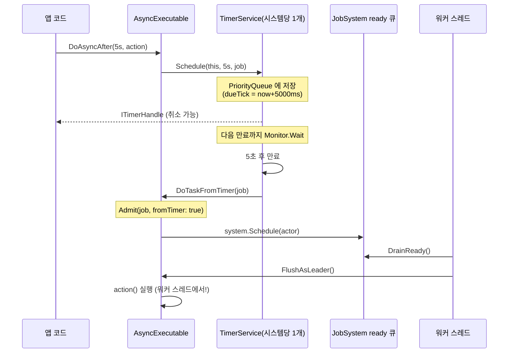

# Chapter 05: 타이머 서비스와 ThreadContext — 지연·주기 실행

## 5.1 타이머는 어디에서 살아야 하나?

`DoAsyncAfter(5초, ...)`를 호출하면 누군가는 5초를 세고 있어야 합니다. 그 "누군가"를 어디에
두느냐가 이 장의 전부입니다. 선택지는 셋입니다.

```
① 예약한 스레드마다 하나씩 둔다        ← v1 / v2.0 이 택했던 방식
   장점: 락 없음, ThreadLocal 로 간단
   단점: 그 스레드가 죽으면 타이머도 같이 죽는다 ★

② ThreadPool 타이머(System.Threading.Timer)를 쓴다
   장점: 만들기 쉽다
   단점: 콜백이 ThreadPool 스레드에서 실행 → actor 코드가 워커 밖으로 샌다
         ThreadPool 이 포화되면 게임 틱이 밀린다

③ JobSystem 마다 전용 타이머 스레드를 하나 둔다     ← 지금 방식
   장점: 소유자가 명확하고, 워커가 죽어도 타이머는 산다
        발화는 actor 큐로 넘기므로 실행은 여전히 워커에서
   단점: 스레드 1개를 상시 점유 (대신 대기 중에는 CPU 0%)
```

①의 단점이 실제 장애로 이어진 것이 P0-2 결함입니다. 워커가 예외로 죽어 supervisor 가
재기동하면, **그 워커 스레드에서 예약해 둔 타이머가 전부 사라졌습니다.** NPC AI tick 체인,
부활 타이머, AOI 재동기화가 조용히 영구 정지하고, 메트릭에도 잡히지 않았습니다.

그래서 v2.1 은 ③으로 바꿨습니다.

---

## 5.2 TimerService — 시스템당 전용 스레드 1개

```
JobSystem "game"
   ├─ 워커 스레드 8개        (JobWorker-game-0 ~ 7)
   ├─ 타이머 스레드 1개      (JobTimer-game)         ← 이 장의 주인공
   ├─ ready 큐
   └─ 메트릭
```

`TimerService`는 `internal` 클래스입니다. 사용자가 직접 만들거나 참조하지 않고,
`DoAsyncAfter` / `DoAsyncEvery` 를 통해서만 씁니다. 내부는 아주 단순합니다:

```csharp
internal sealed class TimerService : IDisposable
{
    private const int MaxWaitMs = 1000;

    private readonly object _lock = new();
    private readonly PriorityQueue<TimerEntry, long> _queue = new();   // 만료 시각 최소 힙
    private readonly List<TimerEntry> _dueBuffer = [];
    private readonly Thread _thread;   // "JobTimer-{system.Name}", AboveNormal, IsBackground
    private long _pending;
}
```

핵심 루프는 "가장 빨리 만료될 항목까지 자고, 깨어나서 만료된 것을 꺼내 던진다"입니다.

```csharp
while (살아있는 동안)
{
    lock (_lock)
    {
        CollectDueLocked();               // 만료된 항목을 _dueBuffer 로

        if (_dueBuffer.Count == 0)
        {
            if (_queue.Count == 0)
            {
                Monitor.Wait(_lock, MaxWaitMs);   // 예약이 하나도 없음 → 최대 1초 대기
                continue;
            }

            _queue.TryPeek(out _, out var nextDue);
            var remaining = nextDue - CurrentTick;
            if (remaining <= 0) continue;

            Monitor.Wait(_lock, (int)Math.Min(remaining, MaxWaitMs));  // 다음 만료까지 대기
            continue;
        }
    }

    DispatchDue();                        // 락 밖에서 발화
}
```

`PeriodicTimer(1ms)` 를 돌리지 않는 것이 포인트입니다. **예약이 없으면 이 스레드는 완전히
잠들어 있고, 새 예약이 들어오면 `Monitor.Pulse`로 깨어납니다.** 워커 8개면 ThreadPool 에
1ms 주기 태스크가 8개 돌던 예전 구조와 비교됩니다.

`PriorityQueue`를 쓰는 이유는 그대로입니다:

```
일반 Queue:            PriorityQueue (최소 힙):

[A: 500ms]             [B: 100ms] ← 맨 앞 (가장 빨리 만료)
[B: 100ms]             [C: 200ms]
[C: 200ms]             [A: 500ms]

순서대로 꺼내면         만료 시각 순으로 꺼냄
B를 빨리 처리 못함      → "다음 만료까지 잔다" 가 가능해짐
```

---

## 5.3 예약에서 실행까지

```csharp
// AsyncExecutable
public ITimerHandle DoAsyncAfter(TimeSpan delay, Action action)
{
    ArgumentNullException.ThrowIfNull(action);

    if (!TryReserve(out var reason))       // 셧다운/Dispose/faulted 면 예약 자체를 거부
    {
        Refuse(reason);
        return CancelledTimer.Instance;    // Cancel() == false, IsPending == false
    }

    return _system.Timers.Schedule(this, delay, Job.Rent(action));
}
```

발화 경로는 다음과 같습니다:


```mermaid
sequenceDiagram
    participant App as 앱 코드
    participant AE as AsyncExecutable
    participant TS as TimerService(시스템당 1개)
    participant RQ as JobSystem ready 큐
    participant W as 워커 스레드

    App->>AE: DoAsyncAfter(5s, action)
    AE->>TS: Schedule(this, 5s, job)
    Note over TS: PriorityQueue 에 저장<br/>(dueTick = now+5000ms)
    TS-->>App: ITimerHandle (취소 가능)

    Note over TS: 다음 만료까지 Monitor.Wait
    TS->>TS: 5초 후 만료
    TS->>AE: DoTaskFromTimer(job)
    Note over AE: Admit(job, fromTimer: true)
    AE->>RQ: system.Schedule(actor)
    W->>RQ: DrainReady()
    W->>AE: FlushAsLeader()
    AE->>AE: action() 실행 (워커 스레드에서!)
```

여기서 중요한 것은 **타이머 스레드가 사용자 코드를 직접 실행하지 않는다**는 점입니다.
타이머 스레드는 `actor.DoTaskFromTimer(job)` 만 호출하고, 그 안의 `Admit(..., fromTimer: true)`이
actor 를 ready 큐에 올립니다. 실행은 워커에서 일어납니다. 타이머 스레드가 느린 콜백에 붙들려
다음 만료를 놓치는 일이 없습니다.

만료 시각이 지난 뒤 실제로 발화하기까지 걸린 시간(lag)은
`EnableDetailedMetrics` 를 켜면 히스토그램으로 기록됩니다 (`jobdispatcher.timer.lag`).

---

## 5.4 취소 — ITimerHandle

```csharp
public interface ITimerHandle
{
    /// 발화 전이면 취소하고 true. 이미 발화했거나 이미 취소됐으면 false.
    /// 주기 타이머는 이후 모든 발화가 멈춘다.
    bool Cancel();

    /// 아직 한 번 이상 발화할 예정인가
    bool IsPending { get; }
}
```

취소는 "폐기된 객체를 타이머가 붙들고 있는" 문제를 없앱니다.

```csharp
// ❌ 예전 방식 — 취소가 없으니 플래그로 무시했다
private volatile bool _despawned;

private void RespawnTick()
{
    if (_despawned) return;   // 발화는 하되 아무것도 안 함
    ...
}
// → 타이머가 actor 참조를 계속 붙들고 있어 GC 도 지연되고,
//   셧다운 시 "남은 타이머"가 계속 발화해 드레인이 끝나지 않는다

// ✅ 지금 방식 — 진짜로 취소한다
private ITimerHandle? _respawnTimer;

private void ProcessReceiveDamage(...)
{
    if (!_npc.IsAlive)
        _respawnTimer = DoAsyncAfter(TimeSpan.FromSeconds(8), static a => a.Respawn(), this);
}

private void ProcessDespawn()
{
    _despawned = true;
    _tickTimer?.Cancel();
    _respawnTimer?.Cancel();   // ← 예약을 실제로 없앤다
}
```

취소된 타이머의 `Job`은 `Discard()`로 풀에 반납되고(4.9), `TimersCancelled` 카운터가 올라갑니다.

---

## 5.5 DoAsyncEvery — 주기 실행

```csharp
public ITimerHandle DoAsyncEvery(
    TimeSpan period,              // 반복 간격 (양수여야 함)
    Action action,
    TimeSpan? initialDelay = null // 첫 발화까지의 지연. 생략하면 period 와 같다
);
```

이 API 가 대체하는 것이 **"작업이 끝나면서 자기 자신을 다시 예약"하는 자기복제 패턴**입니다.
그 패턴에는 두 가지 문제가 있었습니다.

```
문제 1 — 예외 한 번에 체인이 끊긴다
    private void Tick()
    {
        DoWork();                              // ← 여기서 예외!
        DoAsyncAfter(_interval, Tick);         // ← 이 줄에 도달하지 못함
    }
    로그 한 줄 남기고 그 NPC 는 영원히 멈춘다. 재무장할 방법도 없다.

문제 2 — 드리프트(drift)
    "작업이 끝난 시점" 부터 다시 200ms 를 세므로,
    작업이 5ms 걸리면 실제 주기는 205ms 가 된다. 1시간이면 1분 이상 밀린다.
```

`DoAsyncEvery`는 둘 다 해결합니다.

```csharp
// TimerService.DispatchDue — 주기 항목 재무장
_system.Metrics.OnTimerFired();
_system.DispatchTimerJob(entry.Owner, Job.Rent(action));   // 발화는 actor 큐로

// 드리프트 방지: "끝난 시각"이 아니라 "예정 시각"에 period 를 더한다.
// 단, 과거로는 예약하지 않는다 (밀렸을 때 폭주 방지).
var next = entry.DueTick + ToMillis(entry.Period);
if (next <= now) next = now + ToMillis(entry.Period);
Enqueue(entry, next, isNew: false);
```

발화와 재무장이 **타이머 스레드에서** 일어나므로, actor 큐 안에서 콜백이 예외를 던져도
다음 틱은 정상적으로 옵니다. 정지는 핸들을 `Cancel()` 하는 것 하나뿐입니다.

```csharp
// AdvancedMmorpgServer/NpcActor.cs
private void ProcessStart()
{
    if (_despawned) return;

    // 첫 틱만 0~interval 사이로 흩어서 50마리가 같은 ms 에 몰리지 않게 한다
    var jitter = TimeSpan.FromMilliseconds(
        Random.Shared.Next(0, Math.Max(1, (int)_tickInterval.TotalMilliseconds)));

    _tickTimer = DoAsyncEvery(_tickInterval, Tick, jitter);
}
```

```
t=0     DoAsyncEvery(200ms, Tick, jitter=73ms)
t=73    Tick()
t=273   Tick()
t=473   Tick()  ← 여기서 예외가 나도
t=673   Tick()  ← 다음 틱은 온다
...
        _tickTimer.Cancel()  → 종료
```

> 주기 타이머는 살아 있는 동안 `PendingTimerCount` 에 **1** 로만 계수됩니다. 발화할 때마다
> 카운트가 올라가 내려오지 않던 버그(그래서 `DrainAsync`/`StopAsync` 가 항상 타임아웃까지
> 기다리던 문제)는 2.1 에서 고쳐졌습니다.

---

## 5.6 TimerPrecision — 정확도와 OS 해상도

```csharp
public enum TimerPrecision
{
    /// 만료 시각까지 잔다. CPU 0%. 정확도는 OS 타이머 해상도에 좌우된다.
    Coarse,   // 기본값

    /// 만료 직전까지 자고 그다음부터 스핀. 서브 밀리초 정확도, 대신 CPU 를 잠깐 태운다.
    High,
}
```

```csharp
var system = new JobSystem(new JobSystemOptions
{
    Name = "game",
    TimerPrecision = TimerPrecision.High,
    TimerSpinThresholdMs = 16,          // 만료 16ms 전부터 스핀 시작
    RaiseSystemTimerResolution = false, // 아래 설명 참조
});
```

**반드시 알아야 할 OS 제약이 있습니다.**

```
Monitor.Wait / Thread.Sleep 의 실제 해상도
──────────────────────────────────────────────────────────
Windows (기본):  약 15.6ms   ← "10ms 뒤"를 부탁해도 15.6ms 뒤에 깨어날 수 있다
Windows (다른 프로세스가 timeBeginPeriod 를 올린 경우): 1ms
Linux:           약 1ms
──────────────────────────────────────────────────────────

즉 Coarse 모드에서 200ms 틱은 충분히 정확하지만, 5ms 틱은 정확하지 않습니다.
```

Windows 에서 이 해상도 자체를 1ms 로 올리는 opt-in 옵션이 `RaiseSystemTimerResolution` 입니다.
`timeBeginPeriod(1)` 을 호출하는 것으로, **프로세스 전역이 아니라 시스템 전역에 영향을 주고
전력 소비를 올립니다.** 측정으로 필요성을 확인한 뒤에만 켜세요. 기본값은 꺼짐입니다.

```
튜닝 순서 권장
1) Coarse 로 시작한다. 대부분의 서버 틱(50~200ms)에는 이걸로 충분하다.
2) EnableDetailedMetrics 로 jobdispatcher.timer.lag 히스토그램을 본다.
3) p99 lag 이 목표를 넘으면 → TimerPrecision.High
4) 그래도 부족하고 Windows 라면 → RaiseSystemTimerResolution = true (전력 비용 감수)
```

---

## 5.7 워커가 없을 때 — P0-3 과 폴백

`AsyncExecutable` 하나만 만들어 쓰는 가장 단순한 사용법에서는 `JobDispatcher` 가 없습니다.
이때 타이머가 발화하면 넘겨줄 워커가 없습니다.

```csharp
// AsyncExecutable.Admit, fromTimer 경로
if (fromTimer)
{
    if (_system.HasWorkers)
    {
        _system.Schedule(this);        // 정상 경로: 워커에게 넘긴다
        return true;
    }

    // 디스패처가 하나도 없다. 조용히 사라지게 두는 대신(v2.0 동작)
    // 이 자리(타이머 스레드)에서 실행하고, 그 사실을 한 번만 알린다.
    _system.WarnTimerFallbackOnce();
    RunFlushLoop();
    return true;
}
```

로그는 딱 한 번만 나옵니다:

```
[JobDispatcherNET][Warn] JobSystem 'default' has no worker threads, so timer callbacks run
on the timer thread. Start a JobDispatcher to move them onto dedicated workers.
```

> **v2.0 에서는 이랬다 (P0-3)**
> 만료된 타이머 작업은 `TimerDispatchQueue` 라는 전역 큐에 들어갔고, **그 큐를 드레인하는 것은
> 워커의 `Run` 루프뿐이었습니다.** 워커가 없는 프로세스에서는 `DoAsyncAfter` 가 아무것도 하지
> 않고, 경고조차 없었습니다. 9장의 `ExampleConsoleApp` 이 `Test count: 41` 대신 `26` 을 찍던
> 원인이 바로 이것입니다. 예전 문서에 있던 *"디스패처 없이도 지연 실행이 정상 트리거된다"* 는
> 서술은 v1 시절의 동작을 그대로 옮긴 것이었고, v2.0 에서는 사실이 아니었습니다.
> 지금은 다시 사실이 되었습니다 — 단, 워커가 없으면 콜백이 타이머 스레드에서 돈다는 조건과
> 함께입니다.

---

## 5.8 ThreadContext — 남아 있는 것들

`ThreadContext`는 여전히 존재하지만, 이제 타이머와는 무관합니다. `[ThreadStatic]` 필드
네 개뿐입니다 (`ThreadLocal<T>` 보다 hot path 에서 쌉니다).

```csharp
public static class ThreadContext
{
    /// 이 스레드가 지금 flush 중인 actor. null 이면 actor 작업 밖.
    public static AsyncExecutable? CurrentExecuter { get; internal set; }

    /// 이 스레드가 다른 actor 를 flush 하는 동안 leader 가 된 actor 들의 대기열.
    /// 가장 바깥 flush 루프가 드레인하므로 중첩 디스패치가 재귀하지 않는다.
    public static Queue<AsyncExecutable> ExecuterQueue { get; }

    /// JobSystem 기준 단조 증가 ms. 워커가 틱마다 갱신한다.
    public static long TickCount { get; set; }

    /// JobDispatcher 가 만든 스레드인가. ExecutionMode.Scheduled 판정에 쓰인다.
    public static bool IsWorkerThread { get; internal set; }

    /// 이 워커 스레드를 소유한 JobSystem (워커 밖에서는 null).
    public static JobSystem? CurrentSystem { get; internal set; }
}
```

`ThreadContext.Timer` 는 **없습니다.** 스레드마다 타이머를 갖는 설계 자체가 사라졌기 때문입니다.

`TickCount` 는 워커 루프가 매 반복마다 갱신합니다:

```csharp
// JobDispatcherBase.PumpReadyQueue
protected int PumpReadyQueue()
{
    ThreadContext.TickCount = System.CurrentTick;
    return System.DrainReady(Options.MaxReadyDrainPerTick);
}
```

`IRunnable` 안에서 락 없는 주기 작업을 만들 때 유용합니다:

```csharp
public bool Run(CancellationToken cancellationToken)
{
    long now = ThreadContext.TickCount;   // 이 스레드만의 값 → 락 불필요
    if (now - _lastHeartbeatTick >= 5000)
    {
        _lastHeartbeatTick = now;
        Console.WriteLine($"Worker alive — tick={now}ms");
    }
    return true;
}
```

---

## 5.9 v2.0 에서는 이랬다 — 사라진 세 가지

예전 코드를 본 적이 있다면 다음 세 타입을 기억할 겁니다. **셋 다 지금은 없거나 no-op 입니다.**

```
TimerQueue           스레드마다 하나씩 있던 PriorityQueue + PeriodicTimer(1ms).
  (제거됨)           - 예약한 스레드가 소유자였다 → 그 스레드가 죽으면 타이머도 죽었다 (P0-2)
                     - 워커 8개 + IO 스레드 N개면 ThreadPool 에 1ms 주기 태스크가 그만큼 돌았다

TimerDispatchQueue   만료된 작업을 워커에게 넘기던 전역 큐.
  (제거됨)           - 워커의 Run 루프만 드레인했다 → 워커가 없으면 영원히 발화 안 함 (P0-3)

TimerRegistry        모든 TimerQueue 를 WeakReference 로 추적하던 레지스트리.
  ([Obsolete],       - 종료 시 DisposeAll() 로 일괄 정리하는 용도였다
   전부 no-op)       - JobSystem 이 타이머 스레드를 소유하고 함께 Dispose 하므로 할 일이 없다
```

```csharp
// 예전 코드는 그대로 컴파일되지만 아무 일도 하지 않는다
TimerRegistry.DisposeAll();     // no-op

// 대신
await system.StopAsync(TimeSpan.FromSeconds(10));   // 타이머 스레드도 여기서 정리된다
```

바꾼 이유를 한 줄로 요약하면: **타이머의 수명은 "예약한 스레드"가 아니라 "작업이 속한
시스템"에 묶여야 하기 때문입니다.**

---

## 5.10 셧다운과 남은 타이머

`JobSystem.StopAsync` / `Dispose` 는 타이머 스레드를 정지시키고, 아직 발화하지 않은 예약을
모두 폐기합니다.

```csharp
// TimerService.DiscardAll (Dispose 경로)
while (_queue.Count > 0)
{
    var entry = _queue.Dequeue();
    if (entry.IsCancelled) continue;
    entry.DiscardJob();                        // Job 은 풀로
    Interlocked.Decrement(ref _pending);
    _system.Metrics.OnTimerDiscarded();        // ★ 버려진 개수가 메트릭에 남는다
}
```

```
셧다운 시 확인할 것
──────────────────────────────────────────────────────────
TimersDiscarded 가 크다  → 종료 시점에 아직 살아 있던 예약이 많다는 뜻.
                          NPC tick / 부활 타이머를 Despawn 에서 Cancel 하고 있는지 확인.
                          (AdvancedMmorpgServer 의 GameWorld.Stop 이 하는 일이 정확히 이것)
```

셧다운 전에 타이머 체인을 정리해 두면 `DrainAsync` 가 실제로 "할 일 없음" 상태에 도달할 수
있습니다. 정리하지 않으면 주기 타이머가 계속 새 작업을 만들어내므로 드레인이 타임아웃까지
갑니다.

```csharp
// AdvancedMmorpgServer/GameWorld.Stop
_isStopping = true;

DoAsync(static w =>
{
    foreach (var s in w._sessions.Values) s.Close();
    foreach (var na in w._npcs.Values)    na.Despawn();   // 내부에서 tick 타이머 Cancel
    foreach (var pa in w._players.Values) pa.Despawn();   // 내부에서 resync 타이머 Cancel
}, this);

// 예전의 Thread.Sleep(200) 대신 실제 정적 상태를 기다린다
System.DrainAsync(TimeSpan.FromSeconds(5)).GetAwaiter().GetResult();
```

---

## 5.11 정리

```
이번 장에서 배운 것
──────────────────────────────────────────────
✓ 타이머는 JobSystem 이 소유한 전용 스레드 1개가 관리한다
   (PriorityQueue + Monitor.Wait, 예약이 없으면 CPU 0%)
✓ 발화는 actor 큐 → ready 큐 → 워커. 타이머 스레드는 사용자 코드를 돌리지 않는다
✓ DoAsyncAfter / DoAsyncEvery 는 ITimerHandle 을 돌려준다 → Cancel() 가능
✓ DoAsyncEvery = 드리프트 없는 주기 실행 + 예외에 강한 체인
✓ TimerPrecision(Coarse/High)과 OS 해상도(Windows 기본 15.6ms) 이해
✓ 워커가 없으면 타이머 스레드에서 실행 + 1회 경고 (P0-3 수정)
✓ ThreadContext 에는 이제 Timer 가 없다
   (CurrentExecuter / ExecuterQueue / TickCount / IsWorkerThread / CurrentSystem)
✓ TimerQueue·TimerDispatchQueue 는 제거, TimerRegistry 는 no-op
```

---

*[← Chapter 04](./chapter04.md) | [→ Chapter 06: JobDispatcher와 IRunnable](./chapter06.md)*
