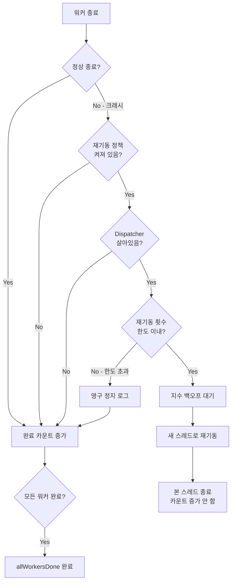

# Chapter 06: JobDispatcher와 IRunnable — 전용 워커 스레드

## 6.1 왜 전용 OS 스레드가 필요한가?

.NET의 `ThreadPool`은 편리하지만 게임 서버에 맞지 않는 부분이 있습니다:

```
ThreadPool의 특성:
──────────────────────────────────────────────────────────
✓ 작업이 끝나면 스레드 반환 → 다음 작업에 다른 스레드가 올 수 있음
✓ 스레드 수 자동 조절
✗ ThreadLocal 값이 작업 간에 유지 안 됨!
  (다른 스레드가 오면 다른 ThreadLocal)
✗ Thread.Sleep 사용 금지 (다른 작업 못 받음)
✗ 스레드 우선순위 제어 어려움

전용 OS 스레드의 특성:
──────────────────────────────────────────────────────────
✓ 항상 같은 스레드 → ThreadLocal이 유지됨!
✓ Thread.Sleep 사용 가능 (CPU yield)
✓ IsBackground = true로 프로세스 종료 시 자동 중단
✓ 스레드 이름 지정 가능 (디버깅 편리)
```

---

## 6.2 IRunnable 인터페이스

```csharp
public interface IRunnable : IDisposable
{
    /// <summary>
    /// 전용 워커 스레드에서 반복 호출됩니다.
    /// true 반환: 계속 실행
    /// false 반환: 이 워커 종료
    ///
    /// ThreadPool이 아닌 진짜 OS 스레드이므로
    /// Thread.Sleep으로 CPU를 양보할 수 있습니다.
    /// </summary>
    bool Run(CancellationToken cancellationToken);
}
```

사용 예시:

```csharp
public class GameWorker : IRunnable
{
    public bool Run(CancellationToken cancellationToken)
    {
        if (cancellationToken.IsCancellationRequested)
            return false;  // 종료 요청 → false 반환으로 중단

        // 작업 처리...
        if (InboundCommands.TryDequeue(out var cmd))
            cmd();
        else
            Thread.Sleep(1);  // 할 일 없으면 CPU 잠깐 양보

        return true;  // 계속 실행
    }

    public void Dispose()
    {
        // 스레드 종료 전 정리 작업
    }
}
```

---

## 6.3 JobDispatcherOptions — 워커 설정

```csharp
public sealed record JobDispatcherOptions
{
    public static readonly JobDispatcherOptions Default = new();

    /// <summary>워커가 죽으면 자동 재기동. 기본 true.</summary>
    public bool RestartFailedWorkers { get; init; } = true;

    /// <summary>최대 재기동 횟수. 기본 5. 초과 시 영구 정지.</summary>
    public int MaxRestartsPerWorker { get; init; } = 5;

    /// <summary>재기동 간 최소 간격 (지수 백오프 시작값). 기본 1초.</summary>
    public TimeSpan RestartBackoff { get; init; } = TimeSpan.FromSeconds(1);

    /// <summary>한 틱에 처리할 타이머 작업 수 상한. 기본 256.</summary>
    public int MaxTimerDrainPerTick { get; init; } = 256;
}
```

지수 백오프 계산:

```
재기동 1회: 1초 × 2^0 = 1초 대기
재기동 2회: 1초 × 2^1 = 2초 대기
재기동 3회: 1초 × 2^2 = 4초 대기
재기동 4회: 1초 × 2^3 = 8초 대기
재기동 5회: 1초 × 2^4 = 16초 대기
→ 6회 시도: 최대 횟수 초과 → 영구 정지
```

---

## 6.4 JobDispatcher\<T\> 구조

```csharp
public sealed class JobDispatcher<T> : IDisposable, IAsyncDisposable
    where T : IRunnable, new()  // ← T는 IRunnable이어야 하고 기본 생성자 있어야 함
{
    private readonly int _workerCount;
    private readonly Thread[] _threads;       // 전용 OS 스레드들
    private readonly int[] _restartCounts;    // 각 슬롯의 재기동 횟수
    private readonly JobDispatcherOptions _options;
    private readonly CancellationTokenSource _cts = new();
    private TaskCompletionSource? _allWorkersDone;
    private int _completedWorkers;
    private int _disposed;
}
```

---

## 6.5 RunWorkerThreadsAsync — 워커 시작

```csharp
public Task RunWorkerThreadsAsync()
{
    _allWorkersDone = new TaskCompletionSource(
        TaskCreationOptions.RunContinuationsAsynchronously);

    for (int i = 0; i < _workerCount; i++)
    {
        int slot = i;
        StartWorkerOnSlot(slot, isRestart: false);
    }

    return _allWorkersDone.Task;
    // 반환된 Task는 모든 워커가 종료되면 완료됨
}

private void StartWorkerOnSlot(int slot, bool isRestart)
{
    var thread = new Thread(() => RunWorker(slot))
    {
        IsBackground = true,  // 프로세스 종료 시 자동 중단
        Name = isRestart
            ? $"JobWorker-{slot}-r{_restartCounts[slot]}"
            : $"JobWorker-{slot}",
    };
    _threads[slot] = thread;
    thread.Start();
}
```

---

## 6.6 RunWorker — 워커의 생명주기

```csharp
private void RunWorker(int slot)
{
    IRunnable? runner = null;
    bool exitedNormally = false;

    try
    {
        runner = new T();  // ← 새 T() 생성 (GameWorker, ChatWorker 등)

        while (!_cts.Token.IsCancellationRequested)
        {
            // ① 현재 tick 갱신
            ThreadContext.TickCount = ThreadContext.Timer.GetCurrentTick();

            // ② Timer 작업 드레인 (타이머 → 워커 스레드 전환)
            int drained = 0;
            int maxDrain = _options.MaxTimerDrainPerTick;
            while (drained < maxDrain && TimerDispatchQueue.TryDequeue(out var item))
            {
                try
                {
                    item.Owner.DoTask(item.Job);  // 워커 스레드에서 직접 실행!
                }
                catch (Exception ex)
                {
                    JobLog.Error("Timer-dispatched job failed", ex);
                }
                drained++;
            }

            // ③ IRunnable.Run() 호출
            if (!runner.Run(_cts.Token))
                break;  // false 반환 시 정상 종료
        }

        exitedNormally = true;
    }
    catch (OperationCanceledException)
    {
        exitedNormally = true;  // 취소는 정상 종료
    }
    catch (Exception ex)
    {
        // ★ 비정상 종료! supervisor가 재기동 결정
        JobLog.Error($"Worker slot #{slot} crashed", ex);
        AsyncExecutable.OnError?.Invoke(ex);
    }

    // 정리
    try { runner?.Dispose(); } catch { }
    try { ThreadContext.Timer.Dispose(); } catch { }

    // supervisor 처리 (아래 참조)
    HandleWorkerExit(slot, exitedNormally);
}
```

각 Run 루프의 타임라인:

```
Run() 루프 한 번 반복:

[① TickCount 갱신]  →  [② TimerDispatch 드레인]  →  [③ runner.Run()]
     │                        │                            │
     │                        │                            ▼
     │                   최대 256개의               IRunnable 구현체
     │                   타이머 작업               (GameWorker 등)
     │                   실행
     ▼
  현재 ms 저장
  (ThreadLocal)
```

---

## 6.7 워커 수퍼바이저 — 자동 재기동

```csharp
private void HandleWorkerExit(int slot, bool exitedNormally)
{
    // 정상 종료 or 재기동 불가 조건이면 → 완료 카운트 증가
    if (!exitedNormally                          // 비정상 종료이고
        && _options.RestartFailedWorkers          // 재기동 정책이 켜져 있고
        && Volatile.Read(ref _disposed) == 0      // Dispatcher가 살아있고
        && !_cts.IsCancellationRequested)         // 취소 요청 없으면
    {
        int attempts = Interlocked.Increment(ref _restartCounts[slot]);
        if (attempts <= _options.MaxRestartsPerWorker)
        {
            JobMetrics.IncrementWorkerRestarts();

            // 지수 백오프 계산
            var backoff = TimeSpan.FromMilliseconds(
                _options.RestartBackoff.TotalMilliseconds * Math.Pow(2, attempts - 1));

            JobLog.Warn($"Restarting worker slot #{slot} " +
                        $"(attempt {attempts}/{_options.MaxRestartsPerWorker}) " +
                        $"after {backoff.TotalMilliseconds:F0}ms");

            Thread.Sleep(backoff);  // 잠깐 대기 후 재기동

            if (Volatile.Read(ref _disposed) == 0 && !_cts.IsCancellationRequested)
            {
                StartWorkerOnSlot(slot, isRestart: true);
                return;  // 본 스레드 종료, 완료 카운트 증가 안 함
            }
        }
        else
        {
            JobLog.Error($"Worker slot #{slot} exceeded max restarts — permanently down");
        }
    }

    // 이 슬롯 완료
    if (Interlocked.Increment(ref _completedWorkers) == _workerCount)
        _allWorkersDone?.TrySetResult();  // 모든 워커 종료 → Task 완료
}
```

수퍼바이저 동작 흐름:



---

## 6.8 Dispose — 워커 종료

```csharp
public void Dispose()
{
    if (Interlocked.Exchange(ref _disposed, 1) != 0)
        return;  // 이미 Dispose됨

    // CancellationToken 취소 → 모든 워커의 Run() 루프 중단
    _cts.Cancel();

    // 각 워커 스레드가 종료될 때까지 최대 5초 대기
    foreach (var thread in _threads)
    {
        if (thread is { IsAlive: true })
            thread.Join(TimeSpan.FromSeconds(5));
    }

    _cts.Dispose();
}
```

---

## 6.9 실제 사용 패턴

```csharp
// 1. 기본 사용
await using var dispatcher = new JobDispatcher<GameWorker>(4);
var task = dispatcher.RunWorkerThreadsAsync();

// 2. 옵션 지정
var opts = new JobDispatcherOptions
{
    RestartFailedWorkers = true,
    MaxRestartsPerWorker = 5,
    RestartBackoff = TimeSpan.FromSeconds(1),
};
await using var dispatcher2 = new JobDispatcher<GameWorker>(4, opts);

// 3. 모든 워커가 종료될 때까지 대기
await dispatcher.RunWorkerThreadsAsync();

// 4. 명시적 종료
dispatcher.Dispose();

// 5. 살아있는 워커 수 모니터링
Console.WriteLine($"활성 워커: {dispatcher.LiveWorkerCount}");
```

---

## 6.10 IO 스레드와 워커 스레드의 분리

실제 게임 서버에서 사용되는 패턴입니다:

```
[네트워크 IO 스레드들]     [워커 스레드들]
       │                        │
       │ 패킷 수신               │ 매 틱 Run() 실행
       ▼                        │
InboundCommands.Enqueue(        │
  () => server.HandlePacket(p)  │
)                               │
                                ▼
                  InboundCommands.TryDequeue(out cmd)
                  cmd()  ← 여기서 실제 처리
                    │
                    ▼
                 actor.DoAsync(...)  ← Actor 큐로
```

코드로 보면:

```csharp
// IO 스레드에서 (NetworkServer.cs 등)
void OnPacketReceived(Packet packet)
{
    GameWorker.InboundCommands.Enqueue(
        () => _world.HandlePacket(packet));
    // IO 스레드는 여기서 끝! 빠르게 다음 패킷 대기
}

// 워커 스레드에서 (GameWorker.cs)
public bool Run(CancellationToken ct)
{
    if (InboundCommands.TryDequeue(out var cmd))
        cmd();  // 여기서 _world.HandlePacket 실행
    else
        Thread.Sleep(1);
    return true;
}
```

이 패턴의 장점:

```
┌─────────────────────────────────────────────────────────┐
│  IO 스레드와 워커 스레드 분리의 이점                     │
├─────────────────────────────────────────────────────────┤
│  IO 스레드: 순수 I/O — 네트워크 읽기/쓰기만 담당        │
│  워커 스레드: 순수 로직 — 게임 로직만 담당              │
│                                                          │
│  → IO 스레드가 게임 로직에 의해 막히지 않음             │
│  → Actor의 Flush가 항상 워커 스레드에서 실행            │
│  → ThreadLocal 값이 항상 정확                           │
└─────────────────────────────────────────────────────────┘
```

---

## 6.11 정리

```
이번 장에서 배운 것
──────────────────────────────────────────────
✓ IRunnable = 워커 스레드에서 반복 실행되는 인터페이스
✓ JobDispatcherOptions = 워커 설정 (재기동, 백오프 등)
✓ JobDispatcher<T> = N개의 전용 OS 스레드 관리
✓ RunWorker() = ① TickCount 갱신 ② 타이머 드레인 ③ Run() 호출
✓ 수퍼바이저 = 크래시 시 자동 재기동 (지수 백오프)
✓ IO 스레드 분리 = InboundCommands 큐 패턴
```

---

*[← Chapter 05](./chapter05.md) | [→ Chapter 07: Sequencer — 패킷 순서 보장](./chapter07.md)*
