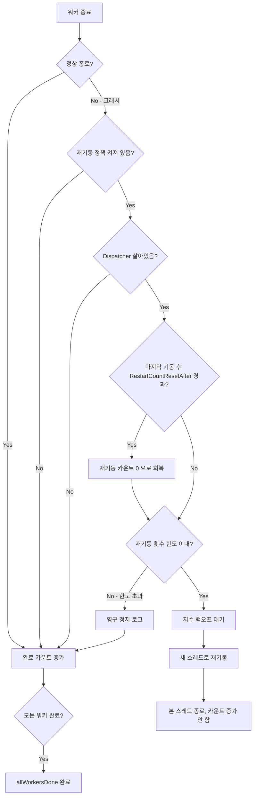

# Chapter 06: JobDispatcher와 IRunnable — 전용 워커 스레드

## 6.1 왜 전용 OS 스레드가 필요한가?

.NET의 `ThreadPool`은 편리하지만 게임 서버에 맞지 않는 부분이 있습니다:

```
ThreadPool의 특성:
──────────────────────────────────────────────────────────
✓ 작업이 끝나면 스레드 반환 → 다음 작업에 다른 스레드가 올 수 있음
✓ 스레드 수 자동 조절
✗ ThreadLocal 값이 작업 간에 유지 안 됨!
  (다른 스레드가 오면 다른 ThreadLocal)
✗ 긴 블로킹 작업이 풀을 굶긴다 (스레드 주입은 초 단위로 느리다)
✗ 스레드 우선순위 제어 어려움

전용 OS 스레드의 특성:
──────────────────────────────────────────────────────────
✓ 항상 같은 스레드 → ThreadLocal이 유지됨!
✓ 블로킹해도 다른 워크로드를 굶기지 않음
✓ IsBackground = true로 프로세스 종료 시 자동 중단
✓ 스레드 이름·우선순위·스택 크기 지정 가능 (디버깅·튜닝 편리)
```

---

## 6.2 두 가지 디스패처

v2.1 부터 디스패처는 **두 종류**입니다. 공통 부분(시작·감시·재기동·정지)은
`JobDispatcherBase`에 있고, 워커 루프의 본문만 다릅니다.

```
JobDispatcherBase (abstract)
   ├── JobDispatcher        ← 비제네릭. 사용자 루프 없음.
   │                          워커는 할 일이 없으면 시그널을 기다리며 블록한다.
   │                          작업이 전부 "actor 작업 / 타이머 발화 / JobSystem.Post"
   │                          로 들어오는 서버에 적합. (권장 기본값)
   │
   └── JobDispatcher<T>     ← 제네릭. T : IRunnable, new()
                              워커마다 T 인스턴스를 만들고 Run() 을 반복 호출한다.
                              워커에 자체 루프가 필요할 때 (게임 틱 루프 등).
```

```csharp
// ① 비제네릭 — 이제 대부분의 서버가 쓸 형태
_dispatcher = new JobDispatcher(workerThreads, new JobDispatcherOptions
{
    System = _system,
    RestartFailedWorkers = true,
});
_ = _dispatcher.RunWorkerThreadsAsync();

// ② 제네릭 — 워커에 자체 루프가 필요할 때
await using var dispatcher = new JobDispatcher<TestWorkerThread>(4);
_ = dispatcher.RunWorkerThreadsAsync();
```

### 비제네릭 워커 루프 — 폴링 없는 유휴 대기

```csharp
public sealed class JobDispatcher : JobDispatcherBase
{
    protected override void WorkerLoop(int slot, CancellationToken cancellationToken)
    {
        var idleWait = Math.Max(1, Options.IdleWaitMs);

        while (!cancellationToken.IsCancellationRequested)
        {
            if (PumpReadyQueue() == 0)      // 할 일이 있으면 처리하고 다시 확인
                System.WaitForWork(idleWait);  // 없으면 시그널이 올 때까지 블록
        }
    }
}
```

`JobSystem.WaitForWork`는 `Monitor.Wait`로 잠들고, 새 작업이 들어오면 producer 가
`Monitor.Pulse`로 깨웁니다.

```csharp
internal void WaitForWork(int timeoutMs)
{
    Interlocked.Increment(ref _waiters);   // ★ 큐를 보기 "전에" 대기자로 등록한다
    try
    {
        lock (_signal)
        {
            if (!_readyQueue.IsEmpty) return;   // 들어가기 직전에 일이 생겼다면 바로 나간다
            Monitor.Wait(_signal, timeoutMs);
        }
    }
    finally { Interlocked.Decrement(ref _waiters); }
}
```

대기자 등록을 먼저 하는 이유는 lost-wakeup 방지입니다. producer 는 `_waiters == 0` 이면
`Pulse`를 생략하는데, 워커가 "대기하러 들어가는 중"인 순간에 그 판단이 내려지면 아무도 깨우지
않은 채 잠들 수 있기 때문입니다.

```
v2.0 (모든 예제의 IRunnable):        v2.1 (비제네릭 JobDispatcher):

while (true) {                        while (true) {
    if (queue.TryDequeue(out var c))      if (PumpReadyQueue() == 0)
        c();                                  WaitForWork(20);
    else                              }
        Thread.Sleep(1);
}                                     · 유휴 시 CPU 0%, 깨우기는 시그널
                                      · 유입 지연 = 시그널 지연 (마이크로초)
· 워커 8개 → 초당 8,000회 깨어남
· Windows 타이머 해상도 때문에
  실제로는 1~15ms 유입 지연
```

---

## 6.3 IRunnable 인터페이스

```csharp
public interface IRunnable : IDisposable
{
    /// <summary>
    /// 전용 워커 스레드에서 반복 호출됩니다.
    /// true 반환: 계속 실행 / false 반환: 이 워커 종료
    /// </summary>
    bool Run(CancellationToken cancellationToken);
}
```

`JobDispatcher<T>`는 워커마다 `new T()`를 만들고, **ready 큐를 먼저 드레인한 뒤** `Run()`을
호출합니다.

```csharp
protected override void WorkerLoop(int slot, CancellationToken cancellationToken)
{
    var runner = new T();
    try
    {
        while (!cancellationToken.IsCancellationRequested)
        {
            PumpReadyQueue();                    // 타이머 발화·Scheduled actor 를 먼저 처리
            if (!runner.Run(cancellationToken))  // 그다음 사용자 루프
                break;
        }
    }
    finally
    {
        try { runner.Dispose(); }
        catch (Exception ex) { System.Logger.Error($"Worker slot #{slot} runner disposal failed", ex); }
    }
}
```

사용 예시:

```csharp
public class GameTickWorker : IRunnable
{
    private long _lastTick;

    public bool Run(CancellationToken cancellationToken)
    {
        if (cancellationToken.IsCancellationRequested)
            return false;

        long now = ThreadContext.TickCount;     // 워커가 매 반복 갱신해 준다
        if (now - _lastTick >= 50)
        {
            _lastTick = now;
            StepSimulation();
        }

        // 유휴 대기는 짧게. 순수 actor 워크로드라면 애초에 비제네릭 JobDispatcher 를 쓸 것.
        cancellationToken.WaitHandle.WaitOne(1);
        return true;
    }

    public void Dispose() { }
}
```

> `IRunnable`을 쓰기 전에 한 번 자문해 보세요. **"내 워커에 정말 자체 루프가 필요한가?"**
> 패킷 처리와 타이머 발화만 있다면 비제네릭 `JobDispatcher` 가 더 빠르고 코드도 없습니다.
> 예전 예제들이 `IRunnable` + `InboundCommands` + `Thread.Sleep(1)` 을 손으로 만들던 이유는
> 그때는 그 방법밖에 없었기 때문입니다 (6.11 참조).

---

## 6.4 JobDispatcherOptions — 워커 설정

```csharp
public sealed record JobDispatcherOptions
{
    public static readonly JobDispatcherOptions Default = new();

    /// <summary>워커가 예외로 죽으면 자동 재기동. 기본 true.</summary>
    public bool RestartFailedWorkers { get; init; } = true;

    /// <summary>슬롯당 최대 재기동 횟수. 기본 5. 초과 시 그 슬롯은 정지.</summary>
    public int MaxRestartsPerWorker { get; init; } = 5;

    /// <summary>재기동 간 대기 (지수 백오프 시작값). 기본 1초.</summary>
    public TimeSpan RestartBackoff { get; init; } = TimeSpan.FromSeconds(1);

    /// <summary>재기동 후 이만큼 정상 동작하면 재기동 예산을 회복. 기본 5분. Zero 면 비활성.</summary>
    public TimeSpan RestartCountResetAfter { get; init; } = TimeSpan.FromMinutes(5);

    /// <summary>한 반복에서 ready 큐를 최대 몇 개까지 처리할지. 기본 256.</summary>
    public int MaxReadyDrainPerTick { get; init; } = 256;

    /// <summary>유휴 워커가 시그널을 기다리는 최대 ms. 비제네릭 디스패처 전용. 기본 20.</summary>
    public int IdleWaitMs { get; init; } = 20;

    /// <summary>워커 스레드 우선순위. 기본 Normal.</summary>
    public ThreadPriority ThreadPriority { get; init; } = ThreadPriority.Normal;

    /// <summary>백그라운드 스레드로 띄울지. 기본 true (프로세스를 붙잡지 않음).</summary>
    public bool BackgroundThreads { get; init; } = true;

    /// <summary>워커 스택 크기(byte). 0 이면 플랫폼 기본값.</summary>
    public int MaxStackSize { get; init; }

    /// <summary>이 워커들이 서비스할 시스템. null 이면 JobSystem.Default.</summary>
    public JobSystem? System { get; init; }
}
```

> `MaxTimerDrainPerTick` 은 `MaxReadyDrainPerTick` 으로 이름이 바뀌었습니다. 타이머 전용 큐가
> 사라지고 공용 ready 큐로 합쳐졌기 때문입니다. 옛 이름도 `[Obsolete]` 로 남아 그대로 동작합니다.

지수 백오프 계산:

```
재기동 1회: 1초 × 2^0 = 1초 대기
재기동 2회: 1초 × 2^1 = 2초 대기
재기동 3회: 1초 × 2^2 = 4초 대기
재기동 4회: 1초 × 2^3 = 8초 대기
재기동 5회: 1초 × 2^4 = 16초 대기
→ 6회 시도: 최대 횟수 초과 → 그 슬롯은 정지
   (단, RestartCountResetAfter 만큼 건강하게 돌았다면 카운트가 0 으로 회복된다 — 6.8)
```

---

## 6.5 JobDispatcherBase 구조

```csharp
public abstract class JobDispatcherBase : IDisposable, IAsyncDisposable
{
    private readonly Thread[] _threads;             // 전용 OS 스레드들
    private readonly int[] _restartCounts;          // 슬롯별 재기동 횟수
    private readonly long[] _lastStartTimestamps;   // 슬롯별 마지막 기동 시각 (예산 회복 판정)
    private readonly CancellationTokenSource _cts = new();
    private TaskCompletionSource? _allWorkersDone;
    private int _completedWorkers;
    private int _disposed;
    private int _started;                           // 중복 시작 가드

    protected JobDispatcherBase(int workerCount, JobDispatcherOptions? options)
    {
        if (workerCount < 1)
            throw new ArgumentOutOfRangeException(nameof(workerCount), "must be >= 1");

        Options = options ?? JobDispatcherOptions.Default;
        System  = Options.System ?? JobSystem.Default;
        WorkerCount = workerCount;
        _threads = new Thread[workerCount];
        _restartCounts = new int[workerCount];
        _lastStartTimestamps = new long[workerCount];

        System.AttachDispatcher(this);   // ★ system.StopAsync 가 나를 정지시킬 수 있게 등록
    }

    public JobDispatcherOptions Options { get; }
    public JobSystem System { get; }
    public int WorkerCount { get; }
    public int LiveWorkerCount { get; }              // 살아 있는 스레드 수

    protected CancellationToken StoppingToken => _cts.Token;
    protected abstract void WorkerLoop(int slot, CancellationToken cancellationToken);
    protected int PumpReadyQueue();
}
```

`AttachDispatcher` 가 중요합니다. 디스패처는 자기를 소유한 `JobSystem`에 등록되고,
`system.StopAsync()` 한 번이 타이머 스레드와 이 디스패처를 함께 정리합니다.
사용자가 디스패처를 따로 `Dispose` 할 필요가 없어집니다.

---

## 6.6 RunWorkerThreadsAsync — 워커 시작 (1회 제한)

```csharp
public Task RunWorkerThreadsAsync()
{
    // ★ 두 번 부르면 예외. 예전에는 조용히 워커가 2N 개 떴다 (P0-5)
    if (Interlocked.Exchange(ref _started, 1) != 0)
        throw new InvalidOperationException(
            "RunWorkerThreadsAsync has already been called on this dispatcher.");

    ObjectDisposedException.ThrowIf(Volatile.Read(ref _disposed) != 0, this);

    _allWorkersDone = new TaskCompletionSource(TaskCreationOptions.RunContinuationsAsynchronously);

    for (var slot = 0; slot < WorkerCount; slot++)
        StartWorkerOnSlot(slot, isRestart: false);

    return _allWorkersDone.Task;   // 모든 워커가 종료되면 완료되는 Task
}

private void StartWorkerOnSlot(int slot, bool isRestart)
{
    var name = isRestart
        ? $"JobWorker-{System.Name}-{slot}-r{_restartCounts[slot]}"
        : $"JobWorker-{System.Name}-{slot}";

    var thread = Options.MaxStackSize > 0
        ? new Thread(() => RunWorker(slot), Options.MaxStackSize)
        : new Thread(() => RunWorker(slot));

    thread.IsBackground = Options.BackgroundThreads;
    thread.Name = name;                       // 시스템 이름이 들어가 디버깅이 쉽다
    thread.Priority = Options.ThreadPriority;

    _threads[slot] = thread;
    _lastStartTimestamps[slot] = Stopwatch.GetTimestamp();
    thread.Start();
}
```

> **왜 1회 가드가 필요했나 (P0-5)**
> 예전에는 `RunWorkerThreadsAsync()` 를 두 번 부르면 `_allWorkersDone` 이 덮어써지고 스레드가
> `2 × WorkerCount` 개 떴습니다. 첫 번째 Task 는 영원히 완료되지 않고, 워커 수는 설정의 두 배가
> 되는데 아무 경고도 없었습니다. "시작 코드가 두 경로에서 불리는" 흔한 실수가 조용한 자원 낭비로
> 이어지던 자리입니다.

---

## 6.7 RunWorker — 워커의 생명주기

```csharp
private void RunWorker(int slot)
{
    var exitedNormally = false;

    // ① 스레드 컨텍스트 표시 — ExecutionMode.Scheduled 판정과 진단에 쓰인다
    ThreadContext.IsWorkerThread = true;
    ThreadContext.CurrentSystem = System;
    System.RegisterWorker();               // system.LiveWorkerCount / HasWorkers 에 반영

    try
    {
        WorkerLoop(slot, _cts.Token);      // ② 실제 루프 (비제네릭 / 제네릭 구현체)
        exitedNormally = true;
    }
    catch (OperationCanceledException)
    {
        exitedNormally = true;             // 취소는 정상 종료
    }
    catch (Exception ex)
    {
        // ★ 어느 actor 를 돌리다 죽었는지까지 남긴다 (예전에는 스택만 남았다)
        var running = ThreadContext.CurrentExecuter;
        var where = running is null ? string.Empty : $" while running actor '{running.Name}'";
        System.Logger.Error($"Worker slot #{slot} crashed{where}", ex);
        AsyncExecutable.RaiseGlobalError(ex);
    }
    finally
    {
        ThreadContext.CurrentExecuter = null;
        ThreadContext.IsWorkerThread = false;
        ThreadContext.CurrentSystem = null;
        System.UnregisterWorker();
    }

    // ③ 비정상 종료면 supervisor 가 재기동을 시도
    if (!exitedNormally && Options.RestartFailedWorkers
        && Volatile.Read(ref _disposed) == 0 && !_cts.IsCancellationRequested)
    {
        if (TryRestart(slot))
            return;                        // 새 스레드가 이 슬롯을 이어받음
    }

    if (Interlocked.Increment(ref _completedWorkers) == WorkerCount)
        _allWorkersDone?.TrySetResult();
}
```

각 반복의 타임라인:

```
비제네릭 JobDispatcher:              제네릭 JobDispatcher<T>:

[PumpReadyQueue]                     [PumpReadyQueue]
   │ TickCount 갱신                     │ TickCount 갱신
   │ ready 큐에서 최대 256개               │ ready 큐에서 최대 256개
   │  (Scheduled actor / 타이머 발화 /      │
   │   JobSystem.Post 로 넣은 Action)      ▼
   ▼                                  [runner.Run(ct)]
[처리한 게 0 이면 WaitForWork]            false 반환 시 이 워커만 종료
```

> **v2.0 에서 사라진 줄**
> 예전 워커 종료 경로에는 `ThreadContext.Timer.Dispose()` 가 있었습니다. 이 한 줄이
> P0-2 — "워커가 죽으면 그 스레드의 타이머가 전부 사라진다" — 의 직접 원인이었습니다.
> 타이머가 시스템 소유가 된 지금은 워커 종료가 타이머에 아무 영향도 주지 않습니다.

---

## 6.8 워커 수퍼바이저 — 자동 재기동과 예산 회복

```csharp
private bool TryRestart(int slot)
{
    // ★ 이 슬롯이 충분히 오래 건강했다면 재기동 예산을 되돌려준다
    if (Options.RestartCountResetAfter > TimeSpan.Zero
        && Stopwatch.GetElapsedTime(_lastStartTimestamps[slot]) >= Options.RestartCountResetAfter)
    {
        Interlocked.Exchange(ref _restartCounts[slot], 0);
    }

    var attempts = Interlocked.Increment(ref _restartCounts[slot]);
    if (attempts > Options.MaxRestartsPerWorker)
    {
        System.Logger.Error(
            $"Worker slot #{slot} exceeded max restarts ({Options.MaxRestartsPerWorker}) — permanently down");
        return false;
    }

    System.Metrics.OnWorkerRestart();     // WorkerRestarts 메트릭 +1
    var backoff = TimeSpan.FromMilliseconds(
        Options.RestartBackoff.TotalMilliseconds * Math.Pow(2, attempts - 1));
    System.Logger.Warn(
        $"Restarting worker slot #{slot} (attempt {attempts}/{Options.MaxRestartsPerWorker}) after {backoff.TotalMilliseconds:F0}ms");

    Thread.Sleep(backoff);

    if (Volatile.Read(ref _disposed) != 0 || _cts.IsCancellationRequested)
        return false;

    StartWorkerOnSlot(slot, isRestart: true);
    return true;
}
```

예산 회복이 왜 필요한가:

```
회복이 없던 v2.0:

  1월 3일  워커 #2 크래시 ×5  → 예산 소진, 슬롯 #2 영구 정지
  1월 4일 ~ 6월    정상 운영... 하지만 워커는 계속 7/8 개
                   아무도 눈치채지 못한다 (로그는 5개월 전 것)

회복이 있는 v2.1 (기본 5분):

  마지막 재기동 후 5분간 살아 있었다면 → 그 슬롯의 카운트를 0 으로
  → "가끔 한 번씩 나는 크래시" 와 "지금 폭주 중인 크래시" 를 구분할 수 있다
```

수퍼바이저 동작 흐름:


```mermaid
flowchart TD
    A[워커 종료] --> B{정상 종료?}
    B -->|Yes| C[완료 카운트 증가]
    B -->|No - 크래시| D{재기동 정책 켜져 있음?}
    D -->|No| C
    D -->|Yes| E{Dispatcher 살아있음?}
    E -->|No| C
    E -->|Yes| R{마지막 기동 후 RestartCountResetAfter 경과?}
    R -->|Yes| S[재기동 카운트 0 으로 회복]
    R -->|No| F
    S --> F{재기동 횟수 한도 이내?}
    F -->|No - 한도 초과| G[영구 정지 로그]
    G --> C
    F -->|Yes| H[지수 백오프 대기]
    H --> I[새 스레드로 재기동]
    I --> J[본 스레드 종료, 카운트 증가 안 함]
    C --> K{모든 워커 완료?}
    K -->|Yes| L[allWorkersDone 완료]
```

---

## 6.9 TryStop / Dispose — 워커 종료

```csharp
public bool TryStop(TimeSpan joinTimeout)
{
    if (Interlocked.Exchange(ref _disposed, 1) != 0)
        return true;                      // 이미 정지됨

    System.DetachDispatcher(this);

    _cts.Cancel();                        // 모든 워커 루프에 종료 신호
    System.SignalWork();                  // 시그널 대기 중인 워커를 깨운다

    var allStopped = true;
    foreach (var thread in _threads)
    {
        if (thread is not { IsAlive: true }) continue;

        System.SignalWork();
        if (thread.Join(joinTimeout)) continue;

        allStopped = false;
        System.Logger.Error(
            $"Worker thread '{thread.Name}' did not stop within {joinTimeout.TotalMilliseconds:F0}ms. " +
            "A job is probably blocking (a lock, a synchronous wait, or an infinite loop).");
    }

    _cts.Dispose();
    return allStopped;                    // ★ 실제로 다 멈췄는지 호출자가 알 수 있다
}

public void Dispose() => TryStop(TimeSpan.FromSeconds(5));
```

`Dispose()`는 `Join` 타임아웃을 조용히 무시하던 예전 동작 대신, 멈추지 않은 스레드 이름과
원인 힌트를 로그에 남깁니다. 종료 성공 여부까지 필요하면 `TryStop`을 쓰세요.

**대부분의 경우 이것을 직접 부를 필요가 없습니다.** `system.StopAsync()` 가
등록된 디스패처들을 알아서 정리합니다.

---

## 6.10 실제 사용 패턴

```csharp
// 1. 가장 단순한 형태 — JobSystem.Default 위에서 워커 4개
await using var dispatcher = new JobDispatcher(4);
_ = dispatcher.RunWorkerThreadsAsync();

// 2. 명시적 시스템 + 수퍼바이저 옵션 (권장)
var system = new JobSystem(new JobSystemOptions { Name = "game" });
var dispatcher2 = new JobDispatcher(8, new JobDispatcherOptions
{
    System = system,
    RestartFailedWorkers = true,
    MaxRestartsPerWorker = 5,
    RestartBackoff = TimeSpan.FromSeconds(1),
    RestartCountResetAfter = TimeSpan.FromMinutes(5),
});
_ = dispatcher2.RunWorkerThreadsAsync();

// 3. 자체 루프가 필요할 때.
//    RunWorkerThreadsAsync 는 스레드를 띄우고 곧바로 반환하며, 두 번 호출하면 예외다.
//    모든 워커가 끝날 때까지 기다리고 싶으면 "첫 호출이 돌려준" Task 를 보관해 두었다가 await 한다.
await using var dispatcher3 = new JobDispatcher<GameTickWorker>(4);
var workersDone = dispatcher3.RunWorkerThreadsAsync();
// ... 종료 시점에
// await workersDone;

// 5. 종료 — 시스템 단위로 한 번에
await system.StopAsync(TimeSpan.FromSeconds(10));

// 6. 살아있는 워커 수 모니터링
Console.WriteLine($"활성 워커: {system.LiveWorkerCount} / {dispatcher2.WorkerCount}");
```

---

## 6.11 IO 스레드와 워커 스레드의 분리

게임 서버의 고전적인 요구사항입니다. **소켓 스레드는 소켓만, 워커 스레드는 로직만.**

```
[네트워크 IO 스레드들]            [워커 스레드들]
       │                              │
       │ 패킷 수신                     │ ready 큐 드레인
       ▼                              │
 세션 Sequencer.Enqueue(line)         │
       │                              ▼
       └──(CAS 로 1회)──► JobSystem.Post(drain) ──► 워커가 drain 실행
                                        │
                                        ▼
                                world.HandleMove(...)  → actor 큐로
```

v2.1 은 이 패턴에 필요한 조각을 라이브러리가 전부 제공합니다.

```csharp
// ① Sequencer 가 워커 풀에 직접 drain 을 예약한다 (7장)
_packetSequencer = new Sequencer<string>(
    server.System,                 // ← JobSystem.Post 로 스케줄
    handler: HandleOnePacket,
    onError: ex => JobLog.Error($"[session #{connId}] packet handling failed", ex));

// ② 그냥 Action 하나를 워커에서 돌리고 싶을 때
system.Post(() => world.ReloadConfig());

// ③ 비-워커 스레드가 actor 의 leader 가 되는 것 자체를 막고 싶을 때
new JobOptions { Mode = ExecutionMode.Scheduled }
```

```
┌─────────────────────────────────────────────────────────┐
│  IO 스레드와 워커 스레드 분리의 이점                     │
├─────────────────────────────────────────────────────────┤
│  IO 스레드: 순수 I/O — 네트워크 읽기/쓰기만 담당        │
│  워커 스레드: 순수 로직 — 게임 로직만 담당              │
│                                                          │
│  → IO 스레드가 게임 로직에 의해 막히지 않음             │
│  → Actor의 Flush가 항상 워커 스레드에서 실행            │
│  → ThreadContext 값이 항상 정확                         │
└─────────────────────────────────────────────────────────┘
```

> **v2.0 에서는 이랬다**
> 위의 세 조각이 전부 없었기 때문에, 모든 예제가 `public static ConcurrentQueue<Action>
> InboundCommands` 같은 중계 큐를 손으로 만들고 `IRunnable.Run` 에서 `TryDequeue` +
> `Thread.Sleep(1)` 로 돌렸습니다. 신규 사용자가 가장 많이 걸려 넘어지던 지점이기도 합니다.
> `AdvancedMmorpgServer` 에서는 이 수동 큐(`GameWorker.cs`)가 통째로 삭제되었습니다.
> `ExampleChatServer`/`ExampleMmorpgServer` 는 "예전 방식"의 참고 자료로 남아 있습니다.

---

## 6.12 정리

```
이번 장에서 배운 것
──────────────────────────────────────────────
✓ JobDispatcher (비제네릭) = 사용자 루프 없음, 시그널 기반 유휴 대기
✓ JobDispatcher<T> = IRunnable 자체 루프가 필요할 때
✓ 공통 기반 JobDispatcherBase = 시작·감시·재기동·정지
✓ JobDispatcherOptions = 재기동/백오프/예산회복/유휴대기/우선순위/스택
✓ RunWorkerThreadsAsync 는 1회만 (두 번 호출 시 예외)
✓ RunWorker = 컨텍스트 등록 → WorkerLoop → 크래시 시 actor 이름까지 로그
✓ 수퍼바이저 = 지수 백오프 재기동 + RestartCountResetAfter 예산 회복
✓ TryStop(timeout) 은 실제 종료 여부를 bool 로 알려준다
✓ IO 분리는 Sequencer / JobSystem.Post / ExecutionMode.Scheduled 로
```

---

*[← Chapter 05](./chapter05.md) | [→ Chapter 07: Sequencer — 패킷 순서 보장](./chapter07.md)*
