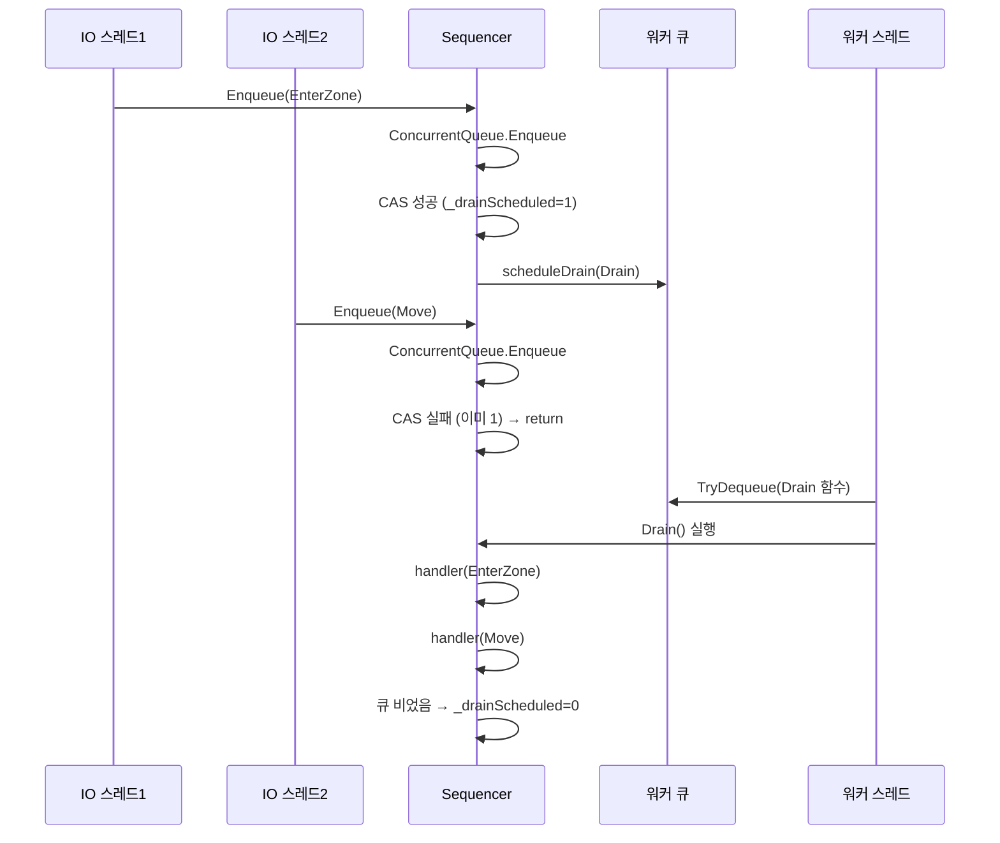

# Chapter 07: Sequencer — 패킷 순서 보장

## 7.1 문제: 왜 순서가 깨질 수 있나?

여러 스레드가 같은 Actor에 작업을 보낼 때, 순서가 뒤집힐 수 있습니다.

```
실제 발생 가능한 문제:
────────────────────────────────────────────────────────

[IO 스레드 1]         [IO 스레드 2]
      │                     │
      ▼                     ▼
  패킷: EnterZone      패킷: Move
      │                     │
      ▼                     ▼
  zone.DoAsync(EnterZone)   zone.DoAsync(Move)

이 두 DoAsync가 거의 동시에 실행된다면?

DoAsync 내부:
  Thread-1: Increment(count=1) ──────────────────── TryWrite(EnterZone)
  Thread-2:   Increment(count=2) ── TryWrite(Move)

Channel에 들어간 순서: [Move, EnterZone]  ← 뒤집힘!

결과:
  Zone이 Move를 먼저 처리 → EnterZone을 나중에 처리
  → 아직 입장하지 않은 플레이어가 이동? 버그!
```

---

## 7.2 Sequencer의 설계 아이디어

`Sequencer<T>`는 이 문제를 해결합니다:

```
Sequencer의 역할:
──────────────────────────────────────────────────────────

1. 여러 IO 스레드가 Enqueue() → 내부 ConcurrentQueue에 순서대로 보관
2. CAS(Compare-And-Swap)로 단 하나의 스레드만 "드레인 권한"을 획득
3. 권한 획득자가 scheduleDrain 콜백 → 워커 큐에 drain 명령 추가
4. 워커가 Drain() 실행 → handler를 순서대로 호출
5. Drain 종료 후 남은 항목 있으면 다시 scheduleDrain

──────────────────────────────────────────────────────────
보장: 같은 Sequencer의 항목은 Enqueue 순서대로 처리됨!
```

---

## 7.3 Sequencer 코드 분석

```csharp
public sealed class Sequencer<T>
{
    private readonly ConcurrentQueue<T> _queue = new();   // ← 스레드 안전 큐
    private readonly Action<T> _handler;                   // ← 항목 처리자
    private readonly Action<Action> _scheduleDrain;        // ← drain을 워커에 예약
    private readonly Action<Exception>? _onError;
    private int _drainScheduled;   // 0: 드레인 없음, 1: 드레인 예약됨
    private int _stopped;          // 0: 실행 중, 1: 중단됨

    public Sequencer(
        Action<T> handler,           // 각 항목 처리 함수
        Action<Action> scheduleDrain, // drain을 워커 큐에 넣는 함수
        Action<Exception>? onError = null)
    {
        _handler = handler;
        _scheduleDrain = scheduleDrain;
        _onError = onError;
    }
}
```

---

## 7.4 Enqueue — 항목 추가

```csharp
public void Enqueue(T item)
{
    if (Volatile.Read(ref _stopped) != 0) return;  // 중단 상태면 무시

    _queue.Enqueue(item);    // ① ConcurrentQueue에 추가 (스레드 안전)
    TryScheduleDrain();      // ② 드레인 예약 시도
}

private void TryScheduleDrain()
{
    // ③ CAS: _drainScheduled가 0이면 1로 바꾸기 (단 하나만 성공!)
    if (Interlocked.CompareExchange(ref _drainScheduled, 1, 0) != 0)
        return;  // 이미 누군가 예약함 → 내 일 없음

    try
    {
        // ④ 워커 큐에 Drain 작업 추가
        _scheduleDrain(Drain);
    }
    catch
    {
        // 예약 실패 시 CAS를 되돌려서 다음 Enqueue에서 재시도 가능하게
        Volatile.Write(ref _drainScheduled, 0);
        throw;
    }
}
```

CAS 동작 원리:

```
Thread-A와 Thread-B가 동시에 TryScheduleDrain 호출:

_drainScheduled = 0 (초기값)

Thread-A: CompareExchange(ref _drainScheduled, 1, 0)
Thread-B: CompareExchange(ref _drainScheduled, 1, 0)

두 스레드가 동시에 실행해도:
  Thread-A가 먼저 성공: _drainScheduled = 1 반환됨, 0 → 1 변경
  Thread-B: 현재값이 이미 1이므로 실패, 1 반환됨 → return

결과: Thread-A만 scheduleDrain 호출!
      → 워커 큐에 Drain이 딱 한 번만 추가됨!
```

---

## 7.5 Drain — 순서대로 처리

```csharp
private void Drain()
{
    try
    {
        // 큐에 있는 모든 항목 순서대로 처리
        while (_queue.TryDequeue(out var item))
        {
            try
            {
                _handler(item);  // 실제 처리!
            }
            catch (Exception ex)
            {
                if (_onError is not null) _onError(ex);
                else JobLog.Error("Sequencer handler error", ex);
            }
        }
    }
    finally
    {
        // ① CAS로 드레인 권한 해제
        Volatile.Write(ref _drainScheduled, 0);

        // ② Drain 도중 새 항목이 들어왔을 수 있음 → 다시 체크
        if (!_queue.IsEmpty && Volatile.Read(ref _stopped) == 0)
            TryScheduleDrain();  // ③ 다시 예약
    }
}
```

Drain과 Enqueue 간의 race condition 처리:

```
Drain 실행 중:

  [큐: A, B, C]
  Drain: A 처리 → B 처리 → C 처리 → 큐 비었음

           ↑ 이 사이에 Thread-X가 D를 Enqueue!

  Drain finally:
    _drainScheduled = 0   ← 권한 해제
    !_queue.IsEmpty?       ← D가 있음!
    TryScheduleDrain()     ← 다시 예약!

  → D도 처리됨!


만약 순서가 반대라면?

  Thread-X가 D를 Enqueue하고 TryScheduleDrain 호출
  이때 _drainScheduled = 1 (Drain 중) → 예약 실패, 리턴

  Drain finally:
    _drainScheduled = 0
    !_queue.IsEmpty?   ← D가 있음! (Drain이 while 루프 끝낸 후)
    TryScheduleDrain() ← 예약!

  → D도 처리됨!
```

---

## 7.6 실제 사용 예시 (AdvancedMmorpgServer)

```csharp
// NetworkServer.cs 에서 — 각 클라이언트 세션마다 Sequencer 생성
public class ClientSession
{
    private readonly Sequencer<Packet> _sequencer;

    public ClientSession(GameWorld world, int playerId)
    {
        _sequencer = new Sequencer<Packet>(
            // handler: 패킷을 world에 전달
            handler: packet => HandlePacket(world, playerId, packet),
            // scheduleDrain: 워커 큐에 drain 추가
            scheduleDrain: action => GameWorker.InboundCommands.Enqueue(action),
            // onError: 예외 처리
            onError: ex => JobLog.Error($"Packet error for player {playerId}", ex)
        );
    }

    // IO 스레드에서 호출
    public void OnPacketReceived(Packet packet)
    {
        _sequencer.Enqueue(packet);
        // 즉시 반환! 처리는 워커 스레드에서
    }

    private void HandlePacket(GameWorld world, int playerId, Packet packet)
    {
        // 워커 스레드에서 순서대로 실행됨
        switch (packet.Type)
        {
            case PacketType.Move:
                world.HandleMove(playerId, packet.X, packet.Y);
                break;
            case PacketType.Attack:
                world.HandleAttack(playerId, packet.TargetId);
                break;
        }
    }
}
```

---

## 7.7 Sequencer 동작 전체 흐름



---

## 7.8 정리

```
이번 장에서 배운 것
──────────────────────────────────────────────
✓ 여러 IO 스레드에서 같은 Actor에 동시 push 시
  순서가 뒤집힐 수 있음
✓ Sequencer<T>로 Enqueue 순서 보장
✓ CAS(Compare-And-Swap)로 단 하나만 draining
✓ scheduleDrain으로 워커 스레드에서 처리
✓ Drain → 권한 해제 → 남은 항목 체크 → 재예약
  (새 Enqueue와의 race condition 안전하게 처리)
✓ Stop() = 종료 표시 (진행 중인 Drain은 완료됨)
```

---

*[← Chapter 06](./chapter06.md) | [→ Chapter 08: 설정·모니터링·로깅](./chapter08.md)*
