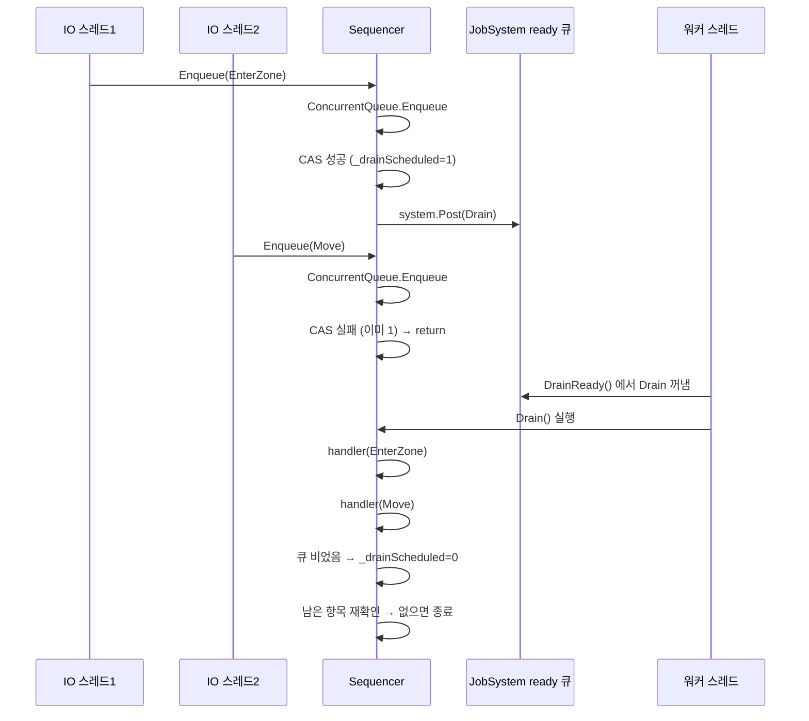

# Chapter 07: Sequencer — 패킷 순서 보장

## 7.1 문제: 왜 순서가 깨질 수 있나?

여러 스레드가 같은 Actor에 작업을 보낼 때, 순서가 뒤집힐 수 있습니다.

```
실제 발생 가능한 문제:
────────────────────────────────────────────────────────

[IO 스레드 1]         [IO 스레드 2]
      │                     │
      ▼                     ▼
  패킷: EnterZone      패킷: Move
      │                     │
      ▼                     ▼
  zone.DoAsync(EnterZone)   zone.DoAsync(Move)

이 두 DoAsync가 거의 동시에 실행된다면?

DoAsync 내부 (입장 CAS → 큐 쓰기 순):
  Thread-1: CAS 성공(count=1) ──────────────────── Enqueue(EnterZone)
  Thread-2:   CAS 성공(count=2) ── Enqueue(Move)

actor 큐에 들어간 순서: [Move, EnterZone]  ← 뒤집힘!

※ actor 는 "한 번에 하나씩"은 보장하지만 "두 producer 중 누가 먼저 넣는지"는
   보장하지 않습니다. 이건 어떤 큐 구현을 쓰든 마찬가지입니다.

결과:
  Zone이 Move를 먼저 처리 → EnterZone을 나중에 처리
  → 아직 입장하지 않은 플레이어가 이동? 버그!
```

---

## 7.2 Sequencer의 설계 아이디어

`Sequencer<T>`는 이 문제를 해결합니다:

```
Sequencer의 역할:
──────────────────────────────────────────────────────────

1. 여러 IO 스레드가 Enqueue() → 내부 ConcurrentQueue에 순서대로 보관
2. CAS(Compare-And-Swap)로 단 하나의 스레드만 "드레인 권한"을 획득
3. 권한 획득자가 scheduleDrain 콜백 → 워커에게 drain 작업을 넘김
4. 워커가 Drain() 실행 → handler를 순서대로 호출
5. Drain 종료 후 남은 항목 있으면 다시 scheduleDrain

──────────────────────────────────────────────────────────
보장 ①: 같은 Sequencer의 항목은 Enqueue 순서대로 처리된다
보장 ②: 어느 순간에도 handler 를 실행 중인 스레드는 최대 1개다
보장 ③: Enqueue 가 true 를 반환했다면 그 항목은 반드시 처리된다
        (Stop() 이 곧바로 뒤따라도 — 이것이 v2.1 에서 고쳐진 P0-4)
```

---

## 7.3 Sequencer 코드 분석

```csharp
public sealed class Sequencer<T>
{
    private readonly ConcurrentQueue<T> _queue = new();   // ← 스레드 안전 큐
    private readonly Action<T> _handler;                   // ← 항목 처리자
    private readonly Action<Action> _scheduleDrain;        // ← drain을 워커에 예약
    private readonly Action<Exception>? _onError;
    private int _drainScheduled;   // 0: 드레인 없음, 1: 드레인 예약됨
    private int _stopped;          // 0: 실행 중, 1: 새 항목 거부
    private int _aborted;          // 1: 남은 항목까지 폐기

    /// <param name="handler">항목 하나를 처리. 직렬로, drain 을 실행하는 스레드에서 호출된다.</param>
    /// <param name="scheduleDrain">drain 작업을 워커 스레드에 넘기는 함수.</param>
    /// <param name="onError">handler 가 예외를 던졌을 때. 기본은 로깅.</param>
    public Sequencer(
        Action<T> handler,
        Action<Action> scheduleDrain,
        Action<Exception>? onError = null)
    {
        ArgumentNullException.ThrowIfNull(handler);
        ArgumentNullException.ThrowIfNull(scheduleDrain);
        _handler = handler;
        _scheduleDrain = scheduleDrain;
        _onError = onError;
    }

    /// <summary>
    /// ★ 편의 생성자 — drain 을 JobSystem 의 워커 풀에 직접 예약한다.
    /// 사용자가 중계용 InboundCommands 큐를 손으로 만들 필요가 없어졌다.
    /// </summary>
    public Sequencer(JobSystem system, Action<T> handler, Action<Exception>? onError = null)
        : this(handler, system.Post, onError) { }

    /// <summary>처리 대기 중인 항목 수.</summary>
    public int PendingCount => _queue.Count;

    /// <summary>Stop() 또는 Abort() 가 호출되었는가.</summary>
    public bool IsStopped => Volatile.Read(ref _stopped) != 0;
}
```

두 번째 생성자가 v2.1 의 실질적인 변화입니다. `scheduleDrain` 을 `system.Post` 로 연결해 주므로,
세션 클래스가 자기만의 워커 중계 큐를 들고 있을 이유가 사라집니다.

---

## 7.4 Enqueue — 항목 추가

```csharp
/// <returns>큐에 들어갔으면 true, 이미 중단된 sequencer 라 버려졌으면 false.</returns>
public bool Enqueue(T item)
{
    if (Volatile.Read(ref _stopped) != 0)
        return false;        // ★ 중단 상태 — 호출자가 "버려졌다"는 것을 알 수 있다

    _queue.Enqueue(item);    // ① ConcurrentQueue에 추가 (스레드 안전)
    TryScheduleDrain();      // ② 드레인 예약 시도
    return true;
}

private void TryScheduleDrain()
{
    // ③ CAS: _drainScheduled가 0이면 1로 바꾸기 (단 하나만 성공!)
    if (Interlocked.CompareExchange(ref _drainScheduled, 1, 0) != 0)
        return;  // 이미 누군가 예약함 → 내 일 없음

    try
    {
        // ④ 워커 큐에 Drain 작업 추가
        _scheduleDrain(Drain);
    }
    catch
    {
        // 예약 실패 시 CAS를 되돌려서 다음 Enqueue에서 재시도 가능하게
        Volatile.Write(ref _drainScheduled, 0);
        throw;
    }
}
```

CAS 동작 원리:

```
Thread-A와 Thread-B가 동시에 TryScheduleDrain 호출:

_drainScheduled = 0 (초기값)

Thread-A: CompareExchange(ref _drainScheduled, 1, 0)
Thread-B: CompareExchange(ref _drainScheduled, 1, 0)

두 스레드가 동시에 실행해도:
  Thread-A가 먼저 성공: _drainScheduled = 1 반환됨, 0 → 1 변경
  Thread-B: 현재값이 이미 1이므로 실패, 1 반환됨 → return

결과: Thread-A만 scheduleDrain 호출!
      → 워커 큐에 Drain이 딱 한 번만 추가됨!
```

---

## 7.5 Drain — 순서대로 처리

```csharp
private void Drain()
{
    try
    {
        // 큐에 있는 모든 항목 순서대로 처리 (Abort 되면 즉시 중단)
        while (Volatile.Read(ref _aborted) == 0 && _queue.TryDequeue(out var item))
        {
            try
            {
                _handler(item);  // 실제 처리!
            }
            catch (Exception ex)
            {
                if (_onError is not null) _onError(ex);
                else JobLog.Error("Sequencer handler error", ex);
            }
        }
    }
    finally
    {
        // ① CAS로 드레인 권한 해제
        Volatile.Write(ref _drainScheduled, 0);

        // ② 마지막 dequeue 와 ① 사이에 들어온 항목도 반드시 실행되어야 한다.
        //    ★ _stopped 는 일부러 조건에서 뺐다. Stop() 은 "새 항목 거부"이지
        //      "이미 받은 것을 버려라"가 아니다. 여기에 _stopped 검사가 있던 것이
        //      세션의 마지막 disconnect 마커를 잃던 원인이었다 (P0-4).
        if (!_queue.IsEmpty && Volatile.Read(ref _aborted) == 0)
            TryScheduleDrain();  // ③ 다시 예약
    }
}
```

Drain과 Enqueue 간의 race condition 처리:

```
Drain 실행 중:

  [큐: A, B, C]
  Drain: A 처리 → B 처리 → C 처리 → 큐 비었음

           ↑ 이 사이에 Thread-X가 D를 Enqueue!

  Drain finally:
    _drainScheduled = 0   ← 권한 해제
    !_queue.IsEmpty?       ← D가 있음!
    TryScheduleDrain()     ← 다시 예약!

  → D도 처리됨!


만약 순서가 반대라면?

  Thread-X가 D를 Enqueue하고 TryScheduleDrain 호출
  이때 _drainScheduled = 1 (Drain 중) → 예약 실패, 리턴

  Drain finally:
    _drainScheduled = 0
    !_queue.IsEmpty?   ← D가 있음! (Drain이 while 루프 끝낸 후)
    TryScheduleDrain() ← 예약!

  → D도 처리됨!
```

---

## 7.6 Stop 과 Abort — 종료의 두 가지 의미

```csharp
/// <summary>새 항목만 거부한다. 이미 받은 것은 순서대로 전부 처리된다.</summary>
public void Stop()
{
    if (Interlocked.Exchange(ref _stopped, 1) != 0)
        return;

    // 플래그를 뒤집는 동안 producer 가 넣었을 수 있다 → 드레인을 확실히 예약한다
    if (!_queue.IsEmpty && Volatile.Read(ref _aborted) == 0)
        TryScheduleDrain();
}

/// <summary>새 항목을 거부하고, 남아 있는 것도 전부 버린다.</summary>
/// <returns>버린 항목 수.</returns>
public int Abort()
{
    Volatile.Write(ref _stopped, 1);
    Volatile.Write(ref _aborted, 1);

    var discarded = 0;
    while (_queue.TryDequeue(out _)) discarded++;
    return discarded;
}
```

```
Stop()   "문을 닫는다. 안에 있는 손님은 다 받는다."
         → 정상적인 세션 종료. 마지막 패킷·disconnect 마커까지 처리된다.

Abort()  "문을 닫고 안에 있는 것도 내보낸다."
         → 소켓이 이미 죽었거나 하드 셧다운. 남은 항목이 절대 실행되면 안 될 때만.
```

### P0-4 — 유령 플레이어를 만들던 버그

예전 `Drain`의 `finally` 는 재스케줄 조건에 `_stopped == 0` 을 포함했습니다. 그래서 아래
인터리빙에서 **이미 받아들인 항목이 영원히 처리되지 않았습니다.**

```
워커 스레드                          IO 스레드                    다른 스레드
──────────────────────────────────────────────────────────────────────────
Drain: while 루프 종료
  (큐가 비었다고 판단)
                                     Enqueue(DisconnectMarker)
                                       _stopped == 0 → 큐에 추가 ✔
                                       TryScheduleDrain
                                         → _drainScheduled == 1 이므로 return
                                                                  Stop() → _stopped = 1
finally:
  _drainScheduled = 0
  !_queue.IsEmpty  → true (마커가 있다)
  _stopped == 0    → false ← ★ 여기서 버려졌다
  → 재예약 안 함

결과: DisconnectMarker 가 영원히 처리되지 않음
      → RemovePlayer 가 호출되지 않음
      → 접속이 끊긴 플레이어가 월드에 남는다 (프로세스 종료까지)
```

`Enqueue`가 `true`를 돌려줬다는 것은 "받아들였다"는 약속입니다. 그 약속을 `Stop()`이 깨고
있었습니다. 지금은 조건에서 `_stopped` 를 빼고 `Abort()` 를 별도로 두어, 문서와 구현이
같은 말을 합니다.

```csharp
// NetworkServer.cs — 이 순서가 이제 안전하다
private void HandleDisconnect()
{
    // 이미 도착한 패킷들 뒤에 마커를 넣는다
    if (!_packetSequencer.Enqueue(DisconnectMarker) && PlayerId != 0)
    {
        // false = 이미 Stop 된 sequencer (서버 셧다운 중) → 직접 정리
        _server.World.RemovePlayer(PlayerId);
    }

    Close();   // 내부에서 _packetSequencer.Stop() 을 부른다
}
```

`Enqueue`의 반환값을 확인하는 부분에 주목하세요. 거부됐을 때의 대체 경로가 있어야
어느 경우에도 플레이어가 남지 않습니다.

---

## 7.7 실제 사용 예시 (AdvancedMmorpgServer)

```csharp
// NetworkServer.cs 에서 — 각 클라이언트 세션마다 Sequencer 생성
public sealed class ClientSession
{
    private readonly Sequencer<string> _packetSequencer;

    public ClientSession(long connId, TcpClient tcp, GameServer server, ...)
    {
        // ★ JobSystem 을 넘기는 생성자 — drain 이 워커 풀로 직접 예약된다
        _packetSequencer = new Sequencer<string>(
            server.System,
            handler: HandleOnePacket,
            onError: ex => JobLog.Error($"[session #{connId}] packet handling failed", ex));
    }

    // IO(수신) 스레드에서 호출 — push 만 하고 즉시 반환
    private void RecvLoop()
    {
        // ... 한 줄을 파싱할 때마다
        _packetSequencer.Enqueue(line);
    }

    // 워커 스레드에서, 도착 순서대로, 한 번에 하나씩 호출된다
    private void HandleOnePacket(string line)
    {
        if (ReferenceEquals(line, DisconnectMarker))
        {
            if (PlayerId != 0)
                _server.World.RemovePlayer(PlayerId);
            return;
        }
        PacketHandler.Handle(_server, this, line);
    }
}
```

> **v2.0 에서는 이랬다**
> `scheduleDrain: action => GameWorker.InboundCommands.Enqueue(action)` — 사용자가 만든
> static 중계 큐에 넣고, `IRunnable.Run` 루프가 그것을 꺼내 실행했습니다. 이제
> `Sequencer(system, handler, onError)` 가 그 배선을 대신합니다.

---

## 7.8 Sequencer 동작 전체 흐름


```mermaid
sequenceDiagram
    participant IO1 as IO 스레드1
    participant IO2 as IO 스레드2
    participant S as Sequencer
    participant JS as JobSystem ready 큐
    participant WR as 워커 스레드

    IO1->>S: Enqueue(EnterZone)
    S->>S: ConcurrentQueue.Enqueue
    S->>S: CAS 성공 (_drainScheduled=1)
    S->>JS: system.Post(Drain)

    IO2->>S: Enqueue(Move)
    S->>S: ConcurrentQueue.Enqueue
    S->>S: CAS 실패 (이미 1) → return

    WR->>JS: DrainReady() 에서 Drain 꺼냄
    WR->>S: Drain() 실행
    S->>S: handler(EnterZone)
    S->>S: handler(Move)
    S->>S: 큐 비었음 → _drainScheduled=0
    S->>S: 남은 항목 재확인 → 없으면 종료
```

---

## 7.9 정리

```
이번 장에서 배운 것
──────────────────────────────────────────────
✓ 여러 IO 스레드에서 같은 Actor에 동시 push 시
  순서가 뒤집힐 수 있음
✓ Sequencer<T>로 Enqueue 순서 보장
✓ CAS(Compare-And-Swap)로 단 하나만 draining
✓ Sequencer(system, handler, onError) 생성자 =
  drain 을 워커 풀에 직접 예약 (중계 큐 불필요)
✓ Enqueue 는 bool 반환 — 거부됐는지 호출자가 알 수 있다
✓ Drain → 권한 해제 → 남은 항목 체크 → 재예약
  (새 Enqueue와의 race condition 안전하게 처리)
✓ Stop() = "새 항목만 거부". 이미 받은 것은 전부 처리된다 (P0-4 수정)
✓ Abort() = 남은 항목까지 폐기, 버린 개수 반환
```

---

*[← Chapter 06](./chapter06.md) | [→ Chapter 08: 설정·모니터링·로깅](./chapter08.md)*
