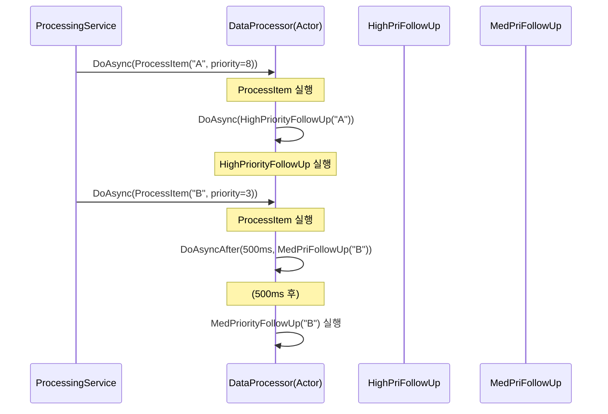

# Chapter 09: ExampleConsoleApp — 기본기 익히기

## 9.1 프로젝트 구조

```
ExampleConsoleApp/
├── Program.cs              ← 세 가지 예제를 실행하는 진입점
├── TestObject.cs           ← 가장 기본적인 AsyncExecutable 구현
├── TestWorkerThread.cs     ← IRunnable 구현
├── DataProcessor.cs        ← Actor 스타일 심화 예제
└── ProcessingService.cs    ← DataProcessor를 래핑하는 서비스
```

이 프로젝트는 세 가지 예제를 순서대로 실행합니다:

```
main() 실행
    │
    ├── BasicExampleAsync()       ← 예제 1: DoAsync/DoAsyncAfter 기본
    │
    ├── WorkerThreadExampleAsync() ← 예제 2: IRunnable + JobDispatcher
    │
    └── AdvancedExampleAsync()    ← 예제 3: Actor 스타일 DataProcessor
```

---

## 9.2 TestObject — 가장 단순한 Actor

```csharp
public class TestObject : AsyncExecutable
{
    private int _testCount;  // lock 없이 안전하게 쓸 수 있는 필드

    public void TestFunc0()
    {
        Interlocked.Increment(ref _testCount);
    }

    public void TestFunc1(int b)
    {
        Interlocked.Add(ref _testCount, b);
    }

    public void TestFunc2(double a, int b)
    {
        Interlocked.Add(ref _testCount, b);

        // Actor 내부에서 자기 자신에게 다시 DoAsync!
        // → 새 작업이 현재 큐에 추가됨 (직렬 실행 보장)
        if (a < 50.0)
        {
            DoAsync(() => TestFunc1(b));
        }
    }

    public void TestFuncForTimer(int b)
    {
        // 50% 확률로 재귀적 타이머 예약
        if (Random.Shared.Next(2) == 0)
        {
            DoAsyncAfter(TimeSpan.FromSeconds(1), () => TestFuncForTimer(-b));
        }
    }

    public int GetTestCount() => _testCount;
}
```

잠깐! `_testCount`에 `Interlocked.Add`를 쓰고 있습니다. Actor 내부에서 실행되는데 왜 Interlocked을 쓸까요?

```
설명:
─────────────────────────────────────────────────────────
TestObject는 AsyncExecutable을 상속하므로 내부 메서드들은
항상 직렬 실행됩니다.

하지만 GetTestCount()는 외부 스레드에서 직접 호출될 수 있습니다!
  TestObject._testCount를 읽기 위해 직접 호출하면
  → 읽기와 쓰기가 동시에 발생 가능

완전한 Actor 모델이라면 GetTestCount()도 큐를 통해야 합니다.
이 예제는 간단함을 위해 Interlocked를 사용한 것입니다.

실제 서버에서는 GetSnapshot() 패턴을 쓰는 것이 더 안전합니다!
─────────────────────────────────────────────────────────
```

---

## 9.3 예제 1: BasicExampleAsync

```csharp
static async Task BasicExampleAsync()
{
    Console.WriteLine("Basic Example:");

    await using var testObject = new TestObject();

    // ① 즉시 실행 — 큐에 넣고 이 스레드에서 바로 Flush!
    testObject.DoAsync(() => testObject.TestFunc0());
    testObject.DoAsync(() => testObject.TestFunc1(5));
    testObject.DoAsync(() => testObject.TestFunc2(25, 10));

    // ② 500ms 후 실행 — TimerQueue에 예약
    testObject.DoAsyncAfter(TimeSpan.FromMilliseconds(500),
        () => testObject.TestFunc1(15));

    // ③ 500ms + 처리 시간을 기다림
    await Task.Delay(1000);

    Console.WriteLine($"Test count: {testObject.GetTestCount()}");
}
```

실행 순서 추적:

```
DoAsync(TestFunc0)
    → Increment(count=1)  — 내가 첫 번째!
    → 큐에 넣기
    → Flush 시작
        TestFunc0 실행  (_testCount += 1)
        Decrement(count=0)  — 큐 비었음 → break

DoAsync(TestFunc1(5))
    → Increment(count=1)  — 또 첫 번째!
    → 큐에 넣기
    → Flush 시작
        TestFunc1(5) 실행  (_testCount += 5)
        Decrement(count=0)  — break

DoAsync(TestFunc2(25, 10))
    → Increment(count=1)
    → 큐에 넣기
    → Flush 시작
        TestFunc2(25, 10) 실행
            Interlocked.Add(10)
            a(25) < 50.0 → DoAsync(TestFunc1(10))
                → Increment(count=2)  ← 아직 Flush 중이므로 큐에만 넣기
        Decrement(count=1)  — 아직 작업 있음
        TestFunc1(10) 실행  (_testCount += 10)
        Decrement(count=0)  — break

DoAsyncAfter(500ms, TestFunc1(15))
    → TimerQueue에 예약
    → 500ms 후 TimerDispatchQueue에 추가
    → 워커 스레드(없음) 또는 메인 스레드의 다음 Flush에서 처리

최종: _testCount = 1 + 5 + 10 + 10 + 15 = 41
```

---

## 9.4 TestWorkerThread — IRunnable 구현

```csharp
public class TestWorkerThread : IRunnable
{
    private readonly List<TestObject> _testObjects = new();
    private const int TestObjectCount = 10;

    public TestWorkerThread()
    {
        // 이 워커가 소유할 10개의 TestObject 생성
        for (int i = 0; i < TestObjectCount; i++)
        {
            _testObjects.Add(new TestObject());
        }
    }

    public bool Run(CancellationToken cancellationToken)
    {
        if (cancellationToken.IsCancellationRequested)
            return false;

        int after = Random.Shared.Next(2000);  // 0~2000ms

        if (after > 1000)  // 절반 확률
        {
            // 랜덤 TestObject들에 작업 보내기
            int i1 = Random.Shared.Next(TestObjectCount);
            int i2 = Random.Shared.Next(TestObjectCount);
            int i3 = Random.Shared.Next(TestObjectCount);
            int i4 = Random.Shared.Next(TestObjectCount);

            _testObjects[i1].DoAsync(() => _testObjects[i1].TestFunc0());
            _testObjects[i2].DoAsync(() =>
                _testObjects[i2].TestFunc2(Random.Shared.Next(100), 2));
            _testObjects[i3].DoAsync(() => _testObjects[i3].TestFunc1(1));

            // 지연 실행도 테스트
            _testObjects[i4].DoAsyncAfter(
                TimeSpan.FromMilliseconds(after),
                () => _testObjects[i4].TestFuncForTimer(after));
        }

        // 카운트가 5000을 넘으면 강제 종료 (조기 종료 테스트)
        if (_testObjects[Random.Shared.Next(TestObjectCount)].GetTestCount() > 5000)
        {
            Console.WriteLine($"Thread {Environment.CurrentManagedThreadId} end by force");
            return false;  // ← false 반환으로 이 워커 종료
        }

        Thread.Sleep(1);  // CPU 양보
        return true;
    }

    public void Dispose()
    {
        // TestObject들을 비동기로 Dispose (큐 drain 대기)
        foreach (var testObject in _testObjects)
        {
            testObject.DisposeAsync().AsTask().Wait();
        }
    }
}
```

---

## 9.5 예제 2: WorkerThreadExampleAsync

```csharp
static async Task WorkerThreadExampleAsync()
{
    Console.WriteLine("Worker Thread Example:");

    // 4개의 전용 OS 스레드로 TestWorkerThread 실행
    await using var dispatcher = new JobDispatcher<TestWorkerThread>(4);

    // 스레드 시작 + 모든 완료를 기다리는 Task 반환
    var dispatcherTask = Task.Run(async () =>
        await dispatcher.RunWorkerThreadsAsync());

    // 5초 동안 실행
    Console.WriteLine("Running worker threads for 5 seconds...");
    await Task.Delay(TimeSpan.FromSeconds(5));

    // 종료 신호 + 스레드 Join
    Console.WriteLine("Stopping worker threads...");
    await dispatcher.DisposeAsync();

    Console.WriteLine("All workers have completed");
}
```

4개 워커 스레드의 동작:

```
JobWorker-0 (OS Thread A):
    TestWorkerThread-0 생성
    Run() 반복:
      → TestObject 0~9에 랜덤으로 DoAsync/DoAsyncAfter
      → 카운트 체크 → 5000 초과하면 false 반환
      → Dispose: TestObject들 drain 대기

JobWorker-1 (OS Thread B):
    TestWorkerThread-1 생성
    Run() 반복: (독립적으로!)

JobWorker-2 (OS Thread C): ...
JobWorker-3 (OS Thread D): ...

★ 같은 TestObject에 여러 워커가 DoAsync를 보낼 수 있음
  → Channel이 직렬화 보장!
  → 어떤 워커가 Flush하든 순서 보장
```

---

## 9.6 DataProcessor — Actor 스타일 심화

```csharp
public class DataProcessor : AsyncExecutable
{
    // lock이 단 하나도 없는 컬렉션!
    private readonly Dictionary<string, int> _processedItems = new();

    // 외부 진입점: 큐에 넣기만
    public void ProcessItem(string itemId, int priority)
    {
        Console.WriteLine($"[Thread {Environment.CurrentManagedThreadId}] " +
                          $"Processing {itemId} priority={priority}");

        Thread.Sleep(100 * (1 + Random.Shared.Next(5)));  // 처리 시뮬레이션

        // ★ lock 없이 안전하게 딕셔너리 갱신!
        if (_processedItems.TryGetValue(itemId, out var count))
            _processedItems[itemId] = count + 1;
        else
            _processedItems[itemId] = 1;

        // 우선순위에 따라 자기 자신에게 후속 작업 예약
        if (priority > 5)
            DoAsync(() => HighPriorityFollowUp(itemId));    // 즉시
        else if (priority > 2)
            DoAsyncAfter(TimeSpan.FromMilliseconds(500),
                () => MediumPriorityFollowUp(itemId));      // 500ms 후
    }

    private void HighPriorityFollowUp(string itemId) { ... }
    private void MediumPriorityFollowUp(string itemId) { ... }

    // ★ 중요: 읽기도 큐를 통과!
    public Task<Dictionary<string, int>> GetProcessingStatsAsync()
    {
        var tcs = new TaskCompletionSource<Dictionary<string, int>>(
            TaskCreationOptions.RunContinuationsAsynchronously);

        DoAsync(() => tcs.SetResult(new Dictionary<string, int>(_processedItems)));

        return tcs.Task;
    }
}
```

왜 GetProcessingStatsAsync에서 큐를 사용하나요?

```
잘못된 방법 (직접 읽기):
──────────────────────────────────────────────────────────
// 이렇게 하면:
public Dictionary<string, int> GetStats()
    => new Dictionary<string, int>(_processedItems);

외부 스레드에서 호출:
  Thread-External: new Dict(_processedItems)  ← 복사 시작
  DataProcessor 큐: ProcessItem() 실행 중
    → _processedItems 수정!
  Thread-External: 복사 진행 중 ← 중간 상태 읽기!

올바른 방법 (큐를 통해 읽기):
──────────────────────────────────────────────────────────
DoAsync(() => tcs.SetResult(new Dict(_processedItems)))

→ ProcessItem이 모두 처리된 후에 읽기 실행
→ 일관된 스냅샷 보장!
→ 큐 순서에 따른 happens-before 일관성
```

---

## 9.7 예제 3: AdvancedExampleAsync

```csharp
static async Task AdvancedExampleAsync()
{
    await using var processingService = new ProcessingService();

    processingService.Start();

    // 5초 동안 실행
    await Task.Delay(TimeSpan.FromSeconds(5));

    // 통계 조회 — 큐를 통과하므로 안전!
    var stats = await processingService.Processor.GetProcessingStatsAsync();

    Console.WriteLine("\nProcessing Statistics:");
    Console.WriteLine($"Total unique items: {stats.Count}");
    Console.WriteLine($"Total operations: {stats.Values.Sum()}");

    foreach (var item in stats.OrderByDescending(x => x.Value))
        Console.WriteLine($"{item.Key}: {item.Value}회");
}
```

ProcessingService의 역할:

```csharp
public class ProcessingService : IAsyncDisposable
{
    private readonly DataProcessor _processor = new();

    public void Start()
    {
        // 별도 Task에서 작업을 DataProcessor에 보냄
        _processingTask = Task.Run(async () =>
        {
            for (int i = 0; i < _itemCount && !token.IsCancellationRequested; i++)
            {
                string item = _items[Random.Shared.Next(_items.Count)];
                int priority = Random.Shared.Next(1, 10);

                // ★ DoAsync로 DataProcessor 큐에 넣기
                _processor.DoAsync(() => _processor.ProcessItem(item, priority));

                await Task.Delay(Random.Shared.Next(10, 50), token);
            }
        }, token);
    }
}
```

---

## 9.8 우선순위 후속 작업 다이어그램



---

## 9.9 핵심 학습 포인트 정리

```
BasicExample에서:
✓ DoAsync는 즉시 Flush를 돌려 같은 스레드에서 처리
✓ DoAsyncAfter는 TimerQueue에 예약
✓ Actor 내부에서 DoAsync 호출 시 기존 Flush에 합류

WorkerThreadExample에서:
✓ IRunnable + JobDispatcher = 전용 OS 스레드
✓ 여러 워커가 같은 Actor에 DoAsync → Channel이 직렬화
✓ Run()이 false 반환 → 해당 워커만 종료 (다른 워커 유지)

AdvancedExample에서:
✓ 읽기도 DoAsync를 통과 → 일관된 스냅샷
✓ TaskCompletionSource로 비동기 결과 회수
✓ 자기 자신에게 후속 작업 예약 가능
```

---

*[← Chapter 08](./chapter08.md) | [→ Chapter 10: ExampleChatServer](./chapter10.md)*
