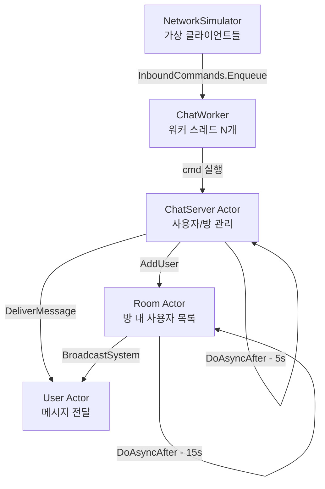

# Chapter 10: ExampleChatServer — Actor 기반 채팅 서버

## 10.1 프로젝트 구조

```
ExampleChatServer/
├── Program.cs           ← 시뮬레이션 실행
├── ChatServer.cs        ← 최상위 서버 Actor
├── ChatWorker.cs        ← IRunnable 워커
├── Room.cs              ← 방 Actor
├── User.cs              ← 사용자 Actor
├── Defines.cs           ← 메시지 타입, 레코드 등
└── NetworkSimulator.cs  ← 가상 클라이언트 시뮬레이션
```

---

## 10.2 전체 구조 다이어그램



---

## 10.3 ChatServer — 최상위 Actor

### 코딩 컨벤션

ChatServer는 두 종류의 메서드를 명확히 구분합니다:

```csharp
public sealed class ChatServer : AsyncExecutable
{
    // ── 외부 진입점 (public Handle*) ──────────────────────
    // 규칙: DoAsync로 큐에 넣기만 한다

    public void HandleUserConnect(IChatClient client)
        => DoAsync(() => ProcessUserConnect(client));

    public void HandleRoomJoin(string userId, string roomId)
        => DoAsync(() => ProcessRoomJoin(userId, roomId));

    public void HandleRoomChat(string userId, string roomId, string content)
        => DoAsync(() => ProcessRoomChat(userId, roomId, content));

    // ── 실제 처리 (private Process*) ─────────────────────
    // 규칙: ChatServer 큐에서 직렬 실행, 여기서 상태 변경

    private void ProcessUserConnect(IChatClient client)
    {
        // ★ _users 딕셔너리 — lock 없이 안전!
        var user = new User(client);
        _users[user.UserId] = user;
        BroadcastSystemToAll(MessageType.UserConnect, $"{user.Username}님이 접속하셨습니다.");
    }

    private void ProcessRoomJoin(string userId, string roomId)
    {
        if (_users.TryGetValue(userId, out var user) &&
            _rooms.TryGetValue(roomId, out var room))
        {
            // ★ Room Actor에게 메시지 패싱!
            room.AddUser(user);  // room.DoAsync(() => room.ProcessAddUser(user))
        }
    }
}
```

---

## 10.4 서버 생명주기

```csharp
public void Start()
{
    // 1. 기본 방 생성 (Actor 큐로!)
    DoAsync(CreateDefaultRooms);

    // 2. 워커 스레드 시작
    _dispatcher = new JobDispatcher<ChatWorker>(_workerCount);
    _ = _dispatcher.RunWorkerThreadsAsync();

    // 3. Heartbeat 시작 (자기복제 패턴)
    DoAsync(StatsHeartbeat);   // 5초마다 통계 출력
    DoAsync(IdleScanHeartbeat); // 10초마다 유휴 사용자 체크
}

public void Stop()
{
    _stopped = true;
    DoAsync(ForceCleanupAllRooms);

    // 큐가 빌 때까지 대기 후 종료
    DisposeAsync().AsTask().Wait();

    _dispatcher?.Dispose();
    TimerRegistry.DisposeAll();
}
```

---

## 10.5 자기복제 Heartbeat 패턴

```csharp
private void StatsHeartbeat()
{
    if (_stopped) return;  // ← 종료 체크 (자기복제 탈출)

    // 실제 작업: 통계 출력
    Console.WriteLine($"사용자 {_users.Count}명 / 방 {_rooms.Count}개");

    // 자기 자신을 5초 후에 다시 예약
    DoAsyncAfter(_statsPeriod, StatsHeartbeat);
}

private void IdleScanHeartbeat()
{
    if (_stopped) return;

    // 각 사용자에게 유휴 체크 요청
    foreach (var user in _users.Values)
        user.CheckIdleAndDisconnect(this, _idleThresholdMs);

    DoAsyncAfter(_idleScanPeriod, IdleScanHeartbeat);
}
```

---

## 10.6 Room — 방 Actor

```csharp
public sealed class Room : AsyncExecutable
{
    private readonly Dictionary<string, User> _users = [];

    // ── 외부 진입점 ───────────────────────────────────────

    public void AddUser(User user) => DoAsync(() => ProcessAddUser(user));
    public void RemoveUser(string userId) => DoAsync(() => ProcessRemoveUser(userId));
    public void BroadcastChat(string senderId, string content)
        => DoAsync(() => ProcessBroadcastChat(senderId, content));

    // ── 실제 처리 ─────────────────────────────────────────

    private void ProcessAddUser(User user)
    {
        if (!_users.TryAdd(user.UserId, user)) return;

        Console.WriteLine($"[Room {_roomId}] 입장: {user.Username}");
        BroadcastSystem(MessageType.RoomJoin, $"{user.Username}님이 입장하셨습니다.");
        user.NoteRoomJoined(_roomId);  // ← User Actor에게 메시지 패싱!
    }

    private void ProcessBroadcastChat(string senderId, string content)
    {
        if (!_users.TryGetValue(senderId, out var sender)) return;

        sender.TouchActivity();

        var message = new ChatMessage(
            Guid.NewGuid(), MessageType.RoomChat,
            sender.Username, null, _roomId, content, DateTimeOffset.UtcNow);

        // ★ 모든 User Actor에게 메시지 전달
        foreach (var user in _users.Values)
            user.DeliverMessage(message);  // 각 User의 DoAsync 호출
    }

    // ── Heartbeat (자기복제) ──────────────────────────────

    private void Heartbeat(TimeSpan period)
    {
        if (_stopped) return;

        if (_users.Count > 0)
        {
            BroadcastSystem(MessageType.RoomChat,
                $"현재 {_name} 방에 {_users.Count}명이 있습니다.");
        }

        // 다음 heartbeat 예약
        DoAsyncAfter(period, () => Heartbeat(period));
    }
}
```

---

## 10.7 User — 사용자 Actor

```csharp
public sealed class User : AsyncExecutable
{
    private long _lastActivityTickMs;  // lock 없이 안전한 필드

    // ── 외부 진입점 ───────────────────────────────────────

    public void DeliverMessage(ChatMessage message)
        => DoAsync(() => ProcessDeliverMessage(message));

    public void TouchActivity()
        => DoAsync(() => _lastActivityTickMs = Environment.TickCount64);

    public void CheckIdleAndDisconnect(ChatServer server, long thresholdMs)
        => DoAsync(() => ProcessCheckIdleAndDisconnect(server, thresholdMs));

    // ── 실제 처리 ─────────────────────────────────────────

    private void ProcessDeliverMessage(ChatMessage message)
    {
        _lastActivityTickMs = Environment.TickCount64;
        // 네트워크 전송 (User Actor 큐에서 직렬 실행 → 다른 Actor 안 막음!)
        _client.SendMessage(message);
    }

    private void ProcessCheckIdleAndDisconnect(ChatServer server, long thresholdMs)
    {
        long idle = Environment.TickCount64 - _lastActivityTickMs;
        if (idle > thresholdMs)
        {
            Console.WriteLine($"{Username} 유휴 {idle}ms — 자동 종료");
            // ★ Actor → Actor 메시지 패싱
            server.HandleUserDisconnect(UserId);
        }
    }
}
```

---

## 10.8 GetSnapshot 패턴 — 안전한 읽기

외부에서 상태를 읽어야 할 때 사용하는 패턴입니다:

```csharp
// Room.cs
public RoomSnapshot GetSnapshot()
{
    using var ev = new ManualResetEventSlim(false);
    RoomSnapshot? result = null;

    DoAsync(() =>
    {
        // Room 큐 안에서 실행 → _users 안전하게 읽기!
        result = new RoomSnapshot(_roomId, _name, _users.Keys.ToList());
        ev.Set();  // 완료 신호!
    });

    ev.Wait();  // 완료 신호 대기
    return result!;
}
```

단계별 동작:

```
외부 스레드             Room Actor 큐
      │
      ├─ DoAsync(람다)
      │   → 큐에 람다 추가
      │
      └─ ev.Wait()  ─────────── (대기 중...)
                                    │
                     큐에서 람다 실행
                     result = 스냅샷
                     ev.Set()  ──────────► 대기 해제!
      │
      └─ return result!
```

주의: `GetSnapshot()`을 다른 Actor의 큐 안에서 호출하면 안 됩니다!

```
❌ 잘못된 사용:
void ProcessSomething()  // ChatServer 큐 안에서 실행 중
{
    var snap = room.GetSnapshot();  // ← 데드락 위험!
    // ChatServer 큐가 멈춤(ev.Wait)
    // Room.DoAsync가 ChatServer 큐에서 처리되길 기다리면 데드락!
}

✅ 올바른 사용:
// 외부 스레드(메인, 통계 수집 등)에서 호출
var snapshot = server.GetSnapshot();
```

---

## 10.9 ChatWorker — 워커 스레드

```csharp
public class ChatWorker : IRunnable
{
    // IO 스레드/시뮬레이션이 명령을 여기에 push
    public static readonly ConcurrentQueue<Action> InboundCommands = new();

    public static long TotalProcessed => Interlocked.Read(ref _totalProcessed);
    private static long _totalProcessed;

    private long _localProcessed;
    private long _lastLogTick;

    public bool Run(CancellationToken cancellationToken)
    {
        if (cancellationToken.IsCancellationRequested) return false;

        if (InboundCommands.TryDequeue(out var cmd))
        {
            try
            {
                cmd();           // 여기서 ChatServer.HandleX 실행
                _localProcessed++;
                Interlocked.Increment(ref _totalProcessed);
            }
            catch (Exception ex)
            {
                Console.Error.WriteLine($"명령 실행 실패: {ex.Message}");
            }
        }
        else
        {
            Thread.Sleep(1);  // 큐 비어있으면 양보
        }

        // ThreadLocal TickCount로 주기 로그
        long now = ThreadContext.TickCount;
        if (now - _lastLogTick >= 5000)
        {
            _lastLogTick = now;
            Console.WriteLine($"[Worker] tick={now}ms 처리={_localProcessed}건");
        }

        return true;
    }
}
```

---

## 10.10 전체 메시지 흐름

실제 채팅 메시지가 처리되는 과정을 따라가봅시다:

```
클라이언트: "안녕!"을 general 방에 보냄

①  NetworkSimulator (또는 실제 IO 스레드)
     ChatWorker.InboundCommands.Enqueue(
         () => server.HandleRoomChat("user1", "general", "안녕!"))

②  ChatWorker.Run()
     InboundCommands.TryDequeue() → cmd 꺼내기
     cmd()  →  server.HandleRoomChat("user1", "general", "안녕!")

③  ChatServer.HandleRoomChat
     DoAsync(() => ProcessRoomChat("user1", "general", "안녕!"))
     → ChatServer 큐에 추가
     → ChatWorker 스레드가 Flush 실행
     → ProcessRoomChat 실행

④  ProcessRoomChat (ChatServer 큐 안)
     room = _rooms["general"]
     room.BroadcastChat("user1", "안녕!")
     → Room 큐에 추가

⑤  Room.ProcessBroadcastChat (Room 큐 안)
     sender = _users["user1"]
     sender.TouchActivity()
     메시지 생성
     for each user in _users:
         user.DeliverMessage(message)
         → 각 User 큐에 추가

⑥  User.ProcessDeliverMessage (User 큐 안)
     _client.SendMessage(message)
     → 실제 네트워크 전송 (여기서만 네트워크 IO!)
```

---

## 10.11 Actor 간 격리의 장점

```
Room 전체에 100명이 있을 때 채팅 처리:

전통적 방법 (lock):
  for each user:
    lock(user)
    send()
    unlock(user)
  → 직렬! 100명 차례로 전송

Actor 방법:
  for each user:
    user.DeliverMessage()  → 각 User 큐에 추가 (즉시 반환!)
  → Room은 즉시 다음 작업으로!
  → 100명의 User Actor가 병렬로 전송!
  → 느린 클라이언트(네트워크 지연)가 다른 사람에게 영향 없음!
```

---

## 10.12 핵심 학습 포인트

```
ChatServer 예제에서:
✓ 세 Actor(ChatServer, Room, User) 협업 구조
✓ Handle*/Process* 코딩 컨벤션
✓ 자기복제 Heartbeat (StatsHeartbeat, IdleScanHeartbeat)
✓ GetSnapshot 패턴 — ManualResetEventSlim 신호 대기
✓ Actor → Actor 메시지 패싱 (user.HandleUserDisconnect)
✓ 워커 스레드에서 ThreadContext.TickCount로 주기 로그
✓ GetSnapshot 호출 시 데드락 주의!
```

---

*[← Chapter 09](./chapter09.md) | [→ Chapter 11: ExampleMmorpgServer](./chapter11.md)*
