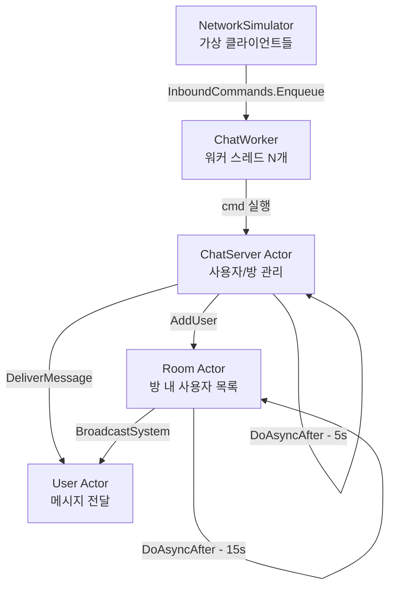

# Chapter 10: ExampleChatServer — Actor 기반 채팅 서버

## 10.1 프로젝트 구조

```
ExampleChatServer/
├── Program.cs           ← 시뮬레이션 실행
├── ChatServer.cs        ← 최상위 서버 Actor
├── ChatWorker.cs        ← IRunnable 워커
├── Room.cs              ← 방 Actor
├── User.cs              ← 사용자 Actor
├── Defines.cs           ← 메시지 타입, 레코드 등
└── NetworkSimulator.cs  ← 가상 클라이언트 시뮬레이션
```

---

## 10.2 전체 구조 다이어그램


```mermaid
graph TD
    NC[NetworkSimulator\n가상 클라이언트들] -->|InboundCommands.Enqueue| CW[ChatWorker\n워커 스레드 N개]
    CW -->|cmd 실행| CS[ChatServer Actor\n사용자/방 관리]
    CS -->|AddUser| R[Room Actor\n방 내 사용자 목록]
    CS -->|DeliverMessage| U[User Actor\n메시지 전달]
    R -->|BroadcastSystem| U
    R -->|DoAsyncAfter - 15s| R
    CS -->|DoAsyncAfter - 5s| CS
```

---

## 10.3 ChatServer — 최상위 Actor

### 코딩 컨벤션

ChatServer는 두 종류의 메서드를 명확히 구분합니다:

```csharp
public sealed class ChatServer : AsyncExecutable
{
    // ── 외부 진입점 (public Handle*) ──────────────────────
    // 규칙: DoAsync로 큐에 넣기만 한다

    public void HandleUserConnect(IChatClient client)
        => DoAsync(() => ProcessUserConnect(client));

    public void HandleRoomJoin(string userId, string roomId)
        => DoAsync(() => ProcessRoomJoin(userId, roomId));

    public void HandleRoomChat(string userId, string roomId, string content)
        => DoAsync(() => ProcessRoomChat(userId, roomId, content));

    // ── 실제 처리 (private Process*) ─────────────────────
    // 규칙: ChatServer 큐에서 직렬 실행, 여기서 상태 변경

    private void ProcessUserConnect(IChatClient client)
    {
        // ★ _users 딕셔너리 — lock 없이 안전!
        var user = new User(client);
        _users[user.UserId] = user;
        BroadcastSystemToAll(MessageType.UserConnect, $"{user.Username}님이 접속하셨습니다.");
    }

    private void ProcessRoomJoin(string userId, string roomId)
    {
        if (_users.TryGetValue(userId, out var user) &&
            _rooms.TryGetValue(roomId, out var room))
        {
            // ★ Room Actor에게 메시지 패싱!
            room.AddUser(user);  // room.DoAsync(() => room.ProcessAddUser(user))
        }
    }
}
```

---

## 10.4 서버 생명주기

```csharp
public void Start()
{
    // 1. 기본 방 생성 (Actor 큐로!)
    DoAsync(CreateDefaultRooms);

    // 2. 워커 스레드 시작
    _dispatcher = new JobDispatcher<ChatWorker>(_workerCount);
    _ = _dispatcher.RunWorkerThreadsAsync();

    // 3. Heartbeat 시작 (자기복제 패턴)
    DoAsync(StatsHeartbeat);   // 5초마다 통계 출력
    DoAsync(IdleScanHeartbeat); // 10초마다 유휴 사용자 체크
}

public void Stop()
{
    Console.WriteLine("[Server] 종료 시작");
    _stopped = true;

    DoAsync(ForceCleanupAllRooms);

    // 자기 큐 drain 대기 (ValueTask 를 Task 로 바꿔 한 번만 차단)
    DisposeAsync().AsTask().Wait();

    // v2.1: 남은 작업 drain → 타이머 스레드 정지 → 워커 정지까지 한 번에.
    System.StopAsync(TimeSpan.FromSeconds(5)).GetAwaiter().GetResult();
    Console.WriteLine("[Server] 종료 완료");
}
```

> **셧다운이 한 줄로 줄어든 이유.**
> v2.0 까지 이 자리에는 세 줄이 있었습니다.
>
> ```csharp
> _dispatcher?.Dispose();          // 워커 정지
> TimerRegistry.DisposeAll();      // 비-워커 스레드가 만든 TimerQueue 정리
> // (+ 상황에 따라 AsyncExecutable.AcceptingWork = false)
> ```
>
> 지금은 타이머를 `JobSystem` 이 소유하므로 정리할 `TimerQueue` 가 애초에 없고
> (`TimerRegistry` 는 `[Obsolete]` no-op 으로만 남아 있습니다 — 5.9 참고),
> `StopAsync` 하나가 **드레인 → 타이머 스레드 정지 → 이 시스템에 붙은 디스패처 정지**를
> 순서대로 처리합니다.
>
> `AsyncExecutable` 을 상속한 클래스는 `System` 프로퍼티로 자기가 속한 `JobSystem` 에
> 바로 접근할 수 있습니다. 반환값이 `false` 면 타임아웃 안에 다 비우지 못했다는 뜻이니
> 로그를 남겨 두는 편이 좋습니다.
>
> ```csharp
> if (!await System.StopAsync(TimeSpan.FromSeconds(10)))
>     JobLog.Warn("일부 작업이 남은 채로 종료되었습니다");
> ```
>
> 12장의 `AdvancedMmorpgServer` 도 같은 형태입니다.

---

## 10.5 자기복제 Heartbeat 패턴

```csharp
private void StatsHeartbeat()
{
    if (_stopped) return;  // ← 종료 체크 (자기복제 탈출)

    // 실제 작업: 통계 출력
    Console.WriteLine($"사용자 {_users.Count}명 / 방 {_rooms.Count}개");

    // 자기 자신을 5초 후에 다시 예약
    DoAsyncAfter(_statsPeriod, StatsHeartbeat);
}

private void IdleScanHeartbeat()
{
    if (_stopped) return;

    // 각 사용자에게 유휴 체크 요청
    foreach (var user in _users.Values)
        user.CheckIdleAndDisconnect(this, _idleThresholdMs);

    DoAsyncAfter(_idleScanPeriod, IdleScanHeartbeat);
}
```

> **지금은 `DoAsyncEvery` 로 쓰는 편이 낫습니다.**
> ```csharp
> private ITimerHandle? _stats;
> private ITimerHandle? _idleScan;
>
> public void StartHeartbeats()
>     => DoAsync(() =>
>     {
>         _stats    = DoAsyncEvery(_statsPeriod,    PrintStats);
>         _idleScan = DoAsyncEvery(_idleScanPeriod, ScanIdleUsers);
>     });
>
> public void StopHeartbeats()   // _stopped 플래그 대신 진짜 취소
> {
>     _stats?.Cancel();
>     _idleScan?.Cancel();
> }
> ```
> 위의 자기복제 패턴에는 두 가지 문제가 있습니다. ① `PrintStats` 가 예외를 던지면
> 마지막 줄에 도달하지 못해 heartbeat 가 **영원히** 멈춥니다. ② `_stopped` 플래그는
> "발화는 하되 아무것도 안 함"이므로, 셧다운 시 타이머가 계속 새 작업을 만들어
> 드레인이 끝나지 않습니다. `DoAsyncEvery` + `Cancel()` 은 둘 다 해결합니다 (5.5).

---

## 10.6 Room — 방 Actor

```csharp
public sealed class Room : AsyncExecutable
{
    private readonly Dictionary<string, User> _users = [];

    // ── 외부 진입점 ───────────────────────────────────────

    public void AddUser(User user) => DoAsync(() => ProcessAddUser(user));
    public void RemoveUser(string userId) => DoAsync(() => ProcessRemoveUser(userId));
    public void BroadcastChat(string senderId, string content)
        => DoAsync(() => ProcessBroadcastChat(senderId, content));

    // ── 실제 처리 ─────────────────────────────────────────

    private void ProcessAddUser(User user)
    {
        if (!_users.TryAdd(user.UserId, user)) return;

        Console.WriteLine($"[Room {_roomId}] 입장: {user.Username}");
        BroadcastSystem(MessageType.RoomJoin, $"{user.Username}님이 입장하셨습니다.");
        user.NoteRoomJoined(_roomId);  // ← User Actor에게 메시지 패싱!
    }

    private void ProcessBroadcastChat(string senderId, string content)
    {
        if (!_users.TryGetValue(senderId, out var sender)) return;

        sender.TouchActivity();

        var message = new ChatMessage(
            Guid.NewGuid(), MessageType.RoomChat,
            sender.Username, null, _roomId, content, DateTimeOffset.UtcNow);

        // ★ 모든 User Actor에게 메시지 전달
        foreach (var user in _users.Values)
            user.DeliverMessage(message);  // 각 User의 DoAsync 호출
    }

    // ── Heartbeat (자기복제) ──────────────────────────────

    private void Heartbeat(TimeSpan period)
    {
        if (_stopped) return;

        if (_users.Count > 0)
        {
            BroadcastSystem(MessageType.RoomChat,
                $"현재 {_name} 방에 {_users.Count}명이 있습니다.");
        }

        // 다음 heartbeat 예약
        DoAsyncAfter(period, () => Heartbeat(period));
    }
}
```

---

## 10.7 User — 사용자 Actor

```csharp
public sealed class User : AsyncExecutable
{
    private long _lastActivityTickMs;  // lock 없이 안전한 필드

    // ── 외부 진입점 ───────────────────────────────────────

    public void DeliverMessage(ChatMessage message)
        => DoAsync(() => ProcessDeliverMessage(message));

    public void TouchActivity()
        => DoAsync(() => _lastActivityTickMs = Environment.TickCount64);

    public void CheckIdleAndDisconnect(ChatServer server, long thresholdMs)
        => DoAsync(() => ProcessCheckIdleAndDisconnect(server, thresholdMs));

    // ── 실제 처리 ─────────────────────────────────────────

    private void ProcessDeliverMessage(ChatMessage message)
    {
        _lastActivityTickMs = Environment.TickCount64;
        // 네트워크 전송 (User Actor 큐에서 직렬 실행 → 다른 Actor 안 막음!)
        _client.SendMessage(message);
    }

    private void ProcessCheckIdleAndDisconnect(ChatServer server, long thresholdMs)
    {
        long idle = Environment.TickCount64 - _lastActivityTickMs;
        if (idle > thresholdMs)
        {
            Console.WriteLine($"{Username} 유휴 {idle}ms — 자동 종료");
            // ★ Actor → Actor 메시지 패싱
            server.HandleUserDisconnect(UserId);
        }
    }
}
```

---

## 10.8 GetSnapshot 패턴 — 안전한 읽기

외부에서 상태를 읽어야 할 때 사용하는 패턴입니다:

```csharp
// Room.cs
public RoomSnapshot GetSnapshot()
{
    using var ev = new ManualResetEventSlim(false);
    RoomSnapshot? result = null;

    DoAsync(() =>
    {
        // Room 큐 안에서 실행 → _users 안전하게 읽기!
        result = new RoomSnapshot(_roomId, _name, _users.Keys.ToList());
        ev.Set();  // 완료 신호!
    });

    ev.Wait();  // 완료 신호 대기
    return result!;
}
```

단계별 동작:

```
외부 스레드             Room Actor 큐
      │
      ├─ DoAsync(람다)
      │   → 큐에 람다 추가
      │
      └─ ev.Wait()  ─────────── (대기 중...)
                                    │
                     큐에서 람다 실행
                     result = 스냅샷
                     ev.Set()  ──────────► 대기 해제!
      │
      └─ return result!
```

### 지금은 AskSync 를 쓰세요

같은 일을 라이브러리가 해 줍니다. 그리고 **훨씬 중요한 차이가 하나 있습니다.**

```csharp
// Room.cs 를 v2.1 스타일로
public RoomSnapshot GetSnapshot()
    => AskSync(() => new RoomSnapshot(_roomId, _name, _users.Keys.ToList()),
               TimeSpan.FromSeconds(2));
```

```
직접 만든 ManualResetEventSlim 버전   vs   AskSync

  ev.Wait() 는 무한 대기                    timeout 필수 → 영구 정지 없음
  큐에 못 들어가도 그냥 멈춘다              거부되면 JobRejectedException
  actor 안에서 부르면 조용히 데드락 ★       actor 안에서 부르면 즉시 예외 ★
```

★ 이 줄이 핵심입니다. `AskSync` 는 첫 줄에서 `JobDiagnostics.GuardBlockingWait` 를 부릅니다.

```
❌ 잘못된 사용:
void ProcessSomething()  // ChatServer 큐 안에서 실행 중
{
    var snap = room.GetSnapshot();
    // 예전: ChatServer 큐가 ev.Wait 에서 멈춤 → Room 의 작업을 처리해 줄 스레드가
    //       바로 지금 멈춰 있는 이 스레드 → 조용한 데드락, 원인 파악 매우 어려움
    // 지금: InvalidOperationException — "actor 'ChatServer' 안에서 AskSync 를 불렀다"
}

✅ 올바른 사용:
// 외부 스레드(메인, 콘솔 명령, 통계 수집 등)에서 호출
var snapshot = server.GetSnapshot();

✅ actor 안에서 다른 actor 의 데이터가 필요하다면 — 메시지 패싱
private void ProcessSomething()
{
    room.RequestSnapshot(this);   // room 이 결과를 이쪽 큐로 DoAsync 해 준다
}
```

이 가드는 `JobSystemOptions.DetectBlockingWaitOnWorker` 로 켜고 끕니다 (DEBUG 기본 on).

---

## 10.9 ChatWorker — 워커 스레드

```csharp
public class ChatWorker : IRunnable
{
    // IO 스레드/시뮬레이션이 명령을 여기에 push
    public static readonly ConcurrentQueue<Action> InboundCommands = new();

    public static long TotalProcessed => Interlocked.Read(ref _totalProcessed);
    private static long _totalProcessed;

    private long _localProcessed;
    private long _lastLogTick;

    public bool Run(CancellationToken cancellationToken)
    {
        if (cancellationToken.IsCancellationRequested) return false;

        if (InboundCommands.TryDequeue(out var cmd))
        {
            try
            {
                cmd();           // 여기서 ChatServer.HandleX 실행
                _localProcessed++;
                Interlocked.Increment(ref _totalProcessed);
            }
            catch (Exception ex)
            {
                Console.Error.WriteLine($"명령 실행 실패: {ex.Message}");
            }
        }
        else
        {
            Thread.Sleep(1);  // 큐 비어있으면 양보
        }

        // ThreadLocal TickCount로 주기 로그
        long now = ThreadContext.TickCount;
        if (now - _lastLogTick >= 5000)
        {
            _lastLogTick = now;
            Console.WriteLine($"[Worker] tick={now}ms 처리={_localProcessed}건");
        }

        return true;
    }
}
```

> **이 워커는 v2.1 에서는 필요 없습니다.**
> `InboundCommands` + `TryDequeue` + `Thread.Sleep(1)` 조합은 라이브러리에 ready 큐와
> 시그널 대기가 없던 시절의 우회책입니다. 지금은:
>
> ```csharp
> // 워커: 사용자 루프 없음. 유휴 시 CPU 0%, 유입 지연은 마이크로초.
> _dispatcher = new JobDispatcher(_workerCount, new JobDispatcherOptions { System = _system });
> _ = _dispatcher.RunWorkerThreadsAsync();
>
> // 외부(IO/시뮬레이션) 스레드: 중계 큐 대신
> _system.Post(() => server.HandleRoomChat(userId, roomId, content));
>
> // 세션별 순서 보장이 필요하면 Sequencer 가 알아서 Post 한다 (7장)
> new Sequencer<string>(_system, handler: HandleOnePacket);
> ```
>
> `Thread.Sleep(1)` 폴링은 워커 8개면 초당 8,000회 깨어나고, Windows 타이머 해상도
> 때문에 1~15ms 의 유입 지연을 만듭니다. `ExampleChatServer` 는 옛 방식의 참고용으로
> 남아 있고, 이관된 형태는 12장의 `AdvancedMmorpgServer` 에서 볼 수 있습니다.

---

## 10.10 전체 메시지 흐름

실제 채팅 메시지가 처리되는 과정을 따라가봅시다:

```
클라이언트: "안녕!"을 general 방에 보냄

①  NetworkSimulator (또는 실제 IO 스레드)
     ChatWorker.InboundCommands.Enqueue(
         () => server.HandleRoomChat("user1", "general", "안녕!"))

②  ChatWorker.Run()
     InboundCommands.TryDequeue() → cmd 꺼내기
     cmd()  →  server.HandleRoomChat("user1", "general", "안녕!")

③  ChatServer.HandleRoomChat
     DoAsync(() => ProcessRoomChat("user1", "general", "안녕!"))
     → ChatServer 큐에 추가
     → ChatWorker 스레드가 Flush 실행
     → ProcessRoomChat 실행

④  ProcessRoomChat (ChatServer 큐 안)
     room = _rooms["general"]
     room.BroadcastChat("user1", "안녕!")
     → Room 큐에 추가

⑤  Room.ProcessBroadcastChat (Room 큐 안)
     sender = _users["user1"]
     sender.TouchActivity()
     메시지 생성
     for each user in _users:
         user.DeliverMessage(message)
         → 각 User 큐에 추가

⑥  User.ProcessDeliverMessage (User 큐 안)
     _client.SendMessage(message)
     → 실제 네트워크 전송 (여기서만 네트워크 IO!)
```

---

## 10.11 Actor 간 격리의 장점

```
Room 전체에 100명이 있을 때 채팅 처리:

전통적 방법 (lock):
  for each user:
    lock(user)
    send()
    unlock(user)
  → 직렬! 100명 차례로 전송

Actor 방법:
  for each user:
    user.DeliverMessage()  → 각 User 큐에 추가 (즉시 반환!)
  → Room은 즉시 다음 작업으로!
  → 100명의 User Actor가 병렬로 전송!
  → 느린 클라이언트(네트워크 지연)가 다른 사람에게 영향 없음!
```

---

## 10.12 핵심 학습 포인트

```
ChatServer 예제에서:
✓ 세 Actor(ChatServer, Room, User) 협업 구조
✓ Handle*/Process* 코딩 컨벤션
✓ 주기 작업 — 예제는 자기복제, 새 코드는 DoAsyncEvery + ITimerHandle
✓ 외부 읽기 — 예제는 ManualResetEventSlim, 새 코드는 AskSync
✓ Actor → Actor 메시지 패싱 (server.HandleUserDisconnect)
✓ 워커 스레드에서 ThreadContext.TickCount로 주기 로그
✓ actor 큐 안에서의 동기 대기는 데드락 — 이제 AskSync 가 예외로 잡아 준다
✓ 셧다운은 System.StopAsync 한 번 (TimerRegistry.DisposeAll 은 이제 no-op)
✓ 이 예제의 InboundCommands 중계 큐는 v2.0 스타일이다
  (이관된 형태는 12장)
```

---

*[← Chapter 09](./chapter09.md) | [→ Chapter 11: ExampleMmorpgServer](./chapter11.md)*
