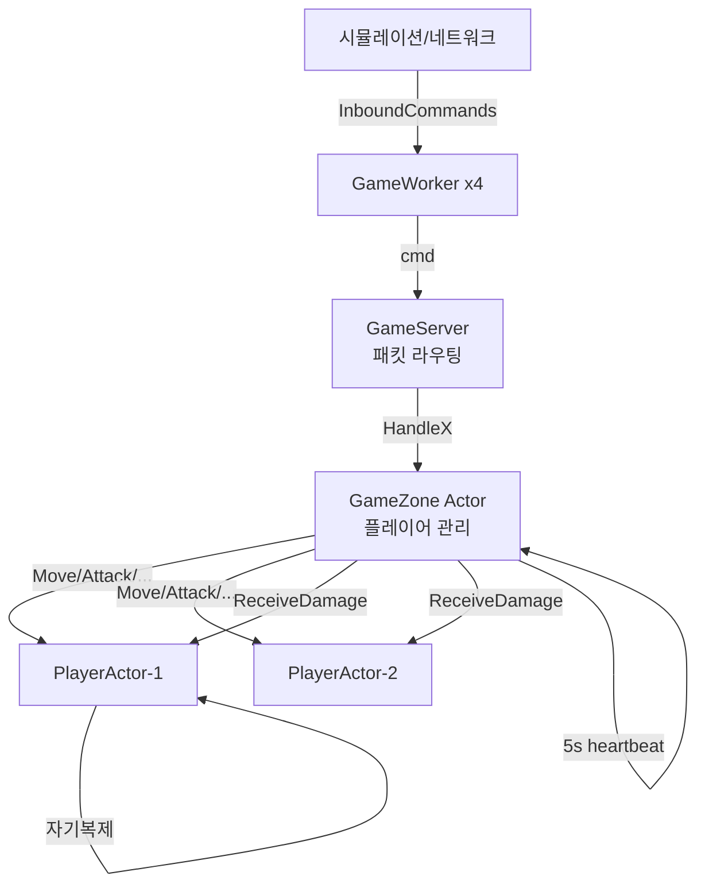

# Chapter 11: ExampleMmorpgServer — MMORPG 게임 서버

## 11.1 프로젝트 구조

```
ExampleMmorpgServer/
├── Program.cs          ← 시뮬레이션 진입점
├── GameServer.cs       ← 서버 컨테이너
├── GameWorker.cs       ← IRunnable 워커
├── GameZone.cs         ← 존 Actor (플레이어 집합)
├── PlayerActor.cs      ← 플레이어 단위 Actor
├── Player.cs           ← 플레이어 데이터 모델
├── Packets.cs          ← 패킷 정의
└── SpatialIndex.cs     ← 공간 인덱스 (범위 쿼리)
```

---

## 11.2 전체 구조



---

## 11.3 GameZone — 존 Actor

존의 핵심 역할은 **플레이어 관리**와 **공격 라우팅**입니다.

```csharp
public class GameZone : AsyncExecutable
{
    private readonly Dictionary<string, PlayerActor> _actors = [];
    public readonly SpatialIndex Spatial;

    // ── 플레이어 입장/퇴장 ────────────────────────────────

    public void EnterZone(Player player, float spawnX, float spawnY)
        => DoAsync(() => ProcessEnterZone(player, spawnX, spawnY));

    private void ProcessEnterZone(Player player, float spawnX, float spawnY)
    {
        // ① PlayerActor 생성 및 등록
        var actor = new PlayerActor(player, this);
        _actors[player.PlayerId] = actor;

        player.X = spawnX;
        player.Y = spawnY;
        Spatial.Add(player);  // 공간 인덱스에 추가

        // ② 자동 회복 시작
        actor.StartRegen();

        Console.WriteLine($"[존] {player.Name} 입장 ({spawnX:F1},{spawnY:F1})");
    }

    public void LeaveZone(string playerId)
        => DoAsync(() => ProcessLeaveZone(playerId));

    private void ProcessLeaveZone(string playerId)
    {
        if (!_actors.Remove(playerId, out var actor)) return;
        actor.Despawn();  // ← PlayerActor에게 Despawn 메시지 전달
        actor.DisposeAsync().AsTask().Wait();  // 큐 drain
    }
}
```

---

## 11.4 공격 처리 흐름 — Actor 간 메시지 패싱

근접 공격이 처리되는 과정을 단계별로 봅시다:

```csharp
// GameZone
public void HandleMeleeAttack(string attackerId, string targetId)
    => DoAsync(() => ProcessMeleeAttack(attackerId, targetId));

private void ProcessMeleeAttack(string attackerId, string targetId)
{
    // ① 공격자 Actor 찾기 (GameZone 큐 안 → _actors 안전)
    if (!_actors.TryGetValue(attackerId, out var attacker)) return;
    if (!_actors.TryGetValue(targetId, out _)) return;

    // ② 공격자 Actor에게 "공격해!" 메시지 전달
    attacker.MeleeAttack(targetId, meleeRange: 3.0f);
}

// PlayerActor
public void MeleeAttack(string targetId, float meleeRange)
    => DoAsync(() => ProcessMeleeAttack(targetId, meleeRange));

private void ProcessMeleeAttack(string targetId, float meleeRange)
{
    if (_despawned || !_player.IsAlive) return;

    // ③ 공격자 스냅샷 생성 (불변 데이터!)
    var snapshot = new AttackerSnapshot(
        _player.PlayerId, _player.Name,
        _player.X, _player.Y, _player.Attack);

    // ④ GameZone에게 데미지 전달 요청
    _zone.SendMeleeDamage(targetId, snapshot, meleeRange);
}

// GameZone
public void SendMeleeDamage(string targetId, AttackerSnapshot snapshot, float meleeRange)
    => DoAsync(() =>
    {
        // ⑤ 대상 Actor 찾기 (GameZone 큐 안 → 안전!)
        if (_actors.TryGetValue(targetId, out var target))
            target.ReceiveMeleeDamage(snapshot, meleeRange);
    });

// 대상 PlayerActor
public void ReceiveMeleeDamage(AttackerSnapshot attacker, float meleeRange)
    => DoAsync(() => ProcessReceiveMeleeDamage(attacker, meleeRange));

private void ProcessReceiveMeleeDamage(AttackerSnapshot attacker, float meleeRange)
{
    if (_despawned || !_player.IsAlive) return;

    float dist = _player.DistanceTo(attacker.X, attacker.Y);
    if (dist > meleeRange) return;  // ← 서버사이드 거리 검증!

    int damage = _player.TakeDamage(attacker.Attack);
    if (!_player.IsAlive)
        HandleDeath(attacker.Name);
}
```

전체 흐름:

```
클라이언트 패킷: ATTACK target=player2

GameWorker → server.HandleMeleeAttack("player1", "player2")
    │
    ▼
GameZone Actor 큐:
  ProcessMeleeAttack("player1", "player2")
  → attacker.MeleeAttack("player2", 3.0f)
    │
    ▼
PlayerActor-1(player1) 큐:
  ProcessMeleeAttack("player2", 3.0f)
  → 스냅샷 생성 (불변!)
  → zone.SendMeleeDamage("player2", snapshot, 3.0f)
    │
    ▼
GameZone Actor 큐:
  target = _actors["player2"]
  → target.ReceiveMeleeDamage(snapshot, 3.0f)
    │
    ▼
PlayerActor-2(player2) 큐:
  ProcessReceiveMeleeDamage(snapshot, 3.0f)
  → 거리 검증
  → TakeDamage()
  → HP 차감 (lock 없이!)
  → SendPacket("DAMAGE|50|30")
```

---

## 11.5 AttackerSnapshot — 불변 데이터의 중요성

```csharp
// 불변(readonly) 구조체 — 스레드 간 전달 안전!
public readonly record struct AttackerSnapshot(
    string PlayerId, string Name,
    float X, float Y, int Attack);
```

왜 스냅샷을 쓰나요?

```
직접 Player 객체 전달 시:

PlayerActor-1 큐에서:
  snap = player1 (직접 참조 전달)
  zone.SendMeleeDamage(playerId2, player1_ref, range)

GameZone 큐에서:
  target.ReceiveMeleeDamage(player1_ref, range)

PlayerActor-2 큐에서:
  player1_ref.X 읽기  ← 이 시점에 player1이 이동했을 수 있음!
  → Race Condition!

스냅샷 전달 시:

PlayerActor-1 큐에서:
  snap = new AttackerSnapshot(
      player1.X,  ← 지금 이 순간의 값을 복사!
      player1.Y,
      player1.Attack)

이후 player1이 어디로 이동해도 snap의 값은 변하지 않음
→ 완전 안전!
```

---

## 11.6 범위 공격 처리

```csharp
// 범위 공격 (AoE) 처리
public void AreaAttack(float centerX, float centerY, float radius, float maxCastRange)
    => DoAsync(() => ProcessAreaAttack(centerX, centerY, radius, maxCastRange));

private void ProcessAreaAttack(float centerX, float centerY, float radius, float maxCastRange)
{
    if (_despawned || !_player.IsAlive) return;

    // 시전 거리 검증
    float distToCenter = _player.DistanceTo(centerX, centerY);
    if (distToCenter > maxCastRange) return;

    var snapshot = new AttackerSnapshot(...);

    // GameZone에게 범위 데미지 fan-out 위임!
    _zone.DispatchAreaDamage(snapshot, centerX, centerY, radius);
}

// GameZone
public void DispatchAreaDamage(
    AttackerSnapshot attacker, float centerX, float centerY, float radius)
    => DoAsync(() => ProcessDispatchAreaDamage(attacker, centerX, centerY, radius));

private void ProcessDispatchAreaDamage(
    AttackerSnapshot attacker, float centerX, float centerY, float radius)
{
    // ① 공간 인덱스로 범위 내 플레이어 검색
    var targets = Spatial.QueryRange(centerX, centerY, radius);

    // ② 각 대상에게 AoE 데미지 전달
    foreach (var targetPlayer in targets)
    {
        if (_actors.TryGetValue(targetPlayer.PlayerId, out var targetActor))
        {
            targetActor.ReceiveAreaDamage(attacker, centerX, centerY, radius);
        }
    }
}
```

---

## 11.7 PlayerActor의 자기복제 Regen

```csharp
// 자동 회복 시작 (GameZone이 EnterZone 후 호출)
public void StartRegen() => DoAsync(RegenTick);

private void RegenTick()
{
    if (_despawned) return;  // ← Despawn 시 체인 자동 종료!

    if (_player.IsAlive && _player.Hp < _player.MaxHp)
    {
        int before = _player.Hp;
        _player.Hp = Math.Min(_player.MaxHp, _player.Hp + RegenAmount);
        int healed = _player.Hp - before;

        if (healed > 0)
        {
            _player.SendPacket?.Invoke($"HP_UPDATE|{_player.Hp}|{_player.MaxHp}");
        }
    }

    // 자기복제!
    DoAsyncAfter(RegenInterval, RegenTick);  // 3초 후 다시 실행
}
```

---

## 11.8 사망과 부활 처리

```csharp
// ReceiveMeleeDamage 안에서 호출됨 (자기 큐 안)
private void HandleDeath(string killerName)
{
    _player.SendPacket?.Invoke($"DEATH|{killerName}");

    // 5초 후 자동 부활 예약!
    DoAsyncAfter(RespawnDelay, ProcessRespawn);
}

private void ProcessRespawn()
{
    if (_despawned) return;

    float oldX = _player.X, oldY = _player.Y;
    _player.Hp = _player.MaxHp;
    _player.X = Random.Shared.NextSingle() * 200f;
    _player.Y = Random.Shared.NextSingle() * 200f;

    // 공간 인덱스 갱신
    _zone.Spatial.UpdatePosition(_player, oldX, oldY);

    _player.SendPacket?.Invoke($"RESPAWN|{_player.X:F1}|{_player.Y:F1}|{_player.Hp}");
}
```

사망 후 타임라인:

```
t=0:   ProcessReceiveMeleeDamage
         → HP = 0
         → HandleDeath() 호출 (직접, 큐 안)
         → DoAsyncAfter(5s, ProcessRespawn)

t=5s:  ProcessRespawn()
         → HP 회복
         → 위치 랜덤 배치
         → Spatial 갱신
         → 클라이언트에 RESPAWN 패킷

t=8s:  RegenTick() (3초 주기 자동 실행)
         → HP 30 회복...
```

---

## 11.9 SpatialIndex — 공간 인덱스

```csharp
public class SpatialIndex
{
    // 그리드 기반 공간 분할
    // 각 셀: ConcurrentDictionary (여러 스레드에서 동시 접근 가능)
    private readonly ConcurrentDictionary<(int cx, int cy), ConcurrentDictionary<string, Player>>
        _grid = new();

    // 범위 쿼리: centerX, centerY에서 radius 이내의 플레이어 목록
    public List<Player> QueryRange(float centerX, float centerY, float radius) { ... }

    // 위치 갱신: 셀이 바뀌면 이전 셀에서 제거 후 새 셀에 추가
    public void UpdatePosition(Player player, float oldX, float oldY) { ... }
}
```

왜 `ConcurrentDictionary`를 쓰나요?

```
SpatialIndex는 여러 Actor가 동시에 접근합니다:

PlayerActor-1 큐: UpdatePosition(player1, ...)
PlayerActor-2 큐: UpdatePosition(player2, ...)
GameZone 큐:      QueryRange(centerX, centerY, ...)

→ 각기 다른 스레드에서 동시 실행 가능
→ ConcurrentDictionary의 내부 버킷 lock이 경합 최소화
→ (개별 PlayerActor 내부 상태는 Actor 큐가 보호)
```

---

## 11.10 PrintStatus — GetSnapshot 패턴

```csharp
public void PrintStatus()
{
    var snap = _zone.GetSnapshot();

    Console.WriteLine("========== 서버 상태 ==========");
    Console.WriteLine($"[{snap.Name}] 플레이어: {snap.Players.Count}명");
    foreach (var p in snap.Players)
    {
        Console.WriteLine($"  - {p.Name} ({p.X:F1},{p.Y:F1}) " +
                          $"HP:{p.Hp}/{p.MaxHp} {(p.IsAlive ? "생존" : "사망")}");
    }
}
```

---

## 11.11 핵심 학습 포인트

```
MmorpgServer 예제에서:
✓ PlayerActor = 플레이어 단위 Actor (병렬!)
✓ GameZone Actor = 전체 존 관리 (직렬!)
✓ 공격 라우팅: 공격자 Actor → GameZone → 대상 Actor
✓ AttackerSnapshot = 불변 데이터로 안전한 스레드 간 전달
✓ 공간 인덱스: ConcurrentDictionary로 다중 Actor 접근 허용
✓ 자기복제: StartRegen, HandleDeath+DoAsyncAfter(부활)
✓ 서버사이드 검증: 거리, 이동 속도 등
✓ Despawn 시 자기복제 체인 자동 종료 (_despawned 체크)
```

---

*[← Chapter 10](./chapter10.md) | [→ Chapter 12: AdvancedMmorpgServer](./chapter12.md)*
