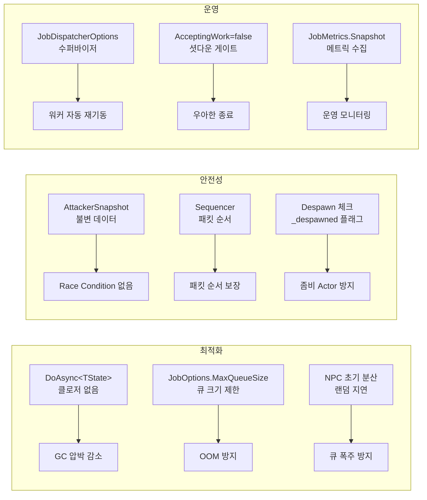

# Chapter 12: AdvancedMmorpgServer — 고급 패턴과 최적화

## 12.1 ExampleMmorpgServer와의 차이점

```
ExampleMmorpgServer          AdvancedMmorpgServer
────────────────────         ────────────────────────────────
기본 PlayerActor              DoAsync<TState>로 클로저 없음
기본 DoAsync만 사용           JobOptions로 큐 크기 제한
옵션 없는 JobDispatcher       JobDispatcherOptions로 supervisor 설정
NPC 없음                     NpcActor — AI tick 루프
Sequencer 없음                Sequencer로 세션별 패킷 순서 보장
설정 파일 없음                config.json으로 서버 설정
NetworkServer 없음            실제 TCP 네트워크 서버
```

---

## 12.2 GameServer — 셧다운 시퀀스

```csharp
public void Dispose()
{
    if (Interlocked.Exchange(ref _disposed, 1) != 0) return;

    // ① 신규 작업 차단
    AsyncExecutable.AcceptingWork = false;

    // ② 네트워크 정지 (IO 스레드 종료)
    _network.Stop();

    // ③ World drain (모든 Actor 종료 + 큐 비우기)
    _world.Stop();

    // ④ 워커 풀 정지
    _dispatcher?.Dispose();

    // ⑤ 비-워커 스레드의 Timer 정리
    TimerRegistry.DisposeAll();

    // 다음 인스턴스(테스트)를 위해 복구
    AsyncExecutable.AcceptingWork = true;
}
```

이 순서가 중요한 이유:

```
① AcceptingWork = false
   → 이후 DoAsync 호출은 모두 즉시 false 반환
   → 큐에 새 작업이 쌓이지 않음

② 네트워크 정지
   → IO 스레드가 Sequencer에 패킷 넣기 중단
   → 진행 중인 Drain은 완료됨

③ World drain
   → NpcActor들 Despawn + 큐 비우기
   → PlayerActor들 Despawn + 큐 비우기
   → 모든 큐가 빈 상태에서 워커 종료

④ 워커 풀 정지
   → CancellationToken 취소
   → 각 워커 Thread.Join (최대 5초)
```

---

## 12.3 NpcActor — AI tick 루프

NPC는 스스로 AI를 실행하는 Actor입니다.

```csharp
public sealed class NpcActor : AsyncExecutable
{
    // ★ 큐 크기 제한! 다수 공격자에게 동시 피격당해도 OOM 방지
    private const int NpcQueueCapacity = 128;

    public NpcActor(Npc npc, GameWorld world, TimeSpan tickInterval)
        : base(new JobOptions
        {
            MaxQueueSize = NpcQueueCapacity,
            DropPolicy = DropPolicy.Reject,
        })
    { ... }

    // ① Start: 첫 Tick 예약 (약간의 랜덤 지연으로 NPC들 분산)
    public void Start()
        => DoAsync<NpcActor>(static a => a.ProcessStart(), this);

    private void ProcessStart()
    {
        if (_despawned) return;
        // 0~tickInterval 사이 랜덤 지연 → NPC들이 같은 틱에 몰리지 않음
        var initial = TimeSpan.FromMilliseconds(
            Random.Shared.Next(0, (int)_tickInterval.TotalMilliseconds));
        DoAsyncAfter(initial, Tick);
    }

    // ② Tick: AI 메인 루프 (자기복제)
    private void Tick()
    {
        if (_despawned) return;
        if (_world.IsStopping) return;  // 서버 종료 시 체인 끊기

        if (!_npc.IsAlive)
        {
            // 사망 상태: tick 체인 끊고 Respawn에서 재시작
            return;
        }

        long now = NowMs();
        float dt = CalculateDt(now);

        switch (_state)
        {
            case AiState.Idle:   TickIdle(now, dt); break;
            case AiState.Chase:  TickChase(now, dt); break;
            case AiState.Attack: TickAttack(now, dt); break;
            case AiState.Flee:   TickFlee(now, dt); break;
        }

        // 자기복제 — 다음 틱 예약
        DoAsyncAfter(_tickInterval, Tick);
    }
}
```

---

## 12.4 AI 상태 머신

```
NPC AI 상태 전환:

                ┌─────────────────────────────┐
                │         IDLE                │
                │  (Wander / 플레이어 탐지)   │
                └──────────────┬──────────────┘
                               │ 플레이어 AggroRange 진입
                               ▼
                ┌─────────────────────────────┐
                │         CHASE               │◄──────────┐
                │  (플레이어 추적)            │           │
                └──────────────┬──────────────┘    공격   │
                               │ AttackRange 진입  범위 벗 │어남
                               ▼
                ┌─────────────────────────────┐
                │         ATTACK              │
                │  (공격 쿨다운마다 공격)     │
                └──────────────┬──────────────┘
                               │ HP < FleeThreshold
                               ▼
                ┌─────────────────────────────┐
                │         FLEE                │
                │  (4초간 도주)               │
                └──────────────┬──────────────┘
                               │ 4초 경과
                               ▼
                            IDLE로 복귀
```

코드로 보면:

```csharp
private void TickChase(long now, float dt)
{
    var target = _world.GetEntity(_targetId);
    if (target is null || !target.IsAlive)
    {
        _state = AiState.Idle; _targetId = -1; return;
    }

    float d = _npc.DistanceTo(target.X, target.Y);

    // 너무 멀어지면 포기
    if (d > _npc.AggroRange * ChaseGiveUpRangeFactor)
    {
        _state = AiState.Idle; _targetId = -1; return;
    }

    // 공격 범위 안에 들어왔으면 공격 상태로
    if (d <= _npc.AttackRange)
    {
        _state = AiState.Attack; return;
    }

    // 플레이어 방향으로 이동
    float dx = target.X - _npc.X, dy = target.Y - _npc.Y;
    float len = MathF.Sqrt(dx * dx + dy * dy);
    float step = _npc.MoveSpeed * dt;
    MoveTo(_npc.X + dx / len * step, _npc.Y + dy / len * step);
}
```

---

## 12.5 ReceiveDamage — DoAsync\<TState\> 최적화

```csharp
// ❌ 일반 방법 — 클로저 생성
public void ReceiveDamage_Slow(AttackerSnapshot atk, float meleeRange)
    => DoAsync(() => ProcessReceiveDamage(atk, meleeRange));
//             ↑ atk(8~24바이트), meleeRange 캡처 → 클로저 힙 할당!

// ✅ 최적화 방법 — 클로저 없음
public void ReceiveDamage(AttackerSnapshot atk, float meleeRange)
    => DoAsync<(NpcActor A, AttackerSnapshot Atk, float R)>(
        // static 람다 → 힙 할당 0
        static t => t.A.ProcessReceiveDamage(t.Atk, t.R),
        // ValueTuple → 스택 또는 Job<T> 풀
        (this, atk, meleeRange));
```

이게 중요한 이유:

```
NPC가 100마리, 매 틱 각 NPC가 1~5번 공격 받는다면:

초당 500~2500번 ReceiveDamage 호출

일반 방법:
  500~2500개의 클로저 객체 생성
  → GC 압박 → 게임 틱 불규칙

DoAsync<TState> 방법:
  Job<(NpcActor, AttackerSnapshot, float)> 풀에서 재사용
  → 0 추가 할당 → 부드러운 틱
```

---

## 12.6 PlayerActor — 이동 속도 검증

```csharp
private void ProcessMove(float newX, float newY)
{
    if (_despawned || !_player.IsAlive) return;

    float oldX = _player.X, oldY = _player.Y;

    // ★ 이동 속도 제한 — 속임 클라이언트 방어!
    float dx = newX - oldX, dy = newY - oldY;
    float dist = MathF.Sqrt(dx * dx + dy * dy);
    float maxStep = _player.MoveSpeed * 0.5f;  // 0.5초 분량

    if (dist > maxStep && dist > 0.0001f)
    {
        // 최대 이동 거리로 클리핑
        float k = maxStep / dist;
        newX = oldX + dx * k;
        newY = oldY + dy * k;
    }

    // 월드 경계 클리핑
    _player.X = Math.Clamp(newX, 0, _world.Width);
    _player.Y = Math.Clamp(newY, 0, _world.Height);

    _world.Spatial.UpdatePosition(_player, oldX, oldY);
}
```

---

## 12.7 GameWorld — Sequencer 활용

```csharp
// 세션 클래스에서 Sequencer 생성
public class PlayerSession
{
    private readonly Sequencer<byte[]> _packetSequencer;

    public PlayerSession(GameWorld world, int playerId)
    {
        _packetSequencer = new Sequencer<byte[]>(
            // 패킷 처리 핸들러
            handler: rawPacket => ProcessPacket(world, playerId, rawPacket),
            // 워커 큐에 drain 예약
            scheduleDrain: action => GameWorker.InboundCommands.Enqueue(action)
        );
    }

    // IO 스레드에서 호출
    public void OnRawPacketReceived(byte[] data)
    {
        _packetSequencer.Enqueue(data);
        // 즉시 반환! IO 스레드는 다음 패킷 받기 대기
    }
}
```

Sequencer 없이 직접 Enqueue하면:

```
IO Thread-1: Enqueue(EnterZone)  ─┐
IO Thread-2: Enqueue(Move)       ─┤→ GameWorker.InboundCommands
                                   │
                                   ▼  처리 순서: ???
                              [Move, EnterZone] (뒤집힐 수 있음!)

Sequencer 사용 시:

IO Thread-1: seq.Enqueue(EnterZone)  ← ConcurrentQueue에 순서대로
IO Thread-2: seq.Enqueue(Move)       ←
                                   │
                               CAS로 단 하나만 drain 권한
                                   │
                                   ▼  처리 순서 보장!
                              EnterZone → Move  (항상 이 순서)
```

---

## 12.8 config.json으로 서버 설정

```json
{
  "server": {
    "port": 9000,
    "workerThreads": 4
  },
  "world": {
    "name": "Azerion",
    "width": 500,
    "height": 500
  },
  "npc": {
    "totalCount": 200,
    "tickIntervalMs": 200,
    "respawnSeconds": 10
  }
}
```

```csharp
// ServerConfig.cs
public sealed class ServerConfig
{
    public ServerSection Server { get; init; } = new();
    public WorldSection World { get; init; } = new();
    public NpcSection Npc { get; init; } = new();
}

// GameServer 생성 시
var config = JsonSerializer.Deserialize<ServerConfig>(
    File.ReadAllText("config.json"))!;

var server = new GameServer(config);
server.Start();
```

---

## 12.9 NPC 초기 분산 전략

NPC 100마리가 동시에 첫 Tick을 실행하면 한꺼번에 워커 큐에 몰립니다.
`ProcessStart`에서 랜덤 지연으로 분산합니다:

```csharp
private void ProcessStart()
{
    if (_despawned) return;

    // 0 ~ tickInterval 사이 랜덤 지연
    var initial = TimeSpan.FromMilliseconds(
        Random.Shared.Next(0, (int)_tickInterval.TotalMilliseconds));

    DoAsyncAfter(initial, Tick);
}
```

200ms 틱 간격, NPC 200마리의 경우:

```
분산 없음:              분산 있음 (0~200ms 랜덤 지연):

t=0ms: 200개 NPC Tick  t=0ms:   1개 NPC
        → 큐 폭주!     t=10ms:  3개 NPC
                       t=20ms:  2개 NPC
                       ...
                       t=200ms: 1개 NPC  → 고르게 분산
```

---

## 12.10 고급 패턴 요약



---

## 12.11 핵심 학습 포인트

```
AdvancedMmorpgServer에서:
✓ DoAsync<TState>: hot path에서 클로저 할당 0
✓ JobOptions: NPC 128, Player 256으로 큐 제한
✓ JobDispatcherOptions: 수퍼바이저 + 지수 백오프
✓ NpcActor AI: 상태 머신 (Idle/Chase/Attack/Flee)
✓ NPC 분산: ProcessStart에서 랜덤 첫 틱 지연
✓ Sequencer: 세션별 패킷 순서 보장
✓ 이동 검증: 속도 제한으로 치팅 방어
✓ 셧다운 순서: AcceptingWork=false → Stop → Dispose → DisposeAll
```

---

*[← Chapter 11](./chapter11.md) | [→ Chapter 13: 실전 패턴과 모범 사례](./chapter13.md)*
