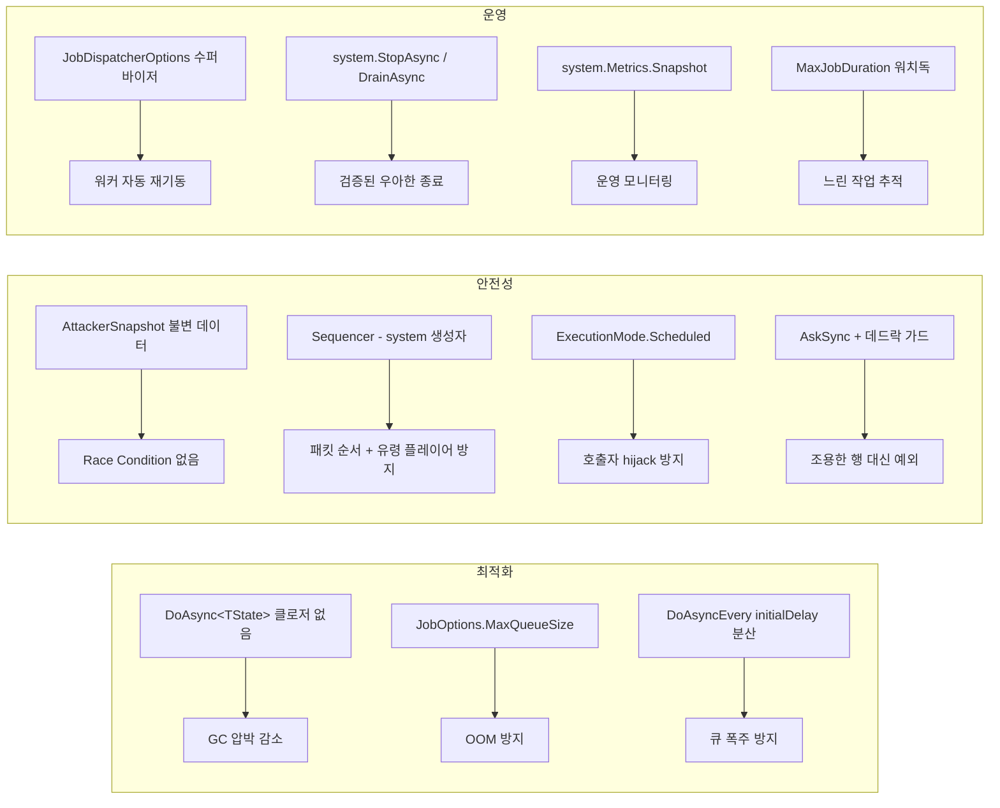

# Chapter 12: AdvancedMmorpgServer — 고급 패턴과 최적화

## 12.1 ExampleMmorpgServer와의 차이점

`AdvancedMmorpgServer` 는 v2.1 API 로 **이관이 끝난** 유일한 샘플입니다. 10·11장의 예제가
"예전 방식"의 기록이라면, 이 장은 "지금 권장하는 방식"입니다.

```
ExampleMmorpgServer (v2.0 스타일)   AdvancedMmorpgServer (v2.1)
────────────────────────────────   ──────────────────────────────────────────
기본 PlayerActor                    DoAsync<TState>로 클로저 없음
옵션 없는 JobDispatcher<GameWorker>  JobSystem + 비제네릭 JobDispatcher
GameWorker.cs (IRunnable +          GameWorker.cs 삭제 — 워커 루프 자체가 없음
  InboundCommands + Sleep(1))
NPC 없음                            NpcActor — DoAsyncEvery 로 도는 AI tick
Sequencer 없음                      Sequencer(system, ...) 로 세션별 순서 보장
자기복제 타이머 + _despawned 플래그   ITimerHandle 보관 → Despawn 시 Cancel()
ManualResetEventSlim 스냅샷          AskSync 스냅샷
4단계 수동 셧다운 + Thread.Sleep(200) system.StopAsync / DrainAsync
설정 파일 없음                       config.json (포트 25100)
NetworkServer 없음                   실제 TCP 네트워크 서버
```

---

## 12.2 GameServer — JobSystem 소유와 셧다운

이 서버는 **자기만의 `JobSystem`** 을 만듭니다. 워커·타이머 스레드·메트릭·셧다운 게이트가
전부 그 안에 들어 있으므로, 종료가 한 줄이 됩니다.

```csharp
public sealed class GameServer : IDisposable
{
    private readonly JobSystem _system;
    private readonly GameWorld _world;
    private readonly NetworkServer _network;
    private JobDispatcher? _dispatcher;

    public GameServer(ServerConfig config)
    {
        _config = config;

        // 이 서버의 워커·타이머·메트릭을 소유하는 시스템 하나.
        _system = new JobSystem(new JobSystemOptions
        {
            Name = "game",
            TimerPrecision = TimerPrecision.Coarse,
            MaxJobDuration = TimeSpan.FromMilliseconds(50),   // 50ms 넘는 작업은 경고
        });

        _world = new GameWorld(config, _system);
        _network = new NetworkServer(this, config.Server.Port);
    }

    public void Start()
    {
        // 사용자 루프가 없는 비제네릭 디스패처: 워커는 할 일이 없으면 시그널을 기다린다.
        // 예전에 필요했던 IRunnable + Thread.Sleep(1) 워커는 사라졌다.
        _dispatcher = new JobDispatcher(_config.Server.WorkerThreads, new JobDispatcherOptions
        {
            System = _system,
            RestartFailedWorkers = true,
            MaxRestartsPerWorker = 5,
            RestartBackoff = TimeSpan.FromSeconds(1),
        });
        _ = _dispatcher.RunWorkerThreadsAsync();

        _world.SpawnInitialNpcs();
        _network.Start();
    }

    public void Dispose()
    {
        if (Interlocked.Exchange(ref _disposed, 1) != 0) return;

        // ① 외부 입력 차단. 내부 종료 작업은 아직 actor 들이 필요하다.
        _network.Stop();

        // ② 전부 despawn + 타이머 체인 취소 → 시스템이 정적 상태에 도달할 수 있게 만든다.
        _world.Stop();

        // ③ 남은 것을 드레인하고, 타이머 스레드와 워커를 정지.
        var drained = _system.StopAsync(TimeSpan.FromSeconds(10)).GetAwaiter().GetResult();
        if (!drained)
            JobLog.Warn("[Server] some work was still in flight at shutdown");

        _system.Dispose();
    }
}
```

이 순서가 중요한 이유:

```
① 네트워크 정지
   → IO 스레드가 Sequencer 에 새 패킷을 넣지 않는다
   → 이미 들어온 패킷과 disconnect 마커는 그대로 처리된다 (7.6)

② World.Stop
   → 모든 NpcActor / PlayerActor 에 Despawn 전송
   → 각 actor 가 자기 타이머 핸들을 Cancel()
   → ★ 이게 없으면 주기 타이머가 계속 새 작업을 만들어 드레인이 끝나지 않는다

③ system.StopAsync
   → in-flight 작업 + ready 큐 + 대기 타이머가 0 이 될 때까지 대기
   → AcceptingWork = false
   → 타이머 스레드 정지
   → 이 시스템에 붙은 디스패처들 정지 (워커 Join)
```

> **v2.0 에서는 이랬다**
> ```csharp
> AsyncExecutable.AcceptingWork = false;   // 프로세스 전역 static
> _network.Stop();
> _world.Stop();                            // 내부에 Thread.Sleep(200)
> _dispatcher?.Dispose();
> TimerRegistry.DisposeAll();
> AsyncExecutable.AcceptingWork = true;     // 다음 인스턴스(테스트)를 위해 복구 ←?!
> ```
> 마지막 줄이 전역 static 게이트의 어색함을 그대로 보여줍니다. 프로세스에 서버가 둘이면
> 서로의 셧다운을 건드리게 되죠. 지금은 게이트가 `JobSystem` 안에 있어 복구가 필요 없습니다.

---

## 12.3 GameWorld — Scheduled 모드와 드레인

```csharp
public sealed class GameWorld : AsyncExecutable
{
    private const int WorldQueueCapacity = 10_000;

    public GameWorld(ServerConfig cfg, JobSystem system)
        : base(new JobOptions
        {
            Name = "World",
            System = system,
            MaxQueueSize = WorldQueueCapacity,
            DropPolicy = DropPolicy.Reject,

            // 월드는 콘솔 스레드(status/metrics)에서도 찔린다. Scheduled 모드로 두면
            // 그런 호출자가 월드의 leader 가 되어 비-워커 스레드에서 게임 로직을 돌리는 일이 없다.
            Mode = ExecutionMode.Scheduled,

            OnDropped = static (actor, reason) => JobLog.Warn(
                $"[World] job refused ({reason}), queue={actor.RemainingTaskCount}"),
        })
    { ... }
}
```

`Mode = ExecutionMode.Scheduled` 는 v2.1 에서 추가된 옵션입니다 (3.3). 이 한 줄이
"첫 호출자가 그 자리에서 actor 를 돌린다"는 기본 동작의 부작용 —
**호출자 hijack** — 을 막습니다.

### Stop — Thread.Sleep 대신 실제 드레인

```csharp
public void Stop()
{
    _isStopping = true;

    DoAsync(static w =>
    {
        foreach (var s in w._sessions.Values) s.Close();
        w._sessions.Clear();
        foreach (var na in w._npcs.Values)    na.Despawn();   // 내부에서 tick 타이머 Cancel
        foreach (var pa in w._players.Values) pa.Despawn();   // 내부에서 resync 타이머 Cancel
    }, this);

    // despawn 과 그로 인해 파생된 작업이 전부 끝날 때까지 기다린다.
    if (!System.DrainAsync(TimeSpan.FromSeconds(5)).GetAwaiter().GetResult())
        JobLog.Warn("[World] world did not fully quiesce before shutdown");
}
```

```
v2.0:  Thread.Sleep(200);        // "이 정도면 되겠지"
v2.1:  System.DrainAsync(5s)     // in-flight == 0 && ready == 0 && pendingTimers == 0
                                 // 실제로 정적 상태가 됐는지 확인하고, 안 되면 경고
```

### GetSnapshot — AskSync

```csharp
/// <summary>월드 자기 큐에서 계산되는 일관된 읽기.</summary>
public WorldSnapshot GetSnapshot()
{
    try
    {
        return AskSync(BuildSnapshot, TimeSpan.FromSeconds(2));
    }
    catch (TimeoutException)
    {
        JobLog.Warn("[World] snapshot timed out");
        return new WorldSnapshot(0, 0, 0, 0, 0, RemainingTaskCount);
    }
}
```

`AskSync` 는 actor 작업 안에서 호출되면 예외를 던지므로(`JobDiagnostics.GuardBlockingWait`),
이 메서드가 "워커를 멈춰 세우고 actor 를 기다리는" 데드락이 되는 일은 구조적으로 없습니다.
예전 샘플의 `ManualResetEventSlim` + `ev.Wait()` 조합은 같은 실수를 조용한 행으로 만들었습니다.

---

## 12.4 NpcActor — DoAsyncEvery 로 도는 AI tick

NPC는 스스로 AI를 실행하는 Actor입니다.

```csharp
public sealed class NpcActor : AsyncExecutable
{
    private const int NpcQueueCapacity = 128;   // tick 1개 + 다수 공격자 피격 흡수

    private volatile bool _despawned;
    private ITimerHandle? _tickTimer;      // ★ AI tick 핸들
    private ITimerHandle? _respawnTimer;   // ★ 부활 타이머 핸들

    public NpcActor(Npc npc, GameWorld world, TimeSpan tickInterval)
        : base(new JobOptions
        {
            Name = $"Npc#{npc.Id}",
            System = world.System,
            MaxQueueSize = NpcQueueCapacity,
            DropPolicy = DropPolicy.Reject,
        })
    { ... }

    // ① Start: 자기 큐 안에서 주기 타이머를 무장한다
    public void Start()
        => DoAsync<NpcActor>(static a => a.ProcessStart(), this);

    private void ProcessStart()
    {
        if (_despawned) return;

        // 첫 틱을 0~interval 사이로 흩어서 NPC 50마리가 같은 ms 에 몰리지 않게 한다
        var jitter = TimeSpan.FromMilliseconds(
            Random.Shared.Next(0, Math.Max(1, (int)_tickInterval.TotalMilliseconds)));

        _tickTimer = DoAsyncEvery(_tickInterval, Tick, jitter);
    }

    // ② Tick: AI 메인 루프 — 재예약 코드가 없다!
    private void Tick()
    {
        if (_despawned) return;
        if (_world.IsStopping) return;
        if (!_npc.IsAlive) return;      // 죽은 NPC 는 그냥 아무것도 안 한다

        long now = NowMs();
        float dt = ...;

        switch (_state)
        {
            case AiState.Idle:   TickIdle(now, dt); break;
            case AiState.Chase:  TickChase(now, dt); break;
            case AiState.Attack: TickAttack(now, dt); break;
            case AiState.Flee:   TickFlee(now, dt); break;
        }
    }

    // ③ Despawn: 플래그가 아니라 실제 취소
    private void ProcessDespawn()
    {
        if (_despawned) return;
        _despawned = true;

        _tickTimer?.Cancel();
        _respawnTimer?.Cancel();

        Aoi.LeaveWorldNpc(_world.Spatial, _npc);
    }
}
```

### 자기복제 → 주기 타이머로 바꾸면서 사라진 문제들

```
v2.0 (Tick 마지막 줄에서 DoAsyncAfter(_tickInterval, Tick)):

  ① Tick 안에서 예외가 한 번 나면 → 재예약 줄에 도달 못 함 → 그 NPC 영구 정지
  ② 죽었을 때 체인을 끊고, Respawn 에서 다시 시작해야 했다 (상태 두 벌 관리)
  ③ 종료 시 _despawned 플래그로 "발화는 하되 무시" → 타이머가 계속 작업을 만든다
  ④ 워커가 크래시로 재기동되면 그 스레드에 걸린 tick 체인이 통째로 사라졌다 (P0-2)

v2.1 (DoAsyncEvery + ITimerHandle):

  ① 예외가 나도 다음 틱이 온다
  ② 죽으면 Tick 이 곧바로 return 할 뿐, 체인은 계속 돈다 → Respawn 이 재무장할 필요 없음
  ③ Despawn 에서 Cancel() → 진짜로 멈춘다 → DrainAsync 가 끝난다
  ④ 타이머는 시스템 소유 스레드에 있으므로 워커 재기동과 무관하다
```

`Respawn` 에 재무장 코드가 없다는 점을 확인해 보세요:

```csharp
private void Respawn()
{
    if (_despawned) return;
    _npc.Hp = _npc.MaxHp;
    ...
    // 주기 tick 은 계속 돌고 있었고, 죽어 있는 동안 아무것도 하지 않았을 뿐이다.
    // 다시 무장할 것이 없다.
}
```

---

## 12.5 AI 상태 머신

```
NPC AI 상태 전환:

                ┌─────────────────────────────┐
                │         IDLE                │
                │  (Wander / 플레이어 탐지)   │
                └──────────────┬──────────────┘
                               │ 플레이어 AggroRange 진입
                               ▼
                ┌─────────────────────────────┐
                │         CHASE               │◄──────────┐
                │  (플레이어 추적)            │           │
                └──────────────┬──────────────┘    공격   │
                               │ AttackRange 진입  범위 벗 │어남
                               ▼
                ┌─────────────────────────────┐
                │         ATTACK              │
                │  (공격 쿨다운마다 공격)     │
                └──────────────┬──────────────┘
                               │ HP < FleeHpRatio
                               ▼
                ┌─────────────────────────────┐
                │         FLEE                │
                │  (4초간 도주)               │
                └──────────────┬──────────────┘
                               │ 4초 경과
                               ▼
                            IDLE로 복귀
```

코드로 보면:

```csharp
private void TickChase(long now, float dt)
{
    var target = _world.GetEntity(_targetId);
    if (target is null || !target.IsAlive)
    {
        _state = AiState.Idle; _targetId = -1; return;
    }

    float d = _npc.DistanceTo(target.X, target.Y);

    // 너무 멀어지면 포기
    if (d > _npc.AggroRange * ChaseGiveUpRangeFactor)
    {
        _state = AiState.Idle; _targetId = -1; return;
    }

    // 공격 범위 안에 들어왔으면 공격 상태로
    if (d <= _npc.AttackRange)
    {
        _state = AiState.Attack; return;
    }

    // 플레이어 방향으로 이동
    float dx = target.X - _npc.X, dy = target.Y - _npc.Y;
    float len = MathF.Sqrt(dx * dx + dy * dy);
    if (len < 0.001f) return;
    float step = _npc.MoveSpeed * dt;
    MoveTo(_npc.X + dx / len * step, _npc.Y + dy / len * step);
}
```

---

## 12.6 ReceiveDamage — DoAsync\<TState\> 최적화

```csharp
// ❌ 일반 방법 — 클로저 생성
public void ReceiveDamage_Slow(AttackerSnapshot atk, float meleeRange)
    => DoAsync(() => ProcessReceiveDamage(atk, meleeRange));
//             ↑ this, atk, meleeRange 캡처 → 클로저 힙 할당!

// ✅ 최적화 방법 — 클로저 없음
public void ReceiveDamage(AttackerSnapshot atk, float meleeRange)
    => DoAsync<(NpcActor A, AttackerSnapshot Atk, float R)>(
        // static 람다 → 힙 할당 0
        static t => t.A.ProcessReceiveDamage(t.Atk, t.R),
        // ValueTuple → Job<T> 풀에서 재사용
        (this, atk, meleeRange));
```

이게 중요한 이유:

```
NPC가 50마리, 매 틱 각 NPC가 1~5번 공격 받는다면:

초당 250~1250번 ReceiveDamage 호출

일반 방법:
  그만큼의 클로저 객체 생성
  → GC 압박 → 게임 틱 불규칙

DoAsync<TState> 방법:
  Job<(NpcActor, AttackerSnapshot, float)> 풀에서 재사용
  → 0 추가 할당 → 부드러운 틱
```

거부됐을 때도 `Job` 은 풀로 돌아옵니다 (4.9). NPC 큐가 128 로 제한되어 있어 몰매를 맞는
NPC 는 실제로 거부가 발생하는데, 그 경로에서 풀이 새지 않습니다.

---

## 12.7 PlayerActor — 이동 속도 검증과 AOI 타이머

```csharp
private void ProcessMove(float newX, float newY)
{
    if (_despawned || !_player.IsAlive) return;

    var oldX = _player.X;
    var oldY = _player.Y;

    // ★ 이동 속도 제한 — 속임 클라이언트 방어!
    var dx = newX - oldX, dy = newY - oldY;
    var dist = MathF.Sqrt(dx * dx + dy * dy);
    var maxStep = _player.MoveSpeed * 0.5f;   // 0.5초 분량

    if (dist > maxStep && dist > 0.0001f)
    {
        var k = maxStep / dist;               // 최대 이동 거리로 클리핑
        newX = oldX + dx * k;
        newY = oldY + dy * k;
    }

    // 월드 경계 클리핑
    _player.X = Math.Clamp(newX, 0, _world.Width);
    _player.Y = Math.Clamp(newY, 0, _world.Height);

    Aoi.PlayerMoved(_world.Spatial, _player, oldX, oldY);   // 섹터 이동 + 시야 갱신
}
```

AOI 재동기화도 주기 타이머입니다:

```csharp
private void ProcessEnterWorld()
{
    if (_despawned) return;
    Aoi.EnterWorld(_world.Spatial, _player);

    // 자기 재예약 대신 주기 타이머 하나. Despawn 에서 핸들 하나만 취소하면 된다.
    if (_world.AoiResyncInterval > TimeSpan.Zero)
        _resyncTimer = DoAsyncEvery(_world.AoiResyncInterval, ResyncTick);
}
```

---

## 12.8 세션 — Sequencer 가 워커 풀에 직접 예약

```csharp
public sealed class ClientSession
{
    private readonly Sequencer<string> _packetSequencer;

    public ClientSession(long connId, TcpClient tcp, GameServer server, ...)
    {
        // ★ JobSystem 을 넘기는 생성자 — drain 이 system.Post 로 워커에 예약된다.
        //   예전에 필요했던 수동 InboundCommands 큐가 사라졌다.
        _packetSequencer = new Sequencer<string>(
            server.System,
            handler: HandleOnePacket,
            onError: ex => JobLog.Error($"[session #{connId}] packet handling failed", ex));
    }

    // 수신 IO 스레드 — push 만 하고 즉시 반환
    private void RecvLoop()
    {
        // ... 개행 단위로 파싱
        _packetSequencer.Enqueue(line);
    }

    // 워커 스레드 — 도착 순서대로, 세션당 한 번에 하나씩
    private void HandleOnePacket(string line)
    {
        if (ReferenceEquals(line, DisconnectMarker))
        {
            if (PlayerId != 0)
                _server.World.RemovePlayer(PlayerId);
            return;
        }
        PacketHandler.Handle(_server, this, line);
    }
}
```

```
IO Thread (NetRecv-N)          워커 풀
       │                          │
       │ Enqueue(line)            │
       ▼                          │
  Sequencer ──CAS 1회──► system.Post(Drain) ──► 워커가 Drain 실행
                                                  handler(line1)
                                                  handler(line2)   ← 도착 순서 보장
                                                  ...
                                                     │
                                                     ▼
                                            world.HandleClientMove(...)
                                                     │
                                                     ▼
                                             PlayerActor 큐
```

### 유령 플레이어를 막는 disconnect 마커

```csharp
private void HandleDisconnect()
{
    if (Interlocked.Exchange(ref _closeNotified, 1) != 0) { Close(); return; }

    // 이미 도착한 패킷들 뒤에 마커를 넣는다 → RemovePlayer 가 마지막에 실행된다
    if (!_packetSequencer.Enqueue(DisconnectMarker) && PlayerId != 0)
    {
        // false = 이미 Stop 된 sequencer (서버 셧다운) → 직접 정리
        _server.World.RemovePlayer(PlayerId);
    }

    Close();   // 내부에서 _packetSequencer.Stop()
}
```

`Close()` 는 곧바로 `Stop()` 을 부릅니다. v2.0 에서는 이 조합이 **마커를 잃을 수 있었고**
(P0-4, 7.6), 그 결과 접속이 끊긴 플레이어가 월드에 남았습니다. 지금은 `Stop()` 이
"새 항목만 거부"이므로 마커는 반드시 처리됩니다. 그리고 `Enqueue` 의 반환값을 확인해
거부된 경우의 대체 경로까지 두었습니다.

---

## 12.9 config.json으로 서버 설정

```json
{
  "server": {
    "port": 25100,
    "workerThreads": 8,
    "aoiResyncIntervalMs": 3000
  },
  "world": {
    "name": "AdvancedField",
    "width": 1000.0,
    "height": 1000.0,
    "spatialCellSize": 64.0
  },
  "npc": {
    "totalCount": 50,
    "tickIntervalMs": 200,
    "respawnSeconds": 8.0,
    "types": [ { "kind": "Slime", "weight": 4, "maxHp": 60, ... } ]
  }
}
```

```csharp
var config = ServerConfig.Load(configPath);   // 기본 "config.json"
var server = new GameServer(config);
server.Start();
```

> 포트가 9100 에서 **25100** 으로 바뀌었습니다. 이 저장소의 개발용 포트 대역
> (TCP 25001–25199) 규칙에 맞춘 것으로, 테스트 클라이언트도 같은 포트를 씁니다.

---

## 12.10 NPC 초기 분산 전략

NPC 50마리가 동시에 첫 Tick을 실행하면 한꺼번에 워커 큐에 몰립니다.
`DoAsyncEvery` 의 `initialDelay` 인자로 분산합니다:

```csharp
var jitter = TimeSpan.FromMilliseconds(
    Random.Shared.Next(0, Math.Max(1, (int)_tickInterval.TotalMilliseconds)));

_tickTimer = DoAsyncEvery(_tickInterval, Tick, jitter);
//                        ↑ 주기       ↑ 첫 발화까지의 지연
```

200ms 틱 간격, NPC 50마리의 경우:

```
분산 없음:              분산 있음 (0~200ms 랜덤 initialDelay):

t=0ms: 50개 NPC Tick    t=3ms:   1개 NPC
        → 큐 폭주!      t=11ms:  1개 NPC
                        t=24ms:  2개 NPC
                        ...
                        t=198ms: 1개 NPC  → 고르게 분산

한 번 분산되면 그 위상이 계속 유지된다 —
주기 타이머는 "예정 시각 + period" 로 재무장하므로 드리프트가 없다 (5.5).
```

---

## 12.11 콘솔 명령 — 상태와 메트릭

```csharp
static void PrintStatus(GameServer s)
{
    var snap = s.World.GetSnapshot();     // AskSync — 월드 큐에서 계산된 일관 스냅샷
    Console.WriteLine($"[상태] 세션 {snap.SessionCount} / 플레이어 {snap.LivePlayerCount}/{snap.TotalPlayerCount} " +
                      $"/ NPC {snap.LiveNpcCount}/{snap.TotalNpcCount} / WorldQueue {snap.WorldQueueDepth}");
}

static void PrintMetrics(GameServer s)
{
    var m = s.System.Metrics.Snapshot();  // ★ 인스턴스 메트릭
    Console.WriteLine(
        $"[metrics] executed={m.TotalJobsExecuted} dropped={m.TotalJobsDropped} failed={m.TotalJobsFailed} " +
        $"inFlight={m.InFlightJobs} pendingTimers={m.PendingTimerJobs} ready={m.ReadyQueueDepth} " +
        $"jobPool={m.ActiveJobPoolSize} workers={m.LiveWorkers} restarts={m.WorkerRestarts}");
}
```

이 두 명령은 콘솔 입력 스레드(비-워커)에서 실행됩니다. `GetSnapshot` 이 `AskSync` 이고
월드가 `ExecutionMode.Scheduled` 이므로, 콘솔 스레드가 게임 로직을 실행하는 일은 없습니다.

---

## 12.12 고급 패턴 요약


```mermaid
graph LR
    subgraph 최적화
        A1[DoAsync&lt;TState&gt; 클로저 없음] --> O1[GC 압박 감소]
        A2[JobOptions.MaxQueueSize] --> O2[OOM 방지]
        A3[DoAsyncEvery initialDelay 분산] --> O3[큐 폭주 방지]
    end
    subgraph 안전성
        B1[AttackerSnapshot 불변 데이터] --> S1[Race Condition 없음]
        B2[Sequencer - system 생성자] --> S2[패킷 순서 + 유령 플레이어 방지]
        B3[ExecutionMode.Scheduled] --> S3[호출자 hijack 방지]
        B4[AskSync + 데드락 가드] --> S4[조용한 행 대신 예외]
    end
    subgraph 운영
        C1[JobDispatcherOptions 수퍼바이저] --> M1[워커 자동 재기동]
        C2[system.StopAsync / DrainAsync] --> M2[검증된 우아한 종료]
        C3[system.Metrics.Snapshot] --> M3[운영 모니터링]
        C4[MaxJobDuration 워치독] --> M4[느린 작업 추적]
    end
```

---

## 12.13 핵심 학습 포인트

```
AdvancedMmorpgServer에서:
✓ JobSystem 하나가 워커·타이머·메트릭·셧다운 게이트를 소유한다
✓ 비제네릭 JobDispatcher — IRunnable 도, InboundCommands 도, Sleep(1) 도 없다
✓ ExecutionMode.Scheduled 로 비-워커 호출자의 hijack 차단
✓ DoAsync<TState>: hot path에서 클로저 할당 0
✓ JobOptions: World 10,000 / Player 256 / NPC 128 로 큐 제한 + OnDropped(reason)
✓ NpcActor AI: DoAsyncEvery 로 도는 상태 머신, Despawn 에서 Cancel()
✓ Sequencer(system, ...): 세션별 패킷 순서 + disconnect 마커 보장
✓ AskSync: 데드락 가드가 붙은 일관 스냅샷
✓ 셧다운: 네트워크 정지 → World.Stop(취소+드레인) → system.StopAsync
✓ 포트는 개발 대역 25100
```

---

*[← Chapter 11](./chapter11.md) | [→ Chapter 13: 실전 패턴과 모범 사례](./chapter13.md)*
