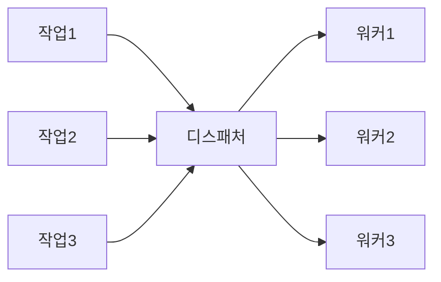
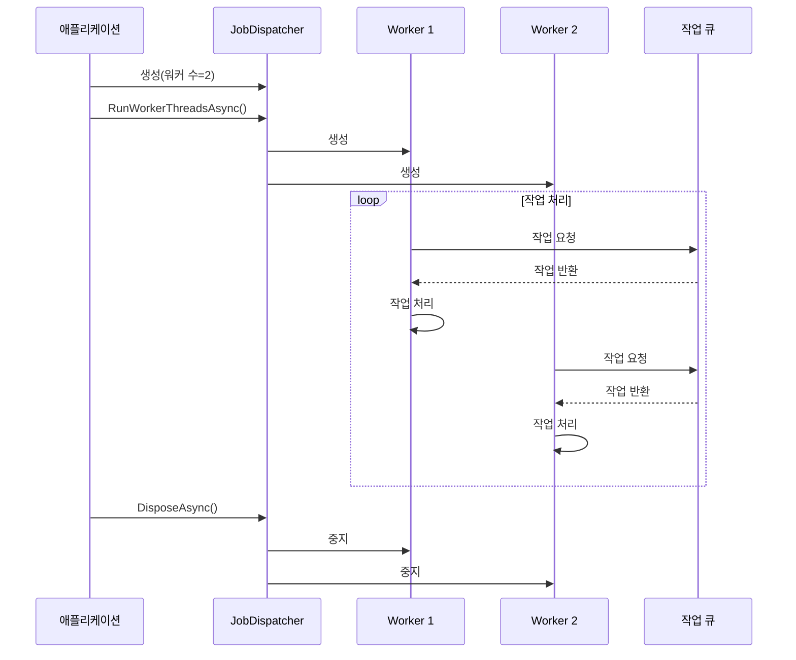

# Chapter 1. 작업 디스패처(JobDispatcher)

## 소개
안녕하세요! 이 장에서는 `JobDispatcherNET` 라이브러리의 핵심 구성 요소인 **작업 디스패처(JobDispatcher)**에 대해 알아보겠습니다. 복잡한 내용이 많이 포함되어 있지만, 최대한 쉽게 설명드리겠습니다.

## 작업 디스패처란 무엇인가요?
작업 디스패처는 프로그램에서 여러 작업을 효율적으로 처리하기 위한 도구입니다. 실생활의 비유를 들자면, 콜센터를 상상해 보세요:

- 콜센터에는 여러 통화(작업)가 동시에 들어옵니다
- 관리자(디스패처)는 이 통화들을 여러 상담원(워커 스레드)에게 배정합니다
- 각 상담원은 자신에게 배정된 통화를 처리합니다

작업 디스패처도 이와 같이 작동합니다. 프로그램에서 여러 작업이 동시에 발생할 때, 작업 디스패처는 이 작업들을 여러 워커 스레드에 분배하여 효율적으로 처리합니다.



## 왜 작업 디스패처가 필요한가요?
프로그램에서 여러 작업을 처리해야 할 때, 크게 두 가지 방법이 있습니다:

1. **순차적 처리**: 작업을 하나씩 차례대로 처리
2. **병렬 처리**: 여러 작업을 동시에 처리

순차적 처리는 간단하지만, 한 작업이 오래 걸리면 전체 프로그램이 느려집니다. 반면 병렬 처리는 여러 작업을 동시에 진행할 수 있어 효율적이지만, 구현이 복잡합니다.

작업 디스패처는 이러한 병렬 처리의 복잡성을 숨기고, 개발자가 쉽게 병렬 처리를 구현할 수 있도록 도와줍니다.
  

## JobDispatcher 클래스 이해하기
`JobDispatcher`는 제네릭 클래스로, 특정 타입의 워커를 생성하고 관리합니다. 코드를 간단히 살펴보겠습니다:

```csharp
public sealed class JobDispatcher<T> : IAsyncDisposable where T : IRunnable, new()
{
    private readonly int _workerCount;
    private readonly List<Task> _workerTasks = new();
    private readonly CancellationTokenSource _cts = new();
    
    public JobDispatcher(int workerCount)
    {
        _workerCount = workerCount;
    }
    // 나머지 코드...
}
```

여기서 `T`는 워커의 타입을 나타내며, `IRunnable` 인터페이스를 구현해야 합니다. 생성자에서는 워커의 수를 지정합니다.
  

## 작업 디스패처 사용하기
작업 디스패처를 사용하는 간단한 예제를 살펴보겠습니다:

```csharp
// 1. 작업 디스패처 생성 (4개의 워커)
var dispatcher = new JobDispatcher<MyWorker>(4);

// 2. 워커 스레드 실행
await dispatcher.RunWorkerThreadsAsync();

// 3. 작업 완료 후 정리
await dispatcher.DisposeAsync();
```

위 코드에서:
1. 4개의 `MyWorker` 타입 워커를 관리하는 디스패처를 생성합니다
2. 워커 스레드를 시작합니다
3. 모든 작업이 완료되면 정리합니다
  

## 워커 구현하기
작업 디스패처를 사용하려면 `IRunnable` 인터페이스를 구현하는 워커 클래스가 필요합니다. 간단한 예제를 살펴보겠습니다:

```csharp
public class MyWorker : IRunnable
{
    public async Task<bool> RunAsync(CancellationToken token)
    {
        // 대기 중인 작업이 있는지 확인
        var job = JobQueue.GetNextJob();
        
        if (job != null)
        {
            // 작업 처리
            await ProcessJobAsync(job);
            return true;
        }
        
        return true; // 계속 실행
    }
}
```

이 워커는:
1. 대기 중인 작업이 있는지 확인합니다
2. 작업이 있으면 처리합니다
3. 작업 처리 여부와 관계없이 `true`를 반환하여 계속 실행됩니다
  

## 내부 구현 살펴보기
작업 디스패처가 내부적으로 어떻게 작동하는지 자세히 살펴보겠습니다:



주요 구현 단계는 다음과 같습니다:
1. `RunWorkerThreadsAsync` 메서드에서 지정된 수의 워커 스레드를 생성합니다:

```csharp
public async Task RunWorkerThreadsAsync()
{
    for (int i = 0; i < _workerCount; i++)
    {
        _workerTasks.Add(RunWorkerAsync());
    }

    await Task.WhenAll(_workerTasks);
}
```

2. 각 워커 스레드는 `RunWorkerAsync` 메서드에서 실행됩니다:

```csharp
private async Task RunWorkerAsync()
{
    await using var runner = new T();

    try
    {
        while (!_cts.Token.IsCancellationRequested)
        {
            bool shouldContinue = await runner.RunAsync(_cts.Token);
            if (!shouldContinue)
                break;

            await Task.Delay(1, _cts.Token);
        }
    }
    catch (OperationCanceledException) when (_cts.Token.IsCancellationRequested)
    {
        // 정상적인 취소, 무시
    }
}
```

이 코드는:
- 새 워커(T 타입)를 생성합니다
- 취소 요청이 없는 한 계속해서 워커의 `RunAsync` 메서드를 호출합니다
- 워커가 `false`를 반환하면 루프를 종료합니다
- 작은 지연을 두어 CPU 사용량을 줄입니다
  

## 실제 사용 예: 채팅 서버
실제 응용 프로그램에서 작업 디스패처를 어떻게 사용하는지 살펴보겠습니다. 채팅 서버 예제를 보겠습니다:

```csharp
public class ChatServer : AsyncExecutable
{
    private JobDispatcher<ChatWorker>? _dispatcher;
    private readonly int _workerCount;
    
    public ChatServer(int workerCount = 4)
    {
        _workerCount = workerCount;
    }
    
    public async Task StartAsync()
    {
        _dispatcher = new JobDispatcher<ChatWorker>(_workerCount);
        _ = Task.Run(async () => await _dispatcher.RunWorkerThreadsAsync());
    }
}
```

이 채팅 서버는:
1. 기본값으로 4개의 `ChatWorker`를 사용하는 작업 디스패처를 생성합니다
2. 백그라운드 태스크로 워커 스레드를 실행합니다
3. 채팅 메시지, 사용자 연결 등의 작업을 워커에 분배합니다
  
  
## 실제 활용 시나리오
작업 디스패처는 다음과 같은 상황에서 유용합니다:

1. **채팅 서버**: 여러 사용자의 메시지를 병렬로 처리
2. **데이터 처리**: 대량의 데이터를 여러 스레드에서 동시에 처리
3. **웹 서버**: 여러 클라이언트 요청을 병렬로 처리
4. **게임 서버**: 여러 플레이어 액션을 동시에 처리

## 요약 및 다음 단계
이번 장에서는 **작업 디스패처(JobDispatcher)**의 개념과 사용법에 대해 알아보았습니다. 작업 디스패처는 여러 작업을 효율적으로 처리하기 위한 도구로, 콜센터 관리자가 전화를 상담원에게 배정하는 것과 유사하게 작동합니다.

주요 내용:
- 작업 디스패처는 지정된 수의 워커 스레드를 생성하고 관리합니다
- 각 워커는 `IRunnable` 인터페이스를 구현해야 합니다
- 작업 디스패처는 병렬 처리의 복잡성을 숨기고 개발자가 쉽게 병렬 처리를 구현할 수 있게 합니다
- 채팅 서버, 데이터 처리 등 다양한 응용 프로그램에서 사용할 수 있습니다

다음 장에서는 작업 디스패처와 함께 사용되는 [비동기 실행 가능 객체(AsyncExecutable)](02_비동기_실행_가능_객체_asyncexecutable__.md)에 대해 알아보겠습니다. 비동기 실행 가능 객체는 작업 디스패처와 함께 사용하여 비동기 작업을 더 쉽게 관리할 수 있게 해주는 도구입니다.

즐거운 프로그래밍 되세요!

---

Generated by [AI Codebase Knowledge Builder](https://github.com/The-Pocket/Tutorial-Codebase-Knowledge)