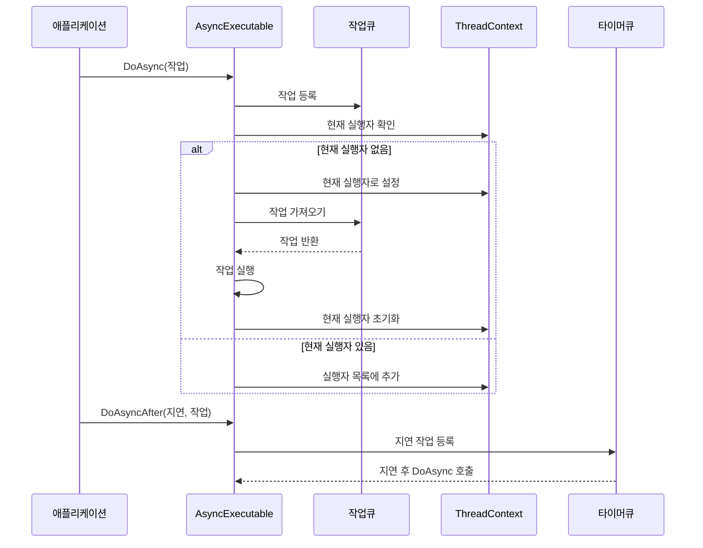
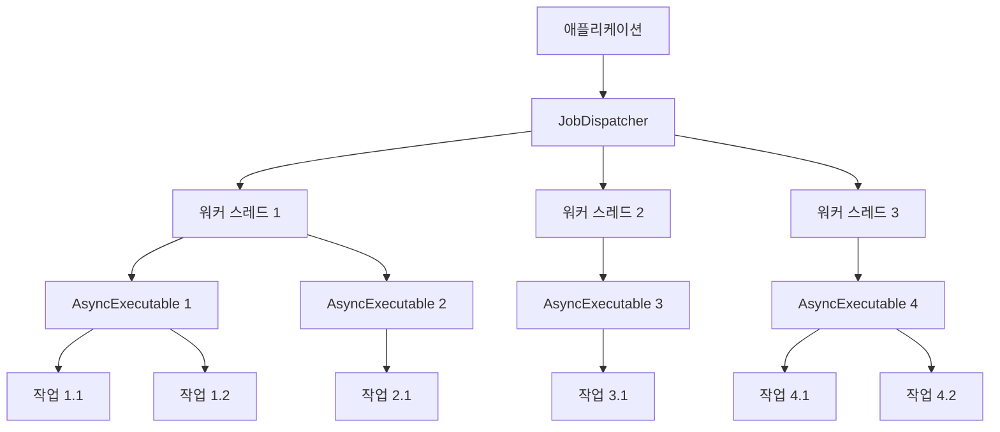

# Chapter 2. 비동기 실행 가능 객체(AsyncExecutable)

## 소개
[작업 디스패처(JobDispatcher)](01_작업_디스패처_jobdispatcher__.md)에서 알아본 것처럼, 여러 작업을 효율적으로 관리하는 것은 복잡한 프로그램에서 매우 중요합니다. 이번 장에서는 `JobDispatcherNET` 라이브러리의 또 다른 핵심 구성 요소인 **비동기 실행 가능 객체(AsyncExecutable)**에 대해 알아보겠습니다.
  

## 비동기 실행 가능 객체란 무엇인가요?
비동기 실행 가능 객체는 작업을 비동기적으로 안전하게 실행할 수 있도록 해주는 기본 클래스입니다. 이것을 쉽게 이해하기 위해 개인 비서의 예를 들어보겠습니다:

- 여러분은 비서에게 다양한 업무를 지시합니다
- 비서는 이 업무들을 메모해두고 적절한 순서와 시간에 처리합니다
- 여러분은 직접 각 업무의 세부 실행 과정을 신경 쓸 필요 없이 비서에게 맡길 수 있습니다

`AsyncExecutable` 클래스는 이런 비서와 같은 역할을 합니다. 여러분이 실행하고 싶은 코드를 `AsyncExecutable`에 등록하면, 알아서 적절한 순서와 타이밍에 코드를 실행해 줍니다.
  

## 왜 비동기 실행 가능 객체가 필요한가요?
멀티스레드 환경에서 코드를 안전하게 실행하는 것은 어렵습니다. 다음과 같은 문제가 발생할 수 있습니다:

1. **경쟁 상태(Race Condition)**: 여러 스레드가 동시에 같은 데이터에 접근할 때 발생하는 문제
2. **데드락(Deadlock)**: 두 스레드가 서로 상대방이 가진 자원을 기다리며 영원히 대기하는 상태
3. **동기화 오버헤드**: 락(lock)을 과도하게 사용함으로써 생기는 성능 저하

`AsyncExecutable`은 이러한 문제를 해결하기 위한 방법을 제공합니다. 모든 코드가 동일한 스레드에서 순차적으로 실행되도록 보장하면서도, 비동기적으로 작업을 등록할 수 있게 해줍니다.
  

## AsyncExecutable 클래스 이해하기
`AsyncExecutable` 클래스는 비교적 간단한 인터페이스를 제공합니다. 주요 메서드는 두 가지입니다:

```csharp
// 비동기적으로 작업 실행
public void DoAsync(Action action)

// 일정 시간 후에 작업 실행
public void DoAsyncAfter(TimeSpan delay, Action action)
```

이 두 메서드는 다음과 같이 작동합니다:
1. `DoAsync`: 작업을 즉시 실행 대기열에 추가합니다
2. `DoAsyncAfter`: 지정된 시간이 지난 후에 작업을 실행 대기열에 추가합니다
  

## 비동기 실행 가능 객체 사용하기
비동기 실행 가능 객체를 사용하는 방법을 간단한 예제를 통해 알아보겠습니다:

```csharp
// 1. AsyncExecutable을 상속받는 클래스 정의
public class MyProcessor : AsyncExecutable
{
    private int _counter = 0;
    
    // 2. 카운터 증가 메서드
    public void IncrementCounter()
    {
        DoAsync(() => {
            _counter++;
            Console.WriteLine($"카운터: {_counter}");
        });
    }
}
```

위 코드에서:
1. `MyProcessor` 클래스는 `AsyncExecutable`을 상속받습니다
2. `IncrementCounter` 메서드는 `DoAsync`를 사용하여 카운터를 증가시키는 작업을 등록합니다
3. 이 작업은 비동기적으로 실행되지만, 항상 같은 스레드에서 순차적으로 실행됩니다

이런 식으로 사용하면, 여러 스레드에서 `IncrementCounter`를 호출하더라도 카운터 값이 안전하게 증가합니다.
  

## 실제 사용 예: 채팅방
이제 실제 응용 사례를 살펴보겠습니다. 아래는 채팅방을 구현하는 코드 예제입니다:

```csharp
public class Room : AsyncExecutable
{
    private readonly Dictionary<string, User> _users = [];
    
    // 사용자 입장 처리
    public void AddUser(User user)
    {
        DoAsync(() => {
            if (!_users.ContainsKey(user.UserId))
            {
                _users[user.UserId] = user;
                Console.WriteLine($"방 입장: {user.Username}");
            }
        });
    }
}
```

이 코드에서 `AddUser` 메서드는 `DoAsync`를 사용하여 사용자 추가 작업을 비동기적으로 실행합니다. 이렇게 하면 여러 스레드에서 동시에 `AddUser`를 호출하더라도 `_users` 딕셔너리에 안전하게 접근할 수 있습니다.
  

## 지연 실행 사용하기
때로는 작업을 즉시 실행하지 않고 일정 시간이 지난 후에 실행하고 싶을 때가 있습니다. 이럴 때 `DoAsyncAfter` 메서드를 사용할 수 있습니다:

```csharp
public class NotificationService : AsyncExecutable
{
    // 알림 전송 후 읽음 확인 요청
    public void SendNotification(string userId, string message)
    {
        DoAsync(() => {
            // 알림 전송
            Console.WriteLine($"{userId}에게 알림 전송: {message}");
            
            // 5초 후 읽음 확인 요청
            DoAsyncAfter(TimeSpan.FromSeconds(5), () => {
                Console.WriteLine($"{userId}의 알림 읽음 확인 요청");
            });
        });
    }
}
```

위 코드는:
1. 사용자에게 알림을 즉시 전송합니다
2. 5초 후에 읽음 확인 요청을 보냅니다

이 모든 작업은 동일한 스레드에서 안전하게 실행됩니다.
  

## 데이터 프로세서 예제
더 실용적인 예제로, 데이터를 처리하는 클래스를 살펴보겠습니다:

```csharp
public class DataProcessor : AsyncExecutable
{
    private readonly Dictionary<string, int> _processedItems = new();
    
    public void ProcessItem(string itemId, int priority)
    {
        Console.WriteLine($"아이템 처리: {itemId}, 우선순위: {priority}");
        
        // 아이템 처리 로직
        DoAsync(() => {
            if (_processedItems.TryGetValue(itemId, out var count))
            {
                _processedItems[itemId] = count + 1;
            }
            else
            {
                _processedItems[itemId] = 1;
            }
        });
    }
}
```

이 `DataProcessor` 클래스는 아이템을 처리하고 처리된 아이템 개수를 추적합니다. `DoAsync`를 사용하여 딕셔너리 접근을 안전하게 합니다.
   

## 내부 구현 살펴보기
이제 `AsyncExecutable`이 내부적으로 어떻게 작동하는지 살펴보겠습니다. 다음은 간단한 시퀀스 다이어그램입니다:



주요 구현 단계는 다음과 같습니다:

1. 작업이 `DoAsync`나 `DoAsyncAfter`를 통해 등록됩니다.
2. 작업은 내부 작업 큐에 저장됩니다.
3. 시스템은 작업을 실행할 적절한 시점을 결정합니다:
   - 현재 실행 중인 `AsyncExecutable`이 없으면 즉시 실행
   - 다른 `AsyncExecutable`이 실행 중이면 나중에 실행
4. 작업들은 항상 동일한 스레드에서 순차적으로 실행됩니다.

`AsyncExecutable` 클래스의 핵심 부분을 살펴보겠습니다:

```csharp
public abstract class AsyncExecutable : IAsyncDisposable
{
    private readonly Channel<JobEntry> _jobQueue;
    
    // 비동기적으로 메서드 실행
    public void DoAsync(Action action)
    {
        var job = new Job(action);
        DoTask(job);
    }
    
    // 지연 후 메서드 실행
    public void DoAsyncAfter(TimeSpan delay, Action action)
    {
        var job = new Job(action);
        ThreadContext.Timer.ScheduleTask(this, delay, job);
    }
}
```

여기서 중요한 부분은:
1. `_jobQueue`는 실행할 작업을 저장하는 Channel입니다
2. `DoAsync`는 작업을 즉시 큐에 추가합니다
3. `DoAsyncAfter`는 [타이머 큐(TimerQueue)](05_타이머_큐_timerqueue__.md)를 사용하여 지연 후 작업을 실행합니다
  

## DoTask 메서드 이해하기
`DoTask` 메서드는 `AsyncExecutable`의 핵심 부분으로, 작업 실행 로직을 관리합니다:

```csharp
internal void DoTask(JobEntry task)
{
    if (Interlocked.Increment(ref _remainingTaskCount) > 1)
    {
        // 작업을 큐에 등록
        _jobQueue.Writer.TryWrite(task);
    }
    else
    {
        // 작업을 큐에 등록
        _jobQueue.Writer.TryWrite(task);
        
        // 현재 스레드의 실행자 확인
        var currentExecuter = ThreadContext.CurrentExecuter;
        if (currentExecuter is not null)
        {
            // 실행자 목록에 추가
            ThreadContext.ExecuterList.Add(this);
        }
        else
        {
            // 현재 실행자로 설정하고 작업 처리
            ThreadContext.CurrentExecuter = this;
            Flush();
            ThreadContext.CurrentExecuter = null;
        }
    }
}
```

이 메서드는:
1. 남은 작업 수를 증가시킵니다
2. 작업을 큐에 추가합니다
3. 현재 스레드에 실행 중인 다른 `AsyncExecutable`이 있는지 확인합니다
4. 없으면 현재 객체를 실행자로 설정하고 작업을 처리합니다
5. 있으면 나중에 처리하도록 목록에 추가합니다
  

## 실제 활용 시나리오
`AsyncExecutable`은 다음과 같은 상황에서 특히 유용합니다:

1. **채팅 서버**: 여러 사용자의 메시지와 상태 관리
2. **게임 서버**: 플레이어 상태와 게임 로직 처리
3. **데이터 처리 파이프라인**: 데이터 항목 처리 및 추적
4. **UI 이벤트 처리**: 사용자 인터페이스 이벤트 처리

이러한 모든 시나리오에서 `AsyncExecutable`은 멀티스레드 환경에서 안전하게 코드를 실행할 수 있도록 도와줍니다.
  

## 비동기 실행 가능 객체와 작업 디스패처의 관계
`AsyncExecutable`은 [작업 디스패처(JobDispatcher)](01_작업_디스패처_jobdispatcher__.md)와 함께 사용될 때 가장 효과적입니다. 작업 디스패처가 여러 워커 스레드를 관리하고, 각 워커 스레드에서 `AsyncExecutable`이 작업을 안전하게 실행합니다.

이 관계를 다이어그램으로 표현하면 다음과 같습니다:



이 다이어그램에서:
1. 애플리케이션은 `JobDispatcher`를 사용하여 워커 스레드를 관리합니다
2. 각 워커 스레드는 여러 `AsyncExecutable` 객체의 작업을 실행합니다
3. 각 `AsyncExecutable`은 자신의 작업을 안전하게 실행합니다
  

## 요약 및 다음 단계
이번 장에서는 **비동기 실행 가능 객체(AsyncExecutable)**의 개념과 사용법에 대해 알아보았습니다. `AsyncExecutable`은 작업을 비동기적으로 안전하게 실행할 수 있게 해주는 기본 클래스로, 마치 개인 비서처럼 작업을 적절한 순서와 시간에 처리합니다.

주요 내용:
- `AsyncExecutable`은 멀티스레드 환경에서 발생할 수 있는 문제(경쟁 상태, 데드락 등)를 해결합니다
- `DoAsync` 메서드를 통해 작업을 즉시 실행 대기열에 추가할 수 있습니다
- `DoAsyncAfter` 메서드를 통해 지연 실행을 예약할 수 있습니다
- 모든 작업은 동일한 스레드에서 순차적으로 실행되어 스레드 안전성을 보장합니다
- 작업 디스패처와 함께 사용하면 효율적인 멀티스레딩을 구현할 수 있습니다

다음 장에서는 [실행 가능 인터페이스(IRunnable)](03_실행_가능_인터페이스_irunnable__.md)에 대해 알아보겠습니다. 이 인터페이스는 작업 디스패처가 실행할 수 있는 작업의 형태를 정의하며, 비동기 실행 가능 객체와 함께 사용하여 더 복잡한 비동기 작업 흐름을 구현할 수 있게 해줍니다.

즐거운 프로그래밍 되세요!


## 추가 - `AsyncExecutable` 클래스의 `DoAsync` 함수를 호출했을 때 
`AsyncExecutable` 클래스의 `DoAsync` 함수를 호출했을 때 해당 job의 처리는 다음과 같은 방식으로 이루어집니다:  
  
`AsyncExecutable`의 각 인스턴스(예: 특정 `Room` 객체)에 대한 job들은 **특정 시점에는 하나의 스레드에 의해서만 순차적으로 처리됩니다.** 여러 워커 스레드 중 유휴 상태인 스레드가 무작위로 해당 job을 가져가 처리하는 방식이 아닙니다.  
  
작동 방식의 핵심은 `AsyncExecutable.cs` 파일의 `DoTask` 메서드와 `ThreadContext.cs` 파일에 있습니다.  

1.  **`DoAsync` 호출 및 `DoTask` 진입**:
    * `DoAsync(Action action)`가 호출되면, `action`을 실행하는 `Job` 객체가 생성되고 내부적으로 `DoTask(JobEntry task)` 메서드가 호출됩니다.

2.  **작업 수 계산 및 실행 흐름 결정**:
    * `DoTask` 메서드 내에서 `Interlocked.Increment(ref _remainingTaskCount)`를 통해 해당 `AsyncExecutable` 인스턴스의 처리 대기 중인 작업 수가 증가합니다.
    * **만약 이전에 처리 대기 중인 작업이 이미 있었다면 (`_remainingTaskCount`가 1보다 커지는 경우)**:
        * 새로운 작업(`task`)은 단순히 내부 `_jobQueue`에 추가됩니다. 이 `AsyncExecutable` 인스턴스의 작업들은 이미 다른 스레드에 의해 처리 중이거나 처리될 예정이므로, 해당 스레드가 이 작업도 순차적으로 처리하게 됩니다.
    * **만약 이것이 첫 번째 작업이거나 이전에 큐가 비워진 후 첫 작업이라면 (`_remainingTaskCount`가 1이 되는 경우)**:
        * 새로운 작업(`task`)이 내부 `_jobQueue`에 추가됩니다.
        * 현재 `DoTask`를 실행하고 있는 스레드가 다른 `AsyncExecutable`의 작업을 이미 처리 중인지 확인합니다 (`var currentExecuter = ThreadContext.CurrentExecuter;`).
            * **만약 현재 스레드가 이미 다른 `AsyncExecutable`의 작업을 처리 중이라면 (`currentExecuter is not null`)**:
                * 현재 `AsyncExecutable` 인스턴스(`this`)는 해당 스레드의 `ThreadContext.ExecuterList`에 추가됩니다. 이는 현재 스레드가 맡은 `currentExecuter`의 작업을 모두 마친 후, `ExecuterList`에 있는 다른 `AsyncExecutable`들의 작업도 순차적으로 처리하기 위함입니다.
            * **만약 현재 스레드가 다른 작업을 처리 중이지 않다면 (`currentExecuter is null`)**:
                * 현재 스레드는 이 `AsyncExecutable` 인스턴스(`this`)의 작업을 처리하기 위해 "점유"됩니다 (`ThreadContext.CurrentExecuter = this;`).
                * `Flush()` 메서드가 호출되어 `_jobQueue`에 있는 모든 작업들이 현재 스레드에서 순차적으로 실행됩니다.
                * 자신의 큐를 모두 비운 후, 이 스레드는 자신이 작업을 처리하는 동안 `ThreadContext.ExecuterList`에 추가된 다른 `AsyncExecutable` 인스턴스들의 작업도 순차적으로 `Flush()`합니다.
                * 모든 작업이 완료되면 현재 스레드는 "점유" 상태에서 해제됩니다 (`ThreadContext.CurrentExecuter = null;`).

**결론적으로:**
* 하나의 `AsyncExecutable` 인스턴스(예: 특정 채팅방 `Room`)에 쌓인 job들은 **동시에 여러 스레드에서 병렬로 처리되지 않습니다.**
* 대신, 해당 `AsyncExecutable` 인스턴스의 job 큐를 처리할 "실행자" 스레드가 (위의 로직에 따라) 사실상 지정됩니다. 이 실행자 스레드가 해당 `AsyncExecutable`의 job들을 순차적으로 처리합니다.
* `JobDispatcher<T>`에 의해 관리되는 워커 스레드들(예: `ChatWorker`)은 이러한 `AsyncExecutable`의 작업들을 실행할 수 있는 스레드 풀을 제공하는 역할을 합니다. `DoAsync`가 어떤 스레드에서 호출되었느냐에 따라, 그 스레드가 (만약 유휴 상태라면) 해당 `AsyncExecutable`의 실행자 스레드가 될 수 있습니다.

따라서 `AsyncExecutable`의 job 처리는 특정 스레드에 의해 (적어도 한 번의 `Flush` 사이클 동안) 전담되어 순차적으로 이루어진다고 이해할 수 있습니다.
  
---
Generated by [AI Codebase Knowledge Builder](https://github.com/The-Pocket/Tutorial-Codebase-Knowledge)