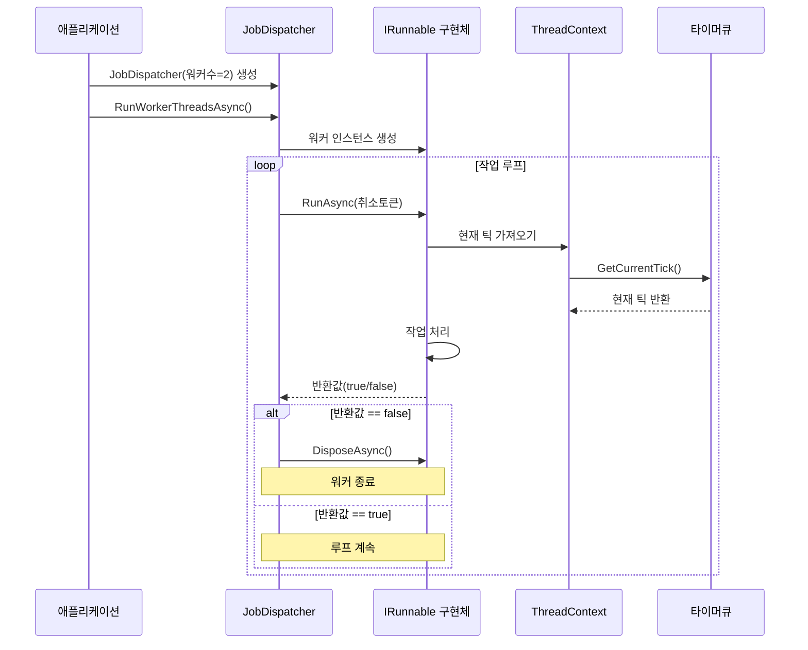

# Chapter 3. 실행 가능 인터페이스(IRunnable)

## 소개
[비동기 실행 가능 객체(AsyncExecutable)](02_비동기_실행_가능_객체_asyncexecutable__.md)에서 살펴본 것처럼, `JobDispatcherNET`은 여러 작업을 효율적으로 관리하는 도구를 제공합니다. 이번 장에서는 라이브러리의 또 다른 핵심 구성 요소인 **실행 가능 인터페이스(IRunnable)**에 대해 알아보겠습니다.

## 실행 가능 인터페이스란 무엇인가요?
실행 가능 인터페이스(IRunnable)는 워커 스레드에서 실행될 수 있는 작업의 형태를 정의하는 인터페이스입니다. 이것을 이해하기 쉽게 설명하기 위해 공장의 비유를 사용해 보겠습니다:

- 공장에는 여러 작업자(워커 스레드)가 있습니다
- 각 작업자는 직무 기술서(IRunnable)를 받습니다
- 이 직무 기술서는 작업자가 수행해야 할 작업과 방법을 정의합니다
- 작업자는 직무 기술서에 따라 반복적으로 작업을 수행합니다

`IRunnable`은 이런 직무 기술서와 같은 역할을 합니다. 워커 스레드가 어떤 작업을 수행할지, 어떻게 수행할지를 정의하는 인터페이스입니다.
  

## IRunnable 인터페이스 살펴보기
`IRunnable` 인터페이스는 매우 간단합니다. 다음은 그 정의입니다:

```csharp
public interface IRunnable : IAsyncDisposable
{
    ValueTask<bool> RunAsync(CancellationToken cancellationToken);
}
```

인터페이스에는 주요 메서드가 하나 있습니다:

- `RunAsync`: 작업 루프를 실행하는 메서드입니다. 이 메서드는 `bool` 값을 반환하여 계속 실행할지(true) 또는 중지할지(false)를 알려줍니다.

또한 `IAsyncDisposable`을 상속받아 리소스 정리를 위한 `DisposeAsync` 메서드도 구현해야 합니다.
  

## IRunnable 인터페이스 구현하기
간단한 `IRunnable` 구현을 만들어 보겠습니다. 숫자를 세는 간단한 워커를 예로 들어보겠습니다:

```csharp
public class CounterWorker : IRunnable
{
    private int _count = 0;
    
    public async ValueTask<bool> RunAsync(CancellationToken cancellationToken)
    {
        // 취소 요청 확인
        if (cancellationToken.IsCancellationRequested)
            return false;
            
        // 숫자 증가 및 출력
        _count++;
        Console.WriteLine($"현재 카운트: {_count}");
        
        // 잠시 대기
        await Task.Delay(1000, cancellationToken);
        
        return true; // 계속 실행
    }
    
    public ValueTask DisposeAsync()
    {
        Console.WriteLine("카운터 워커 종료됨");
        return ValueTask.CompletedTask;
    }
}
```

이 코드에서:
1. `RunAsync` 메서드는 카운터를 증가시키고 그 값을 출력합니다
2. 1초간 대기 후 `true`를 반환하여 계속 실행할 것임을 알립니다
3. `DisposeAsync`는 워커가 종료될 때 호출되어 정리 작업을 수행합니다
  

## RunAsync의 반환 값 이해하기
`RunAsync` 메서드는 `boolean` 값을 반환합니다. 이 값의 의미는 다음과 같습니다:

- `true`: 워커가 계속 실행되어야 함을 의미합니다
- `false`: 워커가 종료되어야 함을 의미합니다

이 반환 값은 [작업 디스패처(JobDispatcher)](01_작업_디스패처_jobdispatcher__.md)가 워커 스레드의 실행을 계속할지 또는 중지할지 결정하는 데 사용됩니다.
  

## 취소 토큰 다루기
`RunAsync` 메서드는 `CancellationToken`을 매개변수로 받습니다. 이 토큰은 워커에게 작업을 중지해야 할 때를 알려주는 메커니즘입니다.

```csharp
public async ValueTask<bool> RunAsync(CancellationToken cancellationToken)
{
    // 취소 요청 확인
    if (cancellationToken.IsCancellationRequested)
        return false;
        
    try
    {
        // 작업 수행 및 대기
        await Task.Delay(1000, cancellationToken);
    }
    catch (OperationCanceledException) when (cancellationToken.IsCancellationRequested)
    {
        // 정상적인 취소 처리
        return false;
    }
    
    return true;
}
```

이 코드는:
1. 메서드 시작 시 취소 토큰을 확인합니다
2. 비동기 작업 중에 취소될 수 있으므로 예외 처리를 추가합니다
3. 취소가 요청되면 `false`를 반환하여 워커를 종료합니다
  

## 실제 사용 예: 채팅 워커
실제 응용 예제로 채팅 서버에서 사용되는 워커를 살펴보겠습니다. 이 예제는 `JobDispatcherNET`이 실제로 어떻게 사용되는지 보여줍니다:

```csharp
public class ChatWorker : IRunnable
{
    private static int _workerCounter = 0;
    private readonly int _workerId;
    
    public ChatWorker()
    {
        _workerId = Interlocked.Increment(ref _workerCounter);
        Console.WriteLine($"채팅 워커 {_workerId} 시작");
    }
    
    public async ValueTask<bool> RunAsync(CancellationToken cancellationToken)
    {
        // 타이머 작업 처리
        var currentTick = ThreadContext.Timer.GetCurrentTick();
        ThreadContext.TickCount = currentTick;
        
        // 짧은 대기
        await Task.Delay(1, cancellationToken);
        
        return true; // 계속 실행
    }
}
```

이 `ChatWorker` 클래스는:
1. 생성 시 고유 ID를 부여받습니다
2. `RunAsync`에서 타이머 작업을 처리합니다
3. [스레드 컨텍스트(ThreadContext)](04_스레드_컨텍스트_threadcontext__.md)와 상호작용하여 현재 틱 카운트를 업데이트합니다
  

## 데이터 프로세싱 워커 예제
또 다른 예제로, 데이터를 처리하는 워커를 살펴보겠습니다:

```csharp
public class ProcessingWorker : IRunnable
{
    private readonly int _workerId;
    
    public ProcessingWorker()
    {
        _workerId = Interlocked.Increment(ref _workerCounter);
    }
    
    public async ValueTask<bool> RunAsync(CancellationToken cancellationToken)
    {
        // 타이머 작업 처리
        var currentTick = ThreadContext.Timer.GetCurrentTick();
        ThreadContext.TickCount = currentTick;
        
        // 데이터 처리 작업 수행
        // ...
        
        // 다른 작업에 시간을 양보
        await Task.Delay(Random.Shared.Next(1, 5), cancellationToken);
        
        return true;
    }
}
```

이 워커는:
1. 타이머 작업을 처리합니다
2. 데이터 처리 로직을 수행합니다 (실제 코드에서는 더 복잡할 수 있음)
3. CPU를 독점하지 않도록 짧은 대기 시간을 가집니다
  

## IRunnable이 작동하는 방식
`IRunnable`이 실제로 어떻게 작동하는지 시퀀스 다이어그램으로 살펴보겠습니다:



주요 실행 단계는 다음과 같습니다:

1. `JobDispatcher`가 생성되고 워커 스레드 실행이 시작됩니다
2. 각 워커 스레드에서 `IRunnable` 구현체의 인스턴스가 생성됩니다
3. `JobDispatcher`는 반복적으로 워커의 `RunAsync` 메서드를 호출합니다
4. 워커는 필요한 작업을 수행하고 계속 실행할지(`true`) 또는 중지할지(`false`)를 반환합니다
5. `false`가 반환되면 `JobDispatcher`는 워커의 `DisposeAsync`를 호출하고 워커를 종료합니다
  

## JobDispatcher와 IRunnable의 관계
`JobDispatcher`는 `IRunnable` 구현체를 워커 스레드에서 실행합니다. 그 구현은 다음과 같습니다:

```csharp
public sealed class JobDispatcher<T> : IAsyncDisposable where T : IRunnable, new()
{
    private async Task RunWorkerAsync()
    {
        await using var runner = new T(); // IRunnable 구현체 생성
        
        try
        {
            while (!_cts.Token.IsCancellationRequested)
            {
                bool shouldContinue = await runner.RunAsync(_cts.Token);
                if (!shouldContinue)
                    break; // 워커가 중지 요청
                    
                await Task.Delay(1, _cts.Token);
            }
        }
        catch (OperationCanceledException) when (_cts.Token.IsCancellationRequested)
        {
            // 정상적인 취소, 무시
        }
    }
}
```

이 코드에서:
1. `new T()`로 `IRunnable` 구현체의 인스턴스를 생성합니다
2. 반복적으로 `RunAsync`를 호출하고 반환 값을 확인합니다
3. `false`가 반환되면 루프를 종료합니다
4. 취소가 요청되면 워커를 안전하게 종료합니다
  

## 워커의 필요성
왜 `IRunnable`과 워커 스레드가 필요한지 궁금할 수 있습니다. 일반적으로 다음과 같은 이유가 있습니다:

1. **병렬 처리**: 여러 작업을 동시에 처리해 프로그램 성능 향상
2. **작업 분리**: 서로 다른 유형의 작업을 각각의 워커로 분리하여 코드 구조화
3. **리소스 관리**: CPU 코어 수에 맞게 워커 수를 조절하여 효율적인 리소스 사용
4. **반응성 향상**: 긴 작업을 별도 스레드에서 실행하여 메인 스레드의 응답성 유지
  

## 실제 활용 시나리오
`IRunnable`은, 특히 워커 스레드 처리 패턴이 필요한 다양한 시나리오에서 활용할 수 있습니다:

1. **채팅 서버**: 메시지 처리, 사용자 관리, 룸 관리 등을 서로 다른 워커가 담당
2. **게임 서버**: 물리 엔진, AI, 네트워크 처리 등을 서로 다른 워커가 처리
3. **데이터 처리 시스템**: 데이터 수집, 변환, 저장 등의 작업을 여러 워커로 분산
4. **IoT 시스템**: 다양한 센서 데이터를 병렬로 처리하기 위한 워커 구현
  

## IRunnable 구현 시 주의사항

`IRunnable`을 구현할 때 몇 가지 주의해야 할 점이 있습니다:

1. **경량 작업 유지**: `RunAsync` 메서드는 자주 호출되므로, 무거운 작업은 나누어 처리
2. **취소 토큰 확인**: `cancellationToken`을 주기적으로 확인하여 빠른 종료 보장
3. **오래 걸리는 작업 주의**: 한 번의 `RunAsync` 호출에서 너무 오래 걸리는 작업 피하기
4. **예외 처리**: 적절한 예외 처리로 워커가 예기치 않게 종료되지 않도록 주의
  

## 흔한 오류 패턴과 해결 방법
`IRunnable` 구현 시 흔히 발생하는 오류와 해결 방법을 살펴보겠습니다:

```csharp
// 잘못된 방법
public async ValueTask<bool> RunAsync(CancellationToken cancellationToken)
{
    // ❌ 너무 긴 작업을 한 번에 처리
    for (int i = 0; i < 1000000; i++)
    {
        // 무거운 작업 처리
    }
    
    return true;
}

// 올바른 방법
public async ValueTask<bool> RunAsync(CancellationToken cancellationToken)
{
    // ✅ 작업을 분할하고 취소 토큰 확인
    for (int i = 0; i < 100; i++)
    {
        if (cancellationToken.IsCancellationRequested)
            return false;
        
        // 일부 작업만 처리
    }
    
    return true;
}
```

첫 번째 예제는 너무 많은 작업을 한 번에 처리하여 시스템 응답성이 떨어집니다. 두 번째 예제는 작업을 나누고 취소 토큰을 확인하여 보다 효율적입니다.
  

## 요약 및 다음 단계
이번 장에서는 **실행 가능 인터페이스(IRunnable)**의 개념과 사용법에 대해 알아보았습니다. `IRunnable`은 워커 스레드에서 실행될 수 있는 작업의 형태를 정의하며, 공장에서 작업자들의 직무 기술서와 같은 역할을 합니다.

주요 내용:
- `IRunnable`은 `RunAsync` 메서드를 통해 작업 루프를 실행합니다
- 워커는 `RunAsync`의 반환 값을 통해 계속 실행할지 또는 중지할지 결정합니다
- `CancellationToken`을 통해 워커를 안전하게 종료할 수 있습니다
- `JobDispatcher`는 `IRunnable` 구현체를 워커 스레드에서 실행합니다
- 적절한 `IRunnable` 구현으로 다양한 워커 패턴을 적용할 수 있습니다

다음 장에서는 [스레드 컨텍스트(ThreadContext)](04_스레드_컨텍스트_threadcontext__.md)에 대해 알아보겠습니다. 스레드 컨텍스트는 작업자 스레드가 실행되는 환경을 관리하며, 타이머 큐와 실행자 목록 등 중요한 정보를 포함합니다.

즐거운 프로그래밍 되세요!

---

Generated by [AI Codebase Knowledge Builder](https://github.com/The-Pocket/Tutorial-Codebase-Knowledge)