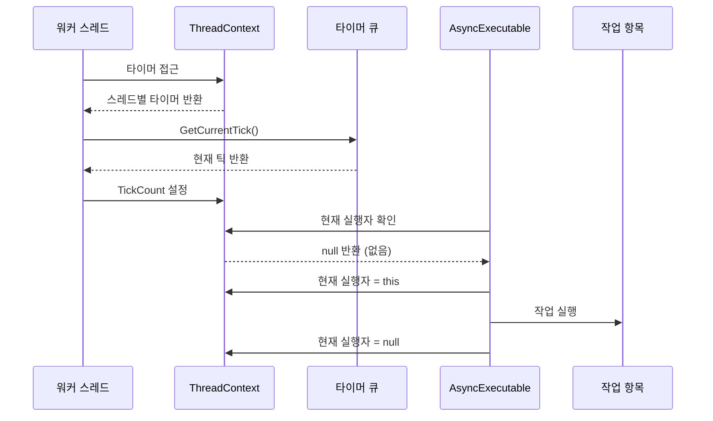
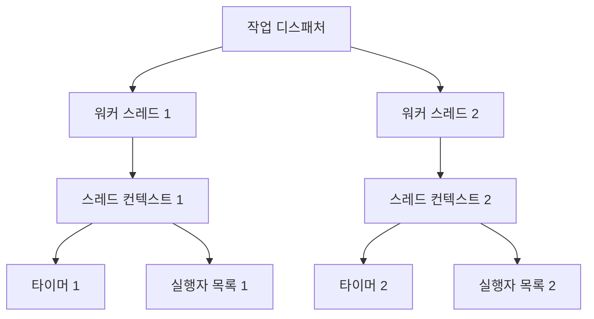

# Chapter 4. 스레드 컨텍스트(ThreadContext)

## 소개
[실행 가능 인터페이스(IRunnable)](03_실행_가능_인터페이스_irunnable__.md)에서 알아본 것처럼, 워커 스레드는 `JobDispatcherNET` 라이브러리의 중요한 부분입니다. 하지만 이런 여러 스레드가 동시에 작업할 때, 각 스레드만의 고유한 환경을 어떻게 관리할까요? 이번 장에서는 **스레드 컨텍스트(ThreadContext)**에 대해 알아보겠습니다.
  

## 스레드 컨텍스트란 무엇인가요?
스레드 컨텍스트는 각 워커 스레드가 자신만의 정보와 상태를 저장하는 곳입니다. 이해를 돕기 위해 공장의 작업대 비유를 들어보겠습니다:

- 공장에는 여러 작업자가 있습니다
- 각 작업자는 자신만의 작업대를 가지고 있습니다
- 작업대에는 개인 도구, 현재 작업 중인 부품, 작업 메모 등이 있습니다
- 작업자는 자신의 작업대를 통해 효율적으로 일할 수 있습니다

`ThreadContext`는 이런 작업대와 같은 역할을 합니다. 각 스레드가 독립적으로 작업할 수 있도록 필요한 정보와 도구를 제공하는 것이죠.
  

## 왜 스레드 컨텍스트가 필요한가요?
멀티스레드 환경에서는 각 스레드가 독립적인 실행 흐름을 가집니다. 이때 몇 가지 문제가 발생할 수 있습니다:

1. **데이터 공유**: 여러 스레드가 동일한 데이터에 접근할 때 충돌 발생
2. **상태 추적**: 각 스레드의 현재 상태를 추적하기 어려움
3. **리소스 관리**: 스레드별로 필요한 리소스를 효율적으로 관리해야 함

스레드 컨텍스트는 이런 문제를 해결해 줍니다. 각 스레드가 자신만의 독립적인 환경에서 작업할 수 있게 하여 데이터 충돌을 방지하고, 상태 추적을 용이하게 하며, 리소스를 효율적으로 관리할 수 있게 해줍니다.

## ThreadContext 클래스 살펴보기
`ThreadContext` 클래스는 아주 간단하지만 강력한 기능을 제공합니다. 다음은 그 구조입니다:

```csharp
public static class ThreadContext
{
    private static readonly ThreadLocal<TimerQueue> _timer = new(() => new TimerQueue());
    private static readonly ThreadLocal<List<AsyncExecutable>> _executerList = new();
    private static readonly ThreadLocal<AsyncExecutable?> _currentExecuter = new();
    private static readonly AsyncLocal<long> _tickCount = new();
    
    // 속성들...
}
```

이 코드에서 중요한 점은:
1. `static` 클래스로 구현되어 있어 어디서든 접근 가능합니다
2. `ThreadLocal`과 `AsyncLocal`을 사용하여 스레드별 데이터를 관리합니다
  

## ThreadLocal과 AsyncLocal 이해하기
스레드 컨텍스트에서 가장 중요한 개념은 `ThreadLocal`과 `AsyncLocal`입니다:

- **ThreadLocal<T>**: 각 스레드가 자신만의 독립적인 데이터 인스턴스를 가질 수 있게 해줍니다
- **AsyncLocal<T>**: 비동기 작업 간에도 데이터가 유지되도록 해줍니다

예를 들어 설명해보겠습니다:

```csharp
// ThreadLocal 예제
ThreadLocal<int> threadCounter = new(() => 0);

// 스레드 1에서
threadCounter.Value++; // 값: 1

// 스레드 2에서 (동시에)
threadCounter.Value++; // 값: 1 (스레드 1의 값과 독립적)
```

위 코드에서 두 스레드는 같은 `threadCounter` 변수를 사용하지만, 각자 독립적인 값을 가집니다. 즉, 한 스레드에서 값을 변경해도 다른 스레드에 영향을 주지 않습니다.
  

## ThreadContext의 주요 구성 요소
`ThreadContext`는 네 가지 주요 구성 요소를 제공합니다:

1. **Timer (타이머 큐)**: 지연 작업을 예약하고 실행하는 데 사용됩니다
2. **ExecuterList (실행자 목록)**: 현재 스레드에 등록된 `AsyncExecutable` 객체 목록
3. **CurrentExecuter (현재 실행자)**: 현재 스레드를 점유하고 있는 `AsyncExecutable` 객체
4. **TickCount (틱 카운트)**: 현재 타이머 틱 값을 저장합니다

이 구성 요소들은 각각 다음과 같은 속성으로 접근할 수 있습니다:

```csharp
// 타이머 큐 접근
TimerQueue timer = ThreadContext.Timer;

// 실행자 목록 접근
List<AsyncExecutable> executerList = ThreadContext.ExecuterList;

// 현재 실행자 접근/설정
AsyncExecutable? currentExecuter = ThreadContext.CurrentExecuter;
ThreadContext.CurrentExecuter = myExecutable;

// 틱 카운트 접근/설정
long tickCount = ThreadContext.TickCount;
ThreadContext.TickCount = 123;
```

각 속성은 해당 스레드만의 값을 반환하므로, 다른 스레드의 값과 충돌하지 않습니다.
  

## 타이머 큐(Timer) 활용하기
`ThreadContext.Timer`는 [타이머 큐(TimerQueue)](05_타이머_큐_timerqueue__.md)의 인스턴스로, 지연 작업을 예약하는 데 사용됩니다. 예를 들어:

```csharp
// 5초 후에 실행할 작업 예약
ThreadContext.Timer.ScheduleTask(
    myExecutable,              // 실행자
    TimeSpan.FromSeconds(5),   // 지연 시간
    new Job(() => Console.WriteLine("5초 후 실행됨"))  // 작업
);
```

이 코드는 5초 후에 "5초 후 실행됨"을 출력하는 작업을 예약합니다. 이런 방식으로 [비동기 실행 가능 객체(AsyncExecutable)](02_비동기_실행_가능_객체_asyncexecutable__.md)의 `DoAsyncAfter` 메서드가 내부적으로 구현되어 있습니다.
  

## 실행자 목록(ExecuterList)과 현재 실행자(CurrentExecuter)
`ExecuterList`와 `CurrentExecuter`는 [비동기 실행 가능 객체(AsyncExecutable)](02_비동기_실행_가능_객체_asyncexecutable__.md)의 실행을 관리하는 데 사용됩니다:

- `CurrentExecuter`: 현재 스레드를 점유하고 있는 실행자
- `ExecuterList`: 현재 스레드에서 실행 대기 중인 실행자 목록

이 구성 요소들은 여러 `AsyncExecutable` 객체가 동일한 스레드에서 순차적으로 실행될 수 있도록 조정합니다.

```csharp
// AsyncExecutable 내부 구현의 일부
if (ThreadContext.CurrentExecuter is not null)
{
    // 이미 다른 실행자가 점유 중이므로 목록에 추가
    ThreadContext.ExecuterList.Add(this);
}
else
{
    // 실행자가 없으므로 현재 실행자로 설정
    ThreadContext.CurrentExecuter = this;
    // 작업 실행...
}
```

이 메커니즘을 통해 여러 `AsyncExecutable` 객체가 동일한 스레드에서 안전하게 실행될 수 있습니다.
  

## 틱 카운트(TickCount) 활용하기
`TickCount`는 현재 타이머의 틱 값을 저장합니다. 이 값은 주로 [타이머 큐(TimerQueue)](05_타이머_큐_timerqueue__.md)에서 지연 작업의 실행 시점을 결정하는 데 사용됩니다.

```csharp
// 워커 스레드에서 틱 카운트 업데이트
public async ValueTask<bool> RunAsync(CancellationToken cancellationToken)
{
    // 현재 틱 가져오기
    var currentTick = ThreadContext.Timer.GetCurrentTick();
    
    // 컨텍스트에 설정
    ThreadContext.TickCount = currentTick;
    
    // 나머지 작업...
    return true;
}
```

[실행 가능 인터페이스(IRunnable)](03_실행_가능_인터페이스_irunnable__.md)를 구현한 워커는 위와 같이 주기적으로 틱 카운트를 업데이트하여 타이머 큐가 적절한 시점에 작업을 실행할 수 있게 합니다.
  

## 스레드 컨텍스트의 작동 원리
스레드 컨텍스트가 어떻게 작동하는지 시퀀스 다이어그램으로 살펴보겠습니다:



위 다이어그램에서:

1. 워커 스레드는 `ThreadContext.Timer`를 통해 자신만의 타이머에 접근합니다
2. 타이머에서 현재 틱을 가져와 `ThreadContext.TickCount`에 설정합니다
3. `AsyncExecutable`은 `ThreadContext.CurrentExecuter`를 확인하고 작업을 실행합니다

이 모든 과정은 각 스레드 내에서 독립적으로 이루어지므로, 다른 스레드의 작업과 충돌하지 않습니다.
  

## 실제 사용 예: 채팅 워커
실제 애플리케이션에서 스레드 컨텍스트가 어떻게 사용되는지 살펴보겠습니다. 다음은 채팅 서버에서 사용되는 워커의 예입니다:

```csharp
public class ChatWorker : IRunnable
{
    public async ValueTask<bool> RunAsync(CancellationToken cancellationToken)
    {
        // 타이머 작업 처리
        var currentTick = ThreadContext.Timer.GetCurrentTick();
        ThreadContext.TickCount = currentTick;
        
        // 짧은 대기
        await Task.Delay(1, cancellationToken);
        
        return true; // 계속 실행
    }
}
```

이 채팅 워커는:
1. `ThreadContext.Timer`를 통해 현재 틱을 가져옵니다
2. `ThreadContext.TickCount`를 업데이트합니다
3. 이렇게 함으로써 지연 작업(DoAsyncAfter로 예약된 작업)이 적절한 시점에 실행될 수 있게 합니다
  

## 스레드 컨텍스트와 작업 디스패처의 관계
스레드 컨텍스트는 [작업 디스패처(JobDispatcher)](01_작업_디스패처_jobdispatcher__.md)와 밀접한 관련이 있습니다. 작업 디스패처는 여러 워커 스레드를 생성하고, 각 워커 스레드는 자신만의 스레드 컨텍스트를 가집니다.



각 워커 스레드는 독립적인 스레드 컨텍스트를 가지므로, 서로 간섭 없이 병렬로 작업을 처리할 수 있습니다.

  
## 스레드 컨텍스트의 내부 구현
이제 스레드 컨텍스트의 내부 구현을 자세히 살펴보겠습니다. `ThreadContext.cs` 파일의 핵심 부분입니다:

```csharp
public static class ThreadContext
{
    private static readonly ThreadLocal<TimerQueue> _timer = 
        new(() => new TimerQueue());
    
    private static readonly ThreadLocal<List<AsyncExecutable>> _executerList = 
        new(() => new List<AsyncExecutable>());
    
    private static readonly ThreadLocal<AsyncExecutable?> _currentExecuter = 
        new(() => null);
    
    private static readonly AsyncLocal<long> _tickCount = new();
    
    // 속성들...
}
```

여기서 중요한 점은:

1. `ThreadLocal<T>`는 각 스레드마다 별도의 인스턴스를 생성하는 데 초기화 함수(`() => ...`)를 사용합니다
2. `TimerQueue`는 스레드마다 새로 생성됩니다
3. `ExecuterList`도 스레드마다 새로운 빈 리스트로 시작합니다
4. `CurrentExecuter`는 초기에 `null`로 설정됩니다
5. `TickCount`는 비동기 컨텍스트에서도 값이 유지되도록 `AsyncLocal<T>`를 사용합니다
  

## 속성 구현
`ThreadContext`의 속성들은 매우 간단하게 구현되어 있습니다:

```csharp
public static TimerQueue Timer => _timer.Value;

public static List<AsyncExecutable> ExecuterList => _executerList.Value;

public static AsyncExecutable? CurrentExecuter
{
    get => _currentExecuter.Value;
    set => _currentExecuter.Value = value;
}

public static long TickCount
{
    get => _tickCount.Value;
    set => _tickCount.Value = value;
}
```

이 속성들은 각각 해당하는 `ThreadLocal` 또는 `AsyncLocal` 변수의 `Value` 속성에 접근합니다. 이를 통해 각 스레드는 자신만의 값에 안전하게 접근할 수 있습니다.
  

## 비동기 작업에서의 주의사항
`AsyncLocal<T>`은 일반 `ThreadLocal<T>`와 달리 비동기 작업 간에도 값이 유지됩니다. 이는 `async/await` 패턴을 사용할 때 중요합니다:

```csharp
public async Task ExampleAsync()
{
    // 값 설정
    ThreadContext.TickCount = 100;
    
    // 비동기 작업
    await Task.Delay(1000);
    
    // 값이 유지됨
    Console.WriteLine(ThreadContext.TickCount); // 출력: 100
}
```

`TickCount`는 `AsyncLocal<long>`으로 구현되어 있어, 비동기 작업 전후로 값이 유지됩니다. 이것이 `ThreadLocal<T>` 대신 `AsyncLocal<T>`를 사용하는 이유입니다.
  

## 스레드 컨텍스트 활용 예제
스레드 컨텍스트를 활용한 간단한 예제를 살펴보겠습니다:

```csharp
public class MyWorker : IRunnable
{
    private static int _workerCounter = 0;
    private readonly int _workerId = Interlocked.Increment(ref _workerCounter);
    
    public async ValueTask<bool> RunAsync(CancellationToken cancellationToken)
    {
        // 현재 틱 업데이트
        var currentTick = ThreadContext.Timer.GetCurrentTick();
        ThreadContext.TickCount = currentTick;
        
        // 작업자 ID 출력
        Console.WriteLine($"작업자 {_workerId}, 틱: {currentTick}");
        
        await Task.Delay(10, cancellationToken);
        return true;
    }
}
```

이 워커는:
1. 고유한 작업자 ID를 가집니다
2. 실행될 때마다 현재 틱을 업데이트합니다
3. 자신의 ID와 현재 틱을 출력합니다

각 워커는 자신만의 스레드 컨텍스트에서 독립적으로 작동하므로, 서로 간섭 없이 병렬로 실행됩니다.
  

## 흔한 실수와 주의사항
스레드 컨텍스트를 사용할 때 주의해야 할 몇 가지 사항이 있습니다:

1. **크로스 스레드 접근**: 다른 스레드의 컨텍스트에 직접 접근하는 것은 불가능합니다
2. **컨텍스트 공유**: 스레드 간에 컨텍스트를 공유하려면 명시적으로 값을 전달해야 합니다
3. **ThreadLocal vs AsyncLocal**: 비동기 작업에서는 `AsyncLocal`을 사용해야 값이 유지됩니다

예를 들어, 다음과 같은 실수를 피해야 합니다:

```csharp
// ❌ 잘못된 예: 스레드 간 컨텍스트 공유 시도
Task.Run(() => {
    // 스레드 1에서 설정
    ThreadContext.TickCount = 100;
}).Wait();

// 다른 스레드에서 접근
Console.WriteLine(ThreadContext.TickCount); // 출력: 0 (기본값)
```

대신, 명시적으로 값을 전달해야 합니다:

```csharp
// ✅ 올바른 예: 값 명시적 전달
long tickValue = 0;

Task.Run(() => {
    // 스레드 1에서 설정
    ThreadContext.TickCount = 100;
    
    // 값 반환
    tickValue = ThreadContext.TickCount;
}).Wait();

Console.WriteLine(tickValue); // 출력: 100
```
  

## 실제 활용 시나리오
스레드 컨텍스트는 다음과 같은 실제 시나리오에서 유용합니다:

1. **채팅 서버**: 여러 채팅방과 사용자 정보를 각 스레드에서 독립적으로 관리
2. **게임 서버**: 게임 객체 상태를 스레드별로 관리하여 충돌 방지
3. **웹 서버**: 요청 처리 스레드마다 독립적인 컨텍스트 제공
4. **데이터 처리 파이프라인**: 각 처리 단계별로 독립적인 컨텍스트 유지

예를 들어, 채팅 서버에서는 각 워커 스레드가 자신만의 타이머와 실행자 목록을 가지고 메시지 처리와 사용자 관리를 독립적으로 수행할 수 있습니다.
  

## 요약 및 다음 단계
이번 장에서는 **스레드 컨텍스트(ThreadContext)**의 개념과 사용법에 대해 알아보았습니다. 스레드 컨텍스트는 각 워커 스레드에게 독립적인 작업 환경을 제공하는 개인 작업대와 같은 역할을 합니다.

주요 내용:
- 스레드 컨텍스트는 각 스레드별로 독립적인 데이터를 저장합니다
- `ThreadLocal`과 `AsyncLocal`을 통해 스레드 안전성을 보장합니다
- 주요 구성 요소: 타이머, 실행자 목록, 현재 실행자, 틱 카운트
- 여러 스레드가 서로 간섭 없이 병렬로 작업할 수 있게 해줍니다
- 비동기 작업에서도 컨텍스트를 유지할 수 있습니다

스레드 컨텍스트는 [작업 디스패처(JobDispatcher)](01_작업_디스패처_jobdispatcher__.md), [비동기 실행 가능 객체(AsyncExecutable)](02_비동기_실행_가능_객체_asyncexecutable__.md), [실행 가능 인터페이스(IRunnable)](03_실행_가능_인터페이스_irunnable__.md)와 함께 작동하여 효율적인 멀티스레딩 환경을 구축합니다.

다음 장에서는 [타이머 큐(TimerQueue)](05_타이머_큐_timerqueue__.md)에 대해 알아보겠습니다. 타이머 큐는 스레드 컨텍스트에서 사용되는 중요한 구성 요소로, 지연 작업을 예약하고 실행하는 메커니즘을 제공합니다.

즐거운 프로그래밍 되세요!

---

Generated by [AI Codebase Knowledge Builder](https://github.com/The-Pocket/Tutorial-Codebase-Knowledge)