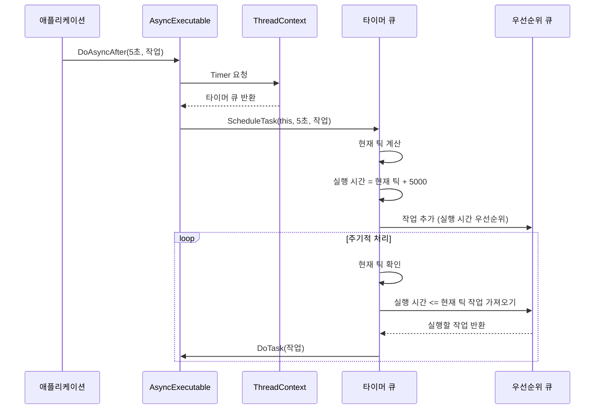
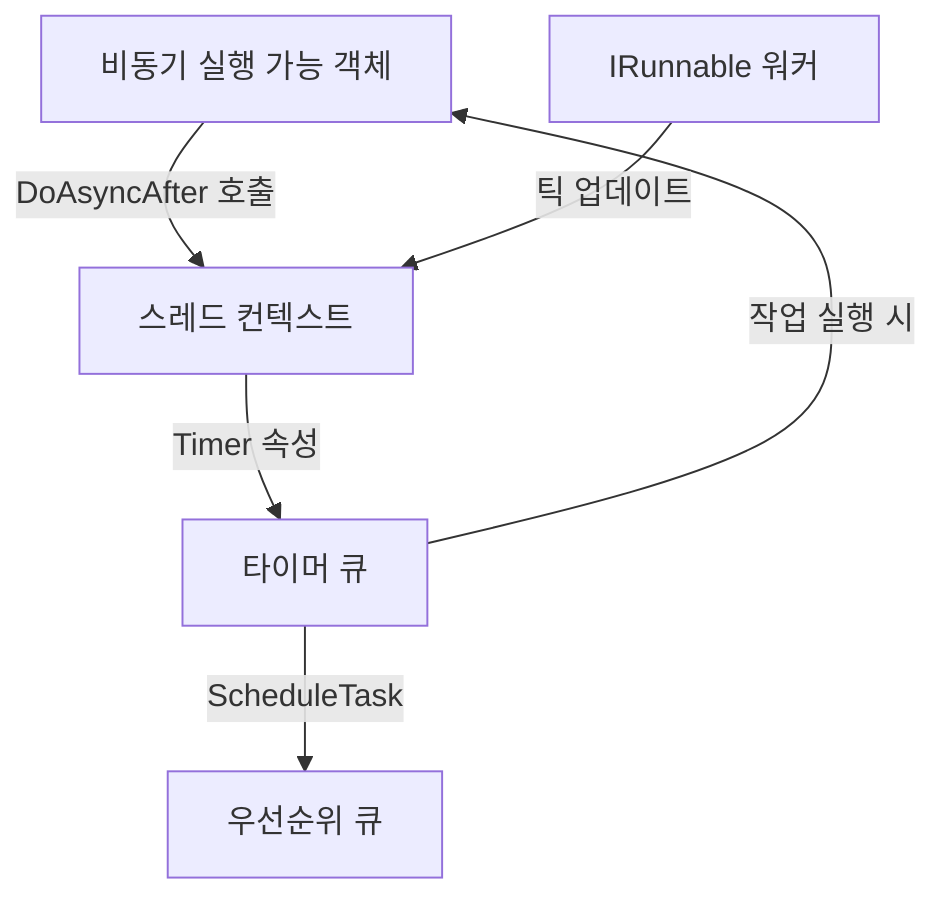

# Chapter 5. 타이머 큐(TimerQueue)

## 소개
[스레드 컨텍스트(ThreadContext)](04_스레드_컨텍스트_threadcontext__.md)에서 알아본 것처럼, 각 워커 스레드는 자신만의 환경에서 작업을 처리합니다. 이번 장에서는 이 환경의 중요한 구성 요소인 **타이머 큐(TimerQueue)**에 대해 알아보겠습니다.

## 타이머 큐란 무엇인가요?
타이머 큐는 시간 기반 작업을 관리하는 도구입니다. 이해하기 쉽게 알람 시계에 비유해 볼 수 있습니다:

- 일상 생활에서 우리는 특정 시간에 알림을 받기 위해 알람을 설정합니다
- 알람 시계는 설정된 시간이 되면 알림을 울립니다
- 여러 알람을 설정할 수 있고, 각 알람은 지정된 시간에 울립니다

`TimerQueue`는 이런 알람 시계와 같은 역할을 합니다. 프로그램에서 "나중에 이 작업을 실행해 주세요"라고 요청하면, 타이머 큐는 지정된 시간이 되었을 때 해당 작업을 실행합니다.
  

## 왜 타이머 큐가 필요한가요?
프로그래밍에서 특정 시간 후에 작업을 실행해야 하는 경우가 많습니다:

1. **지연 알림**: "5분 후에 사용자에게 알림 보내기"
2. **주기적 작업**: "매 10초마다 데이터 업데이트하기"
3. **타임아웃 처리**: "30초 동안 응답이 없으면 연결 끊기"
4. **재시도 로직**: "요청 실패 후 2초 뒤에 다시 시도하기"

이런 작업들을 수동으로 관리하는 것은 복잡합니다. 타이머 큐는 이런 시간 기반 작업을 효율적으로 관리하는 솔루션을 제공합니다.
  

## 타이머 큐의 핵심 기능
타이머 큐의 핵심 기능은 두 가지입니다:

1. **작업 예약(Schedule)**: 특정 시간 후에 실행될 작업을 등록합니다
2. **작업 실행(Execute)**: 예약된 시간이 되면 작업을 실행합니다

이 두 가지 기능을 통해 타이머 큐는 "나중에 실행"이라는 개념을 구현합니다.
  

## 타이머 큐 사용하기
타이머 큐는 주로 [비동기 실행 가능 객체(AsyncExecutable)](02_비동기_실행_가능_객체_asyncexecutable__.md)의 `DoAsyncAfter` 메서드를 통해 간접적으로 사용됩니다. 다음은 그 예입니다:

```csharp
public class NotificationService : AsyncExecutable
{
    // 5초 후에 알림 보내기
    public void SendDelayedNotification(string userId, string message)
    {
        Console.WriteLine($"알림 예약: {userId}, 메시지: {message}");
        
        // 5초 후에 실행할 작업 예약
        DoAsyncAfter(TimeSpan.FromSeconds(5), () => {
            Console.WriteLine($"알림 전송: {userId}, 메시지: {message}");
        });
    }
}
```

이 코드에서:
1. `SendDelayedNotification` 메서드는 먼저 알림 예약 메시지를 출력합니다
2. `DoAsyncAfter`를 호출하여 5초 후에 알림 전송 작업을 예약합니다
3. 5초 후에 콘솔에 알림 전송 메시지가 출력됩니다
  

## 직접 타이머 큐 사용하기
드물게 타이머 큐를 직접 사용해야 할 때도 있습니다. 다음은 그 예입니다:

```csharp
// 타이머 큐 가져오기
TimerQueue timer = ThreadContext.Timer;

// 작업 예약하기
timer.ScheduleTask(
    myExecutable,              // 실행자
    TimeSpan.FromSeconds(10),  // 10초 지연
    new Job(() => Console.WriteLine("10초 후 실행됨"))  // 작업
);
```

이 코드는:
1. 현재 스레드의 타이머 큐를 가져옵니다
2. 10초 후에 "10초 후 실행됨"을 출력하는 작업을 예약합니다
  

## 타이머 큐의 작동 원리
타이머 큐가 내부적으로 어떻게 작동하는지 이해하기 위해, 다음의 시퀀스 다이어그램을 살펴보겠습니다:



주요 작동 단계는 다음과 같습니다:

1. 애플리케이션이 `DoAsyncAfter`를 호출하여 지연 작업을 요청합니다
2. 내부적으로 `ThreadContext.Timer`를 통해 타이머 큐에 접근합니다
3. 타이머 큐는 현재 틱을 계산하고 지연 시간을 더해 실행 시간을 결정합니다
4. 작업은 실행 시간을 우선순위로 하여 우선순위 큐에 추가됩니다
5. 타이머 큐는 주기적으로 현재 틱을 확인하고 실행 시간이 된 작업을 처리합니다
  

## 우선순위 큐의 역할
타이머 큐는 내부적으로 **우선순위 큐(PriorityQueue)**를 사용합니다. 우선순위 큐는 항목들을 우선순위에 따라 정렬하여 가장 높은 우선순위(이 경우 가장 빨리 실행될 작업)를 먼저 꺼낼 수 있게 해줍니다.

```csharp
private readonly PriorityQueue<TimerJob, long> _queue = new();
```

이 우선순위 큐에서:
- `TimerJob`은 실행할 작업 정보를 담고 있는 레코드입니다
- `long` 타입의 우선순위는 작업이 실행될 시각(틱)입니다
- 가장 작은 값(가장 빨리 실행될 시각)이 가장 높은 우선순위를 가집니다
    

## 타이머 큐의 내부 구현
이제 타이머 큐의 내부 구현을 자세히 살펴보겠습니다. `TimerQueue.cs` 파일의 주요 부분입니다:

```csharp
public sealed class TimerQueue
{
    private readonly PriorityQueue<TimerJob, long> _queue = new();
    private readonly object _lock = new();
    private readonly PeriodicTimer _timer;
    private readonly DateTime _startTime = DateTime.UtcNow;
    
    // 생성자와 메서드...
}
```

여기서 중요한 부분은:
1. `_queue`: 예약된 작업들을 저장하는 우선순위 큐입니다
2. `_lock`: 여러 스레드에서 동시에 큐에 접근하는 것을 방지하는 락 객체입니다
3. `_timer`: 주기적으로 작업을 확인하는 타이머입니다
4. `_startTime`: 틱 계산의 기준이 되는 시작 시간입니다
  

## GetCurrentTick 메서드
타이머 큐는 시간을 "틱(tick)"이라는 단위로 관리합니다. 틱은 타이머 큐가 생성된 시점부터 경과한 밀리초입니다:

```csharp
public long GetCurrentTick() => (long)(DateTime.UtcNow - _startTime).TotalMilliseconds;
```

이 메서드는:
1. 현재 UTC 시간과 시작 시간의 차이를 계산합니다
2. 그 차이를 밀리초 단위로 변환하여 반환합니다

## ScheduleTask 메서드
`ScheduleTask` 메서드는 지연 작업을 예약하는 핵심 메서드입니다:

```csharp
public void ScheduleTask(AsyncExecutable owner, TimeSpan delay, JobEntry task)
{
    var dueTime = GetCurrentTick() + (long)delay.TotalMilliseconds;
    owner.AddRef(); // 타이머 참조 추가
    
    lock (_lock)
    {
        _queue.Enqueue(new TimerJob(owner, task), dueTime);
    }
}
```

이 메서드는:
1. 현재 틱에 지연 시간을 더해 실행 시간(dueTime)을 계산합니다
2. 실행자(owner)의 참조 카운트를 증가시킵니다(메모리 관리 목적)
3. 락을 사용하여 스레드 안전하게 작업을 큐에 추가합니다
4. 작업과 실행자 정보를 담은 `TimerJob`을 실행 시간을 우선순위로 하여 큐에 추가합니다
  

## 작업 처리 루프
타이머 큐는 백그라운드에서 주기적으로 작업을 처리하는 루프를 실행합니다:

```csharp
private async Task ProcessTimerJobsAsync(CancellationToken cancellationToken)
{
    while (await _timer.WaitForNextTickAsync(cancellationToken).ConfigureAwait(false))
    {
        ThreadContext.TickCount = GetCurrentTick();
        await ProcessDueJobsAsync();
    }
}
```

이 메서드는:
1. 주기적으로(기본 1밀리초) 깨어나서 작업을 확인합니다
2. 현재 틱을 `ThreadContext.TickCount`에 저장합니다
3. `ProcessDueJobsAsync`를 호출하여 실행 시간이 된 작업을 처리합니다
  

## 실행 시간이 된 작업 처리하기
`ProcessDueJobsAsync` 메서드는, 실행 시간이 된 작업을 찾아 실행합니다:

```csharp
private async Task ProcessDueJobsAsync()
{
    List<TimerJob>? jobsToExecute = null;
    
    lock (_lock)
    {
        var currentTick = GetCurrentTick();
        
        // 실행 시간이 된 작업 찾기
        while (_queue.Count > 0 && 
               _queue.TryPeek(out _, out var dueTime) && 
               currentTick >= dueTime)
        {
            jobsToExecute ??= new List<TimerJob>();
            jobsToExecute.Add(_queue.Dequeue());
        }
    }
    
    // 작업 실행
    // ...
}
```

이 코드는:
1. 현재 틱을 확인합니다
2. 큐에서 실행 시간이 된 작업을 찾습니다
3. 찾은 작업들을 리스트에 추가합니다
4. 락 밖에서 작업들을 실행합니다(코드 생략)
  

## 실제 사용 예: 채팅 시스템
타이머 큐의 실제 응용 사례로 채팅 시스템을 예로 들어보겠습니다:

```csharp
public class ChatRoom : AsyncExecutable
{
    // 사용자에게 환영 메시지 보내기
    public void UserJoined(string userId)
    {
        Console.WriteLine($"{userId}님이 입장했습니다.");
        
        // 5초 후에 환영 메시지 전송
        DoAsyncAfter(TimeSpan.FromSeconds(5), () => {
            Console.WriteLine($"{userId}님, 환영합니다! 도움이 필요하시면 /help를 입력하세요.");
        });
    }
}
```

이 예제에서:
1. 사용자가 채팅방에 입장하면 입장 메시지가 즉시 표시됩니다
2. 5초 후에 상세한 환영 메시지가 표시됩니다

이런 패턴은 사용자 경험을 향상시키는 데 유용합니다. 첫 메시지는 즉시 표시되어 반응성을 제공하고, 두 번째 메시지는 사용자가 환경에 적응할 시간을 준 후에 표시됩니다.
  

## 타이머 작업 취소하기
현재 `TimerQueue` 구현에서는 한 번 예약된 작업을 취소하는 직접적인 방법을 제공하지 않습니다. 하지만 간접적으로 취소하는 방법이 있습니다:

1. 작업이 예약될 때 상태 변수를 설정합니다
2. 작업 실행 시 상태를 확인하고 필요하면 아무 작업도 하지 않습니다

예제:

```csharp
public class CancellableTask : AsyncExecutable
{
    private bool _isCancelled = false;
    
    public void ScheduleTask()
    {
        _isCancelled = false;
        DoAsyncAfter(TimeSpan.FromSeconds(10), () => {
            if (!_isCancelled) {
                Console.WriteLine("작업 실행됨");
            }
        });
    }
    
    public void CancelTask()
    {
        _isCancelled = true;
    }
}
```

이 패턴을 사용하면 작업 자체는 예약된 시간에 실행되지만, 내부 로직에서 취소 상태를 확인하여 실제 작업 수행 여부를 결정할 수 있습니다.
  

## 타이머 큐의 활용 사례
타이머 큐는 다양한 시나리오에서 유용하게 활용될 수 있습니다:

1. **재시도 로직**: 
```csharp
public void SendRequest()
{
    try {
        // API 요청 시도
    }
    catch {
        // 2초 후 재시도
        DoAsyncAfter(TimeSpan.FromSeconds(2), SendRequest);
    }
}
```

2. **세션 타임아웃**:
```csharp
public void UserAuthenticated(string userId)
{
    // 30분 후 세션 만료
    DoAsyncAfter(TimeSpan.FromMinutes(30), () => {
        LogoutUser(userId);
    });
}
```

3. **주기적 데이터 갱신**:
```csharp
public void StartDataRefresh()
{
    RefreshData();
    // 10초마다 반복
    DoAsyncAfter(TimeSpan.FromSeconds(10), StartDataRefresh);
}
```

이런 패턴들은 시간 기반 로직을 간결하고 효과적으로 구현할 수 있게 해줍니다.
  

## 타이머 큐와 다른 구성 요소의 관계
타이머 큐는 `JobDispatcherNET` 라이브러리의 다른 구성 요소들과 밀접하게 연관되어 있습니다:



이 다이어그램에서:
1. [비동기 실행 가능 객체(AsyncExecutable)](02_비동기_실행_가능_객체_asyncexecutable__.md)는 `DoAsyncAfter`를 통해 지연 작업을 요청합니다
2. [스레드 컨텍스트(ThreadContext)](04_스레드_컨텍스트_threadcontext__.md)의 `Timer` 속성을 통해 타이머 큐에 접근합니다
3. 타이머 큐는 작업을 우선순위 큐에 저장합니다
4. 실행 시간이 되면 타이머 큐는 다시 비동기 실행 가능 객체에 작업 실행을 위임합니다
5. [실행 가능 인터페이스(IRunnable)](03_실행_가능_인터페이스_irunnable__.md) 워커는 틱을 업데이트하여 타이머 큐가 정확한 시간에 작업을 실행할 수 있게 합니다
  

## 실제 구현에서의 최적화
타이머 큐의 실제 구현에는 몇 가지 최적화가 포함되어 있습니다:

1. **우선순위 큐 사용**: 가장 빨리 실행될 작업을 효율적으로 찾을 수 있게 합니다
2. **스레드 안전성**: 락(`_lock`)을 사용하여 여러 스레드에서 안전하게 접근할 수 있게 합니다
3. **비동기 처리**: 작업 처리가 UI 스레드나 다른 중요한 작업을 차단하지 않게 합니다
4. **참조 카운팅**: 실행자(owner)의 참조 카운트를 관리하여 메모리 누수를 방지합니다

이런 최적화를 통해 타이머 큐는 많은 수의 지연 작업을 효율적으로 처리할 수 있습니다.
  

## 요약 및 다음 단계
이번 장에서는 **타이머 큐(TimerQueue)**의 개념과 사용법에 대해 알아보았습니다. 타이머 큐는 알람 시계와 같이 특정 시간에 작업을 실행해 주는 도구로, `JobDispatcherNET` 라이브러리에서 시간 기반 작업을 관리하는 중요한 역할을 합니다.

주요 내용:
- 타이머 큐는 지연 작업을 예약하고 실행하는 메커니즘을 제공합니다
- 우선순위 큐를 사용하여 실행 시간에 따라 작업을 관리합니다
- 비동기 실행 가능 객체의 `DoAsyncAfter` 메서드를 통해 주로 사용됩니다
- 재시도 로직, 세션 타임아웃, 주기적 작업 등 다양한 시나리오에 활용될 수 있습니다
- 스레드 컨텍스트, 비동기 실행 가능 객체, 실행 가능 인터페이스와 함께 작동하여 효율적인 시간 기반 작업 처리를 가능하게 합니다

다음 장에서는 [작업 항목(JobEntry)](06_작업_항목_jobentry__.md)에 대해 알아보겠습니다. 작업 항목은 실행될 작업의 정보를 담고 있는 객체로, 타이머 큐와 비동기 실행 가능 객체에서 처리하는 작업의 기본 단위입니다.

즐거운 프로그래밍 되세요!

---

Generated by [AI Codebase Knowledge Builder](https://github.com/The-Pocket/Tutorial-Codebase-Knowledge)