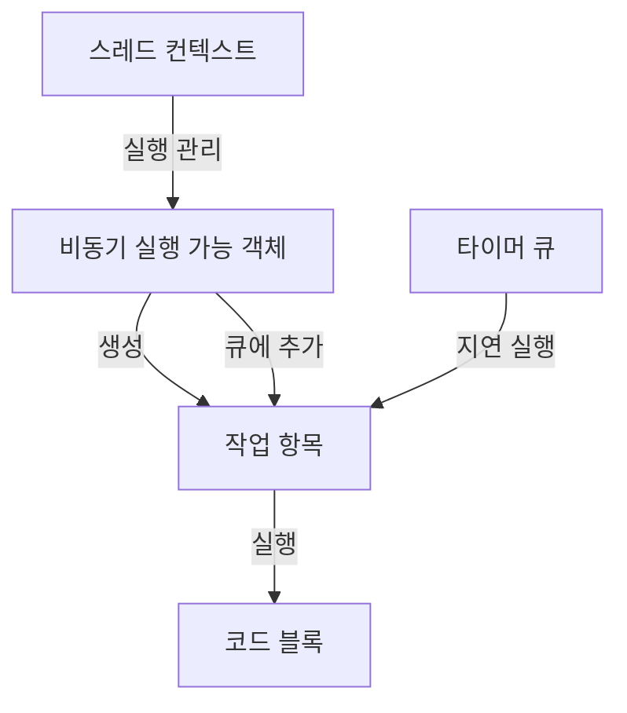
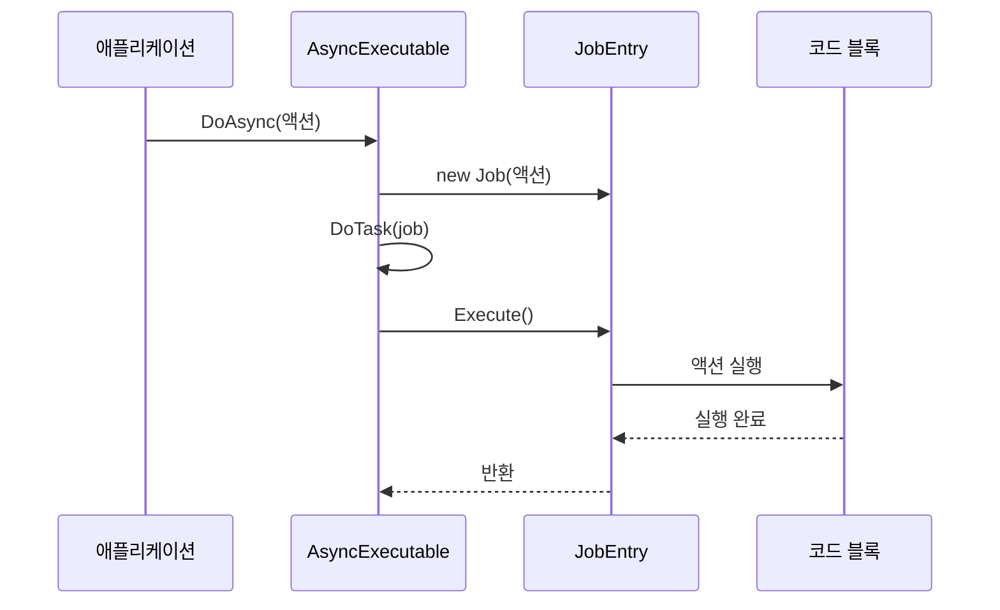

# Chapter 6. 작업 항목(JobEntry)

## 소개
[타이머 큐(TimerQueue)](05_타이머_큐_timerqueue__.md)에서 알아본 것처럼, 시간 기반 작업을 관리하는 것은 비동기 프로그램에서 중요한 부분입니다. 이번 장에서는 `JobDispatcherNET` 라이브러리의 중요한 구성 요소인 **작업 항목(JobEntry)**에 대해 알아보겠습니다.

## 작업 항목이란 무엇인가요?
작업 항목은 시스템에서 실행될 작업을 나타내는 객체입니다. 쉽게 이해하기 위해 음식점의 주문서에 비유해 볼 수 있습니다:

- 손님(클라이언트)이 주문을 합니다
- 주문서(JobEntry)에 무엇을 요리할지 기록됩니다
- 주방 직원(스레드)이 주문서를 받아 요리(작업)를 만듭니다
- 주문서는 각 요리사가 이해할 수 있는 표준 형식으로 작성됩니다

`JobEntry`는 이런 주문서와 같은 역할을 합니다. 시스템이 수행해야 할 작업을 표준화된 방식으로 정의하여, 어떤 워커 스레드에서도 동일하게 처리될 수 있게 해줍니다.

## 왜 작업 항목이 필요한가요?
복잡한 시스템에서는 다양한 유형의 작업이 존재합니다. 이런 작업들을 효율적으로 관리하기 위해서는:

1. **표준화**: 모든 작업이 동일한 인터페이스를 따라야 합니다
2. **캡슐화**: 작업에 필요한 모든 정보와 로직이 하나의 객체에 포함되어야 합니다
3. **유연성**: 다양한 유형의 작업을 지원할 수 있어야 합니다

`JobEntry`는 이런 요구사항을 충족하기 위한 추상 클래스로 설계되었습니다. 모든 작업이 동일한 인터페이스(`Execute` 메서드)를 제공하면서도, 내부 구현은 자유롭게 변경할 수 있습니다.
  

## JobEntry 클래스 이해하기
`JobEntry` 클래스의 기본 구조는 매우 간단합니다:

```csharp
public abstract class JobEntry
{
    public abstract void Execute();
}
```

여기서 중요한 점은:
1. `abstract` 클래스로 선언되어 있어 직접 인스턴스화할 수 없습니다
2. `Execute()` 메서드가 추상 메서드로 선언되어 있어 하위 클래스에서 반드시 구현해야 합니다

이 간단한 디자인을 통해 모든 작업 항목이 동일한 방식으로 실행될 수 있습니다.
  

## Job 클래스: JobEntry의 구현체
`JobDispatcherNET`에서는 기본적인 작업 구현체로 `Job` 클래스를 제공합니다:

```csharp
public sealed class Job : JobEntry
{
    private readonly Action _action;

    public Job(Action action)
    {
        _action = action;
    }

    public override void Execute() => _action();
}
```

이 코드에서:
1. `Job` 클래스는 `JobEntry`를 상속받습니다
2. 생성자에서 `Action` 델리게이트를 받아 저장합니다
3. `Execute` 메서드에서는 저장된 액션을 실행합니다

이 구현을 통해 어떤 코드 블록(람다 식이나 메서드)도 작업으로 래핑할 수 있습니다.
  

## 작업 항목 사용하기
실제로 작업 항목을 어떻게 사용하는지 예제를 통해 알아보겠습니다. 먼저 기본적인 사용법입니다:

```csharp
// 1. 직접 Job 객체 생성
var job = new Job(() => Console.WriteLine("안녕하세요!"));

// 2. 작업 실행
job.Execute(); // 출력: 안녕하세요!
```

그러나 실제로는 대부분 [비동기 실행 가능 객체(AsyncExecutable)](02_비동기_실행_가능_객체_asyncexecutable__.md)의 `DoAsync` 메서드를 통해 간접적으로 사용합니다:

```csharp
public class MyProcessor : AsyncExecutable
{
    public void SayHello(string name)
    {
        // 내부적으로 Job 객체를 생성합니다
        DoAsync(() => {
            Console.WriteLine($"안녕하세요, {name}님!");
        });
    }
}
```

이 코드에서 `DoAsync` 메서드는 내부적으로 `Job` 객체를 생성하여 작업 큐에 추가합니다.
  

## 사용자 정의 작업 항목 만들기
특별한 요구사항이 있을 경우, 자신만의 작업 항목 클래스를 만들 수 있습니다:

```csharp
public class DatabaseJob : JobEntry
{
    private readonly string _query;
    private readonly Action<object> _callback;
    
    public DatabaseJob(string query, Action<object> callback)
    {
        _query = query;
        _callback = callback;
    }
    
    public override void Execute()
    {
        var result = ExecuteQuery(_query);
        _callback(result);
    }
    
    private object ExecuteQuery(string query)
    {
        // 데이터베이스 쿼리 실행 코드
        return new object(); // 결과 반환
    }
}
```

이런 사용자 정의 작업 항목은 더 복잡한 로직이나 추가 데이터가 필요한 경우에 유용합니다.
  

## 작업 항목과 다른 구성 요소의 관계
작업 항목은 `JobDispatcherNET`의 다른 구성 요소들과 밀접하게 연결되어 있습니다:



이 다이어그램에서:
1. [비동기 실행 가능 객체(AsyncExecutable)](02_비동기_실행_가능_객체_asyncexecutable__.md)는 `DoAsync`나 `DoAsyncAfter`를 통해 작업 항목을 생성합니다
2. 작업 항목은 `Execute` 메서드를 통해 실제 코드 블록을 실행합니다
3. [타이머 큐(TimerQueue)](05_타이머_큐_timerqueue__.md)는 지연 실행이 필요한 작업 항목을 관리합니다
4. 스레드 컨텍스트는 비동기 실행 가능 객체의 실행을 관리합니다
  

## 내부 구현 살펴보기
작업 항목이 어떻게 내부적으로 작동하는지 시퀀스 다이어그램으로 살펴보겠습니다:



주요 실행 단계는 다음과 같습니다:

1. 애플리케이션이 `AsyncExecutable`의 `DoAsync` 메서드를 호출합니다
2. `DoAsync`는 전달받은 액션으로 `Job` 객체를 생성합니다
3. 생성된 작업은 `DoTask` 메서드를 통해 처리됩니다
4. 작업이 실행될 차례가 되면 `Execute` 메서드가 호출됩니다
5. `Execute` 메서드는 저장된 액션을 실행합니다
  

## DoAsync 메서드의 내부 구현
[비동기 실행 가능 객체(AsyncExecutable)](02_비동기_실행_가능_객체_asyncexecutable__.md)의 `DoAsync` 메서드는 작업 항목을 어떻게 생성하고 처리하는지 살펴보겠습니다:

```csharp
public void DoAsync(Action action)
{
    var job = new Job(action);
    DoTask(job);
}
```

이 코드는 매우 간단합니다:
1. 전달받은 `action`을 사용하여 `Job` 객체를 생성합니다
2. 생성된 작업을 `DoTask` 메서드에 전달합니다

`DoTask` 메서드는 작업을 큐에 추가하고 적절한 시점에 실행되도록 합니다.
  
  
## 작업 실행 과정
작업이 실제로 실행되는 과정은 `AsyncExecutable`의 `Flush` 메서드에서 처리됩니다:
  
```csharp
internal void Flush()
{
    while (true)
    {
        if (_jobQueue.Reader.TryRead(out var job))
        {
            try
            {
                job.Execute();
            }
            catch (Exception ex)
            {
                Console.WriteLine($"작업 실행 오류: {ex}");
            }
            
            // 남은 작업 카운트 감소
            if (Interlocked.Decrement(ref _remainingTaskCount) == 0)
                break;
        }
    }
}
```

이 코드에서:
1. 작업 큐에서 작업을 하나 꺼냅니다
2. 작업의 `Execute` 메서드를 호출합니다
3. 예외가 발생하면 기록합니다
4. 남은 작업 카운트를 감소시키고, 0이 되면 루프를 종료합니다

이 과정을 통해 큐에 있는 모든 작업이 안전하게 실행됩니다.
  

## DoAsyncAfter와 타이머 작업
지연 실행을 위한 `DoAsyncAfter` 메서드도 `JobEntry`를 기반으로 합니다:

```csharp
public void DoAsyncAfter(TimeSpan delay, Action action)
{
    var job = new Job(action);
    ThreadContext.Timer.ScheduleTask(this, delay, job);
}
```

이 코드에서:
1. 전달받은 `action`으로 `Job` 객체를 생성합니다
2. [타이머 큐(TimerQueue)](05_타이머_큐_timerqueue__.md)에 작업과 지연 시간을 등록합니다

지정된 지연 시간이 지나면 타이머 큐는 작업을 실행합니다.
  
  
## 실제 사용 예: 데이터 처리기
이제 작업 항목을 사용한 실제 예제를 살펴보겠습니다. 다음은 데이터 처리기의 예입니다:

```csharp
public class DataProcessor : AsyncExecutable
{
    private readonly Dictionary<string, int> _data = new();
    
    // 데이터 추가 메서드
    public void AddData(string key, int value)
    {
        DoAsync(() => {
            if (_data.ContainsKey(key))
                _data[key] += value;
            else
                _data[key] = value;
                
            Console.WriteLine($"데이터 추가됨: {key} = {_data[key]}");
        });
    }
}
```

이 예제에서:
1. `AddData` 메서드는 `DoAsync`를 통해 비동기적으로 데이터를 추가합니다
2. 내부적으로 `Job` 객체가 생성되어 작업 큐에 추가됩니다
3. 작업이 실행될 때 딕셔너리에 데이터가 추가됩니다

이 패턴을 사용하면 여러 스레드에서 동시에 `AddData`를 호출하더라도 데이터가 안전하게 처리됩니다.
  

## 작업 항목 확장하기
때로는 더 복잡한 작업 처리가 필요할 수 있습니다. 예를 들어, 진행 상황을 보고하는 작업을 만들어 보겠습니다:

```csharp
public class ProgressReportingJob : JobEntry
{
    private readonly Action _action;
    private readonly Action<int> _progressCallback;
    private readonly int _totalSteps;
    
    public ProgressReportingJob(Action action, Action<int> progressCallback, int totalSteps)
    {
        _action = action;
        _progressCallback = progressCallback;
        _totalSteps = totalSteps;
    }
    
    public override void Execute()
    {
        for (int i = 0; i <= _totalSteps; i++)
        {
            // 진행 상황 보고
            _progressCallback(i * 100 / _totalSteps);
            
            // 일부 작업 수행
            if (i == _totalSteps)
                _action();
        }
    }
}
```

이런 확장된 작업 항목은 특별한 요구사항이 있는 경우에 유용합니다.
  

## 작업 항목과 비동기 작업
비동기 작업(`async/await`)을 `JobEntry`와 함께 사용할 때 주의해야 할 점이 있습니다. 기본 `Execute` 메서드는 동기적(void 반환)이기 때문에, 비동기 작업을 올바르게 처리하려면 추가 작업이 필요합니다:

```csharp
public class AsyncJob : JobEntry
{
    private readonly Func<Task> _asyncAction;
    
    public AsyncJob(Func<Task> asyncAction)
    {
        _asyncAction = asyncAction;
    }
    
    public override void Execute()
    {
        // 비동기 작업을 동기적으로 실행
        // 주의: 실제 코드에서는 데드락 방지를 위한 추가 처리 필요
        _asyncAction().GetAwaiter().GetResult();
    }
}
```

이 패턴을 사용할 때는 데드락 가능성에 주의해야 합니다. 복잡한 비동기 시나리오에서는 더 정교한 해결책이 필요할 수 있습니다.
  

## 작업 항목의 활용 시나리오
작업 항목은 다양한 시나리오에서 활용될 수 있습니다:

1. **채팅 메시지 처리**: 
```csharp
public void ProcessMessage(string userId, string message)
{
    DoAsync(() => {
        // 메시지 처리 로직
        Console.WriteLine($"{userId}: {message}");
    });
}
```

2. **데이터베이스 작업**:
```csharp
public void SaveUser(User user)
{
    DoAsync(() => {
        // 사용자 정보 저장
        _database.Save(user);
        Console.WriteLine($"사용자 저장됨: {user.Name}");
    });
}
```

3. **지연된 알림**:
```csharp
public void RemindUser(string userId, string message)
{
    DoAsyncAfter(TimeSpan.FromMinutes(5), () => {
        // 5분 후 알림 전송
        _notificationService.Send(userId, message);
    });
}
```

이런 패턴들은 코드를 쉽게 구조화하고 멀티스레딩 환경에서 안전하게 실행할 수 있게 해줍니다.
  

## 요약 및 다음 단계
이번 장에서는 **작업 항목(JobEntry)**의 개념과 사용법에 대해 알아보았습니다. 작업 항목은 실행될 작업을 표현하는 객체로, 음식점의 주문서와 같이 시스템이 수행해야 할 작업을 표준화된 방식으로 정의합니다.

주요 내용:
- `JobEntry`는 작업을 표현하는 추상 클래스로, `Execute` 메서드를 정의합니다
- `Job` 클래스는 `Action` 델리게이트를 사용하여 `JobEntry`를 구현합니다
- 작업 항목은 주로 [비동기 실행 가능 객체(AsyncExecutable)](02_비동기_실행_가능_객체_asyncexecutable__.md)의 `DoAsync`와 `DoAsyncAfter`를 통해 사용됩니다
- 특별한 요구사항이 있을 경우 사용자 정의 작업 항목을 만들 수 있습니다
- 작업 항목은 멀티스레딩 환경에서 안전하게 작업을 실행할 수 있게 해줍니다

작업 항목은 [비동기 실행 가능 객체(AsyncExecutable)](02_비동기_실행_가능_객체_asyncexecutable__.md), [타이머 큐(TimerQueue)](05_타이머_큐_timerqueue__.md), [스레드 컨텍스트(ThreadContext)](04_스레드_컨텍스트_threadcontext__.md)와 함께 작동하여 효율적인 비동기 작업 처리 환경을 구축합니다.

다음 장에서는 [데이터 프로세서(DataProcessor)](07_데이터_프로세서_dataprocessor__.md)에 대해 알아보겠습니다. 데이터 프로세서는 작업 항목과 비동기 실행 가능 객체를 활용하여 데이터를 효율적으로 처리하는 방법을 보여줍니다.

즐거운 프로그래밍 되세요!

---

Generated by [AI Codebase Knowledge Builder](https://github.com/The-Pocket/Tutorial-Codebase-Knowledge)