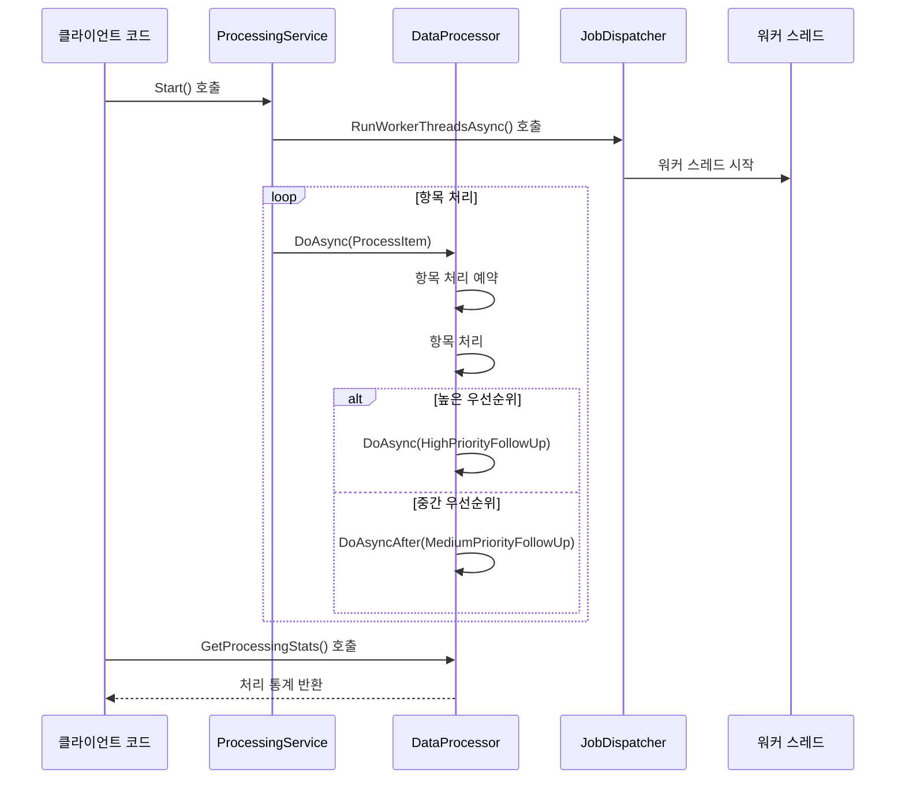

# Chapter 7. 예제: 데이터 프로세서(DataProcessor)

## 소개
[작업 항목(JobEntry)](06_작업_항목_jobentry__.md)에서 살펴본 것처럼, 비동기 작업을 효율적으로 관리하는 것은 복잡한 애플리케이션에서 중요합니다. 이번 장에서는 `JobDispatcherNET` 라이브러리의 실제 활용 사례인 **데이터 프로세서(DataProcessor)**에 대해 알아보겠습니다.

## 데이터 프로세서란 무엇인가요?
데이터 프로세서는 [비동기 실행 가능 객체(AsyncExecutable)](02_비동기_실행_가능_객체_asyncexecutable__.md)를 활용하여 다양한 데이터 항목을 처리하는 구성 요소입니다. 이해를 돕기 위해 문서 처리 부서의 비유를 들어보겠습니다:

- 문서 처리 부서에는 여러 종류의 문서(데이터 항목)가 들어옵니다
- 각 문서는 중요도(우선순위)에 따라 분류됩니다
- 직원들은 문서를 처리하고, 중요도에 따라 후속 작업을 계획합니다
- 모든 처리 내역은 기록되어 통계를 낼 수 있습니다

`DataProcessor`는 이런 문서 처리 부서와 같은 역할을 합니다. 다양한 데이터 항목을 받아 처리하고, 우선순위에 따라 후속 작업을 예약하며, 처리 통계를 관리합니다.
  

## 데이터 프로세서가 해결하는 문제
실제 비즈니스 애플리케이션에서는 다음과 같은 문제가 발생할 수 있습니다:

1. **다양한 데이터 항목**: 여러 종류의 데이터를 처리해야 합니다
2. **우선순위 처리**: 일부 항목은 다른 항목보다 중요하므로 빠르게 처리해야 합니다
3. **후속 작업**: 데이터 처리 후 추가 작업이 필요할 수 있습니다
4. **통계 추적**: 처리된 항목들의 통계를 유지해야 합니다
5. **병렬 처리**: 효율성을 위해 여러 작업자가 동시에 작업해야 합니다

데이터 프로세서는 [비동기 실행 가능 객체(AsyncExecutable)](02_비동기_실행_가능_객체_asyncexecutable__.md)의 특성을 활용하여 이러한 문제를 해결합니다.
  

## DataProcessor 클래스 구조
`DataProcessor` 클래스의 기본 구조는 다음과 같습니다:

```csharp
public class DataProcessor : AsyncExecutable
{
    private readonly Dictionary<string, int> _processedItems = new();
    private readonly object _lock = new();
    
    // 메서드들...
}
```

이 코드에서:
1. `DataProcessor`는 `AsyncExecutable`을 상속받아 비동기 작업 처리 기능을 활용합니다
2. `_processedItems` 딕셔너리는 처리된 항목의 ID와 처리 횟수를 저장합니다
3. `_lock` 객체는 멀티스레드 환경에서 딕셔너리 접근을 안전하게 합니다
  

## 항목 처리 메서드
데이터 프로세서의 핵심은 항목을 처리하는 메서드입니다:

```csharp
public void ProcessItem(string itemId, int priority)
{
    Console.WriteLine($"[스레드 {Environment.CurrentManagedThreadId}] " + 
                     $"항목 {itemId} 처리 중, 우선순위: {priority}");

    // 처리 작업 시뮬레이션
    Thread.Sleep(100 * (1 + Random.Shared.Next(5)));
    
    // 처리 통계 업데이트
    lock (_lock)
    {
        // 항목 처리 카운트 증가
    }
    
    // 우선순위에 따른 후속 작업 예약
    if (priority > 5)
    {
        // 높은 우선순위 후속 작업
    }
    else if (priority > 2)
    {
        // 중간 우선순위 후속 작업
    }
}
```

이 메서드는:
1. 항목 ID와 우선순위를 매개변수로 받습니다
2. 현재 스레드 ID와 함께 처리 정보를 출력합니다
3. 처리 작업을 시뮬레이션합니다 (실제 환경에서는 실제 처리 로직이 들어갑니다)
4. 항목 처리 통계를 안전하게 업데이트합니다
5. 우선순위에 따라 다른 후속 작업을 예약합니다
  

## 처리 통계 업데이트
항목이 처리될 때마다 통계를 업데이트하는 코드를 자세히 살펴보겠습니다:

```csharp
lock (_lock)
{
    if (_processedItems.TryGetValue(itemId, out var count))
    {
        _processedItems[itemId] = count + 1;
    }
    else
    {
        _processedItems[itemId] = 1;
    }
}
```

이 코드는:
1. `_lock` 객체를 사용하여 딕셔너리 접근을 동기화합니다
2. 항목 ID가 이미 딕셔너리에 있는지 확인합니다
3. 있으면 카운트를 증가시키고, 없으면 새로 추가합니다

이렇게 하면 여러 스레드가 동시에 같은 항목을 처리하더라도 통계가 정확하게 유지됩니다.
  

## 우선순위 기반 후속 작업
우선순위에 따라 다른 후속 작업을 예약하는 부분을 살펴보겠습니다:

```csharp
// 우선순위에 따른 후속 작업 예약
if (priority > 5)
{
    DoAsync(() => HighPriorityFollowUp(itemId));
}
else if (priority > 2)
{
    DoAsyncAfter(TimeSpan.FromMilliseconds(500), 
                () => MediumPriorityFollowUp(itemId));
}
```

이 코드는:
1. 우선순위가 5보다 크면 높은 우선순위 후속 작업을 즉시 예약합니다
2. 우선순위가 2보다 크고 5 이하면 중간 우선순위 후속 작업을 500ms 후에 예약합니다
3. 우선순위가 2 이하면 후속 작업을 예약하지 않습니다

이 패턴은 실제 비즈니스 로직에서 우선순위에 따라 작업을 처리하는 방법을 보여줍니다.
  

## 후속 작업 메서드
후속 작업을 처리하는 메서드들도 살펴보겠습니다:

```csharp
private void HighPriorityFollowUp(string itemId)
{
    Console.WriteLine($"[스레드 {Environment.CurrentManagedThreadId}] " + 
                     $"{itemId}에 대한 고우선순위 후속 작업");
    // 처리 로직
}

private void MediumPriorityFollowUp(string itemId)
{
    Console.WriteLine($"[스레드 {Environment.CurrentManagedThreadId}] " + 
                     $"{itemId}에 대한 중간우선순위 후속 작업");
    // 처리 로직
}
```

이 메서드들은:
1. 현재 스레드 ID와 항목 ID를 출력합니다
2. 우선순위에 따른 다른 후속 처리 작업을 수행합니다 (실제 환경에서는 구체적인 로직이 구현됩니다)
  

## 통계 조회 메서드
처리된 항목의 통계를 조회하는 메서드도 있습니다:

```csharp
public Dictionary<string, int> GetProcessingStats()
{
    lock (_lock)
    {
        return new Dictionary<string, int>(_processedItems);
    }
}
```

이 메서드는:
1. `_lock` 객체를 사용하여 안전하게 딕셔너리에 접근합니다
2. 처리된 항목의 ID와 처리 횟수가 담긴 딕셔너리의 복사본을 반환합니다

복사본을 반환함으로써 외부에서 딕셔너리를 수정할 수 없게 하여 데이터 무결성을 유지합니다.
  

## 프로세싱 서비스
데이터 프로세서를 사용하는 서비스 클래스도 살펴보겠습니다:

```csharp
public class ProcessingService : IAsyncDisposable
{
    private readonly DataProcessor _processor = new();
    private readonly List<string> _items = new();
    private readonly JobDispatcher<ProcessingWorker> _dispatcher;
    
    // 생성자와 메서드들...
}
```

이 서비스는:
1. `DataProcessor` 인스턴스를 생성합니다
2. 처리할 항목 목록을 관리합니다
3. [작업 디스패처(JobDispatcher)](01_작업_디스패처_jobdispatcher__.md)를 사용하여 워커 스레드를 관리합니다
  

## 서비스 시작 메서드
프로세싱 서비스의 시작 메서드는 다음과 같습니다:

```csharp
public void Start()
{
    // 항목 처리 제출
    _processingTask = Task.Run(async () =>
    {
        for (int i = 0; i < _maxItems; i++)
        {
            string item = _items[Random.Shared.Next(_items.Count)];
            int priority = Random.Shared.Next(1, 10);

            _processor.DoAsync(() => _processor.ProcessItem(item, priority));

            await Task.Delay(Random.Shared.Next(10, 50));
        }
    });

    // 워커 스레드 시작
    _ = _dispatcher.RunWorkerThreadsAsync();
}
```

이 메서드는:
1. 백그라운드 태스크를 시작하여 항목을 처리합니다
2. 무작위로 항목과 우선순위를 선택합니다
3. `DoAsync`를 사용하여 항목 처리를 비동기적으로 예약합니다
4. 작업 디스패처를 시작하여 워커 스레드를 실행합니다

여기서 주목할 점은 `_processor.DoAsync(() => _processor.ProcessItem(item, priority))`입니다. 이 패턴은 항목 처리를 비동기적으로 실행하면서도 스레드 안전성을 보장합니다.
  

## 내부 작동 원리
데이터 프로세서가 어떻게 작동하는지 시퀀스 다이어그램으로 살펴보겠습니다:



이 다이어그램에서:
1. 클라이언트 코드가 서비스의 `Start()` 메서드를 호출합니다
2. 서비스는 디스패처를 통해 워커 스레드를 시작합니다
3. 서비스는 프로세서에 항목 처리를 요청합니다
4. 프로세서는 항목을 처리하고 우선순위에 따라 후속 작업을 예약합니다
5. 클라이언트는 나중에 처리 통계를 요청할 수 있습니다
  

## 비즈니스 로직 구현 패턴
데이터 프로세서 패턴은 실제 비즈니스 로직을 구현할 때 다음과 같은 이점을 제공합니다:

1. **스레드 안전성**: `AsyncExecutable`을 상속받아 모든 작업이 동일한 스레드에서 순차적으로 실행되므로 락이 최소화됩니다
2. **우선순위 처리**: 우선순위에 따라 작업을 즉시 또는 지연 실행할 수 있습니다
3. **모듈성**: 각 후속 작업을 별도의 메서드로 분리하여 코드 가독성을 높입니다
4. **확장성**: 워커 스레드 수를 조절하여 시스템 부하에 따라 확장할 수 있습니다
  

## 실제 활용 사례
데이터 프로세서 패턴은 다음과 같은 실제 시나리오에서 유용합니다:

1. **문서 처리 시스템**: 다양한 유형의 문서를 처리하고 후속 작업을 예약
2. **주문 처리 시스템**: 주문을 접수하고 우선순위에 따라 처리
3. **알림 시스템**: 알림을 받아 중요도에 따라 즉시 또는 나중에 처리
4. **로그 분석**: 로그 데이터를 수집하고 중요도에 따라 분석 작업 예약
5. **결제 처리**: 결제 요청을 받아 처리하고 후속 확인 작업 예약

예를 들어, 온라인 쇼핑몰에서 주문 처리 시스템은 다음과 같이 구현할 수 있습니다:

```csharp
public class OrderProcessor : AsyncExecutable
{
    public void ProcessOrder(Order order)
    {
        DoAsync(() => {
            // 주문 처리 로직
            
            if (order.IsExpressDelivery)
            {
                DoAsync(() => ProcessHighPriorityShipping(order));
            }
            else
            {
                DoAsyncAfter(TimeSpan.FromHours(1), 
                            () => ProcessStandardShipping(order));
            }
        });
    }
}
```

이 패턴을 사용하면 주문을 안전하게 처리하고, 배송 유형에 따라 적절한 후속 작업을 예약할 수 있습니다.
  

## 더 복잡한 예제: 다단계 처리
더 복잡한 경우, 여러 단계의 처리가 필요할 수 있습니다:

```csharp
public void ProcessComplexItem(string itemId, int priority)
{
    DoAsync(() => {
        // 1단계 처리
        Console.WriteLine($"1단계 처리: {itemId}");
        
        // 다음 단계 예약
        DoAsyncAfter(TimeSpan.FromSeconds(1), () => {
            // 2단계 처리
            Console.WriteLine($"2단계 처리: {itemId}");
            
            if (priority > 5)
            {
                // 마지막 단계 즉시 예약
                DoAsync(() => FinalizeProcessing(itemId));
            }
        });
    });
}
```

이 패턴은 워크플로우나 파이프라인과 같은 다단계 처리에 유용합니다.
  

## 확장: 오류 처리와 재시도
실제 환경에서는 오류 처리와 재시도 메커니즘이 중요합니다:

```csharp
public void ProcessWithRetry(string itemId)
{
    DoAsync(() => {
        try
        {
            // 처리 로직
            ProcessItem(itemId, 5);
        }
        catch (Exception ex)
        {
            Console.WriteLine($"오류 발생: {ex.Message}");
            
            // 3초 후 재시도
            DoAsyncAfter(TimeSpan.FromSeconds(3), 
                        () => ProcessWithRetry(itemId));
        }
    });
}
```

이 패턴은 일시적인 오류가 발생했을 때 자동으로 재시도하도록 하여 시스템 안정성을 높입니다.
  

## 요약 및 다음 단계
이번 장에서는 **데이터 프로세서(DataProcessor)**의 개념과 활용법에 대해 알아보았습니다. 데이터 프로세서는 [비동기 실행 가능 객체(AsyncExecutable)](02_비동기_실행_가능_객체_asyncexecutable__.md)를 활용하여 다양한 데이터 항목을 처리하고, 우선순위에 따라 후속 작업을 예약하는 패턴입니다.

주요 내용:
- 데이터 프로세서는 문서 처리 부서와 같이 다양한 항목을 처리하는 구성 요소입니다
- 항목은 우선순위에 따라 다른 방식으로 처리됩니다
- `DoAsync`와 `DoAsyncAfter`를 활용하여 후속 작업을 예약합니다
- 처리 통계를 유지하여 시스템 성능을 모니터링할 수 있습니다
- 실제 비즈니스 시나리오에서 작업 디스패처와 비동기 실행 가능 객체를 효과적으로 활용하는 방법을 보여줍니다

데이터 프로세서 패턴은 문서 처리, 주문 처리, 알림 시스템 등 다양한 실제 비즈니스 시나리오에서 활용할 수 있습니다. 이 패턴을 통해 복잡한 비동기 작업 흐름을 체계적으로 관리하고, 우선순위에 따라 효율적으로 리소스를 분배할 수 있습니다.

다음 장에서는 [채팅 서버(ChatServer)](08_채팅_서버_chatserver__.md)에 대해 알아보겠습니다. 채팅 서버는 데이터 프로세서보다 더 복잡한 실제 시스템으로, `JobDispatcherNET` 라이브러리의 여러 구성 요소를 종합적으로 활용하는 방법을 보여줍니다.

즐거운 프로그래밍 되세요!

---
Generated by [AI Codebase Knowledge Builder](https://github.com/The-Pocket/Tutorial-Codebase-Knowledge)