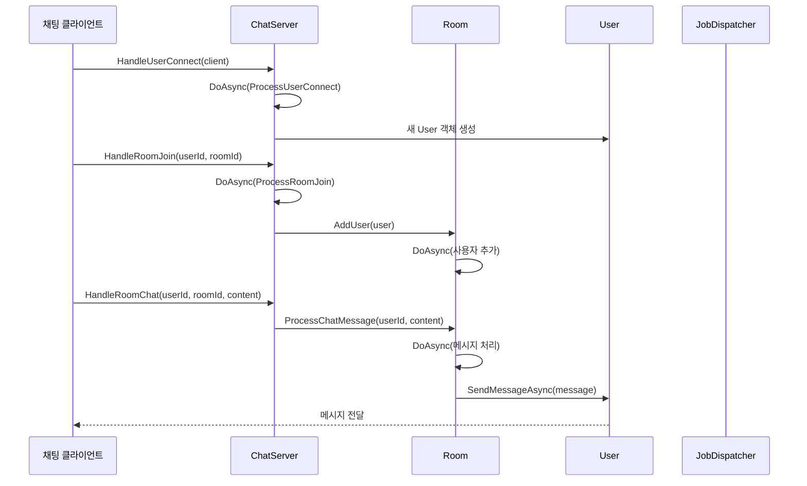
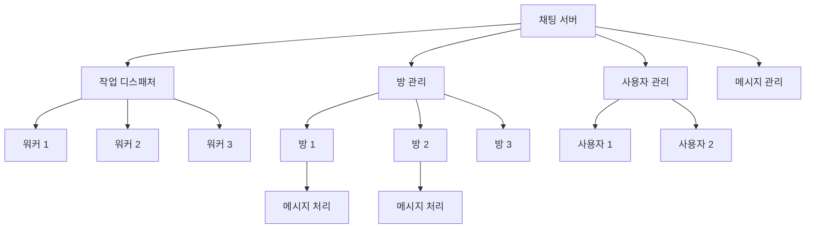

# Chapter 8. 에제제: 채팅 서버(ChatServer)
[데이터 프로세서(DataProcessor)](07_데이터_프로세서_dataprocessor__.md)에서 살펴본 것처럼, `JobDispatcherNET` 라이브러리는 비동기 작업을 효율적으로 처리하는 다양한 도구를 제공합니다. 이번 장에서는 이러한 도구들을 활용한 실제 애플리케이션인 **채팅 서버(ChatServer)**에 대해 알아보겠습니다.
  

## 채팅 서버란 무엇인가요?
채팅 서버는 여러 사용자가 실시간으로 메시지를 주고받을 수 있게 해주는 시스템입니다. 이해하기 쉽게 호텔의 컨시어지 서비스에 비유해 볼 수 있습니다:

- 호텔 컨시어지(채팅 서버)는 모든 투숙객(사용자)의 요청을 관리합니다
- 여러 회의실(채팅방)을 관리하고 사용자들의 입장과 퇴장을 처리합니다
- 투숙객 간의 메시지를 전달하고 필요한 정보를 제공합니다
- 여러 직원(워커 스레드)을 통해 많은 요청을 동시에 처리할 수 있습니다

`ChatServer` 클래스는 이런 호텔 컨시어지와 같은 역할을 수행하며, [비동기 실행 가능 객체(AsyncExecutable)](02_비동기_실행_가능_객체_asyncexecutable__.md)를 상속받아 안전하게 비동기 작업을 처리합니다.
  

## 채팅 서버의 주요 구성 요소
채팅 서버는 다음과 같은 주요 구성 요소로 이루어져 있습니다:

1. **사용자 관리**: 접속한 사용자들의 정보를 관리합니다
2. **채팅방 관리**: 여러 채팅방을 생성하고 관리합니다
3. **메시지 처리**: 사용자 간 메시지 전달을 처리합니다
4. **워커 스레드**: [작업 디스패처(JobDispatcher)](01_작업_디스패처_jobdispatcher__.md)를 통해 여러 워커 스레드로 작업을 분산 처리합니다

이 구성 요소들이 어떻게 작동하는지 더 자세히 살펴보겠습니다.
  

## 채팅 서버 클래스 구조 이해하기

채팅 서버 클래스의 기본 구조는 다음과 같습니다:

```csharp
public class ChatServer : AsyncExecutable
{
    private readonly Dictionary<string, User> _users = [];
    private readonly Dictionary<string, Room> _rooms = [];
    private readonly int _workerCount;
    private JobDispatcher<ChatWorker>? _dispatcher;
    
    public ChatServer(int workerCount = 4)
    {
        _workerCount = workerCount;
    }
    
    // 나머지 메서드들...
}
```

이 코드에서:
1. `ChatServer`는 `AsyncExecutable`을 상속받아 비동기 작업 처리 기능을 활용합니다
2. `_users`와 `_rooms` 딕셔너리는 각각 사용자와 채팅방 정보를 저장합니다
3. `_workerCount`는 서버에서 사용할 워커 스레드의 수를 지정합니다
4. `_dispatcher`는 워커 스레드를 관리하는 [작업 디스패처(JobDispatcher)](01_작업_디스패처_jobdispatcher__.md) 객체입니다
  

## 채팅 서버 시작하기
채팅 서버를 시작하는 과정은 다음과 같습니다:

```csharp
public async Task StartAsync()
{
    Console.WriteLine("채팅 서버를 시작합니다...");

    // 기본 채팅방 생성
    CreateDefaultRooms();

    // JobDispatcher 시작
    _dispatcher = new JobDispatcher<ChatWorker>(_workerCount);
    
    // 비동기로 워커 스레드 실행
    _ = Task.Run(async () => await _dispatcher.RunWorkerThreadsAsync());
}
```

이 메서드는:
1. 기본 채팅방을 생성합니다 (일반 채팅, 게임 채팅, 개발자 채팅 등)
2. 지정된 수의 워커 스레드로 `JobDispatcher`를 생성합니다
3. 백그라운드 태스크로 워커 스레드를 실행합니다

이렇게 하면 채팅 서버가 여러 개의 워커 스레드로 사용자 요청을 처리할 준비가 됩니다.
  

## 사용자 관리하기
채팅 서버의 핵심 기능 중 하나는 사용자 관리입니다. 사용자가 접속했을 때 처리하는 코드를 살펴보겠습니다:

```csharp
// 사용자 접속 처리
public void HandleUserConnect(IChatClient client)
{
    DoAsync(() => ProcessUserConnect(client));
}

private void ProcessUserConnect(IChatClient client)
{
    var user = new User(client);
    _users[user.UserId] = user;
    
    // 모든 사용자에게 새 사용자 접속 알림
    BroadcastSystemMessage(
        MessageType.UserConnect,
        $"{user.Username}님이 접속하셨습니다.",
        null);
}
```

이 코드는:
1. `DoAsync`를 사용하여 사용자 접속 처리를 비동기적으로 예약합니다
2. 새로운 `User` 객체를 생성하고 사용자 목록에 추가합니다
3. 모든 사용자에게 새 사용자가 접속했다는 시스템 메시지를 전송합니다

`DoAsync`를 사용함으로써 여러 사용자가 동시에 접속하더라도 사용자 목록에 안전하게 접근할 수 있습니다.
  

## 채팅방 관리하기
채팅 서버는 여러 채팅방을 관리합니다. 채팅방 입장 처리 코드를 살펴보겠습니다:

```csharp
// 채팅방 입장 처리
public void HandleRoomJoin(string userId, string roomId)
{
    DoAsync(() => ProcessRoomJoin(userId, roomId));
}

private void ProcessRoomJoin(string userId, string roomId)
{
    User? user = null;
    Room? room = GetRoom(roomId);
    
    // 사용자 정보 가져오기
    _users.TryGetValue(userId, out user);
    
    if (user is not null && room is not null)
    {
        // Room의 DoAsync를 사용하여 이 작업을 Room의 스레드에서 처리
        room.AddUser(user);
        
        // 사용자의 참여 방 목록 업데이트
        user.JoinedRoomIds.Add(roomId);
    }
}
```

이 코드는:
1. `DoAsync`를 사용하여 방 입장 처리를 비동기적으로 예약합니다
2. 사용자와 채팅방 정보를 가져옵니다
3. 채팅방의 `AddUser` 메서드를 호출하여 사용자를 추가합니다 (이것도 내부적으로 `DoAsync`를 사용합니다)
4. 사용자의 참여 방 목록을 업데이트합니다

여기서 주목할 점은 `room.AddUser(user)`가 [채팅방(Room)](09_채팅방_room__.md) 객체의 `DoAsync`를 통해 처리된다는 것입니다. 이렇게 함으로써 채팅방 내부 상태도 스레드 안전하게 유지됩니다.
  

## 메시지 처리하기
채팅 서버의 핵심 기능은 메시지 처리입니다. 채팅방 메시지 처리 코드를 살펴보겠습니다:

```csharp
// 방 채팅 메시지 처리
public void HandleRoomChat(string userId, string roomId, string content)
{
    Room? room = GetRoom(roomId);

    if (room != null)
    {
        // Room의 DoAsync를 사용하여 이 작업을 Room의 스레드에서 처리
        room.ProcessChatMessage(userId, content);
    }
}
```

이 코드는:
1. 지정된 ID의 채팅방을 찾습니다
2. 채팅방의 `ProcessChatMessage` 메서드를 호출하여 메시지를 처리합니다

여기서도 `room.ProcessChatMessage`가 `DoAsync`를 통해 처리되어 메시지 처리가 스레드 안전하게 이루어집니다.
  

## 1:1 채팅 구현하기
채팅 서버는 채팅방 메시지 외에도 1:1 채팅을 지원합니다:

```csharp
// 1:1 채팅 메시지 처리
public void HandlePrivateChat(string senderId, string recipientId, string content)
{
    DoAsync(() => ProcessPrivateChat(senderId, recipientId, content));
}

private void ProcessPrivateChat(string senderId, string recipientId, string content)
{
    // 발신자와 수신자 찾기
    _users.TryGetValue(senderId, out var sender);
    _users.TryGetValue(recipientId, out var recipient);
    
    if (sender is not null && recipient is not null)
    {
        // 메시지 생성 및 전송
        var message = new ChatMessage(
            Guid.NewGuid(),
            MessageType.PrivateChat,
            sender.Username,
            recipient.Username,
            null,
            content,
            DateTimeOffset.UtcNow);
            
        // 발신자와 수신자에게 전송
        _ = sender.SendMessageAsync(message);
        _ = recipient.SendMessageAsync(message);
    }
}
```

이 코드는:
1. `DoAsync`를 사용하여 1:1 채팅 처리를 비동기적으로 예약합니다
2. 발신자와 수신자 정보를 가져옵니다
3. 채팅 메시지 객체를 생성합니다
4. 발신자와 수신자 모두에게 메시지를 전송합니다

이런 방식으로 사용자 간의 개인 채팅이 안전하게 전달됩니다.
  

## 채팅 서버 사용 예제
실제로 채팅 서버를 어떻게 사용하는지 예제 코드를 통해 살펴보겠습니다:

```csharp
// 채팅 서버 생성 및 시작
var chatServer = new ChatServer(workerCount: 4);
await chatServer.StartAsync();

// 테스트용 가상 클라이언트 연결
var client1 = new ChatNetworkClient("user1", "철수");
var client2 = new ChatNetworkClient("user2", "영희");
chatServer.HandleUserConnect(client1);
chatServer.HandleUserConnect(client2);

// 채팅방 입장
chatServer.HandleRoomJoin("user1", "general");
chatServer.HandleRoomJoin("user2", "general");

// 메시지 전송
chatServer.HandleRoomChat("user1", "general", "안녕하세요, 모두들!");
chatServer.HandlePrivateChat("user2", "user1", "철수님 안녕하세요!");
```

이 코드는:
1. 4개의 워커 스레드로 채팅 서버를 생성하고 시작합니다
2. 두 명의 가상 클라이언트를 생성하고 서버에 연결합니다
3. 두 사용자를 "general" 채팅방에 입장시킵니다
4. 채팅방 메시지와 1:1 메시지를 전송합니다

실제 애플리케이션에서는 네트워크 연결을 통해 클라이언트와 통신하지만, 이 예제에서는 직접 메서드를 호출하여 시뮬레이션합니다.
  

## 채팅 서버의 내부 작동 원리
채팅 서버가 내부적으로 어떻게 작동하는지 시퀀스 다이어그램으로 살펴보겠습니다:



이 다이어그램에서 중요한 점은:
1. 모든 작업이 `DoAsync`를 통해 비동기적으로 처리됩니다
2. 채팅 서버는 사용자 연결과 채팅방 관리를 담당합니다
3. 채팅방은 자체적으로 사용자와 메시지를 관리합니다
4. 모든 객체가 자신의 상태를 스레드 안전하게 유지합니다
  

## JobDispatcher 활용
채팅 서버가 [작업 디스패처(JobDispatcher)](01_작업_디스패처_jobdispatcher__.md)를 어떻게 활용하는지 살펴보겠습니다:

```csharp
public async Task StartAsync()
{
    // JobDispatcher 생성
    _dispatcher = new JobDispatcher<ChatWorker>(_workerCount);
    
    // 비동기로 워커 스레드 실행
    _ = Task.Run(async () => await _dispatcher.RunWorkerThreadsAsync());
}
```

여기서 `ChatWorker`는 [실행 가능 인터페이스(IRunnable)](03_실행_가능_인터페이스_irunnable__.md)를 구현한 클래스입니다. 각 워커는 타이머 틱을 관리하고, 지연 작업(DoAsyncAfter로 예약된 작업)이 적절한 시점에 실행될 수 있도록 합니다.
  

## 동시성 관리
채팅 서버에서 가장 중요한 측면 중 하나는 동시성 관리입니다. 여러 사용자가 동시에 접속하고 메시지를 보낼 때 데이터 일관성을 유지해야 합니다. 이를 위해 채팅 서버는 두 가지 접근 방식을 사용합니다:

1. **메시지 패싱 패턴**: `DoAsync`와 `DoAsyncAfter`를 사용하여 작업을 큐에 추가합니다
2. **락 사용**: 공유 리소스에 접근할 때 락을 사용하여 동시성 문제를 방지합니다

예를 들어, 사용자 컬렉션에 접근할 때 ReaderWriterLockSlim을 사용하는 코드를 살펴보겠습니다:

```csharp
private readonly ReaderWriterLockSlim _usersLock = new();

public void HandleUserDisconnect(string userId)
{
    DoAsync(() => {
        User? user = null;
        
        _usersLock.EnterReadLock();
        try
        {
            _users.TryGetValue(userId, out user);
        }
        finally
        {
            _usersLock.ExitReadLock();
        }
        
        // 사용자 처리 로직...
    });
}
```

이 패턴은 여러 스레드가 동시에 사용자 목록을 읽을 수 있게 하면서도, 한 번에 한 스레드만 목록을 수정할 수 있도록 보장합니다.
  

## Room 객체와의 상호작용
채팅 서버는 [채팅방(Room)](09_채팅방_room__.md) 객체와 밀접하게 상호작용합니다. 채팅방은 자체적으로 `AsyncExecutable`을 상속받아 독립적인 처리 단위로 작동합니다:

```csharp
// Room 객체 가져오기
private Room? GetRoom(string roomId)
{
    lock (_roomsLock)
    {
        return _rooms.TryGetValue(roomId, out var room) ? room : null;
    }
}

// 채팅방 메시지 처리
public void HandleRoomChat(string userId, string roomId, string content)
{
    Room? room = GetRoom(roomId);
    if (room != null)
    {
        room.ProcessChatMessage(userId, content);
    }
}
```

여기서 주목할 점은:
1. `GetRoom` 메서드에서 락을 사용하여 방 컬렉션에 안전하게 접근합니다
2. 방 객체를 찾은 후, 메시지 처리는 해당 방 객체에 위임합니다
3. 방 객체는 자체적으로 `DoAsync`를 사용하여 안전하게 메시지를 처리합니다

이 설계는 각 방이 독립적으로 작동하게 하여 한 방의 부하가 다른 방에 영향을 주지 않도록 합니다.
  

## 채팅 서버 확장 설계
채팅 서버는 다음과 같은 방식으로 확장 가능하게 설계되었습니다:



이 구조의 장점은:
1. **모듈성**: 각 구성 요소가 독립적으로 작동합니다
2. **확장성**: 워커 수를 늘려 더 많은 사용자와 방을 처리할 수 있습니다
3. **격리**: 한 방의 문제가 전체 시스템에 영향을 주지 않습니다
4. **유연성**: 새로운 기능(예: 파일 전송, 음성 채팅)을 쉽게 추가할 수 있습니다
  

## 실제 활용 사례
채팅 서버는 다음과 같은 실제 시나리오에서 활용될 수 있습니다:

1. **비즈니스 메신저**: 팀원 간 실시간 커뮤니케이션
2. **게임 내 채팅**: 게임 플레이어 간 소통
3. **고객 지원 채팅**: 고객과 상담원 간 대화
4. **교육용 채팅방**: 학생과 교사 간 상호작용
5. **커뮤니티 포럼**: 관심사가 같은 사용자 간 실시간 토론

예를 들어, 게임 내 채팅 시스템에서는 다음과 같이 활용될 수 있습니다:

```csharp
// 게임 서버에서 채팅 서버 초기화
var chatServer = new ChatServer(workerCount: 8); // 높은 동시성을 위해 워커 수 증가
await chatServer.StartAsync();

// 게임 로비와 인게임 채팅방 생성
CreateGameRooms();

// 플레이어 접속 시 채팅 서버에 연결
public void OnPlayerConnect(Player player)
{
    chatServer.HandleUserConnect(new GameChatClient(player));
    chatServer.HandleRoomJoin(player.Id, "lobby");
}

// 게임 매치 시작 시 해당 게임 채팅방에 입장
public void OnMatchStart(Match match)
{
    foreach (var player in match.Players)
    {
        chatServer.HandleRoomJoin(player.Id, $"game_{match.Id}");
    }
}
```

이 예제에서는 게임 서버가 채팅 서버를 활용하여 플레이어 간 커뮤니케이션을 관리합니다.
  

## 요약 및 다음 단계
이번 장에서는 **채팅 서버(ChatServer)**의 개념과 구현에 대해 알아보았습니다. 채팅 서버는 호텔 컨시어지와 같이 사용자 연결, 채팅방 관리, 메시지 전달을 담당하는 중앙 관리자의 역할을 수행합니다.

주요 내용:
- 채팅 서버는 [비동기 실행 가능 객체(AsyncExecutable)](02_비동기_실행_가능_객체_asyncexecutable__.md)를 상속받아 비동기 작업을 안전하게 처리합니다
- [작업 디스패처(JobDispatcher)](01_작업_디스패처_jobdispatcher__.md)를 활용하여 여러 워커 스레드로 작업을 분산 처리합니다
- 사용자 관리, 채팅방 관리, 메시지 처리 등 다양한 기능을 제공합니다
- `DoAsync`와 `DoAsyncAfter`를 활용하여 모든 작업이 스레드 안전하게 처리되도록 합니다
- [채팅방(Room)](09_채팅방_room__.md) 객체와 협력하여 사용자 통신을 관리합니다

채팅 서버는 게임 채팅, 비즈니스 메신저, 고객 지원 등 다양한 실시간 커뮤니케이션 시나리오에 활용될 수 있습니다. 이 패턴을 통해 많은 사용자와 채팅방을 효율적으로 관리하면서도 안정적인 성능을 유지할 수 있습니다.

다음 장에서는 [채팅방(Room)](09_채팅방_room__.md)에 대해 자세히 알아보겠습니다. 채팅방은 채팅 서버의 중요한 구성 요소로, 참여자와 메시지를 관리하는 역할을 담당합니다.

즐거운 프로그래밍 되세요!

---

Generated by [AI Codebase Knowledge Builder](https://github.com/The-Pocket/Tutorial-Codebase-Knowledge)