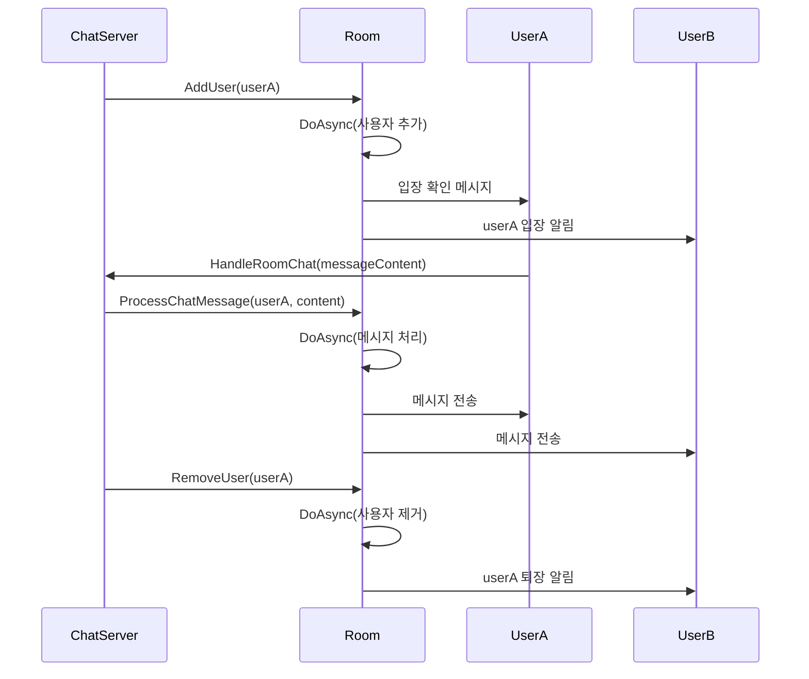

# Chapter 9. 예제: 채팅방(Room)
[채팅 서버(ChatServer)](08_채팅_서버_chatserver__.md)에서 살펴본 것처럼, `JobDispatcherNET` 라이브러리는 복잡한 네트워크 애플리케이션을 구축하는 데 필요한 다양한 도구를 제공합니다. 이번 장에서는 채팅 서버의 핵심 요소인 **채팅방(Room)**에 대해 알아보겠습니다.
  

## 채팅방이란 무엇인가요?
채팅방은 사용자들이 모여 대화를 나누는 가상의 공간입니다. 실제 세계의 회의실과 매우 유사하게, 사람들은 들어오고 나가며, 그곳에 있는 모든 사람들은 서로의 대화를 볼 수 있습니다.

`JobDispatcherNET`의 채팅 시스템에서 채팅방은 사용자 입장/퇴장, 메시지 전송 등의 작업을 안전하게 처리하는 중요한 구성 요소입니다. 이것은 [비동기 실행 가능 객체(AsyncExecutable)](02_비동기_실행_가능_객체_asyncexecutable__.md)를 상속받아 모든 작업이 동일한 스레드에서 순차적으로 실행되도록 보장합니다.
  

## 채팅방의 주요 특징

### 1. 독립적인 작업 큐
각 채팅방은 자체 작업 큐를 가집니다. 이것은 마치 각 회의실마다 자체 의제와 진행자가 있는 것과 같습니다. 한 방에서 일어나는 활동은 다른 방에 영향을 주지 않습니다.

### 2. 스레드 안전성
채팅방은 [비동기 실행 가능 객체(AsyncExecutable)](02_비동기_실행_가능_객체_asyncexecutable__.md)를 상속받아 모든 작업이 스레드 안전하게 실행됩니다. 여러 사용자가 동시에 메시지를 보내거나 입장/퇴장해도 데이터가 손상되지 않습니다.

### 3. 사용자 관리
채팅방은 현재 방에 있는 모든 사용자를 추적하고, 누가 입장하고 퇴장하는지 관리합니다.

### 4. 메시지 브로드캐스팅
사용자가 메시지를 보내면, 채팅방은 그 메시지를 방 안의 모든 사용자에게 전달합니다.

## 채팅방 사용하기
채팅방을 사용하는 방법은 간단합니다. 다음 단계로 진행됩니다:

### 1. 채팅방 생성하기
새로운 채팅방을 만들기 위해 `Room` 클래스의 인스턴스를 생성합니다:

```csharp
var generalRoom = new Room("일반 채팅");
```

이 코드는 "일반 채팅"이라는 이름의 새 채팅방을 생성합니다. 각 방은 고유한 ID가 자동으로 생성됩니다.

### 2. 사용자 입장 처리하기
사용자가 방에 입장할 때는 `AddUser` 메서드를 사용합니다:

```csharp
public void AddUser(User user)
{
    DoAsync(() => {
        if (!_users.ContainsKey(user.UserId))
        {
            _users[user.UserId] = user;
            // 입장 메시지 브로드캐스트...
        }
    });
}
```

`DoAsync`를 사용하면 이 작업이 채팅방의 작업 큐에 추가되어 스레드 안전하게 처리됩니다. 사용자가 방에 입장하면, 방에 있는 모든 사용자에게 입장 메시지가 전송됩니다.

### 3. 채팅 메시지 처리하기
사용자가 메시지를 보내면 `ProcessChatMessage` 메서드를 사용하여 처리합니다:

```csharp
public void ProcessChatMessage(string userId, string content)
{
    DoAsync(() => {
        if (_users.TryGetValue(userId, out var sender))
        {
            // 메시지 생성
            var message = new ChatMessage(
                Guid.NewGuid(),
                MessageType.RoomChat,
                sender.Username,
                null,
                _roomId,
                content,
                DateTimeOffset.UtcNow);
                
            // 모든 사용자에게 메시지 전송
            foreach (var user in _users.Values)
            {
                _ = user.SendMessageAsync(message);
            }
        }
    });
}
```

이 메서드는 메시지를 보낸 사용자를 확인하고, 메시지를 생성한 후 방에 있는 모든 사용자에게 전송합니다. 역시 `DoAsync`를 사용하여 스레드 안전하게 처리됩니다.

### 4. 사용자 퇴장 처리하기
사용자가 방을 나갈 때는 `RemoveUser` 메서드를 사용합니다:

```csharp
public void RemoveUser(string userId)
{
    DoAsync(() => {
        if (_users.TryGetValue(userId, out var user))
        {
            _users.Remove(userId);
            // 퇴장 메시지 브로드캐스트...
        }
    });
}
```

사용자가 방에서 나가면, 역시 모든 사용자에게 퇴장 메시지가 전송됩니다. 이 작업도 `DoAsync`를 통해 안전하게 처리됩니다.
  

## 채팅방의 내부 구현
채팅방의 내부 작동 방식을 이해하기 위해 간단한 시퀀스 다이어그램을 살펴보겠습니다:



위 다이어그램에서 볼 수 있듯이, 모든 채팅방 작업은 `DoAsync`를 통해 방의 작업 큐에 추가됩니다. 이렇게 하면 한 번에 하나의 작업만 처리되므로, 데이터 일관성을 유지할 수 있습니다.

이제 `Room` 클래스의 내부 구현을 더 자세히 살펴보겠습니다:

```csharp
public class Room : AsyncExecutable
{
    private readonly Dictionary<string, User> _users = [];
    private readonly string _roomId;
    private readonly string _name;

    public Room(string name)
    {
        _roomId = Guid.NewGuid().ToString();
        _name = name;
    }
}
```

채팅방은 `AsyncExecutable`을 상속받아 비동기 작업 처리 기능을 활용합니다. 내부적으로 사용자 딕셔너리(`_users`)를 유지하여 현재 방에 있는 모든 사용자를 추적합니다. 각 방은 고유한 ID(`_roomId`)와 이름(`_name`)을 가집니다.

메시지 브로드캐스팅은 다음과 같이 구현됩니다:

```csharp
private void BroadcastSystemMessage(MessageType type, string content)
{
    var message = new ChatMessage(
        Guid.NewGuid(),
        type,
        "시스템",
        null,
        _roomId,
        content,
        DateTimeOffset.UtcNow);

    foreach (var user in _users.Values)
    {
        _ = user.SendMessageAsync(message);
    }
}
```

이 메서드는 시스템 메시지(예: 입장/퇴장 알림)를 생성하고, 방에 있는 모든 사용자에게 전송합니다. 메시지 객체는 메시지 유형, 발신자, 내용, 시간 등의 정보를 포함합니다.

채팅방의 작업 처리는 [비동기 실행 가능 객체(AsyncExecutable)](02_비동기_실행_가능_객체_asyncexecutable__.md)로부터 상속받은 `DoAsync` 메서드를 통해 이루어집니다. 이 메서드는 작업을 큐에 추가하여 모든 작업이 동일한 스레드에서 순차적으로 실행되도록 보장합니다.
  

## 실제 활용 예

### 게임 로비 및 채팅방 시스템
게임 서버에서 로비와 다양한 게임룸을 관리하는 시나리오를 생각해 보겠습니다:

```csharp
// 게임 로비와 여러 게임룸 생성
var lobbyRoom = new Room("메인 로비");
var dungeon1 = new Room("던전 1");
var dungeon2 = new Room("던전 2");

// 유저가 로비에 입장
lobbyRoom.AddUser(newPlayer);

// 던전 파티 구성 후 던전룸 입장
dungeon1.AddUser(player1);
dungeon1.AddUser(player2);
```

이렇게 하면 여러 개의 독립적인 채팅방을 쉽게 관리할 수 있으며, 각 방은 자체적으로 사용자와 메시지를 처리합니다. 게임 로비에서는 모든 플레이어가 소통할 수 있고, 던전별로 별도의 채팅방을 제공하여 팀원 간 소통을 지원합니다.

### 메시지 필터링과 명령어 처리
채팅방은 메시지 필터링이나 특별 명령어 처리와 같은 기능을 쉽게 확장할 수 있습니다:

```csharp
public void ProcessChatMessage(string userId, string content)
{
    DoAsync(() => {
        // 비속어 필터링
        content = FilterBadWords(content);
        
        // 명령어 처리
        if (content.StartsWith("/"))
        {
            ProcessCommand(userId, content);
            return;
        }
        
        // 일반 메시지 처리...
    });
}
```

이와 같이 채팅방의 메시지 처리 로직을 확장하여 비속어 필터링, 명령어 처리 등 다양한 기능을 구현할 수 있습니다. 예를 들어, `/whisper`와 같은 명령어로 귓속말 기능을 구현하거나, `/kick`으로 사용자 강제 퇴장 기능을 구현할 수 있습니다.

### 사용자 정보 조회
채팅방에 있는 사용자 정보를 조회하는 기능도 쉽게 구현할 수 있습니다:

```csharp
public List<string> GetUserIds()
{
    var tcs = new TaskCompletionSource<List<string>>();

    DoAsync(() => {
        var userIds = _users.Keys.ToList();
        tcs.SetResult(userIds);
    });

    return tcs.Task.Result;
}
```

이 메서드는 채팅방에 있는 모든 사용자의 ID 목록을 반환합니다. `TaskCompletionSource`를 사용하여 비동기 작업의 결과를 동기적으로 반환하는 패턴을 보여줍니다.
  

## 요약 및 다음 단계
이번 장에서는 **채팅방(Room)**의 개념과 구현에 대해 알아보았습니다. 채팅방은 사용자들이 모여 대화를 나누는 가상 공간으로, [비동기 실행 가능 객체(AsyncExecutable)](02_비동기_실행_가능_객체_asyncexecutable__.md)를 상속받아 사용자 입장/퇴장, 메시지 전송 등의 작업을 스레드 안전하게 처리합니다.

주요 내용:
- 채팅방은 독립적인 작업 큐를 가지고 있어 다른 방의 활동에 영향을 받지 않고 독립적으로 운영됩니다
- 모든 작업은 `DoAsync`를 통해 처리되어 스레드 안전성을 보장합니다
- 사용자 관리, 메시지 브로드캐스팅 등 채팅 시스템의 핵심 기능을 제공합니다
- 게임 로비, 다중 채팅방 등 다양한 시나리오에 활용할 수 있습니다

채팅방은 [채팅 서버(ChatServer)](08_채팅_서버_chatserver__.md)와 함께 작동하여 완전한 채팅 시스템을 구성합니다. 다음 장에서는 [채팅 네트워크 클라이언트(ChatNetworkClient)](10_채팅_네트워크_클라이언트_chatnetworkclient__.md)에 대해 알아보고, 클라이언트 측에서 채팅 서버와 어떻게 통신하는지 살펴보겠습니다.

즐거운 프로그래밍 되세요!

---

Generated by [AI Codebase Knowledge Builder](https://github.com/The-Pocket/Tutorial-Codebase-Knowledge)