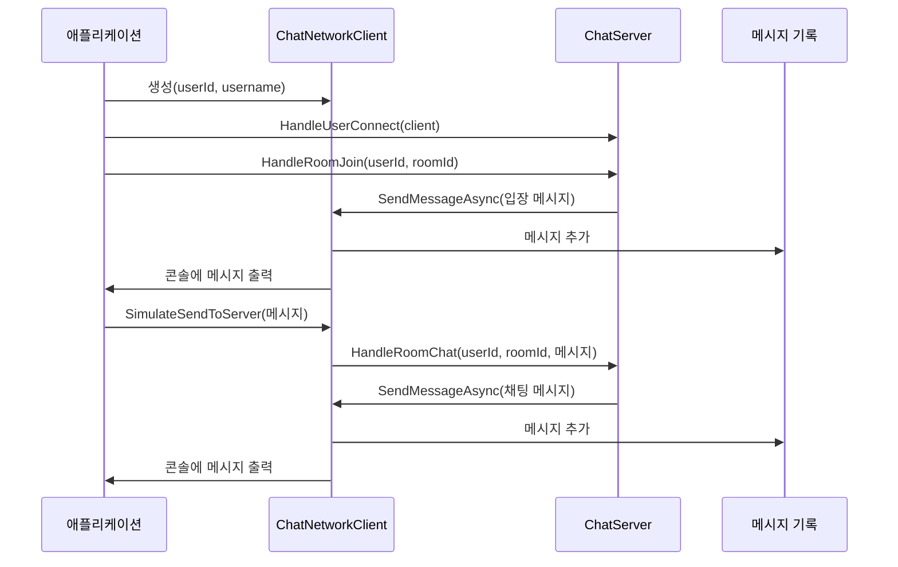

# Chapter 10. 예제: 채팅 네트워크 클라이언트(ChatNetworkClient)
[채팅방(Room)](09_채팅방_room__.md)에서 살펴본 것처럼, 채팅 시스템은 서버 측에서 사용자와 메시지를 관리합니다. 이번 장에서는 이 시스템의 클라이언트 측 구성 요소인 **채팅 네트워크 클라이언트(ChatNetworkClient)**에 대해 알아보겠습니다.
  

## 채팅 네트워크 클라이언트란 무엇인가요?
채팅 네트워크 클라이언트는 사용자가 채팅 서버에 연결하여 메시지를 주고받을 수 있게 해주는 구성 요소입니다. 이해를 돕기 위해 회의 참가자의 비유를 들어보겠습니다:

- 회의실(채팅방)에는 여러 참가자(클라이언트)가 있습니다
- 각 참가자는 발언(메시지 보내기)하고 다른 사람의 발언을 듣습니다(메시지 받기)
- 참가자는 회의에 참가하거나 떠날 수 있습니다(연결/연결 해제)
- 모든 대화 내용은 회의록에 기록됩니다(메시지 기록)

`ChatNetworkClient`는 이런 회의 참가자와 같은 역할을 합니다. 채팅 서버에 연결하여 메시지를 보내고 받으며, 모든 대화를 기록합니다.
  

## 채팅 클라이언트 인터페이스 이해하기
채팅 클라이언트는 `IChatClient` 인터페이스를 구현합니다. 이 인터페이스는 다음과 같이 정의됩니다:

```csharp
public interface IChatClient
{
    string UserId { get; }
    string Username { get; }
    
    // 메시지 전송 (네트워크 구현은 생략)
    ValueTask SendMessageAsync(ChatMessage message);
}
```

이 인터페이스는:
1. `UserId`: 클라이언트의 고유 식별자
2. `Username`: 사용자의 표시 이름
3. `SendMessageAsync`: 클라이언트에게 메시지를 보내는 메서드

를 포함합니다. 모든 채팅 클라이언트는 이 인터페이스를 구현해야 합니다.
  

## ChatNetworkClient 클래스 구조
`ChatNetworkClient` 클래스는 `IChatClient` 인터페이스를 구현하는 기본 클래스입니다:

```csharp
public class ChatNetworkClient : IChatClient
{
    private readonly bool _verbose;
    private bool _isConnected;
    private readonly List<ChatMessage> _messageHistory = [];
    
    public string UserId { get; }
    public string Username { get; }
    
    // 생성자와 메서드들...
}
```

이 클래스는:
1. 사용자 식별 정보(`UserId`, `Username`)를 저장합니다
2. 연결 상태(`_isConnected`)를 추적합니다
3. 받은 모든 메시지의 기록(`_messageHistory`)을 유지합니다
4. 상세 로그 출력 여부(`_verbose`)를 설정할 수 있습니다
  

## 클라이언트 생성하기
채팅 클라이언트를 생성하는 방법은 간단합니다:

```csharp
// 기본 로그 모드로 클라이언트 생성
var client = new ChatNetworkClient("user1", "철수");

// 상세 로그 모드로 클라이언트 생성
var verboseClient = new ChatNetworkClient("user2", "영희", verbose: true);
```

생성자는 사용자 ID, 사용자 이름, 그리고 선택적으로 상세 로그 옵션을 받습니다. 클라이언트는 생성 즉시 연결된 상태로 시작합니다.
  

## 메시지 받기
채팅 클라이언트의 핵심 기능은 서버로부터 메시지를 받는 것입니다. 이는 `SendMessageAsync` 메서드를 통해 구현됩니다:

```csharp
public ValueTask SendMessageAsync(ChatMessage message)
{
    if (!_isConnected)
    {
        Console.WriteLine($"[오류] 연결이 끊긴 클라이언트에게 메시지 전송 시도: {Username}");
        return ValueTask.CompletedTask;
    }
    
    // 메시지 기록에 추가
    _messageHistory.Add(message);
    
    // 메시지 출력 로직...
    
    return ValueTask.CompletedTask;
}
```

이 메서드는:
1. 클라이언트가 연결되어 있는지 확인합니다
2. 받은 메시지를 기록에 추가합니다
3. 메시지를 콘솔에 출력합니다 (실제로는 UI에 표시하는 등의 처리를 합니다)

`SendMessageAsync`는 서버가 클라이언트에게 메시지를 보낼 때 호출됩니다. 이름이 `Send`로 시작하지만 실제로는 "클라이언트가 메시지를 받는" 기능입니다.
  

## 메시지 출력하기
받은 메시지는 메시지 타입에 따라 다르게 출력됩니다:

```csharp
switch (message.Type)
{
    case MessageType.RoomChat:
        Console.WriteLine($"[{message.RoomId}] {message.Sender}: {message.Content}");
        break;
    case MessageType.PrivateChat:
        Console.WriteLine($"[1:1 채팅] {message.Sender} -> {message.Recipient}: {message.Content}");
        break;
    // 다른 메시지 타입 처리...
}
```

이 코드는 메시지 타입에 따라 적절한 형식으로 메시지를 출력합니다. 채팅방 메시지, 1:1 채팅, 시스템 알림 등 다양한 메시지 타입을 지원합니다.
  

## 서버에 메시지 보내기
클라이언트가 서버에 메시지를 보내는 것을 시뮬레이션하는 메서드도 있습니다:

```csharp
public void SimulateSendToServer(string messageContent, MessageType type, 
                                string? roomId = null, string? recipientId = null)
{
    if (!_isConnected)
    {
        Console.WriteLine($"[오류] 연결이 끊긴 클라이언트가 메시지 전송 시도: {Username}");
        return;
    }
    
    Console.WriteLine($"[클라이언트 {Username} 전송] {type}: \"{messageContent}\"");
    
    // 실제 구현에서는 여기서 서버로 메시지를 전송
}
```

이 메서드는 클라이언트에서 서버로 메시지를 보내는 것을 시뮬레이션합니다. 실제 네트워크 구현에서는 이 부분에 서버로 데이터를 전송하는 코드가 들어갑니다.
  

## 연결 관리하기
클라이언트는 연결 상태를 관리하는 메서드를 제공합니다:

```csharp
// 연결 종료 시뮬레이션
public void Disconnect()
{
    if (_isConnected)
    {
        _isConnected = false;
        Console.WriteLine($"클라이언트 연결 종료됨: {Username} ({UserId})");
    }
}

// 재연결 시뮬레이션
public void Reconnect()
{
    if (!_isConnected)
    {
        _isConnected = true;
        Console.WriteLine($"클라이언트 재연결됨: {Username} ({UserId})");
    }
}
```

이 메서드들은 클라이언트의 연결 상태를 변경합니다. 실제 네트워크 구현에서는 이 부분에 네트워크 연결 관리 코드가 들어갑니다.
  

## 메시지 기록 관리하기
클라이언트는 받은 모든 메시지의 기록을 유지하고 조회할 수 있습니다:

```csharp
// 메시지 히스토리 출력
public void PrintMessageHistory()
{
    Console.WriteLine($"\n=== {Username}의 메시지 히스토리 ({_messageHistory.Count}개) ===");
    
    foreach (var msg in _messageHistory)
    {
        Console.WriteLine($"[{msg.Timestamp:HH:mm:ss}] ({msg.Type}) {msg.Sender}: {msg.Content}");
    }
    
    Console.WriteLine("===================================\n");
}
```

이 메서드는 클라이언트가 받은 모든 메시지를 시간순으로 출력합니다. 이를 통해 사용자는 이전 대화 내용을 확인할 수 있습니다.
  

## 클라이언트의 작동 원리
채팅 네트워크 클라이언트가 어떻게 작동하는지 시퀀스 다이어그램으로 살펴보겠습니다:



이 다이어그램에서:
1. 애플리케이션이 클라이언트를 생성하고 서버에 연결합니다
2. 클라이언트가 채팅방에 입장하면 서버에서 입장 메시지를 받습니다
3. 클라이언트는 메시지를 서버에 전송하고, 서버는 그 메시지를 다시 모든 클라이언트에게 전달합니다
4. 클라이언트는 받은 메시지를 기록하고 출력합니다
  

## 실제 사용 예제
이제 실제로 채팅 네트워크 클라이언트를 사용하는 예제를 살펴보겠습니다:

```csharp
// 클라이언트 생성
var client1 = new ChatNetworkClient("user1", "철수");
var client2 = new ChatNetworkClient("user2", "영희");

// 서버에 연결
chatServer.HandleUserConnect(client1);
chatServer.HandleUserConnect(client2);

// 채팅방 입장
chatServer.HandleRoomJoin("user1", "general");
chatServer.HandleRoomJoin("user2", "general");

// 메시지 전송
chatServer.HandleRoomChat("user1", "general", "안녕하세요, 모두들!");
chatServer.HandlePrivateChat("user2", "user1", "철수님 안녕하세요!");
```

이 코드는:
1. 두 개의 채팅 클라이언트를 생성합니다
2. 두 클라이언트를 서버에 연결합니다
3. 두 클라이언트를 "general" 채팅방에 입장시킵니다
4. 철수가 채팅방에 메시지를 보냅니다
5. 영희가 철수에게 1:1 메시지를 보냅니다
  

## 메시지 종류 이해하기
채팅 시스템은 다양한 메시지 타입을 지원합니다. `MessageType` 열거형은 다음과 같이 정의됩니다:

```csharp
public enum MessageType
{
    RoomChat,       // 방 채팅
    PrivateChat,    // 1:1 채팅
    InstantMessage, // 쪽지
    RoomJoin,       // 방 입장
    RoomLeave,      // 방 퇴장
    UserConnect,    // 유저 접속
    UserDisconnect  // 유저 접속 종료
}
```

각 메시지 타입은 다른 용도로 사용됩니다:
- `RoomChat`: 채팅방 내 모든 사용자에게 보내는 메시지
- `PrivateChat`: 특정 사용자에게만 보내는 1:1 채팅
- `InstantMessage`: 오프라인 사용자에게도 전달되는 쪽지
- `RoomJoin`/`RoomLeave`: 채팅방 입장/퇴장 알림
- `UserConnect`/`UserDisconnect`: 사용자 접속/접속 종료 알림
  

## 메시지 구조 이해하기
채팅 메시지는 `ChatMessage` 레코드로 표현됩니다:

```csharp
public record ChatMessage(
    Guid Id,
    MessageType Type,
    string Sender,
    string? Recipient,
    string? RoomId,
    string Content,
    DateTimeOffset Timestamp);
```

이 레코드는:
1. `Id`: 메시지의 고유 식별자
2. `Type`: 메시지 타입
3. `Sender`: 발신자 이름
4. `Recipient`: 수신자 이름 (1:1 채팅, 쪽지에만 사용)
5. `RoomId`: 채팅방 ID (방 채팅에만 사용)
6. `Content`: 메시지 내용
7. `Timestamp`: 메시지 생성 시간

을 포함합니다. 이 구조를 통해 다양한 종류의 메시지를 표현할 수 있습니다.
  

## 메시지 내보내기
클라이언트는 메시지 기록을 JSON 형식으로 내보내는 기능도 제공합니다:

```csharp
public string ExportMessageHistoryAsJson()
{
    var options = new JsonSerializerOptions { WriteIndented = true };
    return JsonSerializer.Serialize(_messageHistory, options);
}
```

이 메서드는 클라이언트가 받은 모든 메시지를 JSON 형식으로 변환합니다. 이 기능은 메시지 기록을 저장하거나 다른 시스템으로 전송할 때 유용합니다.
  

## 네트워크 동작 시뮬레이션
실제 네트워크 구현은 생략되어 있지만, `ChatNetworkClient`는 네트워크 지연을 시뮬레이션합니다:

```csharp
// 메시지 수신 시뮬레이션 - 실제 네트워크 지연 시뮬레이션
Thread.Sleep(Random.Shared.Next(1, 5));
```

이 코드는 실제 네트워크 환경에서 발생할 수 있는 지연을 시뮬레이션합니다. 실제 구현에서는 이 부분이 실제 네트워크 코드로 대체됩니다.
  

## 실제 활용 사례
채팅 네트워크 클라이언트는 다양한 시나리오에서 활용될 수 있습니다:

### 1. 게임 내 채팅

```csharp
// 게임 플레이어를 위한 채팅 클라이언트
var gameClient = new ChatNetworkClient(player.Id, player.Nickname);

// 게임 로비 입장
chatServer.HandleUserConnect(gameClient);
chatServer.HandleRoomJoin(player.Id, "game_lobby");

// 팀 채팅 전송
chatServer.HandleRoomChat(player.Id, "team_red", "적 발견 좌표: X=120, Y=340");
```

게임에서는 플레이어 간 실시간 소통을 위해 채팅 클라이언트를 활용할 수 있습니다. 로비 채팅, 팀 채팅, 귓속말 등 다양한 소통 채널을 제공할 수 있습니다.

### 2. 고객 지원 채팅

```csharp
// 고객용 채팅 클라이언트
var customerClient = new ChatNetworkClient("cust123", "고객님");

// 지원팀과 1:1 채팅
chatServer.HandleUserConnect(customerClient);
chatServer.HandlePrivateChat("cust123", "support1", "결제 관련 문의가 있습니다.");
```

고객 지원 시스템에서는 고객과 상담원 간 1:1 채팅을 통해 실시간 지원을 제공할 수 있습니다.
  

## 채팅 클라이언트의 확장
실제 애플리케이션에서는 `ChatNetworkClient`를 확장하여 더 많은 기능을 추가할 수 있습니다:

```csharp
public class EnhancedChatClient : ChatNetworkClient
{
    private readonly HashSet<string> _blockList = [];
    
    public EnhancedChatClient(string userId, string username) 
        : base(userId, username) { }
    
    // 사용자 차단
    public void BlockUser(string userId)
    {
        _blockList.Add(userId);
    }
    
    // 메시지 필터링
    public override ValueTask SendMessageAsync(ChatMessage message)
    {
        if (_blockList.Contains(message.Sender))
        {
            // 차단된 사용자의 메시지는 무시
            return ValueTask.CompletedTask;
        }
        
        return base.SendMessageAsync(message);
    }
}
```

이 확장 클래스는 사용자 차단 기능을 추가하여 특정 사용자의 메시지를 필터링합니다. 이런 방식으로 채팅 클라이언트를 확장하여 다양한 기능을 구현할 수 있습니다.
  

## 요약 및 다음 단계
이번 장에서는 **채팅 네트워크 클라이언트(ChatNetworkClient)**의 개념과 구현에 대해 알아보았습니다. 채팅 클라이언트는 회의 참가자와 같이 채팅 서버와 통신하여 메시지를 주고받는 역할을 합니다.

주요 내용:
- 채팅 클라이언트는 `IChatClient` 인터페이스를 구현하여 메시지 수신 기능을 제공합니다
- 클라이언트는 연결 상태를 관리하고 메시지 기록을 유지합니다
- 다양한 메시지 타입(방 채팅, 1:1 채팅, 시스템 알림 등)을 처리할 수 있습니다
- 이 구현은 실제 네트워크 코드 없이 네트워크 동작을 시뮬레이션합니다
- 게임 채팅, 고객 지원 등 다양한 시나리오에서 활용할 수 있습니다

채팅 네트워크 클라이언트는 [채팅 서버(ChatServer)](08_채팅_서버_chatserver__.md)와 [채팅방(Room)](09_채팅방_room__.md)과 함께 작동하여 완전한 채팅 시스템을 구성합니다. 이 구성 요소들은 `JobDispatcherNET` 라이브러리의 다양한 기능을 활용하여 효율적이고 안전한 멀티스레딩 환경에서 작동합니다.

이것으로 `JobDispatcherNET` 라이브러리의 모든 핵심 구성 요소에 대한 학습을 마칩니다. 이 라이브러리를 활용하여 다양한 멀티스레딩 애플리케이션을 안전하고 효율적으로 구현할 수 있을 것입니다.

즐거운 프로그래밍 되세요!

---

Generated by [AI Codebase Knowledge Builder](https://github.com/The-Pocket/Tutorial-Codebase-Knowledge)