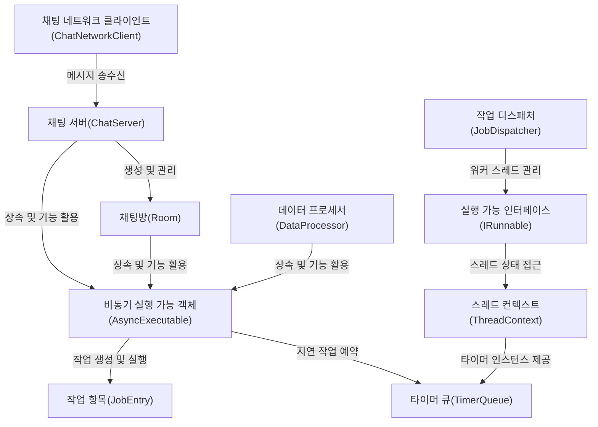

# Tutorial: JobDispatcherNET

**JobDispatcherNET**은 **다중 스레드 환경에서 비동기 작업을 효율적으로 관리하는 프레임워크**입니다. *작업 디스패처*를 통해 여러 워커 스레드를 관리하고, *비동기 실행 객체*를 활용해 스레드 안전하게 작업을 분배합니다. **타이머 큐**를 사용한 예약 작업 지원과 **스레드 컨텍스트**를 통한 스레드별 자원 관리 기능을 제공합니다. 채팅 서버 예제에서는 이러한 기능들을 활용하여 동시에 여러 채팅방과 사용자를 안정적으로 관리하는 방법을 보여줍니다.

**Source Repository:** [GitHub](https://github.com/jacking75/JobDispatcherNET )

   

## Chapters

1. [작업 디스패처(JobDispatcher)
](01_작업_디스패처_jobdispatcher__.md)
2. [비동기 실행 가능 객체(AsyncExecutable)
](02_비동기_실행_가능_객체_asyncexecutable__.md)
3. [실행 가능 인터페이스(IRunnable)
](03_실행_가능_인터페이스_irunnable__.md)
4. [스레드 컨텍스트(ThreadContext)
](04_스레드_컨텍스트_threadcontext__.md)
5. [타이머 큐(TimerQueue)
](05_타이머_큐_timerqueue__.md)
6. [작업 항목(JobEntry)
](06_작업_항목_jobentry__.md)
7. [데이터 프로세서(DataProcessor)
](07_데이터_프로세서_dataprocessor__.md)
8. [채팅 서버(ChatServer)
](08_채팅_서버_chatserver__.md)
9. [채팅방(Room)
](09_채팅방_room__.md)
10. [채팅 네트워크 클라이언트(ChatNetworkClient)
](10_채팅_네트워크_클라이언트_chatnetworkclient__.md)

---

Generated by [AI Codebase Knowledge Builder](https://github.com/The-Pocket/Tutorial-Codebase-Knowledge)